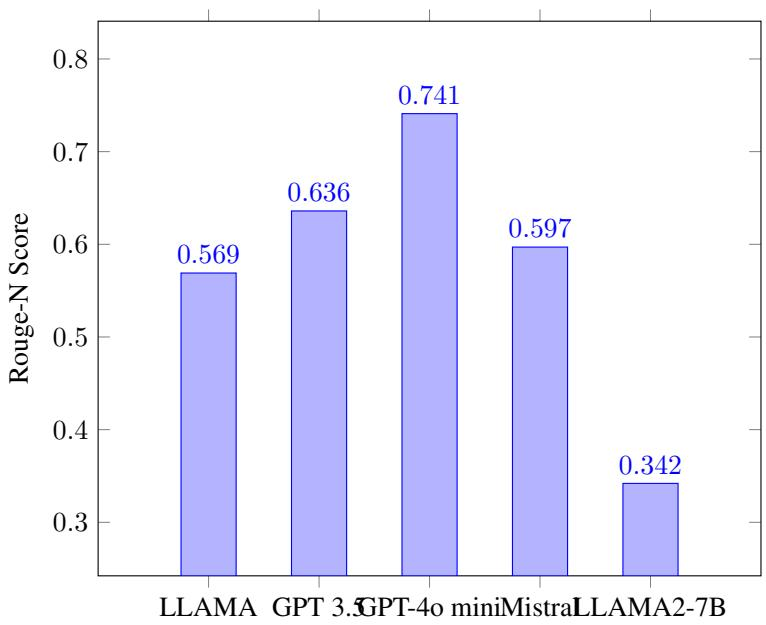

# Semantic Self-Consistency: Enhancing Language Model Reasoning via Semantic Weighting

Tim Knappe∗ Ryan Li Ayush Chauhan Kaylee Chhua Kevin Zhu† Sean O’Brien† Algoverse AI Research cs.timknappe@gmail.com, kevin@algoverse.us

# Abstract

While large language models (LLMs) have rapidly improved their performance on a broad number of tasks, they still often fall short on reasoning tasks. As LLMs become more integrated in diverse real-world tasks, advancing their reasoning capabilities is crucial to their effectiveness in nuanced, complex problems. Wang et al. [33]’s self-consistency framework reveals that sampling multiple rationales before taking a majority vote reliably improves model performance across various closed-answer reasoning tasks. Standard methods based on this framework aggregate the final decisions of these rationales but fail to utilize the semantic information detailed in the step-by-step reasoning paths. Our work introduces semantic self-consistency, enhancing this approach by incorporating and analyzing both the reasoning paths of these rationales in addition to their final decisions before taking a majority vote. These methods not only improve the reliability of reasoning paths but also cause more robust performance on complex reasoning tasks.

# 1 Introduction

In recent years, the development of large language models has witnessed remarkable strides, with significant advancements in their accuracy and expressive capabilities [3, 28, 24, 4]. Despite these achievements, models still perform suboptimally in domains such as mathematics, commonsense, and complex algorithmic reasoning [10]. Various methods such as chain-of-thought prompting have been developed to further increase reasoning capabilities and was further enhanced by the introduction of self-consistency, which demonstrate that baselines can be pushed forward by sampling and ensembling multiple model responses with chain-of-thought to improve prediction quality [34, 23].

We build on the framework of self-consistency, proposing two techniques that add a separate semantic weighting step to rerank results based on their reasoning paths. To achieve this, we use semantic vector embeddings in combination with self-consistency to group consistent model outputs, aiding in the identification of similar responses to estimate the most likely output. Additionally, we introduce a semantic filtering mechanism that discards degenerate or hallucinated outputs, which can be utilized for analyzing smaller sample sizes. Overall, we demonstrate that self-consistency with semantic marginalization not only improves accuracy across a range of benchmarks but also serves as a filtering mechanism. By introducing these methods, we aim to provide a framework for improving performance and analyzing the semantic usage of model outputs in reasoning.

  
Figure 1: Whereas baseline self-consistency comprises three steps: (1) Prompt a model with chainof-thought, (2) generate $n$ sampled sequences, and (3) choose results based on the most occurring final output, our proposed method, shown above, decides based on the semantic consistency of the employed reasoning path. Our assumption is that language models often apply the correct reasoning but lack the ability to conclude to the correct result.

# 2 Datasets

We evaluate the models on arithmetic and commonsense reasoning using three datasets: AQuA-RAT, SVAMP, and StrategyQA. AQuA-RAT assesses models’ ability to solve arithmetic problems involving basic calculations, numerical relationships, and multi-step reasoning [17]. SVAMP challenges models with math problems focused on algebraic manipulations and symbolic reasoning [25]. StrategyQA tests models on answering complex, open-domain questions that require strategic thinking rather than simple factual knowledge [9]. For specific information please refer to Appendix L.

# 3 Language Models

Our models are categorized into two types: generators, which produce sequences such as text, code, or reasoning steps, and featurizers, which transform these outputs into numerical representations (vector embeddings) that summarize their meaning for analysis.

Detailed information on the configurations used for our models can be found in Appendix I.3. Additionally important hyperparameters for different methods are discussed in Appendix I We use chain-of-thought prompting for all of our experiments. The prompts can be found in Appendix K.

# 3.1 Generators

For our evaluation, we use several models with varying architectures and sizes. First, we utilize GPT-3.5, a closed-source large-scale transformer model developed by OpenAI [3]. Additionally, we evaluate both Llama 2 (7B parameters) [32] and Llama 3 (8B parameters) [8], which are open-weight models known for their strong performance on numerous benchmarks. We also include Mistral 7B (version 0.1), recognized for its robust capabilities across a variety of language processing tasks [13]. Lastly, we assess GPT-4o mini, a lower parameter variant of the GPT-4o architecture that balances computational efficiency with high performance across diverse language tasks.

# 3.2 Featurizers

All of our featurizers are based on the BERT (Bidirectional Encoder Representations from Transformers) model architecture [7], with various fine-tuned versions used to generate embedding vectors tailored to specific datasets.RoBERTa 125M is employed for the StrategyQA dataset, which requires reading comprehension and contextual reasoning, benefiting from RoBERTa’s robustness in general language processing tasks [19]. Additionally, we use SciBERT 110M for the AQuA-RAT and SVAMP datasets, which focus on mathematical reasoning, as its specialization in scientific texts makes it well-suited to handle the language present in these datasets [2].

# 4 Methodology

We analyze three main mechanisms for weighting and categorization (CPW, sequence comparison, and filtering of anomalous points) that follow a similar operational pattern outlined below:

1. Generate candidate responses: Given a query of few-shot examples, we generate $n$ samples based on chain-of-thought prompting [34].   
2. Embed reasoning paths: We represent each generated rationale as a vector embedding using fine-tuned BERT models (e.g., SciBERT for mathematical reasoning tasks). Instead of focusing on individual sentences or tokens, we obtain a single vector representation for each entire reasoning path, capturing its overall semantic content.   
3. Semantic consistency or outlier removal: We apply various algorithms to weight and aggregate the responses based on their featurized embedding vectors, enhancing decisionmaking by emphasizing semantically consistent reasoning paths or removing outliers.

# 4.1 Semantic consistency

# 4.1.1 Centroid Proximity Weighting

In a set of examples, general answers often display similar patterns, suggesting the application of embedding vectors to map responses into an $n$ -dimensional space. To identify t relevantdata_emb of the embeddings, centroid tance of each vector from $=$ $\textstyle { \frac { 1 } { N } } \sum _ { i = 1 } ^ { N }$   
centroid, distance $\begin{array} { r l r } { \mathfrak { s } [ { i } ] } & { { } = } & { \| \mathrm { d a t a \_ e m b e d d i n g s } [ { i } ] - \mathrm { c e n t r o i d } \| , } \end{array}$   
normalized_distances[ $\begin{array} { r } { i ] = \frac { \operatorname { d i s t a n c e s } [ i ] } { \sum _ { j = 1 } ^ { N } \operatorname { d i s t a n c e s } [ j ] } } \end{array}$ We assign weights to the vectors inversely proportional to their normalized distances, weights 1normalized_distances[i] . Finally, the total weight for each unique output is computed as sum_weights $\begin{array} { r } { [ u ] = \sum _ { i \in I ( u ) } } \end{array}$ weights $[ i ]$ , where outputs with the highest total weights are considered the most likely to be correct.

# 4.1.2 Semantic Consensus Weighting

To compare the weighting of embedding positions, we introduce another method and weigh responses relative to their respective sequences with cosine similarity, a measurement of how similar two vectors. We take $n _ { 1 } , n _ { 2 } , n _ { 3 } , . . . , n _ { i }$ as distinct elements in our set $N$ , where each $n$ corresponds to a featurized embedding vector. The cosine similarity between vectors $n _ { a }$ and $n _ { b }$ is given by cosine_similarity $\begin{array} { r } { ( n _ { a } , n _ { b } ) = \frac { n _ { a } \cdot n _ { b } } { \| n _ { a } \| _ { 2 } \| n _ { b } \| _ { 2 } } } \end{array}$ na·nb∥na∥2∥nb∥2 , and for each ne, we compute the cosine similarity with every $n _ { i }$ in $N$ and aggregate the scores: $\begin{array} { r } { S _ { n _ { e } } = \sum _ { n _ { i } \in N } } \end{array}$ cosine_similarity $( n _ { e } , n _ { i } )$ . This process is repeated for each $n _ { j }$ in $N$ i , resulting in aggregated scores $S _ { n _ { 1 } } , S _ { n _ { 2 } } , S _ { n _ { 3 } } , . . . , S _ { n _ { i } }$ , and the scores are summed based on their answer decision, leading to the selection of the highest consensual response.

# 4.2 Outlier removal

To eliminate outliers, we filter responses based on proximity [18, 21, 5], isolating data points that significantly deviate and identifying flawed reasoning, degenerated outputs, or model hallucinations. We examine the following common methods: (1) $\mathbf { K }$ -nearest neighbor, using $\scriptstyle { \sqrt { \sum _ { i = 1 } ^ { n } ( x _ { i } - y _ { i } ) ^ { 2 } } }$ ; (2) Isolation forest, where $s ( x , n ) = 2 ^ { - { \frac { E ( h ( x ) ) } { c ( n ) } } }$ ; and (3) Support vector machines, defined by $\begin{array} { r } { \frac { 1 } { 2 } \omega ^ { T } \omega + C \sum _ { i = 1 } ^ { n } \zeta _ { i } } \end{array}$ .

# 5 Results

# 5.1 Semantic consistency results

We compared Centroid Proximity Weighting (CPW) and Semantic Consensus Weighting (SCW) with the self-consistency baseline across datasets. As shown in Table 1, SCW generally outperformed CPW. For Llama 2 7B, SCW boosted accuracy on StrategyQA by $1 3 . 5 3 \%$ , while CPW improved it by $6 . 1 1 \%$ . GPT 3.5 also saw a $7 . 8 9 ~ \%$ gain with SCW, but CPW caused a $1 . 6 \%$ drop. GPT-4o mini underperformed with CPW across all datasets. Cosine similarity improved most models, except Mistral 7B on StrategyQA and Llama 3 8B on SVAMP, while CPW underperformed in six out of fifteen model-dataset pairs.

Table 1: Accuracy comparison of CPW and cosine similarity on different datasets and models, with SciBERT embeddings for AQuA-RAT and SVAMP and RoBERTa encodings for StrategyQA.   

<table><tr><td>Dataset</td><td>Method/Metric</td><td>Llama27B</td><td>Mistral 7B</td><td>GPT 3.5</td><td>Llama 38B</td><td>GPT-4o mini</td></tr><tr><td rowspan="3">AQuA-RAT</td><td>Top prob sample</td><td>21.65 24.80</td><td>24.34 25.60</td><td>53.63 59.40</td><td>43.02 45.28</td><td>79.22 83.07</td></tr><tr><td>SC baseline CPW</td><td>24.60 (-0.2)</td><td>29.00 (+3.4)</td><td>68.00 (+8.6)</td><td>46.06 (+0.78)</td><td>82.68 (-0.39)</td></tr><tr><td>SCW</td><td>25.00 (+0.2)</td><td>29.80 (+4.2)</td><td>65.40 (+6.0)</td><td>47.48 (+2.2)</td><td>86.18 (+3.11)</td></tr><tr><td rowspan="3">SVAMP</td><td>Top prob sample SC baseline</td><td>31.90 46.50</td><td>65.18</td><td>77.42</td><td>70.55</td><td>85.62</td></tr><tr><td>CPW</td><td>47.40 (+0.9)</td><td>68.50</td><td>79.80</td><td>73.33</td><td>89.80</td></tr><tr><td></td><td>46.90 (+0.4)</td><td>69.80 (+1.3) 70.20 (+1.7)</td><td>81.00 (+1.2)</td><td>74.67 (+1.34)</td><td>89.60 (-0.2)</td></tr><tr><td rowspan="3">StrategyQA</td><td>SCW Top prob sample</td><td>46.79</td><td>64.27</td><td>80.30 (+0.5) 63.21</td><td>73.00 (-0.33) 60.32</td><td>92.38 (+2.98) 75.32</td></tr><tr><td>SC baseline</td><td>48.91</td><td>67.98</td><td>66.81</td><td>63.32</td><td>79.18</td></tr><tr><td>CPW SCW</td><td>55.02 (+6.11) 62.44 (+13.53)</td><td>60.70 (-7.28) 65.35 (-2.63)</td><td>65.21 (-1.6) 74.70 (+7.89)</td><td>63.32 (+0.0)</td><td>73.80 (-5.38)</td></tr></table>

CPW improved self-consistency by $3 . 1 4 \%$ on AQuA-RAT and $0 . 9 7 \%$ on SVAMP but decreased performance by $\mathbf { - 1 . 6 3 \% }$ on StrategyQA, likely due to its limited reasoning paths. This effect was seen across self-consistency, where improvements were smaller compared to other datasets. A detailed discussion of these suboptimal cases is in Appendix D.

SCW showed that weighting sequences based on consistency reduces errors and improves accuracy, outperforming baseline self-consistency.

# 5.2 Outlier detection results

The results from our analysis of various outlier detection methods isolation forest, k-nearest neighbor, one-class support vector machines (SVM) demonstrate their effectiveness in refining the quality of model output. The observed increases in accuracy across these methods remain consistent towards reduced sample sizes as well, suggesting that the effectiveness of anomaly detection techniques are not solely dependent on sample size. Obtained results exhibited slight deviations between the different configurations. A review across different sets of configurations and parameters can be found under Appendix I.2.1 to I.2.3.

The found results highlight variability across datasets, with isolation forest and one-class SVM performing better on certain datasets.

# 6 Discussion

It is worth noting that our system uses embedding vectors to filter responses based on general reasoning accuracy, prioritizing broad similarity over subtle variations, as the benefit of choosing the numerical majority vote from self-consistency to yield correct answers still applies, especially in the limited rationale space. An additional analysis can be found in Appendix B.

Diverse responses are not necessarily undesirable and can lead to elevated results as shown in Appendix G.1. Against the natural feel, employed methods do not discriminate against diverse reasoning. Lowering the temperature will make multiple responses more diverse and, therefore, broaden the distribution. This will not affect performance when using CPW or outlier detection, since outputs farther from the mean are not outliers but sensible parts of a wider distribution. Consequently, the weighting process will remain consistent, as all values will proportionally receive lower weights.

Table 2: Outlier detection performance on SVAMP, AQuA-RAT, and StrategyQA. Performance increase over baseline of $n > 1 \%$ featured in bold. Encoded based on SciBERT for mathematical reasoning and RoBERTa for commonsense.   

<table><tr><td>Dataset</td><td>Method</td><td>Llama 2</td><td>Mistral</td><td>GPT3.5</td><td>Llama 3</td><td>GPT4o mini</td></tr><tr><td rowspan="5">AQuA-RAT</td><td rowspan="5">SC baseline</td><td colspan="2">Best/Average 25.6/25.6</td><td colspan="2">Best /Average 45.28/45.28</td><td>Best/Average</td></tr><tr><td colspan="2">24.8/24.8</td><td colspan="2">59.4/59.4</td><td>83.07/83.07</td></tr><tr><td colspan="2">Isolation Forest 28.45 /26.04</td><td>65.27 / 63.73</td><td>72.25 / 68.59</td><td>70.86/69.78</td></tr><tr><td colspan="2">K-nearest neighbors 25.40 /25.37</td><td>26.61 /25.97 62.81/60.04</td><td>68.10 /66.74</td><td>71.65 / 70.81</td></tr><tr><td colspan="2">One-class SVM 26.70 /24.25</td><td>25.91 /25.66 28.45 /26.08</td><td>59.55 /59.26</td><td>68.39 / 65.91</td><td>70.87 / 69.23</td></tr><tr><td rowspan="4">SVAMP</td><td colspan="2">SC baseline</td><td>68.5 / 68.5</td><td>79.8/79.8</td><td>73.33/73.33</td><td>89.80/89.80</td></tr><tr><td colspan="2">Isolation Forest</td><td>68.84/68.34</td><td>84.65 /84.28</td><td>84.44 / 81.75</td><td>84.44 /81.76</td></tr><tr><td colspan="2">K-nearest neighbors</td><td>68.84/68.52</td><td>84.64 /84.42</td><td>82.57 / 81.85</td><td>82.57 /81.85</td></tr><tr><td colspan="2">One-class SVM</td><td>67.23 / 65.33</td><td>85.23 / 84.54</td><td>82.11/80.70</td><td>82.11/80.70</td></tr><tr><td rowspan="4">StrategyQA</td><td colspan="2">SC baseline</td><td>67.98 / 67.98</td><td>66.81/66.81</td><td>63.32/63.32</td><td>79.18 /79.18</td></tr><tr><td colspan="2">Isolation Forest</td><td>68.70/68.13</td><td>70.07 /69.01</td><td>70.80 / 69.37</td><td>79.91 /79.56</td></tr><tr><td colspan="2">K-nearest neighbors</td><td>49.34 /49.01 49.49 /49.09 69.00 /68.61</td><td>68.65 / 68.57</td><td>69.43 / 69.10</td><td>80.64/80.28</td></tr><tr><td colspan="2">One-class SVM</td><td>49.85 /48.98 69.43 / 68.81</td><td>68.73 /68.27</td><td>70.45 / 69.23</td><td>81.02 / 80.65</td></tr></table>

# 7 Conclusion

Our investigation into weighting and anomaly detection methods shows that cosine similarity outperforms CPW in improving model accuracy, particularly for models like Llama 2 7B and GPT 3.5 on datasets such as StrategyQA. CPW was effective for AQuA-RAT and SVAMP, leading to accuracy increases, but less so for StrategyQA. Our system prioritizes general reasoning accuracy using embedding vectors, with numerical majority voting from self-consistency remaining a key factor in achieving correct answers, especially within limited rationale spaces. Please note that the recommended methods should be employed with carefully tested hyperparameters, as their effectiveness may vary with subtle implementation nuances.

# 8 Related Work

Reasoning is an ubiquitous issue across many domains. [6]. One significant advancement in the area has been the development of the chain-of-thought prompting [34, 27] and self-consistency [33], which we extend for our Method. Self improvement of Language Models after generation is a well-known method for improving accuracy [12]. This concept has often been adapted by other weighting methods during pre-training to improve overall accuracy [31, 20], using different methods to shift the distribution [14].

# 9 Limitations

Our study proposes the application of semantic vector representations to group and weigh model outputs, which is designed to facilitate the identification of consensus responses [33]. Semantic vectors must capture variations in meaning and context, which is particularly hard in abstract reasoning tasks without a sufficient amount of context making prompting techniques to enhance the models output structure and size an important factor as visualized in Table 3. The process of clustering based on semantic vectors can be challenging due to the nuanced and abstract nature of reasoning processes. This limitation underscores the need for advanced featurization models and explicit choice of a fitting fine-tuned model [22]. Like showcased in Table 6, multiple models should be considered for semantic analysis, to ensure that the model outputs are grouped in a way that truly reflects their underlying meaning and relevance. Without these fitting featurizers, on fields with more subtle variations or on short sequences, the employed method might not be able to distinguish different sequences well enough to uphold a notable positive effect.

# 10 Reproducibility Statement

Our experiments include a variety of models with different sizes. GPT 3.5 as well as GPT-4o mini have API endpoints that are open for public use https://openai.com/blog/openai-api.

Mistral 7B is available for unrestricted use under the Apache 2.0 license, while its model architecture and setup are open source: https://github.com/Mistralai/Mistral-src.

Llama 2 7B and Llama 3 8B are models with restricted access, made available by Meta. One can gain access to them by requesting permission through the provided Meta license. https: //ai.meta.com/llama/.

All of our BERT models are built upon the BERT-base model developed by google-research, which is accessible under the Apache 2.0 license, including MathBERT and SciBERT. RoBERTa can be used under the MIT license.

Our datasets as well as the configurations used for our language models are accessible throughout this paper and in the Appendix to aid the reproducibility of our experiments.

# 10.1 GPU usage

<table><tr><td rowspan=1 colspan=1>approx. Hours</td><td rowspan=1 colspan=1>GPU</td><td rowspan=1 colspan=1>Model</td><td rowspan=1 colspan=1>Memory</td></tr><tr><td rowspan=1 colspan=1>250 h</td><td rowspan=1 colspan=1>NVIDIA</td><td rowspan=1 colspan=1>T4</td><td rowspan=1 colspan=1>15GB</td></tr><tr><td rowspan=1 colspan=1>50h</td><td rowspan=1 colspan=1>NVIDIA</td><td rowspan=1 colspan=1>V100</td><td rowspan=1 colspan=1>16GB</td></tr><tr><td rowspan=1 colspan=1>60h</td><td rowspan=1 colspan=1>NVIDIA</td><td rowspan=1 colspan=1>A100</td><td rowspan=1 colspan=1>40GB</td></tr><tr><td rowspan=1 colspan=1>100 h</td><td rowspan=1 colspan=1>NVIDIA</td><td rowspan=1 colspan=1>TPU v2</td><td rowspan=1 colspan=1>32GB</td></tr></table>

# 11 Ethical Considerations & Risks

Language models may produce factually incorrect or biased outputs based on user prompts. The BERT-based featurizers, trained on English corpora, may yield inconsistent results in other languages. Mistral 7B, Llama 2 7B, and Llama 3 8B lack built-in content moderation, needing external safeguards against harmful content. While GPT-4o and GPT-4o mini have stronger moderation, biases may still emerge.

Further risks include that embedding and clustering methods may introduce subtle biases by emphasizing specific response types over others. Additionally variations in model temperature and sampling can add unintended randomness. Controlled sampling and inverse temperature weighting help but require careful tuning.

We recommend using monitoring tools and responsible model deployment, particularly in high-stakes applications.

# 12 Acknowledgements

We thank Celine Lee and Andy Chung for their helpful feedback on the methods and assistance in improving the clarity of our work. We also thank the anonymous reviewers of the conference for their insightful comments and suggestions, which helped improve the quality of this paper.

# References

[1] Yossi Adi, Einat Kermany, Yonatan Belinkov, Ofer Lavi, and Yoav Goldberg. Analysis of sentence embedding models using prediction tasks in natural language processing. IBM J. Res. Dev., 61:3:1–3:9, 2017. URL https://api.semanticscholar.org/CorpusID:33865316.   
[2] Iz Beltagy, Kyle Lo, and Arman Cohan. Scibert: A pretrained language model for scientific text, 2019.   
[3] Tom B. Brown, Benjamin Mann, Nick Ryder, Melanie Subbiah, Jared Kaplan, Prafulla Dhariwal, Arvind Neelakantan, Pranav Shyam, Girish Sastry, Amanda Askell, Sandhini Agarwal, Ariel Herbert-Voss, Gretchen Krueger, Tom Henighan, Rewon Child, Aditya Ramesh, Daniel M.

Ziegler, Jeffrey Wu, Clemens Winter, Christopher Hesse, Mark Chen, Eric Sigler, Mateusz Litwin, Scott Gray, Benjamin Chess, Jack Clark, Christopher Berner, Sam McCandlish, Alec Radford, Ilya Sutskever, and Dario Amodei. Language models are few-shot learners, 2020.

[4] Sébastien Bubeck, Varun Chandrasekaran, Ronen Eldan, John A. Gehrke, Eric Horvitz, Ece Kamar, Peter Lee, Yin Tat Lee, Yuan-Fang Li, Scott M. Lundberg, Harsha Nori, Hamid Palangi, Marco Tulio Ribeiro, and Yi Zhang. Sparks of artificial general intelligence: Early experiments with gpt-4. ArXiv, abs/2303.12712, 2023. URL https://api.semanticscholar.org/ CorpusID:257663729.   
[5] T. Cover and P. Hart. Nearest neighbor pattern classification. IEEE Transactions on Information Theory, 13(1):21–27, 1967. doi: 10.1109/TIT.1967.1053964.   
[6] Antonia Creswell, Murray Shanahan, and Irina Higgins. Selection-inference: Exploiting large language models for interpretable logical reasoning. ArXiv, abs/2205.09712, 2022. URL https://api.semanticscholar.org/CorpusID:248887351.   
[7] Jacob Devlin, Ming-Wei Chang, Kenton Lee, and Kristina Toutanova. Bert: Pre-training of deep bidirectional transformers for language understanding, 2019.   
[8] Abhimanyu Dubey, Abhinav Jauhri, Abhinav Pandey, Abhishek Kadian, Ahmad Al-Dahle, Aiesha Letman, Akhil Mathur, Alan Schelten, Amy Yang, Angela Fan, Anirudh Goyal, Anthony Hartshorn, Aobo Yang, Archi Mitra, Archie Sravankumar, Artem Korenev, Arthur Hinsvark, Arun Rao, Aston Zhang, Aurelien Rodriguez, Austen Gregerson, Ava Spataru, Baptiste Roziere, Bethany Biron, Binh Tang, Bobbie Chern, Charlotte Caucheteux, Chaya Nayak, Chloe Bi, Chris Marra, Chris McConnell, Christian Keller, Christophe Touret, Chunyang Wu, Corinne Wong, Cristian Canton Ferrer, Cyrus Nikolaidis, Damien Allonsius, Daniel Song, Danielle Pintz, Danny Livshits, David Esiobu, Dhruv Choudhary, Dhruv Mahajan, Diego Garcia-Olano, Diego Perino, Dieuwke Hupkes, Egor Lakomkin, Ehab AlBadawy, Elina Lobanova, Emily Dinan, Eric Michael Smith, Filip Radenovic, Frank Zhang, Gabriel Synnaeve, Gabrielle Lee, Georgia Lewis Anderson, Graeme Nail, Gregoire Mialon, Guan Pang, Guillem Cucurell, Hailey Nguyen, Hannah Korevaar, Hu Xu, Hugo Touvron, Iliyan Zarov, Imanol Arrieta Ibarra, Isabel Kloumann, Ishan Misra, Ivan Evtimov, Jade Copet, Jaewon Lee, Jan Geffert, Jana Vranes, Jason Park, Jay Mahadeokar, Jeet Shah, Jelmer van der Linde, Jennifer Billock, Jenny Hong, Jenya Lee, Jeremy Fu, Jianfeng Chi, Jianyu Huang, Jiawen Liu, Jie Wang, Jiecao Yu, Joanna Bitton, Joe Spisak, Jongsoo Park, Joseph Rocca, Joshua Johnstun, Joshua Saxe, Junteng Jia, Kalyan Vasuden Alwala, Kartikeya Upasani, Kate Plawiak, Ke Li, Kenneth Heafield, Kevin Stone, Khalid El-Arini, Krithika Iyer, Kshitiz Malik, Kuenley Chiu, Kunal Bhalla, Lauren Rantala-Yeary, Laurens van der Maaten, Lawrence Chen, Liang Tan, Liz Jenkins, Louis Martin, Lovish Madaan, Lubo Malo, Lukas Blecher, Lukas Landzaat, Luke de Oliveira, Madeline Muzzi, Mahesh Pasupuleti, Mannat Singh, Manohar Paluri, Marcin Kardas, Mathew Oldham, Mathieu Rita, Maya Pavlova, Melanie Kambadur, Mike Lewis, Min Si, Mitesh Kumar Singh, Mona Hassan, Naman Goyal, Narjes Torabi, Nikolay Bashlykov, Nikolay Bogoychev, Niladri Chatterji, Olivier Duchenne, Onur Çelebi, Patrick Alrassy, Pengchuan Zhang, Pengwei Li, Petar Vasic, Peter Weng, Prajjwal Bhargava, Pratik Dubal, Praveen Krishnan, Punit Singh Koura, Puxin Xu, Qing He, Qingxiao Dong, Ragavan Srinivasan, Raj Ganapathy, Ramon Calderer, Ricardo Silveira Cabral, Robert Stojnic, Roberta Raileanu, Rohit Girdhar, Rohit Patel, Romain Sauvestre, Ronnie Polidoro, Roshan Sumbaly, Ross Taylor, Ruan Silva, Rui Hou, Rui Wang, Saghar Hosseini, Sahana Chennabasappa, Sanjay Singh, Sean Bell, Seohyun Sonia Kim, Sergey Edunov, Shaoliang Nie, Sharan Narang, Sharath Raparthy, Sheng Shen, Shengye Wan, Shruti Bhosale, Shun Zhang, Simon Vandenhende, Soumya Batra, Spencer Whitman, Sten Sootla, Stephane Collot, Suchin Gururangan, Sydney Borodinsky, Tamar Herman, Tara Fowler, Tarek Sheasha, Thomas Georgiou, Thomas Scialom, Tobias Speckbacher, Todor Mihaylov, Tong Xiao, Ujjwal Karn, Vedanuj Goswami, Vibhor Gupta, Vignesh Ramanathan, Viktor Kerkez, Vincent Gonguet, Virginie Do, Vish Vogeti, Vladan Petrovic, Weiwei Chu, Wenhan Xiong, Wenyin Fu, Whitney Meers, Xavier Martinet, Xiaodong Wang, Xiaoqing Ellen Tan, Xinfeng Xie, Xuchao Jia, Xuewei Wang, Yaelle Goldschlag, Yashesh Gaur, Yasmine Babaei, Yi Wen, Yiwen Song, Yuchen Zhang, Yue Li, Yuning Mao, Zacharie Delpierre Coudert, Zheng Yan, Zhengxing Chen, Zoe Papakipos, Aaditya Singh, Aaron Grattafiori, Abha Jain, Adam Kelsey, Adam Shajnfeld, Adithya Gangidi, Adolfo Victoria, Ahuva Goldstand, Ajay Menon, Ajay Sharma, Alex Boesenberg, Alex Vaughan, Alexei Baevski, Allie Feinstein, Amanda Kallet,

Amit Sangani, Anam Yunus, Andrei Lupu, Andres Alvarado, Andrew Caples, Andrew Gu, Andrew Ho, Andrew Poulton, Andrew Ryan, Ankit Ramchandani, Annie Franco, Aparajita Saraf, Arkabandhu Chowdhury, Ashley Gabriel, Ashwin Bharambe, Assaf Eisenman, Azadeh Yazdan, Beau James, Ben Maurer, Benjamin Leonhardi, Bernie Huang, Beth Loyd, Beto De Paola, Bhargavi Paranjape, Bing Liu, Bo Wu, Boyu Ni, Braden Hancock, Bram Wasti, Brandon Spence, Brani Stojkovic, Brian Gamido, Britt Montalvo, Carl Parker, Carly Burton, Catalina Mejia, Changhan Wang, Changkyu Kim, Chao Zhou, Chester Hu, Ching-Hsiang Chu, Chris Cai, Chris Tindal, Christoph Feichtenhofer, Damon Civin, Dana Beaty, Daniel Kreymer, Daniel Li, Danny Wyatt, David Adkins, David Xu, Davide Testuggine, Delia David, Devi Parikh, Diana Liskovich, Didem Foss, Dingkang Wang, Duc Le, Dustin Holland, Edward Dowling, Eissa Jamil, Elaine Montgomery, Eleonora Presani, Emily Hahn, Emily Wood, Erik Brinkman, Esteban Arcaute, Evan Dunbar, Evan Smothers, Fei Sun, Felix Kreuk, Feng Tian, Firat Ozgenel, Francesco Caggioni, Francisco Guzmán, Frank Kanayet, Frank Seide, Gabriela Medina Florez, Gabriella Schwarz, Gada Badeer, Georgia Swee, Gil Halpern, Govind Thattai, Grant Herman, Grigory Sizov, Guangyi, Zhang, Guna Lakshminarayanan, Hamid Shojanazeri, Han Zou, Hannah Wang, Hanwen Zha, Haroun Habeeb, Harrison Rudolph, Helen Suk, Henry Aspegren, Hunter Goldman, Ibrahim Damlaj, Igor Molybog, Igor Tufanov, Irina-Elena Veliche, Itai Gat, Jake Weissman, James Geboski, James Kohli, Japhet Asher, Jean-Baptiste Gaya, Jeff Marcus, Jeff Tang, Jennifer Chan, Jenny Zhen, Jeremy Reizenstein, Jeremy Teboul, Jessica Zhong, Jian Jin, Jingyi Yang, Joe Cummings, Jon Carvill, Jon Shepard, Jonathan McPhie, Jonathan Torres, Josh Ginsburg, Junjie Wang, Kai Wu, Kam Hou U, Karan Saxena, Karthik Prasad, Kartikay Khandelwal, Katayoun Zand, Kathy Matosich, Kaushik Veeraraghavan, Kelly Michelena, Keqian Li, Kun Huang, Kunal Chawla, Kushal Lakhotia, Kyle Huang, Lailin Chen, Lakshya Garg, Lavender A, Leandro Silva, Lee Bell, Lei Zhang, Liangpeng Guo, Licheng Yu, Liron Moshkovich, Luca Wehrstedt, Madian Khabsa, Manav Avalani, Manish Bhatt, Maria Tsimpoukelli, Martynas Mankus, Matan Hasson, Matthew Lennie, Matthias Reso, Maxim Groshev, Maxim Naumov, Maya Lathi, Meghan Keneally, Michael L. Seltzer, Michal Valko, Michelle Restrepo, Mihir Patel, Mik Vyatskov, Mikayel Samvelyan, Mike Clark, Mike Macey, Mike Wang, Miquel Jubert Hermoso, Mo Metanat, Mohammad Rastegari, Munish Bansal, Nandhini Santhanam, Natascha Parks, Natasha White, Navyata Bawa, Nayan Singhal, Nick Egebo, Nicolas Usunier, Nikolay Pavlovich Laptev, Ning Dong, Ning Zhang, Norman Cheng, Oleg Chernoguz, Olivia Hart, Omkar Salpekar, Ozlem Kalinli, Parkin Kent, Parth Parekh, Paul Saab, Pavan Balaji, Pedro Rittner, Philip Bontrager, Pierre Roux, Piotr Dollar, Polina Zvyagina, Prashant Ratanchandani, Pritish Yuvraj, Qian Liang, Rachad Alao, Rachel Rodriguez, Rafi Ayub, Raghotham Murthy, Raghu Nayani, Rahul Mitra, Raymond Li, Rebekkah Hogan, Robin Battey, Rocky Wang, Rohan Maheswari, Russ Howes, Ruty Rinott, Sai Jayesh Bondu, Samyak Datta, Sara Chugh, Sara Hunt, Sargun Dhillon, Sasha Sidorov, Satadru Pan, Saurabh Verma, Seiji Yamamoto, Sharadh Ramaswamy, Shaun Lindsay, Shaun Lindsay, Sheng Feng, Shenghao Lin, Shengxin Cindy Zha, Shiva Shankar, Shuqiang Zhang, Shuqiang Zhang, Sinong Wang, Sneha Agarwal, Soji Sajuyigbe, Soumith Chintala, Stephanie Max, Stephen Chen, Steve Kehoe, Steve Satterfield, Sudarshan Govindaprasad, Sumit Gupta, Sungmin Cho, Sunny Virk, Suraj Subramanian, Sy Choudhury, Sydney Goldman, Tal Remez, Tamar Glaser, Tamara Best, Thilo Kohler, Thomas Robinson, Tianhe Li, Tianjun Zhang, Tim Matthews, Timothy Chou, Tzook Shaked, Varun Vontimitta, Victoria Ajayi, Victoria Montanez, Vijai Mohan, Vinay Satish Kumar, Vishal Mangla, Vítor Albiero, Vlad Ionescu, Vlad Poenaru, Vlad Tiberiu Mihailescu, Vladimir Ivanov, Wei Li, Wenchen Wang, Wenwen Jiang, Wes Bouaziz, Will Constable, Xiaocheng Tang, Xiaofang Wang, Xiaojian Wu, Xiaolan Wang, Xide Xia, Xilun Wu, Xinbo Gao, Yanjun Chen, Ye Hu, Ye Jia, Ye Qi, Yenda Li, Yilin Zhang, Ying Zhang, Yossi Adi, Youngjin Nam, Yu, Wang, Yuchen Hao, Yundi Qian, Yuzi He, Zach Rait, Zachary DeVito, Zef Rosnbrick, Zhaoduo Wen, Zhenyu Yang, and Zhiwei Zhao. The llama 3 herd of models, 2024. URL https://arxiv.org/abs/2407.21783.

[9] Mor Geva, Daniel Khashabi, Elad Segal, Tushar Khot, Dan Roth, and Jonathan Berant. Did aristotle use a laptop? a question answering benchmark with implicit reasoning strategies, 2021.

[11] Harold Hotelling. Analysis of a complex of statistical variables into principal components. Journal of Educational Psychology, 24(6 & 7):417–441 & 498–520, 1933.   
[12] Jiaxin Huang, Shixiang Shane Gu, Le Hou, Yuexin Wu, Xuezhi Wang, Hongkun Yu, and Jiawei Han. Large language models can self-improve, 2022. URL https://arxiv.org/abs/2210. 11610.   
[13] Albert Q Jiang, Alexandre Sablayrolles, Arthur Mensch, Chris Bamford, Devendra Singh Chaplot, Diego de las Casas, Florian Bressand, Gianna Lengyel, Guillaume Lample, Lucile Saulnier, et al. Mistral 7b. arXiv preprint arXiv:2310.06825, 2023.   
[14] Chunyang Jiang, Chi min Chan, Wei Xue, Qifeng Liu, and Yike Guo. Importance weighting can help large language models self-improve, 2024. URL https://arxiv.org/abs/2408. 09849.   
[15] I. T. Jolliffe. Principal Component Analysis. Springer Series in Statistics. Springer-Verlag New York, New York, 2 edition, 2002.   
[16] Chin-Yew Lin. Rouge: A package for automatic evaluation of summaries. In Annual Meeting of the Association for Computational Linguistics, 2004. URL https://api.semanticscholar. org/CorpusID:964287.   
[17] Wang Ling, Dani Yogatama, Chris Dyer, and Phil Blunsom. Program induction by rationale generation $:$ Learning to solve and explain algebraic word problems, 2017.   
[18] Fei Tony Liu, Kai Ming Ting, and Zhi-Hua Zhou. Isolation forest. In 2008 Eighth IEEE International Conference on Data Mining, pages 413–422, 2008. doi: 10.1109/ICDM.2008.17.   
[19] Yinhan Liu, Myle Ott, Naman Goyal, Jingfei Du, Mandar Joshi, Danqi Chen, Omer Levy, Mike Lewis, Luke Zettlemoyer, and Veselin Stoyanov. Roberta: A robustly optimized bert pretraining approach, 2019.   
[20] Xiaozhong Lyu, Stefan Grafberger, Samantha Biegel, Shaopeng Wei, Meng Cao, Sebastian Schelter, and Ce Zhang. Improving retrieval-augmented large language models via data importance learning, 2023. URL https://arxiv.org/abs/2307.03027.   
[21] Larry M. Manevitz and Malik Yousef. One-class svms for document classification. J. Mach. Learn. Res., 2:139–154, mar 2002. ISSN 1532-4435.   
[22] Amil Merchant, Elahe Rahimtoroghi, Ellie Pavlick, and Ian Tenney. What happens to bert embeddings during fine-tuning?, 2020.   
[23] Grégoire Mialon, Roberto Dessì, Maria Lomeli, Christoforos Nalmpantis, Ram Pasunuru, Roberta Raileanu, Baptiste Rozière, Timo Schick, Jane Dwivedi-Yu, Asli Celikyilmaz, Edouard Grave, Yann LeCun, and Thomas Scialom. Augmented language models: a survey, 2023.   
[24] Humza Naveed, Asad Ullah Khan, Shi Qiu, Muhammad Saqib, Saeed Anwar, Muhammad Usman, Naveed Akhtar, Nick Barnes, and Ajmal Mian. A comprehensive overview of large language models, 2023.   
[25] Arkil Patel, Satwik Bhattamishra, and Navin Goyal. Are nlp models really able to solve simple math word problems?, 2021.   
[26] Karl Pearson. On lines and planes of closest fit to systems of points in space. Philosophical Magazine, Series 6, 2(11):559–572, 1901.   
[27] Abulhair Saparov and He He. Language models are greedy reasoners: A systematic formal analysis of chain-of-thought, 2023.   
[28] Iqbal H Sarker. Deep Learning: A Comprehensive Overview on Techniques, Taxonomy, Applications and Research Directions. SN Comput Sci, 2(6):420, 2021.   
[29] Jia Tracy Shen, Michiharu Yamashita, Ethan Prihar, Neil Heffernan, Xintao Wu, Ben Graff, and Dongwon Lee. Mathbert: A pre-trained language model for general nlp tasks in mathematics education, 2023.   
[30] Chi Sun, Xipeng Qiu, Yige Xu, and Xuanjing Huang. How to fine-tune bert for text classification?, 2020.   
[31] Megh Thakkar, Tolga Bolukbasi, Sriram Ganapathy, Shikhar Vashishth, Sarath Chandar, and Partha Talukdar. Self-influence guided data reweighting for language model pre-training, 2023. URL https://arxiv.org/abs/2311.00913.   
[32] Hugo Touvron, Louis Martin, Kevin Stone, Peter Albert, Amjad Almahairi, Yasmine Babaei, Nikolay Bashlykov, Soumya Batra, Prajjwal Bhargava, Shruti Bhosale, Dan Bikel, Lukas Blecher, Cristian Canton Ferrer, Moya Chen, Guillem Cucurull, David Esiobu, Jude Fernandes, Jeremy Fu, Wenyin Fu, Brian Fuller, Cynthia Gao, Vedanuj Goswami, Naman Goyal, Anthony Hartshorn, Saghar Hosseini, Rui Hou, Hakan Inan, Marcin Kardas, Viktor Kerkez, Madian Khabsa, Isabel Kloumann, Artem Korenev, Punit Singh Koura, Marie-Anne Lachaux, Thibaut Lavril, Jenya Lee, Diana Liskovich, Yinghai Lu, Yuning Mao, Xavier Martinet, Todor Mihaylov, Pushkar Mishra, Igor Molybog, Yixin Nie, Andrew Poulton, Jeremy Reizenstein, Rashi Rungta, Kalyan Saladi, Alan Schelten, Ruan Silva, Eric Michael Smith, Ranjan Subramanian, Xiaoqing Ellen Tan, Binh Tang, Ross Taylor, Adina Williams, Jian Xiang Kuan, Puxin Xu, Zheng Yan, Iliyan Zarov, Yuchen Zhang, Angela Fan, Melanie Kambadur, Sharan Narang, Aurelien Rodriguez, Robert Stojnic, Sergey Edunov, and Thomas Scialom. Llama 2: Open foundation and fine-tuned chat models, 2023.   
[33] Xuezhi Wang, Jason Wei, Dale Schuurmans, Quoc Le, Ed Chi, Sharan Narang, Aakanksha Chowdhery, and Denny Zhou. Self-consistency improves chain of thought reasoning in language models, 2023.   
[34] Jason Wei, Xuezhi Wang, Dale Schuurmans, Maarten Bosma, Ed H. Chi, Quoc Le, and Denny Zhou. Chain of thought prompting elicits reasoning in large language models. CoRR, abs/2201.11903, 2022. URL https://arxiv.org/abs/2201.11903.   
[35] Ori Yoran, Tomer Wolfson, Ben Bogin, Uri Katz, Daniel Deutch, and Jonathan Berant. Answering questions by meta-reasoning over multiple chains of thought, 2023.

# A Performance variation

Across different findings, we see a variation in performance with a general upward trend. As shown in Section 3 and discussed in Appendix B, sequence length seems to affect model performance positively. Smaller sequences tend to contain to be less similar in terms of informational density compared to all other sequences.

Moreover, GPT 3.5’s and GPT-4o mini’s instruction fine-tuning positively affects sequence length and output content, leading to longer and more contextual sentences. Additionally, there’s a trend towards larger models, suggesting that increased parameter size may improve performance across tasks and the way information is packed across the exemplars.

# B Effects of symbolic logic and embeddings

Subtle variations in reasoning or content, particularly in fields like mathematics, can lead to significant divergences in outcomes, suggesting a preference for symbolic logic to distinguish these differences precisely. This approach presupposes that correct reasoning across various contexts tends to follow similar operational patterns. By leveraging embedding vectors, the system isolates responses that deviate significantly in reasoning quality or factuality, rather than getting entangled in the minutiae of every possible variation. Thus, while embedding vectors may overlook some subtle differences, their use is justified by their effectiveness in broadly categorizing and filtering responses according to general reasoning accuracy.

Additionally, the inherently delivered effect of self-consistency implies that multiple exemplars, when exhibiting correct or similar reasoning, will eventually result in the majority of correct numerical answers, which will prove especially effective when the space of rationales is limited to these that are sufficiently supported by its reasoning path.

We observe a slight correlation between the average sequence length generated by our models and improvements in accuracy, emphasizing the role of exemplar selection in the reasoning process. Longer chains of thought can provide more context, but they are also more prone to outliers and inaccuracies. Similarly, shorter sequences often lack sufficient context to differentiate responses effectively.

Although sequence length scales with accuracy, we observe no correlation between accuracy and the averaged BLEU score. This suggests that improvements in text generation quality, as measured by BLEU, do not necessarily translate to better reasoning accuracy, underscoring the trade-off between context depth and noise in model predictions.

<table><tr><td>Dataset</td><td>Model</td><td>Avg. Seq. Length</td><td>Avg. Accuracy Increase(%)</td><td>Avg. BLEU Score</td></tr><tr><td>AQuA-RAT</td><td>GPT 3.5</td><td>102.40</td><td>7.30</td><td>0.342</td></tr><tr><td>AQuA-RAT</td><td>Mistral</td><td>53.24</td><td>3.80</td><td>0.031</td></tr><tr><td>AQuA-RAT</td><td>Llama 2</td><td>49.58</td><td>0.00</td><td>0.045</td></tr><tr><td>AQuA-RAT</td><td>Llama 3</td><td>56.21</td><td>1.49</td><td>0.185</td></tr><tr><td>AQuA-RAT</td><td>GPT-4o mini</td><td>83.65</td><td>1.36</td><td>0.358</td></tr><tr><td>SVAMP</td><td>GPT3.5</td><td>49.71</td><td>0.85</td><td>0.440</td></tr><tr><td>SVAMP</td><td>Mistral</td><td>52.92</td><td>1.50</td><td>0.152</td></tr><tr><td>SVAMP</td><td>Llama 2</td><td>52.29</td><td>0.65</td><td>0.213</td></tr><tr><td>SVAMP</td><td>Llama 3</td><td>83.45</td><td>0.505</td><td>0.300</td></tr><tr><td>SVAMP</td><td>GPT-4o mini</td><td>80.32</td><td>1.19</td><td>0.547</td></tr><tr><td>StrategyQA</td><td>GPT 3.5</td><td>92.66</td><td>3.145</td><td>0.289</td></tr><tr><td>StrategyQA</td><td>Mistral</td><td>50.68</td><td>-4.955</td><td>0.227</td></tr><tr><td>StrategyQA</td><td>Llama 2</td><td>60.39</td><td>9.82</td><td>0.075</td></tr><tr><td>StrategyQA</td><td>Llama 3</td><td>77.84</td><td>4.075</td><td>0.141</td></tr><tr><td>StrategyQA</td><td>GPT-4o mini</td><td>88.91</td><td>-2.44</td><td>0.327</td></tr></table>

Table 3: Comparison of Sequence Length, Accuracy Increase, and BLEU Score across datasets and models

Larger sequences initially perform better as they leverage more context, but this benefit diminishes as the sequence length grows too large, resulting in the loss of relevant information. Shorter sequences, in contrast, often fail to provide enough context for the model to make accurate distinctions between responses. BLEU scores reveal that while text generation quality improves moderately with longer sequences, it does not strongly correlate with accuracy improvements. This highlights the trade-off between providing enough context and minimizing noise in model predictions [1].

<table><tr><td rowspan=1 colspan=1>Model</td><td rowspan=1 colspan=1>SVAMP</td><td rowspan=1 colspan=1>AQuA-RAT</td><td rowspan=1 colspan=1>SQA</td></tr><tr><td rowspan=1 colspan=1>Mistral</td><td rowspan=1 colspan=1>1.01</td><td rowspan=1 colspan=1>2.05</td><td rowspan=1 colspan=1>1.50</td></tr><tr><td rowspan=1 colspan=1>Llama 2</td><td rowspan=1 colspan=1>2.13</td><td rowspan=1 colspan=1>0.90</td><td rowspan=1 colspan=1>1.25</td></tr><tr><td rowspan=1 colspan=1>GPT 3.5</td><td rowspan=1 colspan=1>0.33</td><td rowspan=1 colspan=1>0.57</td><td rowspan=1 colspan=1>0.70</td></tr><tr><td rowspan=1 colspan=1>Llama 3</td><td rowspan=1 colspan=1>1.20</td><td rowspan=1 colspan=1>1.80</td><td rowspan=1 colspan=1>1.40</td></tr><tr><td rowspan=1 colspan=1>GPT-4o mini</td><td rowspan=1 colspan=1>0.80</td><td rowspan=1 colspan=1>1.00</td><td rowspan=1 colspan=1>0.95</td></tr></table>

Table 4: Accuracy deviation $( \% )$ ) across models and datasets.

# C Embedding quality analysis

It is important to distinguish that the employed system focuses on identifying consensual responses and broader similarity in the representational space of embeddings, rather then subtle nuances. A clear analysis of our embeddings in connection to symbolic logic and subtle details can be found in Appendix B.

To test our embeddings and ensure that embeddings do not solely discriminate on numerical output, we randomly removed numerical outputs before generating embedding vectors. As visible in the results, performance remained stable and proves that even correctly reasoned but arithmetically incorrect responses can still be used in different methods to enhance overall output quality and mechanisms that make use of semantic evaluation.

Further analysis of both the embedding distribution as well as our dimensionality reduction can be found in Appendix O.

# D Self-consistency failure scenarios

Although we observe an upward trend in performance, there are certain scenarios where the applied methods fail to deliver the desired results.

• Overly similar generations: Generations that provide overly similar reasoning will likely be categorized in a similar position in the embedding space, which will lead to our semantic methods, not being able to discern between elements.   
• Small subtleties in generations: As described in Section B & Section 6 small subtleties aren’t captured directly by our model, making it less capable in tasks like Symbolic Reasoning or state tracking.

# E Comparison to related Methods

# E.1 Meta-reasoning over multiple chains-of-thought

While meta-reasoning has proven effective on tasks that have qualitative evident information, its ability to stay consistent between arithmetic operations and its subsequent reasoning path witnesses the same limitations as baseline self-consistency and chain-of-thought [35].

# E.2 Importance Weighting with self-improvement

Unlike previously established self-improvement and Importance weighting methods as proposed by Jiang et al. [14]. Our methods weighs results directly after generation in a separate weighting/filtering step. While results showed some frailty if not tuned with fitting parameters we spare computational efforts by not requiring an addition pre-training step. Pre-trained self-improvement Models could be used together with our introduced weighting method, to test performance and facilitate accuracy even further

# F Sample analysis

In the evaluation of AQuA-RAT, some results exhibited noise. Particularly smaller models failed to consistently follow the few-shot chain-of-thought examples occasionally. This led to instances where outputs could not be parsed for final analysis. To ensure reproducibility, we employed the parsing extraction approach from baseline self-consistency. Furthermore, some models showed degeneration after generating the initial response, highlighting the need of development for a custom extraction function to ensure accurate semantic interpretation, particularly when utilizing functions that include embeddings.

# G Efficiency Comparison

Other than self-consistency our methods require additional computation, other than the initial generation to compute its results.

• Embeddings: The computational cost is moderate, as the BERT model utilized is of a manageable size, keeping resource usage at a reasonable level.   
• Centroid Proximity Weighting: This method is computationally inexpensive, as it relies solely on mathematical operations without requiring extensive resources.   
• Semantic Consensus Weighting: Similarly, this technique is computationally efficient due to its reliance on lightweight mathematical computations.   
• Outlier Detection: All three outlier detection methods employed are computationally low-cost, ensuring minimal impact on overall performance.

Compared to baseline self-consistency, the performance loss is minimal on modern GPUs, with the most computational effort still lying on the initial generation. Additionally, unlike other selfimprovement methods, our techniques don’t require an extra pre-training phase and can be applied directly. As advancements in computational resources continue and smaller models grow increasingly capable, we expect this concern to become even less significant.

# G.1 Sampling from multiple temperatures

Baseline self-consistency samples of static temperature models often result in deterministic or overly random outputs. We sampled from five different temperatures per generation finding that it provides a wider range of outputs with a more diverse spectrum of answers and performs above average compared to baseline self-consistency.

<table><tr><td>Method</td><td>Avg. Accuracy (%)</td></tr><tr><td>baseline SC</td><td>46.50</td></tr><tr><td>Varied temp. SC (MV)</td><td>46.53</td></tr><tr><td>Varied temp. SC (weight)</td><td>48.54</td></tr></table>

Table 5: Weighted self-consistency with varying levels of abstraction improves performance over baseline.

It is to note that higher temperature showed a degree of randomness that can lead to higher degeneration. However this limiting factor can be mitigated when applied with inverse temperature weighting and improve performance of up to $2 . 5 \%$ . The effect of different temperature sets can be found in Appendix N.

# G.2 Finetuned featurizers

The process of converting rationales into semantic embedding vectors was applied to multiple featurizer-models at different forms of fine-tuning to measure the ability of models to effectively convert sequences into fitting embedding vectors.

<table><tr><td>BERT-Model</td><td>avg distance ()</td></tr><tr><td>RoBERTa</td><td>48.697</td></tr><tr><td>MathBERT</td><td>45.892 (-2.8)</td></tr><tr><td>SciBERT</td><td>45.281 (-3.4)</td></tr></table>

Table 6: Featurizers finetuned on similar distributions tend to pack answers more tightly together

The results revealed elevated results for SciBERT and MathBERT [29] when compared to RoBERTa. This is likely due to RoBERTa’s general robust training where in contrast, both MathBERT and SciBERT exhibit stronger performance3. We conjecture that this is due to their training data being more representative of the reasoning tasks that we evaluate on here [30]. This observation suggests that improper or "unfitting" fine-tuning reduces overall data point density, resulting in a loss of information within the produced vectors, and consequently hindering subsequent marginalization techniques [22].

# G.3 Secondary semantic evaluation methods

The implementation of $k$ -means clustering4 showed that regardless of the fact that reasoning can be improved by detailed mappings, clustering didn’t attribute to enhance the quality of the semantic evaluation. Additionally we reason this to be attributed to two limiting factors: We experimented with a spectrum of values for the parameter $k$ , with a significant emphasis on $k { = } 2$ to ensure that the clusters would still provide a sufficient amount of associated rationales with each cluster to utilize the effect of self-consistency.

Table 7: Performance using $k$ -means for outlier detection, with $k = 2$   

<table><tr><td>Model</td><td>AQuA-rat</td><td>SVAMP</td><td>SQA</td></tr><tr><td>Llama2</td><td>24.16</td><td>42.47</td><td>47.60</td></tr><tr><td>Llama 3</td><td>46.06</td><td>72.33</td><td>17.6</td></tr><tr><td>Mistral</td><td>24.83</td><td>62.52</td><td>23.73</td></tr><tr><td>GPT 3.5</td><td>65.52</td><td>78.67</td><td>21.97</td></tr><tr><td>GPT-4o mini</td><td>83.46</td><td>89.62</td><td>36.68</td></tr></table>

Table 8: Averaged over 10 runs, clustering has shown volatility based on initial cluster placement.

This method implies that the predictions associated with the majority cluster are the ones for which the model exhibits the greatest overall confidence. A detailed assessment of the found results can be accessed in Appendix M.1.

# H N-Gram Rationale Comparison

# H.1 Rouge-N as a performance measure

Contrary to GPT 3.5’s performance in terms of accuracy, it under performs in comparison when taking ROUGE metrics into account. As expected it excels in generating accurate, contextually relevant responses but expressed responses more detailed in a more comprehensive fashion, leading to lower ROUGE scores due to the strictly accurate less extensive rationale annotated in the dataset. [16]

The other Models like Llama 2 7B and Mistral 7B produce higher scores. This might be related to factors like style of writing and higher text length which although it leads to more comprehensive embeddings lowers it’s score when compared with a metric like Rouge- $N$ as visible in Table 3

  
Rouge-N Score Comparison among Models Average Across Datasets   
Figure 2: Average Rouge-N Scores across StrategyQA, AQuA-RAT, and SVAMP for Different Models

# H.2 N-Gram weighting

N-Grams are often used for context understanding, aiding tasks like sentiment analysis and language modeling In our study, we used N-Grams to weigh their impact on results, testing different $\ ' _ { \mathrm { n } } \ '$ values to see how they affect accuracy outcomes.

Table 9: Weighting results based on N-Gram overlap with $\mathfrak { n } = 2$   

<table><tr><td>Model</td><td>AQuA-RAT</td><td>SVAMP</td></tr><tr><td>Llama 2</td><td>15.5</td><td>32.8</td></tr><tr><td>Mistral</td><td>16.7</td><td>47.1</td></tr><tr><td>GPT 3.5</td><td>25.3</td><td>63.9</td></tr></table>

The low accuracy and poor results, coupled with a degree of randomness in the result distribution, indicate challenges in effectively correlating text using N-Grams. We experimented with different values of ’n’ for N-Grams, aiming to improve performance, but encountered limitations. As depicted in the table, the effectiveness of N-Grams varied, suggesting that the pure similar wording in rationales cant be utilized in an effective way to improve or even stably perform similar to the baseline. Higher values of "n" consecutively worsened results.

# I Configuration & Parameters

# I.1 Varying Response Count

Our analysis indicates that maintaining a minimum of 7-10 responses is crucial to achieving consistent performance comparable to the baseline. When $k$ is set to lower values, the performance gains diminish, sometimes leading to completely random results with low accuracy. We expect that increasing the number of responses could enhance the effectiveness of our methods, leveraging the additional context and range of responses available to each weighting mechanism for improved accuracy. For all experiments we use $k = 1 0$ unless stated otherwise.

# I.2 Outlier detection Hyperparameters

# I.2.1 $\mathbf { k }$ -nearest neighbor results

In the $\mathbf { k }$ -nearest neighbor (KNN) algorithm, parameters such as the number of neighbors (n_neighbors), the distance metric (metric), and the algorithm used for computing nearest neighbors were varied. The best-performing configuration in terms of accuracy was found with n_neighbors set to 5, using the euclidean metric using the ball_tree algorithm and a threshold of $90 \% ^ { 5 }$ that concluded to an averaged accuracy of $5 6 . 1 8 \%$ with all Models and Datasets.

# I.2.2 Isolation forest results

For the Isolation Forest, the grid search varied parameters including the number of estimators (n_estimators), the contamination factor, and the max samples size. The configuration yielding the highest accuracy utilized n_estimators $\mathbf { \sigma } = \mathbf { 2 0 0 }$ , contamination=auto, and max_samples=auto with an performance of $5 8 . 5 6 \%$ averaged across all Models and Datasets.

# I.2.3 support vector machines results

In the case of Support Vector Machines (SVM), the kernel type (kernel), the regularization parameter (nu), and the gamma value were among the parameters adjusted. The most accurate results were achieved with a linear kernel, nu set to 0.01, and gamma set to scale. The average accuracy was $5 5 . 1 7 \%$

# I.3 Model configuration

• top-k: 50   
• top-p: 1   
• sampling: true   
• max-new-tokens: see Appendix I.4   
• temperature: see Appendix J.1

Configurations may deviate slightly on GPT 3.5 & GPT4o-mini due to usage via the public API.

# I.4 Token generation

We used a default of 250 max-new-tokens across all models on SVAMP, due to the complexity and length of sequences on AQuA-RAT we chose 400 max-new-tokens. Humaneval is known to cause degeneration after given stopwords, to limit potential faulty generation of new tokens to we set max new tokens to 400. To ensure long enough reasoning chains we limited the generation on StrategyQA to 450 tokens.

# J Abstract consistency

# J.1 Temperature sets

We tested our theory of abstraction on a variety of temperature sets and found that set 1 exhibits the best balance between diversity and correctness in our examples. Therefore, it outperforms the other proposed sets.

All other experiments have been conducted on a static temperature of 0.8 to aid reproducibility and comparability between results and effects of the employed mechanisms.

<table><tr><td rowspan=1 colspan=1>Set 1(t)</td><td rowspan=1 colspan=1>Set2 (t)</td><td rowspan=1 colspan=1>Set3(t)</td></tr><tr><td rowspan=2 colspan=1>0.90.8</td><td rowspan=1 colspan=1>0.7</td><td rowspan=2 colspan=1>0.50.4</td></tr><tr><td rowspan=1 colspan=1>0.6</td></tr><tr><td rowspan=1 colspan=1>0.7</td><td rowspan=1 colspan=1>0.5</td><td rowspan=1 colspan=1>0.3</td></tr><tr><td rowspan=1 colspan=1>0.6</td><td rowspan=1 colspan=1>0.4</td><td rowspan=1 colspan=1>0.2</td></tr><tr><td rowspan=1 colspan=1>0.5</td><td rowspan=1 colspan=1>0.3</td><td rowspan=1 colspan=1>0.1</td></tr></table>

Table 10: Each Temperature is tested on 1/5 of the samples per generation, to ensure an even distribution.

# J.2 Weighing abstract consistency

We propose several methods for weighing sequences from different temperatures. Additionally, we employ a weighing system based on the inverse of the applied temperature. Furthermore, we conducted tests using weighted squared inverse weighting on a small subset. However, these tests did not yield substantially elevated results and performed on a similar margin.

Figure 3: Average Figure 4: Squared Average

$$
\sum _ { i = 1 } ^ { n } { \frac { 1 } { t _ { i } } }
$$

$$
\sum _ { i = 1 } ^ { n } \left( \frac { 1 } { t _ { i } } \right) ^ { 2 }
$$

# K Prompting

Previous work in self-consistency indicated that chain-of-thought yielded the most favorable outcomes both in terms of accuracy and employed reasoning path. This strategy aligned well with the specific requirements and objectives of a long and sensical reasoning path. Therefore, we chose not to employ other prompting strategies as they did not match the required qualities as observed with chain-of-thought prompting.

# K.1 Used k-shot prompts

The used 8-Shot prompt for mathematical reasoning follows the example provided in pg. 43 and use the on pg. 36 referenced set for AQuA on the AQuA-RAT dataset with of the original chain-of-thought paper.

Q: There are 15 trees in the grove. Grove workers will plant trees in the grove today. After they are done, there will be 21 trees. How many trees did the grove workers plant today?

A: We start with 15 trees. Later we have 21 trees. The difference must be the number of trees they planted. So, they must have planted $2 1 - 1 5 = 6$ trees. The answer is 6.

Q: If there are 3 cars in the parking lot and 2 more cars arrive, how many cars are in the parking lot? A: There are 3 cars in the parking lot already. 2 more arrive. Now there are $3 + 2 = 5$ cars. The answer is 5.

Q: Leah had 32 chocolates and her sister had 42. If they ate 35, how many pieces do they have left in total?

A: Leah had 32 chocolates and Leah’s sister had 42. That means there were originally $3 2 + 4 2 = 7 4$ chocolates. 35 have been eaten. So in total they still have $7 4 - 3 5 = 3 9$ chocolates. The answer is 39.

Q: Jason had 20 lollipops. He gave Denny some lollipops. Now Jason has 12 lollipops. How many lollipops did Jason give to Denny?

A: Jason had 20 lollipops. Since he only has 12 now, he must have given the rest to Denny. The number of lollipops he has given to Denny must have been $2 0 - 1 2 = 8 $ lollipops. The answer is 8.

Q: Shawn has five toys. For Christmas, he got two toys each from his mom and dad. How many toys does he have now?

A: He has 5 toys. He got 2 from mom, so after that he has $5 + 2 = 7$ toys. Then he got 2 more from dad, so in total he has $7 + 2 = 9$ toys. The answer is 9.

Q: There were nine computers in the server room. Five more computers were installed each day, from Monday to Thursday. How many computers are now in the server room?

A: There are 4 days from Monday to Thursday. 5 computers were added each day. That means in total $4 \ast 5 = 2 0$ computers were added. There were 9 computers in the beginning, so now there are 9 $+ 2 0 = 2 9$ computers. The answer is 29.

Q: Michael had 58 golf balls. On Tuesday, he lost 23 golf balls. On Wednesday, he lost 2 more. How many golf balls did he have at the end of Wednesday?

A: Michael initially had 58 balls. He lost 23 on Tuesday, so after that he has $5 8 - 2 3 = 3 5$ balls. On Wednesday, he lost 2 more, so now he has $3 5 - 2 = 3 3$ balls. The answer is 33.

Q: Olivia has $\$ 23$ . She bought five bagels for $\$ 3$ each. How much money does she have left? A: She bought 5 bagels for $\$ 3$ each. This means she spent $5 ^ { * } \$ 53 = \$ 15$ on the bagels. She had $\$ 23$ in the beginning, so now she has $\$ 23-\$ 15=58$ . The answer is 8.

# Proposed 4-shot on AQuA-RAT:

Q: John found that the average of 15 numbers is 40. If 10 is added to each number then the mean of the numbers is?

Answer Choices: (a) 50 (b) 45 (c) 65 (d) 78 (e) 64

A: If 10 is added to each number, then the mean of the numbers also increases by 10. So the new mean would be 50. The answer is (a).

Q: If a $/ \mathrm { b } = 3 / 4$ and $8 \mathrm { a } + 5 \mathrm { b } = 2 2$ , then find the value of a.   
Answer Choices: (a) $1 / 2$ (b) 3/2 (c) 5/2 (d) 4/2 (e) 7/2   
A: If a $/ \mathrm { b } = 3 / 4$ , then $\mathsf { b } = 4 \mathsf { a } / 3$ . So $8 { \mathrm { a } } + 5 ( 4 { \mathrm { a } } / 3 ) = 2 2 .$ . This simplifies to $8 \mathrm { a } + 2 0 \mathrm { a } / 3 = 2 2$ , which means 44a / $3 = 2 2$ . So a is equal to 3/2. The answer is (b).

Q: A person is traveling at $2 0 \mathrm { k m / h r }$ and reached his destination in $2 . 5 \mathrm { h r }$ . Find the distance. Answer Choices: (a) $5 3 \mathrm { k m }$ (b) $5 5 \mathrm { k m }$ (c) $5 2 \mathrm { k m }$ (d) $6 0 \mathrm { k m }$ (e) $5 0 \mathrm { k m }$

A: The distance that the person traveled would have been $2 0 \mathrm { k m } / \mathrm { h r } * 2 . 5 \mathrm { h r s } = 5 0 \mathrm { k m }$ . The answer is (e).

Q: How many keystrokes are needed to type the numbers from 1 to 500? Answer Choices: (a) 1156 (b) 1392 (c) 1480 (d) 1562 (e) 1788

A: There are 9 one-digit numbers from 1 to 9. There are 90 two-digit numbers from 10 to 99. There are 401 three-digit numbers from 100 to $5 0 0 . ~ 9 + 9 0 ( 2 ) + 4 0 1 ( 3 ) = 1 3 9 2 .$ . The answer is (b).

# Proposed 6-shot on StrategyQA: 6

Q: Do hamsters provide food for any animals?

A: Hamsters are prey animals. Prey are food for predators. Thus, hamsters provide food for some animals. So the answer is yes.

Q: Could Brooke Shields succeed at University of Pennsylvania?

A: Brooke Shields went to Princeton University. Princeton University is about as academically rigorous as the University of Pennsylvania. Thus, Brooke Shields could also succeed at the University of Pennsylvania. So the answer is yes.

Q: Yes or no: Hydrogen’s atomic number squared exceeds number of Spice Girls?

A: Hydrogen has an atomic number of 1. 1 squared is 1. There are 5 Spice Girls. Thus, Hydrogen’s atomic number squared is less than 5. So the answer is no

Q: Yes or no: Is it common to see frost during some college commencements?

A: College commencement ceremonies can happen in December, May, and June. December is in the winter, so there can be frost. Thus, there could be frost at some commencements. So the answer is yes.

Q: Yes or no: Could a llama birth twice during War in Vietnam (1945-46)?

A: The War in Vietnam was 6 months. The gestation period for a llama is 11 months, which is more than 6 months. Thus, a llama could not give birth twice during the War in Vietnam. So the answer is no.

Q: Yes or no: Would a pear sink in water?

A: The density of a pear is about $0 . 6 \mathrm { g } / \mathrm { c m } ^ { 3 }$ , which is less than water. Objects less dense than water float. Thus, a pear would float. So the answer is no.

The reluctance to follow prompt formatting, primarily observed in GPT-3.5-turbo and GPT-4o-mini on certain tasks, stems from differences in fine-tuning and intended usage. Specifically, "chat finetuning" causes models to disregard formatting guidelines provided by few-shot prompts. To address this issue, we include information to keep the formatting uniform for chat fine-tuned models.

# L Datasets

We selected the datasets that are commonly used in similar methods such as baseline self-consistency [33] and related work to simplify reproduction and comparison to ensure consistency in our results.

We use the recommended configuration splits for testing as suggested by default for each dataset. For AQuA-RAT, our test set includes the full set of 254 examples. In the case of StrategyQA, we employ the complete test split, which consists of 687 samples. Specifically, for SVAMP, we utilize the train and test split comprising 1,000 samples to achieve a less noisy evaluation.

# M K-means Clustering

Across our study we employed kmeans to cluster datapoints mapped by our featurizer model.

# M.1 Clustering effects

Clustering has shown diminishing returns in terms of accuracy, however the herein provided evidence shows that clustering with $\mathbf { k }$ -means provides a notable advantages which even tho the accuracy was low can be used as a diagnostic tool and similarity measure

# M.1.1 Silouhette score

We used the silhouette score to evaluate clustering effectiveness. This score measures how similar an object is to its own cluster compared to other clusters, ranging from -1 to 1.

Our obtained averaged silhouette score equals 0.41, suggesting a moderate level of distinction between clusters. This range indicates that, on average, objects within a cluster are closer to each other than to objects in other clusters, but the separation is not highly distinct.

This finding suggests that clusters are indicating a clear structure in sentence and wording of results and due to Kmeans nature perform better on higher sample sizes.

# M.1.2 Average correct datapoint proportion

Despite the fragility shown during evaluation on benchmarks, the $\mathbf { k }$ -means accurately categorizes the majority of correct answer within the preponderant cluster, not only based on cluster size. This implies that the method, even with limited data, captures essential patterns effectively.

High-performing models are more likely to adhere closely to the chosen method. This is because when most answers are correct, there’s a lower chance of incorrect responses outweighing the correct ones, which could lead to inaccuracies.

The shown results indicate a trend demonstrating that the selected cluster is more likely to feature the majority of correct responses, with an average of $6 0 . 5 \%$ .

We witness the same strides towards higher sample sizes with the usage of $\mathbf { k }$ -means as already conveyed in the original self-consistency paper, here larger sample sizes might be able to capture the amount of correct answers in a more favorable manner due to their enabled potential for a higher number of clusters, capturing more nuanced and subtle variations rather than the broad range of responses.

# M.1.3 Cluster density comparison

The primary cluster and the ostensibly weaker, later-disregarded cluster exhibit comparable performance in terms of the average distance of the data points to its subsequent cluster centroid.

Table 11: Average Deviation for clusters   

<table><tr><td>Method</td><td>Model</td><td>Chosen cluster</td><td>Disregarded cluster</td></tr><tr><td>SVAMP</td><td>LLAMA 2</td><td>2.037</td><td>2.567</td></tr><tr><td>SVAMP</td><td>Mistral</td><td>2.981</td><td>3.800</td></tr><tr><td>SVAMP</td><td>GPT 3.5</td><td>4.428</td><td>4.513</td></tr><tr><td>SVAMP</td><td>GPT 4o mini</td><td>4.356</td><td>4.653</td></tr><tr><td>SVAMP</td><td>LLAMA3</td><td>4.562</td><td>4.569</td></tr><tr><td>AQuA-RAT</td><td>LLAMA 2</td><td>0.838</td><td>0.670</td></tr><tr><td>AQuA-RAT</td><td>Mistral</td><td>0.871</td><td>0.598</td></tr><tr><td>AQuA-RAT</td><td>GPT 3.5</td><td>3.649</td><td>3.684</td></tr><tr><td>AQuA-RAT</td><td>GPT 4o mini</td><td>2.134</td><td>3.082</td></tr><tr><td>AQuA-RAT</td><td>LLAMA 3</td><td>3.235</td><td>3.163</td></tr><tr><td>StrategyQA</td><td>LLAMA 2</td><td>2.741</td><td>3.215</td></tr><tr><td>StrategyQA</td><td>Mistral</td><td>1.962</td><td>2.487</td></tr><tr><td>StrategyQA</td><td>GPT 3.5</td><td>4.283</td><td>4.751</td></tr><tr><td>StrategyQA</td><td>GPT 4o mini</td><td>1.869</td><td>2.935</td></tr><tr><td>StrategyQA</td><td>LLAMA 3</td><td>2.864</td><td>3.124</td></tr></table>

# N Abstract consistency on different temperature sets

Higher temperature in generative models introduces a degree of randomness that can negatively impact performance by increasing degeneration in model outputs. However, this limiting factor can be partially mitigated through techniques such as inverse temperature weighting. When applied appropriately alongside temperature variation. The benefits of higher temperature are not monotonic - beyond an optimal level, continuing to increase temperature will again degrade performance. There exists a sweet spot where judiciously elevated temperature and re-weighting allows models to produce greater diversity without excessive degradation which we found to lay between $\mathrm { t } = 0 . 5$ and $\mathrm { t } = 0 . 9$ .

# O Dimensionality reduction

Dimensionality reduction did improve performance in edge cases, but it should not be relied upon for consistent results and was generally unstable. We recommend that our methods be used without any additional reduction to ensure more reliable and consistent outcomes. [26, 11, 15]

# O.1 t-SNE

To enhance separation and clustering in t-SNE for data exploration and pattern recognition tasks, we use a perplexity parameter of 2. This choice is based on the fact that local distributions in out

  
Figure 5: T-SNE reduced image based on a test on a subset of arithmetic reasoning examples, evaluated on 10, 15 and 20 generated outputs based on baseline self-consistency

scenario provide a more informative representation than global distributions due to the increased density of points in close proximity, which improves the detail captured in the mapping.

# O.2 PCA

In our scenario, while PCA might be better under very specific random circumstances, such as when linear relationships dominate the data, t-SNE is generally superior for visualization. t-SNE excels in revealing complex structures and patterns by capturing local relationships, making it more suitable for understanding the data visually.

# NeurIPS Paper Checklist

# 1. Claims

Question: Do the main claims made in the abstract and introduction accurately reflect the paper’s contributions and scope?

Answer: [Yes]

Justification: Results and impact are discussed in the abstract, discussion and inside the limitations.

Guidelines:

• The answer NA means that the abstract and introduction do not include the claims made in the paper.   
• The abstract and/or introduction should clearly state the claims made, including the contributions made in the paper and important assumptions and limitations. A No or NA answer to this question will not be perceived well by the reviewers.   
• The claims made should match theoretical and experimental results, and reflect how much the results can be expected to generalize to other settings.   
• It is fine to include aspirational goals as motivation as long as it is clear that these goals are not attained by the paper.

# 2. Limitations

Question: Does the paper discuss the limitations of the work performed by the authors?

Answer: [Yes]

Justification: We provide an in depth acessment of our Limitations in our Limitations Section, backed up by additional prove in the appendix and Ethical Considerations.

Guidelines:

• The answer NA means that the paper has no limitation while the answer No means that the paper has limitations, but those are not discussed in the paper.   
• The authors are encouraged to create a separate "Limitations" section in their paper.   
• The paper should point out any strong assumptions and how robust the results are to violations of these assumptions (e.g., independence assumptions, noiseless settings, model well-specification, asymptotic approximations only holding locally). The authors should reflect on how these assumptions might be violated in practice and what the implications would be. The authors should reflect on the scope of the claims made, e.g., if the approach was only tested on a few datasets or with a few runs. In general, empirical results often depend on implicit assumptions, which should be articulated.   
• The authors should reflect on the factors that influence the performance of the approach. For example, a facial recognition algorithm may perform poorly when image resolution is low or images are taken in low lighting. Or a speech-to-text system might not be used reliably to provide closed captions for online lectures because it fails to handle technical jargon.   
• The authors should discuss the computational efficiency of the proposed algorithms and how they scale with dataset size.   
• If applicable, the authors should discuss possible limitations of their approach to address problems of privacy and fairness.   
• While the authors might fear that complete honesty about limitations might be used by reviewers as grounds for rejection, a worse outcome might be that reviewers discover limitations that aren’t acknowledged in the paper. The authors should use their best judgment and recognize that individual actions in favor of transparency play an important role in developing norms that preserve the integrity of the community. Reviewers will be specifically instructed to not penalize honesty concerning limitations.

# 3. Theory Assumptions and Proofs

Question: For each theoretical result, does the paper provide the full set of assumptions and a complete (and correct) proof?

Answer: [Yes]

Justification: Assumptions made are proven by results and theoretical frameworks and formulars.

Guidelines:

• The answer NA means that the paper does not include theoretical results.   
• All the theorems, formulas, and proofs in the paper should be numbered and crossreferenced.   
• All assumptions should be clearly stated or referenced in the statement of any theorems.   
• The proofs can either appear in the main paper or the supplemental material, but if they appear in the supplemental material, the authors are encouraged to provide a short proof sketch to provide intuition.   
• Inversely, any informal proof provided in the core of the paper should be complemented by formal proofs provided in appendix or supplemental material.   
• Theorems and Lemmas that the proof relies upon should be properly referenced.

# 4. Experimental Result Reproducibility

Question: Does the paper fully disclose all the information needed to reproduce the main experimental results of the paper to the extent that it affects the main claims and/or conclusions of the paper (regardless of whether the code and data are provided or not)?

Answer: [Yes]

Justification: We provide a detailed overview over our results, model configuration and dataset splits in the appendix.

Guidelines:

• The answer NA means that the paper does not include experiments.   
• If the paper includes experiments, a No answer to this question will not be perceived well by the reviewers: Making the paper reproducible is important, regardless of whether the code and data are provided or not. If the contribution is a dataset and/or model, the authors should describe the steps taken to make their results reproducible or verifiable.   
• Depending on the contribution, reproducibility can be accomplished in various ways. For example, if the contribution is a novel architecture, describing the architecture fully might suffice, or if the contribution is a specific model and empirical evaluation, it may be necessary to either make it possible for others to replicate the model with the same dataset, or provide access to the model. In general. releasing code and data is often one good way to accomplish this, but reproducibility can also be provided via detailed instructions for how to replicate the results, access to a hosted model (e.g., in the case of a large language model), releasing of a model checkpoint, or other means that are appropriate to the research performed.   
• While NeurIPS does not require releasing code, the conference does require all submissions to provide some reasonable avenue for reproducibility, which may depend on the nature of the contribution. For example (a) If the contribution is primarily a new algorithm, the paper should make it clear how to reproduce that algorithm. (b) If the contribution is primarily a new model architecture, the paper should describe the architecture clearly and fully. (c) If the contribution is a new model (e.g., a large language model), then there should either be a way to access this model for reproducing the results or a way to reproduce the model (e.g., with an open-source dataset or instructions for how to construct the dataset). (d) We recognize that reproducibility may be tricky in some cases, in which case authors are welcome to describe the particular way they provide for reproducibility. In the case of closed-source models, it may be that access to the model is limited in some way (e.g., to registered users), but it should be possible for other researchers to have some path to reproducing or verifying the results.

# 5. Open access to data and code

Question: Does the paper provide open access to the data and code, with sufficient instructions to faithfully reproduce the main experimental results, as described in supplemental material?

Answer: [No]

Justification: All datasets can easily be accessed, specific command environments are not provided. With the information given about used formulars and featurizers, the code can reproduced and tweaked for the specific usecase as intended.

Guidelines:

• The answer NA means that paper does not include experiments requiring code.   
• Please see the NeurIPS code and data submission guidelines (https://nips.cc/ public/guides/CodeSubmissionPolicy) for more details.   
• While we encourage the release of code and data, we understand that this might not be possible, so “No” is an acceptable answer. Papers cannot be rejected simply for not including code, unless this is central to the contribution (e.g., for a new open-source benchmark).   
• The instructions should contain the exact command and environment needed to run to reproduce the results. See the NeurIPS code and data submission guidelines (https: //nips.cc/public/guides/CodeSubmissionPolicy) for more details.   
• The authors should provide instructions on data access and preparation, including how to access the raw data, preprocessed data, intermediate data, and generated data, etc.   
• The authors should provide scripts to reproduce all experimental results for the new proposed method and baselines. If only a subset of experiments are reproducible, they should state which ones are omitted from the script and why.   
• At submission time, to preserve anonymity, the authors should release anonymized versions (if applicable).   
• Providing as much information as possible in supplemental material (appended to the paper) is recommended, but including URLs to data and code is permitted.

# 6. Experimental Setting/Details

Question: Does the paper specify all the training and test details (e.g., data splits, hyperparameters, how they were chosen, type of optimizer, etc.) necessary to understand the results?

Answer: [Yes]

Justification: Our appendix aswell as our Dataset and Model section provide detail to the configuration of models and dataset splits and usage.

Guidelines:

• The answer NA means that the paper does not include experiments. • The experimental setting should be presented in the core of the paper to a level of detail that is necessary to appreciate the results and make sense of them. • The full details can be provided either with the code, in appendix, or as supplemental material.

# 7. Experiment Statistical Significance

Question: Does the paper report error bars suitably and correctly defined or other appropriate information about the statistical significance of the experiments?

Answer: [Yes]

Justification: We use different methods to evaluate significance and discuss those in the results and discussion.

Guidelines:

• The answer NA means that the paper does not include experiments. • The authors should answer "Yes" if the results are accompanied by error bars, confidence intervals, or statistical significance tests, at least for the experiments that support the main claims of the paper.

• The factors of variability that the error bars are capturing should be clearly stated (for example, train/test split, initialization, random drawing of some parameter, or overall run with given experimental conditions).   
• The method for calculating the error bars should be explained (closed form formula, call to a library function, bootstrap, etc.)   
• The assumptions made should be given (e.g., Normally distributed errors).   
• It should be clear whether the error bar is the standard deviation or the standard error of the mean.   
• It is OK to report 1-sigma error bars, but one should state it. The authors should preferably report a 2-sigma error bar than state that they have a $96 \%$ CI, if the hypothesis of Normality of errors is not verified.   
• For asymmetric distributions, the authors should be careful not to show in tables or figures symmetric error bars that would yield results that are out of range (e.g. negative error rates).   
• If error bars are reported in tables or plots, The authors should explain in the text how they were calculated and reference the corresponding figures or tables in the text.

# 8. Experiments Compute Resources

Question: For each experiment, does the paper provide sufficient information on the computer resources (type of compute workers, memory, time of execution) needed to reproduce the experiments?

Answer: [Yes]

Justification: We show our GPU usage in our Reproducibility statement and in certain parts of the Appendix.

Guidelines:

• The answer NA means that the paper does not include experiments.   
• The paper should indicate the type of compute workers CPU or GPU, internal cluster, or cloud provider, including relevant memory and storage.   
• The paper should provide the amount of compute required for each of the individual experimental runs as well as estimate the total compute.   
• The paper should disclose whether the full research project required more compute than the experiments reported in the paper (e.g., preliminary or failed experiments that didn’t make it into the paper).

# 9. Code Of Ethics

Question: Does the research conducted in the paper conform, in every respect, with the NeurIPS Code of Ethics https://neurips.cc/public/EthicsGuidelines?

Answer: [Yes]

Justification: Our paper is conform to the given guidelines. Nonetheless we discuss ethical considerations and risks in the main text.

Guidelines:

• The answer NA means that the authors have not reviewed the NeurIPS Code of Ethics.   
• If the authors answer No, they should explain the special circumstances that require a deviation from the Code of Ethics.   
• The authors should make sure to preserve anonymity (e.g., if there is a special consideration due to laws or regulations in their jurisdiction).

# 10. Broader Impacts

Question: Does the paper discuss both potential positive societal impacts and negative societal impacts of the work performed?

Answer: [Yes]

Justification: We show impact of our work in the Ethics statement and discuss usage of Language Models.

Guidelines:

• The answer NA means that there is no societal impact of the work performed.   
• If the authors answer NA or No, they should explain why their work has no societal impact or why the paper does not address societal impact.   
• Examples of negative societal impacts include potential malicious or unintended uses (e.g., disinformation, generating fake profiles, surveillance), fairness considerations (e.g., deployment of technologies that could make decisions that unfairly impact specific groups), privacy considerations, and security considerations.   
The conference expects that many papers will be foundational research and not tied to particular applications, let alone deployments. However, if there is a direct path to any negative applications, the authors should point it out. For example, it is legitimate to point out that an improvement in the quality of generative models could be used to generate deepfakes for disinformation. On the other hand, it is not needed to point out that a generic algorithm for optimizing neural networks could enable people to train models that generate Deepfakes faster. The authors should consider possible harms that could arise when the technology is being used as intended and functioning correctly, harms that could arise when the technology is being used as intended but gives incorrect results, and harms following from (intentional or unintentional) misuse of the technology.   
If there are negative societal impacts, the authors could also discuss possible mitigation strategies (e.g., gated release of models, providing defenses in addition to attacks, mechanisms for monitoring misuse, mechanisms to monitor how a system learns from feedback over time, improving the efficiency and accessibility of ML).

# 11. Safeguards

Question: Does the paper describe safeguards that have been put in place for responsible release of data or models that have a high risk for misuse (e.g., pretrained language models, image generators, or scraped datasets)?

Answer: [NA]

Justification: Our methods cant be exploited for misuse in such a scenario.

Guidelines:

• The answer NA means that the paper poses no such risks.   
• Released models that have a high risk for misuse or dual-use should be released with necessary safeguards to allow for controlled use of the model, for example by requiring that users adhere to usage guidelines or restrictions to access the model or implementing safety filters.   
• Datasets that have been scraped from the Internet could pose safety risks. The authors should describe how they avoided releasing unsafe images.   
• We recognize that providing effective safeguards is challenging, and many papers do not require this, but we encourage authors to take this into account and make a best faith effort.

# 12. Licenses for existing assets

Question: Are the creators or original owners of assets (e.g., code, data, models), used in the paper, properly credited and are the license and terms of use explicitly mentioned and properly respected?

Answer: [Yes]

Justification: We credit all owners, by citing their work and provide a detailed overview over licenses for models and datasets, in the reproducibility statement.

Guidelines:

• The answer NA means that the paper does not use existing assets.   
• The authors should cite the original paper that produced the code package or dataset.   
• The authors should state which version of the asset is used and, if possible, include a URL.   
• The name of the license (e.g., CC-BY 4.0) should be included for each asset.   
• For scraped data from a particular source (e.g., website), the copyright and terms of service of that source should be provided.   
• If assets are released, the license, copyright information, and terms of use in the package should be provided. For popular datasets, paperswithcode.com/datasets has curated licenses for some datasets. Their licensing guide can help determine the license of a dataset.   
• For existing datasets that are re-packaged, both the original license and the license of the derived asset (if it has changed) should be provided.   
• If this information is not available online, the authors are encouraged to reach out to the asset’s creators.

# 13. New Assets

Question: Are new assets introduced in the paper well documented and is the documentation provided alongside the assets?

Answer: [NA]

Justification: We introduce no new assets. Details of Models, Datasets and Code are provided.

Guidelines:

• The answer NA means that the paper does not release new assets.   
• Researchers should communicate the details of the dataset/code/model as part of their submissions via structured templates. This includes details about training, license, limitations, etc.   
• The paper should discuss whether and how consent was obtained from people whose asset is used.   
• At submission time, remember to anonymize your assets (if applicable). You can either create an anonymized URL or include an anonymized zip file.

# 14. Crowdsourcing and Research with Human Subjects

Question: For crowdsourcing experiments and research with human subjects, does the paper include the full text of instructions given to participants and screenshots, if applicable, as well as details about compensation (if any)?

Answer: [NA]

Justification: The paper does not involve crowdsourcing nor research with human subjects.

Guidelines:

• The answer NA means that the paper does not involve crowdsourcing nor research with human subjects.   
• Including this information in the supplemental material is fine, but if the main contribution of the paper involves human subjects, then as much detail as possible should be included in the main paper.   
• According to the NeurIPS Code of Ethics, workers involved in data collection, curation, or other labor should be paid at least the minimum wage in the country of the data collector.

# 15. Institutional Review Board (IRB) Approvals or Equivalent for Research with Human Subjects

Question: Does the paper describe potential risks incurred by study participants, whether such risks were disclosed to the subjects, and whether Institutional Review Board (IRB) approvals (or an equivalent approval/review based on the requirements of your country or institution) were obtained?

Answer: [NA]

Justification: The paper does not involve crowdsourcing nor research with human subjects.

Guidelines:

• The answer NA means that the paper does not involve crowdsourcing nor research with human subjects.

• Depending on the country in which research is conducted, IRB approval (or equivalent) may be required for any human subjects research. If you obtained IRB approval, you should clearly state this in the paper.   
• We recognize that the procedures for this may vary significantly between institutions and locations, and we expect authors to adhere to the NeurIPS Code of Ethics and the guidelines for their institution.   
• For initial submissions, do not include any information that would break anonymity (if applicable), such as the institution conducting the review.