# Sample-specific Masks for Visual Reprogramming-based Prompting

Chengyi Cai 1 Zesheng Ye 1 Lei Feng 2 Jianzhong Qi 1 Feng Liu 1

# Abstract

Visual reprogramming (VR) is a prompting technique that aims to re-purpose a pre-trained model (e.g., a classifier on ImageNet) to target tasks (e.g., medical data prediction) by learning a small-scale pattern added into input images instead of tuning considerable parameters within the model. The location of the pattern within input samples is usually determined by a pre-defined mask shared across all samples. In this paper, we show that the shared mask potentially limits VR’s generalization and increases its approximation error due to the lack of sample-level adaptation. Motivated by this finding, we design a new framework for VR called sample-specific multi-channel masks (SMM). Specifically, SMM employs a lightweight ConvNet and patch-wise interpolation to generate sample-specific three-channel masks instead of a shared and pre-defined mask. Since we generate different masks for individual samples, SMM is theoretically shown to reduce approximation error for the target tasks compared with existing state-of-the-art VR methods. We also empirically demonstrate its performance gain on both ResNet and ViT. The success of SMM further highlights the broader applicability of VR in leveraging the latent knowledge of pre-trained models for various target tasks. Our code is available at https: //github.com/tmlr-group/SMM.

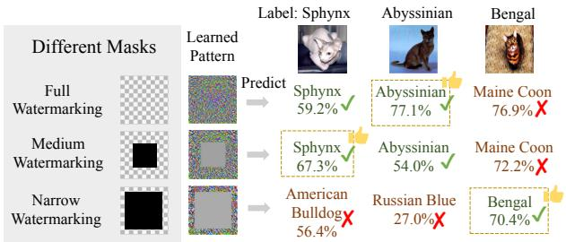  
Figure 1. Drawback of shared masks over individual images. We demonstrate the use of watermarking (Wang et al., 2022), a representative VR method, to re-purpose an ImageNet-pretrained classifier for the OxfordPets dataset, with different shared masks (full, medium, and narrow) in VR. An evaluation of classification confidence across three cat images — Sphynx, Abyssinian, and Bengal — indicates a sample-specific mask preference: Sphynx with medium, Abyssinian with full, and Bengal with narrow. It shows that different masks are needed for individual images.

expensive training costs even just to finetune pre-trained models, visual reprogramming (VR) (Neekhara et al., 2022; Wang et al., 2022; Chen et al., 2023; Tsao et al., 2024), or adversarial reprogramming (Elsayed et al., 2018; Tsai et al., 2020), has been proposed to reuse pre-trained models on target tasks. Concretely, VR is a prompting method that fixes a pre-trained model and only alters the input space by adding some learnable patterns (usually some noise) to target images. The location of the patterns to be learned is usually determined by a pre-defined binary mask that is shared across all samples (Elsayed et al., 2018; Yang et al., 2021; Tsai et al., 2020; Bahng et al., 2022). The key benefit of VR methods is that learning the pattern whose size is around the image size requires much less computing resource than finetuning considerable parameters within the model, posing VR as a promising research area in using pre-trained models (Chen et al., 2023; Tsao et al., 2024).

# 1. Introduction

Recent studies have shown that, by taking advantage of and re-purposing well-trained/pre-trained models, one can address new tasks (i.e., target tasks) without training a taskspecific model from scratch (Basu et al., 2023; Kossen et al., 2023; Mondal et al., 2023). In visual tasks, due to the

In this paper, we show that the shared mask often leads to poor generalization capability of VR, as demonstrated in Figures 1 and 2. In both figures, we use a representative VR method, watermarking (Bahng et al., 2022), to re-purpose an ImageNet-pretrained classifier to classify images in the OxfordPets datasets (Parkhi et al., 2012). In Figure 1, we first find that the optimal masks vary among individual images.

  
Figure 2. Drawback of shared masks in the statistical view. Optimal learning methods like finetuning usually result in loss decreases for all samples (see the blue part). But when applying the same mask in reprogramming, part of the loss changes are observed to be positive (see the red part) according to the distribution of [final loss - initial loss], which means the training loss for some samples even rises.

We apply three kinds of masks (full, medium, and narrow) in watermarking. By observing the classification confidence on three cat images: Sphynx, Abyssinian, and Bengal, we see that the medium mask is the best for Sphynx, the full mask for Abyssinian, and the narrow mask for Bengal. This suggests that different masks are needed for individual images. In Figure 2, we then find that watermarking with a single shared mask may cause the training loss of many individual samples to rise (see the red part in Figure 2). This phenomenon reveals that VR methods’ learning capacity is much less than finetuning all parameters of the pre-trained model (see the blue part in Figure 2).

The examples above show a significant disadvantage of using a single shared mask for VR. This motivates our new VR framework called sample-specific multi-channel masks (SMM). SMM replaces the fixed binary mask applied in existing works with generative three-channel masks that can vary across different samples (shown in Figure 3).

SMM has two modules: a mask generator module and a patch-wise interpolation module. The mask generator is a lightweight convolutional neural network (CNN) that takes resized individual target-domain images (i.e., samples) as the input and outputs different masks for each sample. The last layer of the generator is designed to generate a threechannel mask, which allows better performance for both rich-color images (i.e., CIFAR10/100 (Krizhevsky, 2009)) and monotonous-color images (i.e., SVHN (Yuval, 2011)). Since the generated masks should be the same size as the pattern to be learned, when the size of masks is inconsistent with that of the pattern, the patch-wise interpolation module will be utilized to re-scale the generated masks to fit the pattern, facilitating the training process of the mask generator (detailed in Section 3).

To understand why SMM is effective, we theoretically analyze the approximation error of different hypothesis sets for

VR. Three hypothesis sets are considered: shared pattern with a pre-defined binary mask, sample-specific patterns without masks, and our SMM. We show that SMM has a smaller approximation error (Proposition 4.3), which confirms the effectiveness of SMM.

To further substantiate the efficacy of SMM, we conduct empirical evaluations spanning 11 widely used datasets, incorporating ablation studies that discern the impact of individual SMM components. This is complemented by analysis and interpretations of the generated masks, alongside a comparative visualization of feature spaces. Notably, we demonstrate the effectiveness of SMM with both pretrained ResNet (He et al., 2016) and ViT (Dosovitskiy et al., 2020) (Table 1 and 2), validating that SMM is compatible with commonly used classifier architectures.

Both the theoretical analysis and promising experimental results provide solid evidence that, when powered by SMM, VR can efficiently leverage knowledge within a welltrained/pre-trained model for various target tasks, shedding new light on the explanatory analysis of VR and opening avenues for future research.

# 2. Preliminaries and Related Works

# 2.1. Problem Setting of Model Reprogramming

Model reprogramming (Chen, 2022) offers an efficient transfer learning paradigm for adapting pre-trained models to resource-constrained target tasks. This paradigm repurposes existing knowledge by strategically transforming inputs and outputs, bypassing extensive model parameter finetuning. In what follows, we will present a formal problem setting for model reprogramming.

Let $\mathcal { D } _ { \mathrm { T } }$ represent the data distribution of a target task defined over $\mathcal { X } ^ { \mathrm { T } } \times \mathcal { Y } ^ { \mathrm { T } }$ , where $\mathcal { X } ^ { \mathrm { T } } \subseteq \mathbb { R } ^ { d _ { \mathrm { T } } }$ is the data space and $y ^ { \mathrm { T } } = \{ 1 , \dots , k _ { \mathrm { T } } \}$ is the label space, and let $\{ ( x _ { i } ^ { \mathrm { T } } , y _ { i } ^ { \mathrm { T } } ) \} _ { i = 1 } ^ { n }$ be the observations of $\mathcal { D } _ { \mathrm { T } }$ (i.e., the training set in the target task). Meanwhile, we have a pre-trained model $f _ { \mathrm { P } } : \mathcal { X } ^ { \mathrm { P } } $ $\mathcal { V } ^ { \mathrm { P } }$ , where $\mathcal { X } ^ { \mathrm { P } } \subseteq \mathbb { R } ^ { d _ { \mathrm { P } } }$ and $\mathcal { V } ^ { \mathrm { P } }$ (s.t. $| \mathcal { V } ^ { \mathrm { T } } | \leq | \mathcal { V } ^ { \mathrm { P } } |$ , with the label space of the pre-trained task being larger than that of the target task) represent the data and label spaces used for training $f _ { \mathrm { P } }$ . Then, in model reprogramming, the training objective can be formulated as

$$
\operatorname* { m i n } _ { \theta \in \Theta , \omega \in \Omega } \frac { 1 } { n } \sum _ { i = 1 } ^ { n } \ell ( f _ { \mathrm { o u t } } \big ( f _ { \mathrm { P } } \big ( f _ { \mathrm { i n } } ( x _ { i } ^ { \mathrm { T } } | \theta ) \big ) | \mathcal { V } _ { \mathrm { s u b } } ^ { \mathrm { P } } , \omega \big ) , y _ { i } ^ { \mathrm { T } } \big ) ,
$$

where $f _ { \mathrm { i n } } ( . | \theta ) : \mathcal { X } ^ { \mathrm { T } } \mapsto \mathcal { X } ^ { \mathrm { P } } , f _ { \mathrm { o u t } } ( . | \mathcal { V } _ { \mathrm { s u b } } ^ { \mathrm { P } } , \omega ) : \mathcal { V } _ { \mathrm { s u b } } ^ { \mathrm { P } } \mapsto $ $y ^ { \mathrm { T } }$ are the input transformation and output label mapping function with parameters $\theta \in \Theta$ and $\omega \in \Omega$ , $\mathcal { V } _ { \mathrm { s u b } } ^ { \mathrm { P } } \subseteq \mathcal { V } ^ { \mathrm { P } }$ can be determined by different methods (Elsayed et al., 2018; Tsai et al., 2020; Chen et al., 2023), and $\ell : \mathcal { V } ^ { \mathrm { T } } \times \mathcal { V } ^ { \mathrm { T } } \mapsto$ $\mathbb { R } ^ { + } \cup \{ 0 \}$ is a loss function. Reprogramming techniques have been widely applied in visual (Elsayed et al., 2018; Tsai et al., 2020), text (Neekhara et al., 2018; Hambardzumyan et al., 2021), speech (Yang et al., 2021; 2023; Yen et al., 2023), music (Hung et al., 2023), and cross-modal tasks (Neekhara et al., 2022) in the past few years.

In the context of visual tasks, reprogramming has demonstrated potential in bio-medical measurement (Tsai et al., 2020), machine learning fairness (Zhang et al., 2022), as well as out-of-distribution detection through watermarking (Wang et al., 2022). Moving beyond application prospects, we next discuss the technical details of the specific input and output mapping functions ( $f _ { \mathrm { i n } }$ and $\boldsymbol { f _ { \mathrm { o u t } } } )$ ).

# 2.2. Prompting and Input Visual Reprogramming

General prompting methods in visual tasks, predominantly applied to the ViT architecture (Dosovitskiy et al., 2020), introduce extra parameters to a pre-trained model for enhanced training efficiency. Prompts are flexible in their placement. For example, visual prompt tuning (Jia et al., 2022) positions prompts alongside image embedding before the encoder layers, while effective and efficient visual prompt tuning (Han et al., 2023) extends this by incorporating parameters within self-attention layers as well. Transformer with hierarchical prompting (Wang et al., 2023) also learns prompt tokens to represent the coarse image classes.

Meanwhile, prompting goes beyond vision foundation models to vision-language frameworks such as CLIP (Radford et al., 2021). Methods like CoOP (Zhou et al., 2022b) and CoCoOP (Zhou et al., 2022a) replace textual prompts with learnable vectors for enhanced adaptability to the target task, conditioned on input images. MaPLe (Khattak et al., 2023) further bridges vision and language by learning layerspecific mapping functions. These methods vary from each other in terms of both prompt placements and functions.

In contrast, VR provides a model-agnostic prompting technique, by adding trainable noise to the input image patterns before the forward propagation, without altering their visual essence. Originally proposed by Elsayed et al. (2018), VR has been evolving to include padding-based methods (Tsai et al., 2020; Chen et al., 2023) and watermarking that facilitate downstream target tasks (Bahng et al., 2022). AutoVP (Tsao et al., 2024) stands out with its scalable pre-padding images. A critical limitation in existing VR research is the use of shared noise patterns across all target samples, neglecting sample-level characteristics and compromising generalization. We propose SMM to manage this gap.

# 2.3. Output Mapping of Reprogramming

Learning-based output mapping, i.e., model $f _ { \mathrm { o u t } }$ , as proposed by Chen et al. (2023), can be simplified as a one-toone mapping from a subset of $\mathcal { V } ^ { \mathrm { P } }$ to $y ^ { \mathrm { T } }$ . Therefore, no additional parameters are required. One implementation of this mapping is random label mapping (Rlm), where $f _ { \mathrm { o u t } }$ is a randomly assigned injective function (Elsayed et al., 2018; Chen et al., 2023), formulated as

$$
f _ { \mathrm { o u t } } ^ { \mathrm { R l m } } ( y | \mathcal { Y } _ { \mathrm { s u b } } ^ { \mathrm { P } } ) = \mathtt { r a n d } ( \{ 0 , 1 , . . . , k ^ { \mathrm { T } } \} ) ,
$$

where $\mathtt { r a n d } ( \{ 0 , 1 , . . . , k ^ { \mathrm { T } } \} )$ means randomly selecting one element from the set $\{ 0 , 1 , . . . , k ^ { \mathrm { T } } \}$ , and $\mathcal { V } _ { \mathrm { s u b } } ^ { \mathrm { P } }$ is of the same size with $y ^ { \mathrm { T } }$ (i.e., $k ^ { \mathrm { T } }$ ), randomly chosen from $\mathcal { V } ^ { \mathrm { P } }$ prior to the minimizationinjective, it ensures $f _ { \mathrm { o u t } } ^ { \mathrm { R l m } }$ isfor $f _ { \mathrm { o u t } } ^ { \mathrm { R l m } } ( y _ { 1 } | \mathcal { V } _ { \mathrm { s u b } } ^ { \mathrm { P } } ) \neq f _ { \mathrm { o u t } } ^ { \mathrm { R l m } } ( y _ { 2 } | \mathcal { V } _ { \mathrm { s u b } } ^ { \mathrm { P } } )$ two distinct elements $y _ { 1 } \neq y _ { 2 }$ .

Other representative output-mapping methods determine $\mathcal { V } _ { \mathrm { s u b } } ^ { \mathrm { P } }$ and $f _ { \mathrm { o u t } }$ for different target tasks. For example, one is based on the frequency of label assignment in the pre-trained model and the target data (Tsai et al., 2020), called frequent label mapping (Flm). Chen et al. (2023) propose iterative label mapping (Ilm) that updates $f _ { \mathrm { o u t } }$ in each training iteration, reflecting changes in label mapping throughout the learning of $ { f _ { \mathrm { o u t } } ^ { \mathrm { F l m } } }$ and $ { f _ { \mathrm { o u t } } ^ { \mathrm { I l m } } }$ $f _ { \mathrm { i n } }$ . Detailed procedures and the pseudo-code of are in Appendix A.4.

# 3. Sample-specific Multi-channel Masks

We focus on $f _ { \mathrm { i n } }$ , while treating $f _ { \mathrm { o u t } }$ as a non-parametric mapping, in line with Chen et al. (2023). We thus limit our discussion of trainable parameters to $\theta \in \Theta$ in Eq. (1). A flowchart in Appendix A.1 provides an overview of the problem structure of Input VR.

# 3.1. Framework of SMM

To allow both shared parameters over the whole dataset and variability among individual samples, it is intuitive to

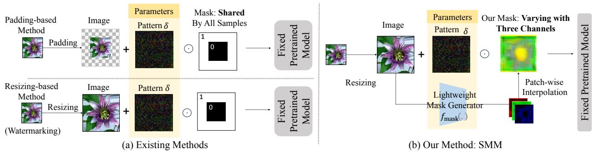  
Figure 3. Comparison between (a) existing methods and (b) our method. Previous padding-based reprogramming adds zeros around the target image, while resizing-based reprogramming adjusts image dimensions to fit the required input size. Both methods use a pre-determined shared mask to indicate the valid location of pattern $\delta$ . Our method, on the other hand, takes a more dynamic and tailored approach. We resize each target image and apply a different three-channel mask accordingly, driven by a lightweight $f _ { \mathrm { m a s k } }$ with an interpolation up-scaling module, allowing for more variability in individual samples.

consider the following VR hypothesis:

$$
f _ { \mathrm { i n } } ( x _ { i } | \phi , \delta ) = r ( x _ { i } ) + \delta \odot f _ { \mathrm { m a s k } } ( r ( x _ { i } ) | \phi ) ,
$$

where $r : \mathcal { X } ^ { \mathrm { T } } \xrightarrow { } \mathbb { R } ^ { d _ { \mathrm { P } } }$ is the resizing function, typically implemented as bilinear interpolation upsampling (Wikipedia contributors, 2023) that scales image dimension from $d _ { \mathrm { T } }$ to $d _ { \mathrm { P } }$ , and $r ( x _ { i } ) \in \mathbb { R } ^ { d _ { \mathrm { P } } }$ is the resized image corresponding to $x _ { i }$ . The mask generation function $f _ { \mathrm { m a s k } } : \mathbb { R } ^ { d _ { \mathrm { P } } } \overset { \cdot } {  } \mathbb { R } ^ { d _ { \mathrm { P } } }$ , parameterized by $\phi \in \Phi$ , produces a mask indicating the noise placements for each image. We denote a trainable noise pattern added to the image by $\delta \in \mathbb { R } ^ { d _ { \mathrm { P } } }$ . The rationale for applying this hypothesis is elaborated in Proposition 4.3 and validated in ablation studies (cf. Table 3). This casts the training objective of our SMM framework $( \theta = \{ \phi , \delta \} )$ t o find the optimal $\phi ^ { * }$ and $\delta ^ { * }$ such that

$$
\begin{array} { r l } & { \underset { \phi \in \Phi , \delta \in \mathbb { R } ^ { d _ { \mathrm { P } } } } { \mathrm { a r g } \mathrm { m i n } } \ \mathbb { E } _ { ( x _ { i } , y _ { i } ) \sim \mathcal { D } _ { \mathrm { T } } } \big [ \ell \big ( f _ { \mathrm { o u t } } \big ( f _ { \mathrm { P } } \big ( r ( x _ { i } ) + } \\ & { } \\ & { \quad \quad \quad \quad \delta \odot f _ { \mathrm { m a s k } } \big ( r ( x _ { i } ) | \phi ) \big ) \big ) , y _ { i } \big ) \big ] . } \end{array}
$$

Note that $\delta$ is shared by all images in the dataset following Bahng et al. (2022) and Chen et al. (2023), while $f _ { \mathrm { m a s k } }$ uniquely generates sample-specific multi-channel masks for each individual image, enabling sample-specific adaptation.

Figure 3 illustrates the workflow of SMM, as well as previous padding-based and resizing-based (i.e., watermarking) VR methods. Compared with previous works, SMM features $f _ { \mathrm { m a s k } } ( \cdot | \phi )$ , integrating a mask generator module and a patch-wise interpolation module. Concretely, SMM starts by resizing target images, followed by their processing through the mask generator to create corresponding threechannel masks. For generated masks smaller than the pattern size, the patch-wise interpolation module performs upsampling, which omits the derivation step in back-propagation and facilitates training. Afterward, the learnable pattern $\delta$ is multiplied with the mask on a pixel-wise basis and added to the image. The resulting image is fed into the fixed pretrained classifier. We discuss further details on the mask generator (Section 3.2), the patch-wise interpolation module (Section 3.3), and the overall learning strategy presented in Eq. (4) (Section 3.4).

# 3.2. Lightweight Mask Generator Module

The mask generator $f _ { \mathrm { m a s k } }$ is supposed to output a mask that has the same size as the input image while prioritizing different locations for $\delta$ to allow more variability. We employ a CNN as the mask generator. This choice stems from the proficiency of CNNs in mirroring localized visual perception (He et al., 2016) with fewer parameters than most deep learning structures, e.g., multilayer perceptrons.

The input of CNN is a resized image $r ( x _ { i } )$ . Applying our bespoke CNN architecture shown in Appendix A.2, the output will be a three-channel mask with dimensions $\textstyle \left\lfloor { \frac { H } { 2 ^ { l } } } \right\rfloor \times$ $\left\lfloor { \frac { W } { 2 ^ { l } } } \right\rfloor$ , where $H$ and $W$ denote image height and width, respectively, and $l$ denotes the number of pooling layers. The analysis of input/output sizes and parameter quantity statistics are in Appendix A.2.

# 3.3. Patch-wise Interpolation Module

The patch-wise interpolation module upscales CNNgenerated masks from $\left\lfloor { \frac { H } { 2 ^ { l } } } \right\rfloor \times \left\lfloor { \frac { W } { 2 ^ { l } } } \right\rfloor$ back to the original size $H \times W$ per channel (it is omitted when $l = 0$ ). Considering the inherent consistency in adjacent image areas and the benefits of concise operations for gradient calculations, we employ a grid of $\left\lfloor { \frac { H } { 2 ^ { l } } } \right\rfloor \times \left\lfloor { \frac { W } { 2 ^ { l } } } \right\rfloor$ patches in the upsampling process, each sized $2 ^ { l } \times 2 ^ { l }$ , ensuring the same values within each patch, with non-divisible cases mirroring the closest patches. Therefore, after obtaining the output of CNN, we

# Algorithm 1 Visual Reprogramming with SMM

1: Input: Pre-trained model $f _ { \mathrm { P } }$ , loss $\ell$ , label-mapping function $f _ { \mathrm { o u t } } ^ { ( j ) }$ for iteration $j$ , target domain training data $\{ ( x _ { i } , y _ { i } ) \} _ { i = 1 } ^ { n }$ , maximum number of iterations $E$ , learning rate $\alpha _ { 1 }$ for $\delta$ and $\alpha _ { 2 }$ for $\phi$   
2: Output: Optimal $\delta ^ { * } , \phi ^ { * }$   
3: Initialize $\phi$ randomly; set $\delta \gets \{ 0 \} ^ { d _ { \mathrm { P } } }$   
4: for $j = 1$ to $E$ do   
5: # Step1: Compute individual marks using the mask generator # Step2: Resize masks using the patch-wise interpolation module $\begin{array} { l } { { f _ { \mathrm { i n } } ( x _ { i } ; \delta , \phi )  r ( x _ { i } ) + \delta \odot f _ { \mathrm { m a s k } } ( r ( x _ { i } ) | \phi ) , \forall i \ : = } } \\ { { 1 , 2 , . . . , n } } \end{array}$   
6: # Compute the classification loss   
7: $\begin{array} { r l } & { L ( \delta , \dot { \phi ) } \dot { \phi ) } \dot { \phi ) } - \frac { 1 } { n } \sum _ { i = 1 } ^ { n } \ell ( f _ { \mathrm { o u t } } ^ { ( j ) } ( f _ { \mathrm { P } } ( f _ { \mathrm { i n } } ( x _ { i } ; \delta , \phi ) ) ) , y _ { i } ) } \\ & { \delta \dot { \phi } - \delta - \alpha _ { 1 } \nabla _ { \delta } L ( \delta , \phi ) } \\ & { \phi  \phi - \alpha _ { 2 } \nabla _ { \phi } L ( \delta , \phi ) } \end{array}$   
8:   
9: end for

enlarge each pixel to $2 ^ { l } \times 2 ^ { l }$ pixels by padding the same value of a pixel to its surrounding areas within the patch.

Unlike traditional interpolation methods which may introduce complicated derivation computations, our module simplifies the training by directly assigning values. The advantage of patch-wise interpolation over traditional interpolation methods will be discussed in Appendix A.3. The effect of patch size $2 ^ { l }$ will be discussed in Section 5.

# 3.4. Learning Strategy

The learning process for the shared noise pattern $\delta$ and the mask generator $f _ { \mathrm { m a s k } }$ is shown in Algorithm 1. The parameters $\delta$ and $\phi$ are iteratively updated in each epoch. To mitigate the impact of initialization, $\delta$ is set to be a zero matrix before training, noted as $\{ 0 \} ^ { d _ { \mathrm { P } } }$ .

# 4. Understanding Masks in Visual Reprogramming for Classification

In this section, we will demonstrate that SMM enables stronger model learning capacity than previous representative VR methods, via showing reduced approximation error in the probably approximately correct (PAC) learning framework (Kearns & Vazirani, 1994). We first present the definition of the approximation error in PAC learning.

Definition 4.1 (Approximation Error). Consider an input space $\mathcal { X }$ , a discrete label space $\mathcal { V }$ , a random variable $( X , Y )$ whose distribution $\mathcal { D }$ is defined on $\mathcal { X } \times \mathcal { V }$ with a joint probability density function $p ( x , y )$ , and a hypothesis space $\mathcal { F } = \{ f : \mathcal { X }  \mathcal { Y } \}$ . The approximation error of $\mathcal { F }$ on $\mathcal { D }$ is

$$
\mathrm { E r r } _ { \mathcal { D } } ^ { \mathrm { a p x } } ( \mathcal { F } ) = \operatorname* { i n f } _ { f \in \mathcal { F } } \mathbb { E } _ { ( X , Y ) \sim \mathcal { D } } \ell ( f ( X ) , Y ) - R _ { \mathcal { D } } ^ { * } ,
$$

where $\ell : \mathcal { V } \times \mathcal { V }  \mathbb { R } ^ { + } \cup \{ 0 \}$ is a loss function, and $R _ { \mathcal { D } } ^ { \ast }$ is the Bayes risk (Snapp & Xu, 1995) on $\mathcal { D }$ defined by

$$
R _ { D } ^ { * } = \int _ { \mathcal { X } } \Big [ 1 - \operatorname* { s u p } _ { y \in \mathcal { Y } } \operatorname* { P r } ( y | x ) \Big ] p _ { X } ( x ) d x .
$$

Here, $\operatorname* { P r } ( y | x )$ is the posterior probability of class $y$ conditioned on observing $x$ , and $\begin{array} { r } { p _ { X } ( x ) = \sum _ { y \in y } p ( x , y ) } \end{array}$ is the marginal distribution of $X$ .

The approximation error of a hypothesis space $\mathcal { F }$ measures the closeness of the minimum achievable error by $\mathcal { F }$ to the theoretical minimum error on distribution $\mathcal { D }$ . In general, increasing the complexity of $\mathcal { F }$ tends to reduce the approximation error. In the following theorem, we show a connection between two approximation errors when hypothesis spaces exhibit a subset relation.

Theorem 4.2. Given an input space $\mathcal { X }$ , a discrete label space $\mathcal { V } _ { : }$ , and a distribution $\mathcal { D }$ over $\mathcal { X } \times \mathcal { V }$ , if there are two hypothesis spaces ${ \mathcal { F } } _ { 1 } \subseteq \{ f : \mathcal { X } \to \mathcal { Y } \}$ and $\mathcal { F } _ { 2 } \subseteq C$ $\{ f : \mathcal { X } \to \mathcal { Y } \}$ satisfying that $\mathcal { F } _ { 1 } \subseteq \mathcal { F } _ { 2 }$ , then we have $\mathrm { E r r } _ { \mathcal { D } } ^ { \mathrm { a p x } } ( \mathcal { F } _ { 1 } ) \geq \mathrm { E r r } _ { \mathcal { D } } ^ { \mathrm { a p x } } ( \mathcal { F } _ { 2 } )$ .

Theorem 4.2 (proof in Appendix B.1) shows that understanding the subset relation between two hypothesis spaces is key to deriving their connections in their approximation errors. Next, we will define two hypothesis spaces: one induced by a shared mask and the other induced by SMM.

Hypothesis Space Induced by A Shared Mask. VR methods with a shared mask (Chen, 2022; Bahng et al., 2022) assume that, for each sample $x _ { i }$ , the mask is a constant matrix $M \in \{ 0 , 1 \} ^ { d _ { \mathrm { P } } }$ . Thus, given a fixed pre-trained model $f _ { \mathrm { P } }$ and a fixed output mapping function $f _ { \mathrm { o u t } }$ (for simplicity, we use $f _ { \mathrm { P } } ^ { \prime }$ to represent $f _ { \mathrm { o u t } } \circ f _ { \mathrm { P } }$ in this section), the hypothesis space induced by a shared mask is

$$
\begin{array} { r } { \mathcal { F } ^ { \mathrm { s h r } } ( f _ { \mathrm { P } } ^ { \prime } ) = \{ f | f ( x ) = f _ { \mathrm { P } } ^ { \prime } ( r ( x ) + M \odot \delta ) , \forall x \in \mathcal { X } \} , } \end{array}
$$

where $\delta \in \mathbb { R } ^ { d _ { \mathrm { P } } }$ . In padding-based reprogramming methods, $M$ is a fixed mask determined by the location of the target image (Chen, 2022). The locations where $x _ { i }$ is placed – usually the center of $r ( x _ { i } )$ – are denoted as $\{ i : M _ { i } = 0 \}$ , which are excluded from further training. The rest of the locations, denoted by $\{ i : M _ { i } = 1 \}$ , indicate trainable parameters $\delta$ . In watermarking-based methods (Bahng et al., 2022), $x _ { i }$ is up-sampled to $r ( x _ { i } )$ , and $\{ i : M _ { i } = 1 \}$ denotes effective locations of $\delta$ added to $r ( x _ { i } )$ .

Hypothesis Space Induced by SMM. Based on Eq. (4), we can obtain the hypothesis space used in SMM:

$$
\begin{array} { r l } & { \quad \mathcal { F } ^ { \mathrm { s m m } } ( f _ { \mathrm { P } } ^ { \prime } ) } \\ & { = \{ f | f ( x ) = f _ { \mathrm { P } } ^ { \prime } ( r ( x ) + f _ { \mathrm { m a s k } } ( r ( x ) ) \odot \delta ) , \forall x \in \mathcal { X } \} . } \end{array}
$$

Table 1. Performance Comparison of Different Input Reprogramming Methods on Pre-trained ResNet (Mean $\% \pm \mathrm { S t d } \%$ , the average results across all datasets are highlighted in grey)   

<table><tr><td>PRE-TRAINED</td><td colspan="5">RESNET-18 (IMAGENET-1K)</td><td colspan="5">RESNET-50 (IMAGENET-1K)</td></tr><tr><td>METHODS</td><td>PAD</td><td>NARROW</td><td>MEDIUM</td><td>FULL</td><td>OURS</td><td>PAD</td><td>NARROW</td><td>MEDIUM</td><td>FULL</td><td>OURS</td></tr><tr><td>CIFAR10</td><td>65.5 ±0.1</td><td>68.6 ±2.8</td><td>68.8±1.1</td><td>68.9 ±0.4</td><td>72.8 ±0.7</td><td>76.6±0.3</td><td>77.4±0.5</td><td>77.8+0.2</td><td>79.3±0.3</td><td>81.4±0.6</td></tr><tr><td>CIFAR100</td><td>24.8±0.1</td><td>36.9±0.6</td><td>34.9±0.2</td><td>33.8±0.2</td><td>39.4±0.6</td><td>38.9±0.3</td><td>42.5±0.2</td><td>43.8±0.2</td><td>47.2±0.1</td><td>49.0±0.2</td></tr><tr><td>SVHN</td><td>75.2±0.2</td><td>58.5±1.1</td><td>71.1±1.0</td><td>78.3±0.3</td><td>84.4±2.0</td><td>75.8±0.4</td><td>59.1±1.3</td><td>71.5±0.8</td><td>79.5±0.5</td><td>82.6±2.0</td></tr><tr><td>GTSRB</td><td>52.0±1.2</td><td>46.1±1.5</td><td>56.4±1.0</td><td>76.8±0.9</td><td>80.4±1.2</td><td>52.5±1.4</td><td>38.9±1.3</td><td>52.6±1.3</td><td>76.5±1.3</td><td>78.2±1.1</td></tr><tr><td>FLOWERS102</td><td>27.9±0.7</td><td>22.1±0.1</td><td>22.6±0.5</td><td>23.2±0.5</td><td>38.7±0.7</td><td>24.6±0.6</td><td>19.9±0.6</td><td>20.9±0.6</td><td>22.6±0.1</td><td>35.9±0.5</td></tr><tr><td>DTD</td><td>35.3±0.9</td><td>33.1±1.3</td><td>31.7±0.5</td><td>29.0±0.7</td><td>33.6±0.4</td><td>40.5±0.5</td><td>37.8±0.7</td><td>38.4±0.2</td><td>34.7±1.3</td><td>41.1±1.1</td></tr><tr><td>UCF101</td><td>23.9±0.5</td><td>27.2±0.9</td><td>26.1±0.3</td><td>24.4±0.9</td><td>28.7±0.8</td><td>34.6±0.2</td><td>38.4±0.2</td><td>37.2±0.2</td><td>35.2±0.2</td><td>38.9±0.5</td></tr><tr><td>F00D101</td><td>14.8±0.2</td><td>14.0±0.1</td><td>14.4±0.3</td><td>13.2±0.1</td><td>17.5±0.1</td><td>17.0±0.3</td><td>18.3±0.2</td><td>18.3±0.2</td><td>16.7±0.2</td><td>19.8±0.0</td></tr><tr><td>SUN397</td><td>13.0±0.2</td><td>15.3±0.1</td><td>14.2±0.1</td><td>13.4±0.2</td><td>16.0±0.3</td><td>20.3±0.2</td><td>22.0±0.1</td><td>21.5±0.1</td><td>21.1±0.1</td><td>22.9±0.0</td></tr><tr><td>EUROSAT</td><td>85.2±0.6</td><td>82.8±0.4</td><td>83.8±0.5</td><td>84.3±0.5</td><td>92.2±0.2</td><td>83.6±0.7</td><td>83.7±0.4</td><td>85.8±0.1</td><td>86.9±0.3</td><td>92.0±0.6</td></tr><tr><td>OXFORDPETS</td><td>65.4±0.7</td><td>73.7±0.2</td><td>71.4±0.2</td><td>70.0±0.6</td><td>74.1±0.4</td><td>76.2±0.6</td><td>76.4±0.3</td><td>75.6±0.3</td><td>73.4±0.3</td><td>78.1±0.2</td></tr><tr><td>AVERAGE</td><td>43.91</td><td>43.48</td><td>45.04</td><td>46.85</td><td>52.53</td><td>49.15</td><td>46.76</td><td>49.39</td><td>52.10</td><td>56.35</td></tr></table>

Note that, $f _ { \mathrm { m a s k } } ( r ( x ) )$ belongs to $\mathbb { R } ^ { d _ { \mathrm { P } } }$ instead of $\{ 0 , 1 \} ^ { d _ { \mathrm { P } } }$ like $M$ . Next, we analyze the relation between the approximation errors of previous VR methods and SMM.

SMM Has a Lower Approximation Error. Based on Theorem 4.2 and the two hypothesis spaces above, we have the following proposition.

Proposition 4.3. Given a fixed pre-trained model $f _ { \mathrm { P } }$ , a fixed output mapping function $f _ { \mathrm { o u t } }$ , and the definitions of $\mathcal { F } ^ { \mathrm { s h r } }$ and ${ \mathcal { F } } ^ { \mathrm { s m m } }$ , we have $\mathcal { F } ^ { \mathrm { s h r } } ( f _ { P } ^ { \prime } ) \subseteq \mathcal { F } ^ { \mathrm { s m m } } ( f _ { P } ^ { \prime } )$ . Then, based on Theorem 4.2, we have

$$
\mathrm { E r r } _ { \mathcal { D } _ { \mathrm { T } } } ^ { \mathrm { a p x } } ( \mathcal { F } ^ { \mathrm { s h r } } ( f _ { P } ^ { \prime } ) ) \ge \mathrm { E r r } _ { \mathcal { D } _ { \mathrm { T } } } ^ { \mathrm { a p x } } ( \mathcal { F } ^ { \mathrm { s m m } } ( f _ { P } ^ { \prime } ) ) ,
$$

where $f _ { P } ^ { \prime } = f _ { \mathrm { o u t } } \circ f _ { \mathrm { P } }$ , $f _ { \mathrm { m a s k } }$ used in $\mathcal { F } ^ { \mathrm { s m m } } ( f _ { P } ^ { \prime } )$ is a CNN demonstrated in Section 3.2, and $\mathcal { D } _ { \mathrm { T } }$ denotes the distribution of the target task.

Proposition 4.3 (see its proof in Appendix B.2) shows that SMM achieves a lower approximation error than previous shared-mask VR methods.

Estimation Error Analysis of SMM. While a lower approximation error does not suffice to guarantee a lower excess risk, the model complexity added to $\mathcal { F } ^ { \mathrm { s m m } } ( f _ { P } ^ { \prime } )$ is manageable in this VR setting, since $f _ { \mathrm { m a s k } }$ introduces less than $0 . 2 \%$ extra parameters1 relative to $f _ { \mathrm { P } } ^ { \prime }$ . Such dominance of $f _ { \mathrm { P } } ^ { \prime }$ suggests that the estimation error of $\mathcal { F } ^ { \mathrm { s m m } } ( f _ { P } ^ { \prime } )$ does not significantly exceed that of $\mathcal { F } ^ { \mathrm { s h r } } ( f _ { P } ^ { \prime } )$ and is unlikely to offset its advantage in approximation error. We also provide an empirical justification from the standpoint of over-fitting to show that the additional estimation error of $\mathcal { F } ^ { \mathrm { s m m } } ( f _ { P } ^ { \prime } )$ is negligible in Appendix D.3. By comparing the disparities in training and testing performance, we demonstrate that SMM does not increase the risk of model over-fitting, implying negligible estimation error.

Excess Risk Analysis of SMM. According to excess risk decomposition2, SMM is also expected to have a lower excess risk and, consequently, superior generalization capability compared to shared-mask VR methods.

Analysis Based on Sample-specific Patterns. Having built the concept of “sample-specific”, we also investigate an alternative to the proposed SMM: directly learning a samplespecific pattern for each image without involving $\delta$ . The hypothesis space in this context can be expressed by

$$
\begin{array} { r } { \mathcal { F } ^ { \mathrm { s p } } ( f _ { \mathrm { P } } ^ { \prime } ) = \{ f | f ( x ) = f _ { \mathrm { P } } ^ { \prime } ( r ( x ) + f _ { \mathrm { m a s k } } ( r ( x ) ) ) , \forall x \in \mathcal { X } \} . } \end{array}
$$

It is easy to check that $\mathcal { F } ^ { \mathrm { s p } } ( f _ { P } ^ { \prime } ) \subseteq \mathcal { F } ^ { \mathrm { s m m } } ( f _ { P } ^ { \prime } )$ , implying that $\mathrm { E r r } _ { \mathcal { D } _ { \mathrm { T } } } ^ { \mathrm { a p x } } ( \mathcal { F } ^ { \mathrm { s p } } ( f _ { P } ^ { \prime } ) ) \ge \mathrm { E r r } _ { \mathcal { D } _ { \mathrm { T } } } ^ { \mathrm { a p x } } ( \mathcal { F } ^ { \mathrm { s m m } } ( f _ { P } ^ { \prime } ) )$ (proof in Appendix B.3). Namely, SMM has a lower approximation error compared to directly learning a sample-specific pattern.

# 5. Experiments

Pre-trained Models and Target Tasks. Following Chen et al. (2023), we use ResNet-18, and ResNet-50 (He et al., 2016) as the pre-trained model. Performance on pre-trained ViT-B32 (Dosovitskiy et al., 2020) is also tested. All these models are pre-trained on ImageNet-1K (Deng et al., 2009), and target tasks include CIFAR10, CIFAR100 (Krizhevsky, 2009), SVHN (Yuval, 2011), GTSRB (Houben et al., 2013), Flowers102 (Nilsback & Zisserman, 2008), DTD (Cimpoi et al., 2014), UCF101 (Soomro et al., 2012), Food101 (Bossard et al., 2014), EuroSAT (Helber et al., 2019), OxfordPets (Parkhi et al., 2012), SUN397 (Xiao et al., 2010). Moreover, StanfordCars (Krause et al., 2013), which is revealed to be unsuitable for VR, is also discussed in Appendix D.4. We follow Chen et al. (2023) to split the datasets. Detailed dataset information is included in Appendix C.

Baselines. We compare our method with both paddingbased (Chen et al., 2023) and resizing-based methods (Bahng et al., 2022), including: (1) Pad: centering the original image and adding the noise pattern around the images, (2) Narrow: adding a narrow padding binary mask with a width of 28 ( $\frac { 1 } { 8 }$ of the input image size) to the noise pattern that covers the whole image (watermark), (3) Medium: adding a mask being a quarter of the size (the width is 56) of watermarks and (4) Full: full watermarks that cover the whole images following Wang et al. (2022). To ensure that all the methods are fairly compared, in training the shared noise pattern, we apply the same learning rate and milestones following Chen et al. (2023), with 0.01 being the initial learning rate and 0.1 being the learning rate decay. Two hundred epochs are run in total, and the $1 0 0 t h$ and the $1 4 5 t h$ epochs are the milestones. The training details of the mask generator are included in Appendix C. Experiments are run with three seeds on a single A100 GPU and the averaged test accuracy is reported. Due to page limits, we report here only the results obtained with the output mapping $ { f _ { \mathrm { o u t } } ^ { \mathrm { I l m } } }$ See Appendix D.1 for the results using $f _ { \mathrm { o u t } } ^ { \mathrm { R l m } }$ and $ { f _ { \mathrm { o u t } } ^ { \mathrm { F l m } } }$ .

Results on ResNets. Table 1 reports the accuracy of ResNet18 and ResNet-50 using VR methods with the baseline shared marks and our proposed SMM method. It can be observed that our SMM yields higher accuracy for both models on all datasets tested except for ResNet-18 on DTD. The advantage is more pronounced on the datasets where the target domains are more different from the original domain, such as SVHN, Flowers102, and EuroSAT. On SVHN, $6 . 1 \%$ and $3 . 1 \%$ improvements have been witnessed for ResNet-18 and ResNet-50, respectively, while over $10 \%$ improvement is observed on the Flowers102. On DTD, the padding-based method has better results for ResNet-18. This is likely to be due to the noisy watermarks adversely impacting the texture that needs to be classified, leading to the disadvantages of resizing-based methods. Even in this challenging setting, our SMM method leads to higher accuracy when applied on the larger pre-trained model ResNet-50.

Results on ViT. Recall that input reprogramming can be applied to diverse pre-trained classifiers, we next turn our focus on ViT. Detailed in Table 2, our comparative study with baselines reveals substantial performance gains in datasets like Flowers102 $( 2 1 . 8 \% )$ , Food101 $( 1 5 . 4 \% )$ , and SUN397 $( 7 . 3 \% )$ . These results suggest that SMM may yield even higher performance gains for larger pre-trained models. Exceptions do exist, like on EuroSAT, where all resizingbased methods show marginal under-performance, possibly a result of over-fitting on relatively simpler datasets. On UCF101, our SMM initially lags behind other strategies like narrow or medium masking but, after choosing appropriate learning rate parameters (See Appendix C), could achieve a leading $4 9 . 9 \%$ accuracy. Overall, the experiments above show the applicability of SMM over different pre-trained models and target domains. Abnormal cases of SMM in Table 1 and Table 2 will be further discussed in Appendix D.4. Next, we report ablation and parameter study results.

Table 2. Performance Comparison of Different Input Reprogramming Methods on Pre-trained ViT (Mean $\%$ , the average results are highlighted in grey)   

<table><tr><td>PRE-TRAINED</td><td colspan="5">VIT-B32 (IMAGENET-1K)</td></tr><tr><td>METHOD</td><td>PAD</td><td>NARROW</td><td>MEDIUM</td><td>FULL</td><td>OURS</td></tr><tr><td>CIFAR10</td><td>62.4</td><td>96.6</td><td>96.5</td><td>95.8</td><td>97.4</td></tr><tr><td>CIFAR100</td><td>31.6</td><td>74.4</td><td>75.3</td><td>75.0</td><td>82.6</td></tr><tr><td>SVHN</td><td>80.2</td><td>85.0</td><td>87.4</td><td>87.8</td><td>89.7</td></tr><tr><td>GTSRB</td><td>62.3</td><td>57.8</td><td>68.6</td><td>75.5</td><td>80.5</td></tr><tr><td>FLOWERS102</td><td>57.3</td><td>55.3</td><td>56.6</td><td>55.9</td><td>79.1</td></tr><tr><td>DTD</td><td>43.7</td><td>37.3</td><td>38.5</td><td>37.7</td><td>45.6</td></tr><tr><td>UCF101</td><td>33.6</td><td>44.5</td><td>44.8</td><td>40.9</td><td>42.6</td></tr><tr><td>F00D101</td><td>37.4</td><td>47.3</td><td>48.6</td><td>49.4</td><td>64.8</td></tr><tr><td>SUN397</td><td>21.8</td><td>29.0</td><td>29.4</td><td>28.8</td><td>36.7</td></tr><tr><td>EUROSAT</td><td>95.9</td><td>90.9</td><td>90.9</td><td>89.1</td><td>93.5</td></tr><tr><td>OXFORDPETS</td><td>57.6</td><td>82.5</td><td>81.0</td><td>75.3</td><td>83.8</td></tr><tr><td>AVERAGE</td><td>53.1</td><td>63.7</td><td>65.2</td><td>64.7</td><td>72.4</td></tr></table>

Table 3. Ablation Studies (Mean $\% \pm \mathrm { S t d } \%$ , with ResNet-18 as an example, and the average results are highlighted in grey)   

<table><tr><td></td><td>ONLY 8</td><td>ONLY fmask</td><td>SINGLE- CHANNEL fmask</td><td>OURS</td></tr><tr><td>CIFAR10</td><td>68.9±0.4</td><td>59.0±1.6</td><td>72.6±2.6</td><td>72.8±0.7</td></tr><tr><td>CIFAR100</td><td>33.8±0.2</td><td>32.1±0.3</td><td>38.0±0.6</td><td>39.4±0.6</td></tr><tr><td>SVHN</td><td>78.3±0.3</td><td>51.1±3.1</td><td>78.4±0.2</td><td>84.4±2.0</td></tr><tr><td>GTSRB</td><td>76.8±0.9</td><td>55.7±1.2</td><td>70.7±0.8</td><td>80.4±1.2</td></tr><tr><td>FLOWERS102</td><td>23.2±0.5</td><td>32.2±0.4</td><td>30.2±0.4</td><td>38.7±0.7</td></tr><tr><td>DTD</td><td>29.0±0.7</td><td>27.2±0.5</td><td>32.7±0.5</td><td>33.6±0.4</td></tr><tr><td>UCF101</td><td>24.4±0.9</td><td>25.7±0.3</td><td>28.0±0.3</td><td>28.7±0.8</td></tr><tr><td>Fo0D101</td><td>13.2±0.1</td><td>13.3±0.1</td><td>15.8±0.1</td><td>17.5±0.1</td></tr><tr><td>SUN397</td><td>13.4±0.2</td><td>10.5±0.1</td><td>15.9±0.1</td><td>16.0±0.3</td></tr><tr><td>EUROSAT</td><td>84.3±0.5</td><td>89.2±0.9</td><td>90.6±0.5</td><td>92.2±0.2</td></tr><tr><td>OXFORDPETS</td><td>70.0±0.6</td><td>72.5±0.3</td><td>73.8±0.6</td><td>74.1±0.4</td></tr><tr><td>AVERAGE</td><td>46.85</td><td>42.59</td><td>49.70</td><td>52.53</td></tr></table>

Impact of Masking. We first investigate the impact of different masking strategies. We take three variants against the proposed SMM into comparison: (i) Shared-pattern VR $f _ { \mathrm { i n } } ( x _ { i } ) ~ = ~ r ( x _ { i } ) + \delta$ , with $M$ being an all-one matrix equal to the image dimension for maximal flexibility in $\delta$ . It defaults to the “full watermarks” baseline without using $f _ { \mathrm { m a s k } }$ . (ii) Sample-specific pattern without masking $f _ { \mathrm { i n } } ( x _ { i } ) = r ( x _ { i } ) + f _ { \mathrm { m a s k } } ( r ( x _ { i } ) )$ . (iii) Single-channel version of SMM $f _ { \mathrm { i n } } ( x _ { i } ) = r ( x _ { i } ) \ – \delta \odot f _ { \mathrm { m a s k } } ^ { \mathrm { s } } ( r ( x _ { i } ) )$ , averaging the penultimate-layer output of the mask generator. These variants refer to the first three columns of Table 3, respectively. They help evaluate the impact of sample specificity, masking, and multiple channels introduced by SMM in the context of input VR.

As shown in Table 3, SMM consistently stands out as the best performer on all datasets. A key observation is that only keeping shared pattern $\delta$ reduces VR effectiveness in featurerich datasets (e.g., CIFAR10, Flowers102, and UCF101). Besides, using only $f _ { \mathrm { m a s k } }$ without $\delta$ , leads to suboptimal performance on datasets with enough training data per class, including CIFAR10, SVHN, GTSRB, and SUN397. Moreover, the single-channel method is less effective, especially on datasets where images have fewer varying color palettes (e.g., GTSRB and Flowers102). Overall, we find that the shared noise in SMM boosts model performance if sufficient training data is provided, whereas the sample-specific $f _ { \mathrm { m a s k } }$ enables specificity for classification tasks demanding detailed feature discrimination. Lastly, the multi-channel allows for adjusting to channel-specific priorities.

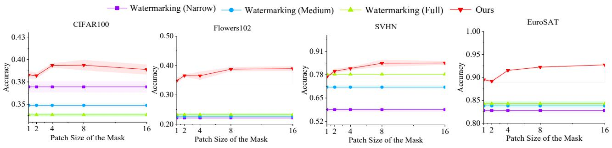  
Figure 4. Comparative results of different patch sizes $( 2 ^ { l } )$ . ResNet-18 is used as the pre-trained model as an example.

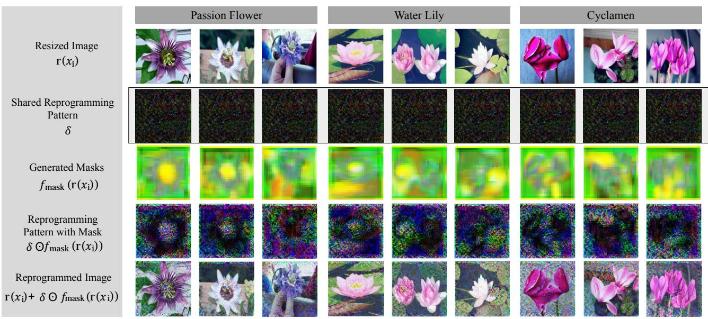  
Figure 5. Visual results of trained VR on the Flowers102 dataset. To show the difference in results, the original image, result image and SMM adopt histogram equalization. ResNet-18 is used as the pre-trained model as an example. Other visualization results and further analysis are included in Appendix F.

Impact of Patch Size. As an important hyperparameter in

SMM, number of Max-Pooling layers, $l$ , can vary, which means different patch sizes $2 ^ { l }$ . Since the 5-layer mask generator neural network has at most 4 Max-Pooling layers, we examine the impact of patch sizes in $\{ 2 ^ { 0 } , 2 ^ { 1 } , 2 ^ { 2 } , 2 ^ { 3 } , 2 ^ { 4 } \}$ Results are shown in Figure 4. As the patch size increases, the accuracy of the SMM increases first, followed by a plateau or decline. This suggests that overly small patches may cause over-fitting, while overly large patch sizes could result in a loss of details in SMM. We thus have set the patch size to be 8 across all datasets.

Visualization of SMM, shared patterns and output reprogrammed images. Visualization results on Flowers102 dataset is shown in Figure 5. It can be observed that when classifying passion flowers, where pedals are important for classification accuracy, the masks tend to mask out the noise output feature space shows limited class separation. With the baseline methods, we observe enhanced but incomplete separations, where certain class pairs (such as ‘3, $_ 5 '$ and $^ { 6 }$ 8’ in SVHN, ‘River’ and ‘highway or road’ in EuroSAT) remain indistinguishable in the feature space. By applying $f _ { \mathrm { m a s k } }$ , our method successfully resolves incorrectly clustered classes, underscoring the effectiveness of SMM.

  
Figure 6. TSNE visualization results of the feature space on (a) SVHN and (b) EuroSAT datasets. ResNet-18 is used as the pretrained model as an example.

Comparison with Finetuning-based Methods. In Appendix E, we compare our SMM with two prevalent finetuning approaches: finetuning fully connected layers and low-rank adaptation (Zhu et al., 2023). This comparison highlights two key benefits of input VR: (1) its efficacy in target tasks with lower-resolution images and (2) its orthogonal relationship to, yet compatibility with, finetuning methods. Additionally, Appendix E provides a comprehensive discussion on the strengths and weaknesses of Input VR in comparison to finetuning techniques.

More Experiments. The training curves are plotted and analyzed in Appendix D.2. The effectiveness of SMM when learning with different $f _ { \mathrm { o u t } }$ is discussed in Appendix D.1.

# 6. Conclusion

In this paper, we identified significant shortcomings in the use of a shared mask across all samples in previous VR practices, notably its failure to accommodate sample diversity, leading to increased training loss of particular samples. In response, we proposed a new SMM learning framework, integrating a lightweight neural net-based mask generator to generate three-channel masks per sample, and a patch-wise interpolation module that resizes and aligns masks to model input. Both theoretical justification and experimental results validated the effectiveness of our proposed method.

pattern over the pedals, which protects useful information from being shadowed by noise. Other features such as flower pistils in passion flowers are also widely present in various similar classes such as ‘oxeye’, ‘daisy’ and ‘orange dahlia’, making the centers of flowers potential sources of interference in classification. Thus, for passion flowers, noise in the center of the flowers is not masked out. When classifying ‘water lily’, SMM will enhance the noise on interfering objects in the image. Similarly, when classifying ‘cyclamen’, similar stems are also commonly found in other classes such as ‘gaura’ and ‘rose’, which hinders accurate classification. Therefore, it is reasonable for SMM to introduce more noise to these interfering components. These results show that SMM is able to retain the important parts of the image and remove the interference.

# Acknowledgements

Feature Space Visualization Results. Figure 6 shows the tSNE (Van der Maaten & Hinton, 2008) visualization results of the output layer feature before the label mapping layer. Before applying VR methods, the target domain’s

CYC and FL are supported by the Australian Research Council (ARC) with grant number DE240101089, and FL is also supported by the ARC with grant number DP230101540 and the NSF&CSIRO Responsible AI program with grant number 2303037. JZQ is supported by ARC with grant number DP240101006. This research is also supported by The University of Melbourne’s Research Computing Services and the Petascale Campus Initiative. We sincerely appreciate the time and dedication of the reviewers in carefully reviewing our manuscript.

# Impact Statement

This paper presents work whose goal is to advance the field of Machine Learning. There are many potential societal consequences of our work, none of which we feel must be specifically highlighted here.

# References

Bahng, H., Jahanian, A., Sankaranarayanan, S., and Isola, P. Exploring visual prompts for adapting large-scale models. arXiv preprint arXiv:2203.17274, 2022.

Basu, S., Katdare, P., Sattigeri, P., Chenthamarakshan, V., Driggs-Campbell, K. R., Das, P., and Varshney, L. R. Efficient equivariant transfer learning from pretrained models. In NeurIPS, 2023.

Bossard, L., Guillaumin, M., and Van Gool, L. Food-101– mining discriminative components with random forests. In ECCV, 2014.

Chen, A., Yao, Y., Chen, P.-Y., Zhang, Y., and Liu, S. Understanding and improving visual prompting: A labelmapping perspective. In CVPR, 2023.

Chen, P.-Y. Model reprogramming: Resource-efficient cross-domain machine learning. arXiv preprint arXiv:2202.10629, 2022.

Cimpoi, M., Maji, S., Kokkinos, I., Mohamed, S., and Vedaldi, A. Describing textures in the wild. In CVPR, 2014.

Deng, J., Dong, W., Socher, R., Li, L.-J., Li, K., and Fei-Fei, L. Imagenet: A large-scale hierarchical image database. In CVPR, 2009.

Dosovitskiy, A., Beyer, L., Kolesnikov, A., Weissenborn, D., Zhai, X., Unterthiner, T., Dehghani, M., Minderer, M., Heigold, G., Gelly, S., et al. An image is worth 16x16 words: Transformers for image recognition at scale. arXiv preprint arXiv:2010.11929, 2020.

Elsayed, G. F., Goodfellow, I., and Sohl-Dickstein, J. Adversarial reprogramming of neural networks. In ICLR, 2018.

Hambardzumyan, K., Khachatrian, H., and May, J. Warp: Word-level adversarial reprogramming. In ACL-IJCNLP, 2021.

Han, C., Wang, Q., Cui, Y., Cao, Z., Wang, W., Qi, S., and Liu, D. $\mathbf { E } ^ { \star }$ 2vpt: An effective and efficient approach for visual prompt tuning. arXiv preprint arXiv:2307.13770, 2023.

He, K., Zhang, X., Ren, S., and Sun, J. Deep residual learning for image recognition. In CVPR, 2016.

Helber, P., Bischke, B., Dengel, A., and Borth, D. Eurosat: A novel dataset and deep learning benchmark for land use and land cover classification. IEEE Journal of Selected Topics in Applied Earth Observations and Remote Sensing, 2019.

Houben, S., Stallkamp, J., Salmen, J., Schlipsing, M., and Igel, C. Detection of traffic signs in real-world images: The german traffic sign detection benchmark. In IJCNN, 2013.

Hu, E. J., Wallis, P., Allen-Zhu, Z., Li, Y., Wang, S., Wang, L., Chen, W., et al. Lora: Low-rank adaptation of large language models. In International Conference on Learning Representations, 2021.

Hung, Y.-N., Yang, C.-H. H., Chen, P.-Y., and Lerch, A. Low-resource music genre classification with crossmodal neural model reprogramming. In ICASSP, 2023.

Jia, M., Tang, L., Chen, B.-C., Cardie, C., Belongie, S., Hariharan, B., and Lim, S.-N. Visual prompt tuning. In ECCV, 2022.

Kearns, M. J. and Vazirani, U. An introduction to computational learning theory. MIT press, 1994.

Khattak, M. U., Rasheed, H., Maaz, M., Khan, S., and Khan, F. S. Maple: Multi-modal prompt learning. In CVPR, 2023.

Kossen, J., Collier, M., Mustafa, B., Wang, X., Zhai, X., Beyer, L., Steiner, A., Berent, J., Jenatton, R., and Kokiopoulou, E. Three towers: Flexible contrastive learning with pretrained image models. arXiv preprint arXiv:2305.16999, 2023.

Krause, J., Stark, M., Deng, J., and Fei-Fei, L. 3d object representations for fine-grained categorization. In ICCV workshops, 2013.

Krizhevsky, A. Learning multiple layers of features from tiny images. Master’s thesis, University of Tront, 2009.

Lauer, F. An interactive journey into machine learning, 2014. URL https://mlweb.loria.fr/book/ en/estimationapproximationerrors.html.

Mondal, A. K., Panigrahi, S. S., Kaba, S.-O., Rajeswar, S., and Ravanbakhsh, S. Equivariant adaptation of large pre-trained models. arXiv preprint arXiv:2310.01647, 2023.

Neekhara, P., Hussain, S., Dubnov, S., and Koushanfar, F. Adversarial reprogramming of text classification neural networks. arXiv preprint arXiv:1809.01829, 2018.

Neekhara, P., Hussain, S., Du, J., Dubnov, S., Koushanfar, F., and McAuley, J. Cross-modal adversarial reprogramming. In WACV, 2022.

Nilsback, M.-E. and Zisserman, A. Automated flower classification over a large number of classes. In Indian Conference on Computer Vision, Graphics & Image Processing, 2008.

Parkhi, O. M., Vedaldi, A., Zisserman, A., and Jawahar, C. Cats and dogs. In CVPR, 2012.

Radford, A., Kim, J. W., Hallacy, C., Ramesh, A., Goh, G., Agarwal, S., Sastry, G., Askell, A., Mishkin, P., Clark, J., et al. Learning transferable visual models from natural language supervision. In ICML, 2021.

Snapp, R. and Xu, T. Estimating the bayes risk from sample data. In NeurIPS, 1995.

Soomro, K., Zamir, A. R., and Shah, M. Ucf101: A dataset of 101 human actions classes from videos in the wild. arXiv preprint arXiv:1212.0402, 2012.

Tsai, Y.-Y., Chen, P.-Y., and Ho, T.-Y. Transfer learning without knowing: Reprogramming black-box machine learning models with scarce data and limited resources. In ICML, 2020.

Tsao, H.-A., Hsiung, L., Chen, P.-Y., Liu, S., and Ho, T.-Y. AutoVP: an automated visual prompting framework and benchmark. In ICLR, 2024.

Van der Maaten, L. and Hinton, G. Visualizing data using t-sne. Journal of Machine Learning Research, 2008.

Wang, Q., Liu, F., Zhang, Y., Zhang, J., Gong, C., Liu, T., and Han, B. Watermarking for out-of-distribution detection. NeurIPS, 2022.

Wang, W., Sun, Y., Li, W., and Yang, Y. Transhp: Image classification with hierarchical prompting. arXiv preprint arXiv:2304.06385, 2023.

Wikipedia contributors. Bilinear interpolation — Wikipedia, the free encyclopedia, 2023. URL https://en.wikipedia.org/w/index.php? title $=$ Bilinear_interpolation&oldid $=$ 1170546721.

Xiao, J., Hays, J., Ehinger, K. A., Oliva, A., and Torralba, A. Sun database: Large-scale scene recognition from abbey to zoo. In CVPR, 2010.

Yang, C.-H. H., Tsai, Y.-Y., and Chen, P.-Y. Voice2series: Reprogramming acoustic models for time series classification. In ICML, 2021.

Yang, C.-H. H., Li, B., Zhang, Y., Chen, N., Prabhavalkar, R., Sainath, T. N., and Strohman, T. From english to more languages: Parameter-efficient model reprogramming for cross-lingual speech recognition. In ICASSP, 2023.

Yen, H., Ku, P.-J., Yang, C.-H. H., Hu, H., Siniscalchi, S. M., Chen, P.-Y., and Tsao, Y. Neural model reprogramming with similarity based mapping for low-resource spoken command recognition. In INTERSPEECH, 2023.

Yuval, N. Reading digits in natural images with unsupervised feature learning. In NIPS Workshop, 2011.

Zhang, G., Zhang, Y., Zhang, Y., Fan, W., Li, Q., Liu, S., and Chang, S. Fairness reprogramming. NeurIPS, 2022.

Zhou, K., Yang, J., Loy, C. C., and Liu, Z. Conditional prompt learning for vision-language models. In CVPR, 2022a.

Zhou, K., Yang, J., Loy, C. C., and Liu, Z. Learning to prompt for vision-language models. International Journal of Computer Vision, 2022b.

Zhu, Y., Shen, Z., Zhao, Z., Wang, S., Wang, X., Zhao, X., Shen, D., and Wang, Q. Melo: Low-rank adaptation is better than fine-tuning for medical image diagnosis. arXiv preprint arXiv:2311.08236, 2023.

# Appendix

# A. Additional Explanation of Methods A.1. General Procedure of Input Visual Reprogramming

Figure 7. Problem setting of input visual reprogramming. The upper part shows the source task, while the lower part shows the target task.   
The main focus of visual reprogramming is the trainable part marked with a yellow rectangle in the input space.

The task of VR is to reuse the fixed, well-trained model toward a target task. As shown in Figure 7, the VR module is added before the pre-trained model into the input space. To gap the difference between the source label and target label, an output mapping function without parameters is also used, taking a source label as the input and outputting a target label. Therefore, regardless of the architecture, a well-trained model on the source dataset can be transferred to the target task without editing.

# A.2. Architecture of the Mask Generator and Parameter Statistics

  
Figure 8. Architecture of the 5-layer mask generator designed for ResNet

Architecture of the Mask Generator. For simplicity, we only include $3 \times 3$ convolution layers and $2 \times 2$ Max-Pooling layers in the architecture. The number of channels of the last layer is set to 3 to produce a three-channel mask.

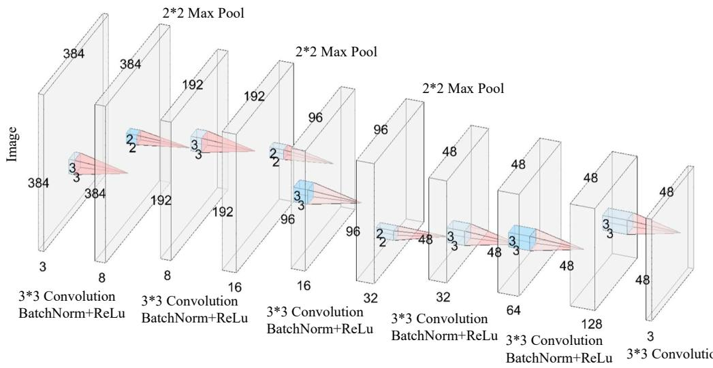  
Figure 9. Architecture of the 6-layer mask generator designed for ViT

The detailed architecture of the 5-layer CNN and 6-layer CNN used in ResNet-18, ResNet-50, and ViT are shown in Figure 8 and Figure 9. Each of them contains 5 or 6 CNN layers with $3 \times 3$ kernels of padding size 1 and stride 1. Both models have 3 Max-Pooling layers.

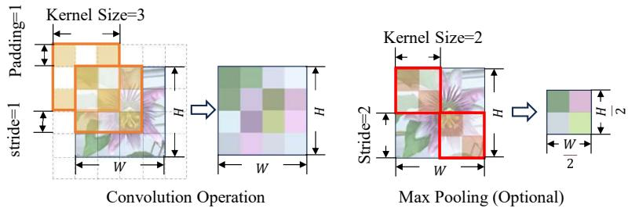  
Figure 10. Changes of the image size when performing convolution and pooling operations with our stride, kernel and padding size

Discussion of Input and Output Size. To show the relationship between the sizes of the input images and the output masks, we use $s , p$ , and $k$ to represent the stride, padding, and kernel sizes, respectively, while $H$ and $W$ denote the height and the width of a certain channel. The output dimensions of the output channel after convolution or pooling are $\begin{array} { r } { \left\lfloor { \frac { H + 2 p - k } { s } } \right\rfloor + 1 } \end{array}$ and $\left\lfloor { \frac { W + 2 p - k } { s } } \right\rfloor + 1$ . As shown in Figure 10, when $s = 1 , p = 1 , k = 3$ , the size of a single channel remains unchanged; when $s = 2 , p \overset { \_ } { = } 0 , k = 2$ , the size of a channel is reduced by half in each dimension. In other words, by only using $3 \times 3$ convolution layers, $f _ { \mathrm { m a s k } } ( . | \phi )$ can retain the original size of a single channel. However, if we introduce Max-Pooling layers to remove redundant information, the output size will be shrunk and another patch-wise interpolation module should be included in $f _ { \mathrm { m a s k } } ( . | \phi )$ for resizing. Assuming that $l$ Max-Pooling layers are used, the output size of a single channel becomes $\left\lfloor { \frac { H } { 2 ^ { l } } } \right\rfloor \times \left\lfloor { \frac { W } { 2 ^ { l } } } \right\rfloor$ .

Parameter Statistics. The parameter statistics of the mask generator, $f _ { \mathrm { m a s k } }$ , are summarized in Table 4. This includes a detailed breakdown of $f _ { \mathrm { m a s k } }$ across different pre-trained backbone models, a relative size comparison with the watermarking reprogramming method, and the number of trainable parameters added to frozen pre-trained models by $f _ { \mathrm { m a s k } }$ . From the size point of view, our mask generator is indeed lightweight and efficient: the CNN architectures contribute only $1 7 . 6 \%$ and $2 3 . 1 3 \%$ of the additional trainable parameters required by watermarking reprogramming. Moreover, relative to the total parameters in pre-trained models, the additional contribution of mask generators is trivial, ranging from $0 . 1 \%$ to $0 . 2 3 \%$ of parameters, which highlights its minimal footprint.

Table 4. Statistics of Mask Generator Parameter Size   

<table><tr><td>PRE-TRAINED</td><td>INPUT IMAGE SIZE</td><td>fmask CNN LAYERS</td><td>EXTRA PARAMETERS OF OUR fmask</td><td>OUR EXTRA PARAMETERS÷ REPROGRAMMING PARAMETERS</td><td>OUR EXTRA PARAMETERS÷ PRE-TRAINED MODEL PARAMETERS</td></tr><tr><td>REsNET-18</td><td>224×224×2</td><td>5</td><td>26,499</td><td>17.60%</td><td>0.23%</td></tr><tr><td>RESNET-50</td><td>224×224×3</td><td>5</td><td>26,499</td><td>17.60%</td><td>0.10%</td></tr><tr><td>VIT-B32</td><td>384×384×3</td><td>6</td><td>102,339</td><td>23.13%</td><td>0.12%</td></tr></table>

# A.3. Advantage of Patch-wise Interpolation

Table 5. Comparison of Patch-wise Interpolation and Other Interpolation Methods   

<table><tr><td colspan="2"></td><td>BILINEAR INTERPOLATION</td><td>BICUBIC INTERPOLATION</td><td>OURS</td></tr><tr><td rowspan="3">RESNET -18/50</td><td>NUMBER OF PIXEL</td><td>0.602</td><td>2.408</td><td>0.151</td></tr><tr><td>ACCESSES (1E6) TIME PER</td><td>0.062±0.001</td><td>0.195±0.013</td><td>0.026±0.004</td></tr><tr><td>BATCH (S) REQUIRE</td><td>YES</td><td>YES</td><td>No</td></tr><tr><td rowspan="6">VIT-B32</td><td>BACKPROPAGATION NUMBER OF</td><td></td><td></td><td></td></tr><tr><td>PIXEL</td><td>1.769</td><td>7.078</td><td>0.442</td></tr><tr><td>ACCESSES (1E6)</td><td></td><td></td><td></td></tr><tr><td>TIME PER BATCH (S)</td><td>0.165±0.009</td><td>0.486±0.026</td><td>0.069±0.004</td></tr><tr><td>REQUIRE</td><td>YES</td><td></td><td></td></tr><tr><td>BACKPROPAGATION</td><td></td><td>YES</td><td>No</td></tr></table>

To assess the efficiency of patch-wise interpolation, we compare it with bilinear and bicubic methods, employing the following numerical metrics for evaluation: (1) Number of Pixel Accesses: The count of times pixel values are retrieved per image during an interpolation algorithm. The fewer, the better. (2) Time Per Batch: The time cost for processing a batch of 256-sized images. The fewer, the better.

As shown in Table 5, the patch-wise interpolation module excels across all metrics. This module exclusively involves copying operations, thus avoiding floating-point calculations and avoiding backpropagation gradient computations during training. Consequently, it is more efficient.

# A.4. Detailed Explanation of Ouptput Mapping Methods $f _ { \mathrm { o u t } } ^ { \mathrm { F l m } }$ and $\it { f } _ { \mathrm { o u t } } ^ { \mathrm { I l m } }$

The inverse function of $f _ { \mathrm { o u t } }$ regarding Flm is an injective function:

$$
y _ { \mathrm { F l m } } ^ { \mathrm { P } } = \underset { y \in \mathcal { Y } ^ { \mathrm { P } } } { \arg \operatorname* { m a x } } \ \underset { ( x _ { i } , y _ { i } ) \sim \mathcal { D } _ { \mathrm { T } } } { P r } \{ y = f _ { \mathrm { P } } ( f _ { \mathrm { i n } } ( x _ { i } | \theta ) ) | y _ { i } = y ^ { \mathrm { T } } \} ,
$$

where $y _ { \mathrm { F l m } } ^ { \mathrm { P } }$ is the optimal $y ^ { \mathrm { P } }$ given the target label $y ^ { \mathrm { T } }$ , $f _ { \mathrm { P } } ( f _ { \mathrm { i n } } ( x _ { i } | \boldsymbol { \theta } ) )$ is the predicted label given the input image $x _ { i }$ . For all images with the label $y ^ { \mathrm { T } }$ , the predicted $y ^ { \mathrm { P } }$ with the highest probability will be $y _ { \mathrm { F l m } } ^ { \mathrm { P } }$ for a given $y ^ { \mathrm { T } }$ . Flm remains unchanged throughout iterations. For a specific $y ^ { \mathrm { T } }$ , Flm determines the correspondence between $y ^ { \mathrm { T } }$ and the most frequently assigned class $y ^ { \mathrm { P } }$ in $\mathcal { V } ^ { \mathrm { P } }$ , utilizing the well-trained network for all target training samples of the class $y ^ { \mathrm { T } }$ , thus obtaining $ { f _ { \mathrm { o u t } } ^ { \mathrm { F l m } } }$ , shown in Algorithm 3.

As the label mapping may change from time to time when learning $f _ { \mathrm { i n } }$ , Chen et al. (2023) proposed an iterative label mapping (Ilm) method that updates $f _ { \mathrm { o u t } } ( \cdot )$ after each training iteration. Let $y _ { \mathrm { I l m } } ^ { \mathrm { { P , ( j ) } } }$ be the optimal $y ^ { \mathrm { P } }$ in the $j$ th training

epoch. We have:

$$
\begin{array} { r } { y _ { \mathrm { I m } } ^ { \mathrm { P } , ( \mathrm { j + 1 } ) } = \underset { y \in \mathcal { Y } ^ { \mathrm { P } } } { \arg \operatorname* { m a x } } \underset { ( x _ { i } , y _ { i } ) \sim \mathcal { D } _ { \mathrm { T } } } { P r } \{ y = f _ { \mathrm { P } } ( f _ { \mathrm { i n } } ^ { ( j ) } ( x _ { i } | \theta ^ { ( j ) } ) ) | y _ { i } = y ^ { \mathrm { T } } \} , } \end{array}
$$

where $f _ { \mathrm { i n } } ^ { ( j ) } ( \cdot | \theta ^ { ( j ) } )$ is the parameters of the $j$ th epoch. The output mapping function is updated after each iteration until convergence.

# Algorithm 2 Computing Frequency Distribution of $[ f _ { \mathrm { P } } ( f _ { \mathrm { i n } } ( x _ { i } | \theta ) ) , y ^ { \mathrm { T } } ]$

1: Input: Target training set $\{ ( x _ { i } ^ { \mathrm { T } } , y _ { i } ^ { \mathrm { T } } ) \} _ { i = 1 } ^ { n }$ , given input VR $f _ { \mathrm { i n } } ( \cdot | \theta )$ and pre-trained model $f _ { \mathrm { P } } ( \cdot )$   
2: Output: Frequency distribution matrix d ∈ Z|YP|×|YT|   
3: Initialize d ← {0}|YP|×|YT|   
4: # Compute frequency distribution $d$   
5: for $i = 1 . . . n$ do   
6: $\hat { y } _ { i } ^ { \mathrm { P } } \gets f _ { \mathrm { P } } ( f _ { \mathrm { i n } } ( x _ { i } ^ { \mathrm { T } } | \boldsymbol { \theta } ) )$   
7: $d _ { \hat { y } _ { i } ^ { \mathrm { P } } , y _ { i } ^ { \mathrm { T } } } \gets d _ { \hat { y } _ { i } ^ { \mathrm { P } } , y _ { i } ^ { \mathrm { T } } } + 1$   
8: end for

# Algorithm 3 Frequent Label Mapping $( f _ { \mathrm { o u t } } ^ { \mathrm { F l m } } )$

1: Input: Label space of the pre-trained task $\mathcal { V } ^ { \mathrm { P } }$ , label space of the target task $y ^ { \mathrm { T } }$ , target training set $\{ ( x _ { i } ^ { \mathrm { T } } , y _ { i } ^ { \mathrm { T } } ) \} _ { i = 1 } ^ { n }$   
given pre-trained model $f _ { \mathrm { P } } ( \cdot )$   
2: Output: Flm $f _ { \mathrm { o u t } } ^ { \mathrm { F l m } } : \mathcal { V } _ { \mathrm { s u b } } ^ { \mathrm { P } } \to \mathcal { V } ^ { \mathrm { T } }$   
3: Initialize $f _ { \mathrm { o u t } } ^ { \mathrm { F l m } } ( \cdot ) \gets 0$ , subset $\partial _ { \mathrm { s u b } } ^ { \mathrm { P } }  \emptyset$ to store matched labels, initialize $f _ { \mathrm { i n } } ( \cdot | \theta )$ to be an identity function $\mathbf { \nabla } \cdot \theta \gets \mathbf { 0 }$ )   
4: # Compute frequency distribution $d$   
5: Use Algorithm 2 to obtain $d$   
6: # Compute output mapping $ { f _ { \mathrm { o u t } } ^ { \mathrm { F l m } } }$   
7: while size of $\mathcal { V } _ { \mathrm { s u b } } ^ { \mathrm { P } }$ is not $| y ^ { \mathrm { T } } |$ do   
8: Find the maximum $d _ { y ^ { \mathrm { P } } , y ^ { \mathrm { T } } }$ in $d$   
9: 10: $\mathcal { V } _ { \mathrm { s u b } } ^ { \mathrm { P } }  \mathcal { V } _ { \mathrm { s u b } } ^ { \mathrm { P } } \cup \{ \boldsymbol { y } ^ { \mathrm { P } } \}$ $f _ { \mathrm { o u t } } ^ { \mathrm { F l m } } ( y ^ { \mathrm { P } } ) \gets y ^ { \mathrm { T } }$ pdate the label mapping function   
11: $d _ { y ^ { \mathrm { P } } , t } \gets 0$ for $t = 1 , 2 , . . . , | \mathcal { V } ^ { \mathrm { T } } |$ # Avoiding illegal assignment to the injective function   
12: $d _ { s , y ^ { \mathrm { T } } } \gets 0$ for $s = 1 , 2 , . . . , | \mathcal { V } ^ { \mathrm { P } } |$   
13: end while

Ilm evolves with iterations, being an improved version of Flm. As is shown in Algorithm 4, before training the reprogramming pattern $\theta$ in each epoch, Ilm updates the one-to-one mapping from $\mathcal { V } ^ { \mathrm { P } }$ to $y ^ { \mathrm { T } }$ with the training samples incorporating the current pattern, iteratively until convergence.

# B. Additional Theoretical Proof

# B.1. Proof of Theorem 4.2

The approximation error of $\mathcal { F } _ { 1 }$ and $\mathcal { F } _ { 2 }$ can be formulated as:

$$
{ \begin{array} { r l } & { { \mathrm { E r r } } _ { \mathcal { D } } ^ { \mathrm { a p x } } ( { \mathcal { F } } _ { 1 } ) = \ { \underset { f \in { \mathcal { F } } _ { 1 } } { \mathrm { i n f } } } { \mathbb { E } } _ { ( X , Y ) \sim \mathcal { D } } \ell ( f ( X ) , Y ) - R _ { \mathcal { D } } ^ { * } , } \\ & { { \mathrm { E r r } } _ { \mathcal { D } } ^ { \mathrm { a p x } } ( { \mathcal { F } } _ { 2 } ) = \ { \underset { f \in { \mathcal { F } } _ { 2 } } { \mathrm { i n f } } } { \mathbb { E } } _ { ( X , Y ) \sim \mathcal { D } } \ell ( f ( X ) , Y ) - R _ { \mathcal { D } } ^ { * } , } \end{array} }
$$

Straightforwardly,

$$
\mathcal { F } _ { 1 } \supseteq \mathcal { F } _ { 2 } \Leftrightarrow \forall f \in \mathcal { F } _ { 2 } , f \in \mathcal { F } _ { 1 }
$$

# Algorithm 4 Iterative Label Mapping $( f _ { \mathrm { o u t } } ^ { \mathrm { I l m } } )$

1: Input: Label space of the pre-trained task $\mathcal { V } ^ { \mathrm { P } }$ , label space of the target task $y ^ { \mathrm { T } }$ , target training set $\{ ( x _ { i } ^ { \mathrm { T } } , y _ { i } ^ { \mathrm { T } } ) \} _ { i = 1 } ^ { n }$ ,   
given pre-2: Output: I $f _ { \mathrm { P } } ( \cdot )$ l iteration nufor iteration ber $E$ , learning rate $\alpha$   
ialize f Ilm,out 3: Initfor $f _ { \mathrm { o u t } } ^ { \mathrm { I l m , ( j ) } } ( \cdot ) \gets 0$ $\ln f _ { \mathrm { o u t } } ^ { \mathrm { I l m , ( j ) } } : \mathcal { V } _ { \mathrm { s u b } } ^ { \mathrm { P } } \to \mathcal { V } ^ { \mathrm { T } }$ , subset $\partial _ { \mathrm { s u b } } ^ { \mathrm { P } }  \emptyset$ to store matched labels, initialize $j$ $f _ { \mathrm { i n } } ( \cdot | \theta )$ to be an identity function $\mathbf { \nabla } \theta \gets \mathbf { 0 }$   
$j = 1 . . . E$   
5: # Compute frequency distribution $d$   
6: 7: Use Algorithm 2 to obtain # Compute output mappin $d$ $f _ { \mathrm { o u t } } ^ { \mathrm { I l m , ( j ) } }$   
8: $| y ^ { \mathrm { T } } |$ do   
9: Find the maximum $d _ { y ^ { \mathrm { P } } , y ^ { \mathrm { T } } }$ in $d$   
10: $\mathcal { V } _ { \mathrm { s u b } } ^ { \mathrm { P } }  \mathcal { V } _ { \mathrm { s u b } } ^ { \mathrm { P } } \cup \{ \boldsymbol { y } ^ { \mathrm { P } } \}$   
11: f Ilm,(j)out (yP) ← yT # Update the label mapping function for iteration jT   
12: # Avoiding illegal assignment to the injective function   
13: $d _ { s , y ^ { \mathrm { T } } } \gets 0$ for $s = 1 , 2 , . . . , | \mathcal { V } ^ { \mathrm { P } } |$   
14: end while   
15: # Train $f _ { \mathrm { i n } } ( \cdot | \theta )$ for iteration $j$   
16: $\begin{array} { r } { \theta  \theta - \alpha \cdot \nabla _ { \theta } \frac { 1 } { n } \sum _ { i = 1 } ^ { n } \ell ( f _ { \mathrm { o u t } } ^ { \mathrm { I l m , ( j ) } } ( f _ { \mathrm { P } } ( f _ { \mathrm { i n } } ( x _ { i } ^ { \mathrm { T } } | \theta ) ) ) , y _ { i } ^ { \mathrm { T } } ) } \end{array}$   
17: end for

Given $\mathcal { F } _ { 1 } \subseteq \mathcal { F } _ { 2 }$ , we have:

$$
\begin{array} { r l } & { \quad \forall f \in \mathscr { F } _ { 1 } , f \in \mathscr { F } _ { 2 } , } \\ & { \Rightarrow \underset { f \in \mathscr { F } _ { 1 } } { \operatorname* { i n f } } \mathbb { E } _ { ( X , Y ) \sim \mathcal { D } } \ell ( f ( X ) , Y ) \geq \underset { f \in \mathscr { F } _ { 2 } } { \operatorname* { i n f } } \mathbb { E } _ { ( X , Y ) \sim \mathcal { D } } \ell ( f ( X ) , Y ) } \\ & { \Rightarrow \mathrm { E r r } _ { \mathcal { D } } ^ { \mathrm { a p x } } ( \mathscr { F } _ { 1 } ) \geq \mathrm { E r r } _ { \mathcal { D } } ^ { \mathrm { a p x } } ( \mathscr { F } _ { 2 } ) } \end{array}
$$

# B.2. Proof of Proposition 4.3

We prove Proposition 4.3 as follows.

Proof. With specially designed kernel and padding sizes, the output of CNN can be reshaped to match the size of the input image. Assuming $d _ { \mathrm { P } } = H \times W \times C$ , we define $\bar { M ^ { \prime } } \in \{ 0 , 1 \} ^ { H * \bar { W } * C \times 1 }$ and $f _ { \mathrm { m a s k } } ^ { \prime } ( \cdot ) \in \mathbb { R } ^ { H * W * C \times 1 }$ as transposed flattened $M$ and $f _ { \mathrm { m a s k } } ( \cdot )$ , respectively. As the last layer of $f _ { \mathrm { m a s k } } ^ { \prime } ( \cdot )$ is CNN, if the input of CNN is the resized image $r ( x )$ , with $x \in \mathcal { X } ^ { \mathrm { T } }$ (and $r ( x ) \in \mathbb { R } ^ { d _ { \mathrm { P } } }$ ), we have $f _ { \mathrm { m a s k } } ^ { \prime } ( r ( x ) ) = W _ { \mathrm { l a s t } } f _ { \mathrm { m a s k } } ^ { \prime \prime } ( r ( x ) ) + b _ { \mathrm { l a s t } }$ , with $b _ { \mathrm { l a s t } }$ being the bias of the last layer, and $W _ { \mathrm { l a s t } }$ being the mapping from the flattened input of the last CNN layer (i.e., $f _ { \mathrm { m a s k } } ^ { \prime \prime } ( r ( x ) ) )$ to the flattened output without adding the bias, which can be derived using the parameters of the last CNN layer. With the set of any possible $W _ { \mathrm { l a s t } }$ being represented by $\{ W _ { \mathrm { l a s t } } \}$ , and all-zero matrix being $O$ , we have:

$$
\begin{array} { r l } & { b _ { \mathrm { l o s t } } \in \mathbb { R } ^ { H \times W \times C \times 1 } , M ^ { \prime } \in \{ 0 , 1 \} ^ { H \times W \times C \times 1 } } \\ & {  \forall M ^ { \prime } , M ^ { \prime } \in \{ b _ { \mathrm { l o s t } } | b _ { \mathrm { l a s t } } \in \mathbb { R } ^ { H + W \times C \times 1 } \} } \\ & { O \in \{ W _ { \mathrm { l a s t } } \} \mathrm { ( } \mathrm { v h o r a l u e ~ i n v e l s ~ f l u e ~ i s ~ } \mathrm { C h u p e r s i o n ~ } \mathrm { W i n s t ~ i s ~ a : w e r o ~ m a t i n } \} } \\ & {  f ( x ) = O ^ { H \times W \times C \times 1 } \in \{ f | f ( x ) = W _ { \mathrm { l a s t } } f _ { \mathrm { m a s t } } ^ { \prime } ( r ( x ) ) , \forall x \in \mathcal { X } ^ { \top } \} } \\ & { \Rightarrow \{ f | f ( x ) = M ^ { \prime } , \forall x \in \mathcal { X } ^ { \top } \} \subseteq \{ f | f ( x ) = f _ { \mathrm { m a s k } } ^ { \prime } ( r ( x ) ) , \forall x \in \mathcal { X } ^ { \top } \} \mathrm { ( G i v e n E q . } } \\ & { \Rightarrow \{ f | f ( x ) = M , \forall x \in \mathcal { X } ^ { \top } \} \subseteq \{ f | f ( x ) = f _ { \mathrm { m a s k } } ( r ( x ) ) , \forall x \in \mathcal { X } ^ { \top } \} } \\ & { \Rightarrow \{ f | f ( x ) = M \odot \delta , \forall x \in \mathcal { X } ^ { \top } \} \subseteq \{ f | f ( x ) = f _ { \mathrm { m a s k } } ( r ( x ) ) \odot \delta , \forall x \in \mathcal { X } ^ { \top } \} } \\ & { \Rightarrow \mathcal { F } ^ { \mathrm { s h r } } ( f _ { \mathrm { P } } ^ { \prime } ) \subseteq \mathcal { F } ^ { \mathrm { s m m } } ( f _ { \mathrm { P } } ^ { \prime } ) \mathrm { ( i s s c . } f _ { \mathrm { P } } ^ { \prime } \mathrm { i s f a c ) } } \\ &  \Rightarrow \mathcal { F } \mathrm { r } _ { 1 } ^  \operatorname*  m \end{array}
$$

# B.3. SMM and Sample-specific Patterns

We will then prove

Proposition B.1. for any fixed $f _ { \mathrm { P } } ^ { \prime }$ , it holds that $\mathcal { F } ^ { \mathrm { s p } } \big ( f _ { \mathrm { P } } ^ { \prime } \big ) \subsetneq \mathcal { F } ^ { \mathrm { s m m } } \big ( f _ { \mathrm { P } } ^ { \prime } \big )$ , and consequently, $\mathrm { E r r } _ { \mathcal { D } _ { \mathrm { T } } } ^ { \mathrm { a p x } } ( \mathcal { F } ^ { \mathrm { s m m } } ( f _ { \mathrm { P } } ^ { \prime } ) ) \ \leq$ $\mathrm { E r r } _ { \mathcal { D } _ { \mathrm { T } } } ^ { \mathrm { a p x } } ( \mathcal { F } ^ { \mathrm { s p } } ( f _ { \mathrm { P } } ^ { \prime } ) )$ .

Proof. Let $\Delta$ be the set of possible $\delta$ , with all-one matrix being denoted as $J$ , we have:

$$
\begin{array} { r l } & { \Rightarrow J ^ { \mathrm { d r } } \in \Delta } \\ & { \Rightarrow \{ f | f ( x ) = f _ { \mathrm { m a s k } } ( r ( x ) ) \odot J ^ { \mathrm { d r } } , \forall x \in \mathcal { X } ^ { \mathrm { T } } \} \subseteq \{ f | f ( x ) = f _ { \mathrm { m a s k } } ( r ( x ) ) \odot \delta , \forall x \in \mathcal { X } ^ { \mathrm { T } } \} } \\ & { \Rightarrow \{ f | f ( x ) = f _ { \mathrm { m a s k } } ( r ( x ) ) , \forall x \in \mathcal { X } ^ { \mathrm { T } } \} \subseteq \{ f | f ( x ) = f _ { \mathrm { m a s k } } ( r ( x ) ) \odot \delta , \forall x \in \mathcal { X } ^ { \mathrm { T } } \} } \\ & { \Rightarrow \mathcal { F } ^ { \mathrm { s p } } ( f _ { \mathrm { P } } ^ { \prime } ) \subseteq \mathcal { F } ^ { \mathrm { s m m } } ( f _ { \mathrm { P } } ^ { \prime } ) ( \mathrm { s i n c e ~  { f _ { \mathrm { P } } ^ { \prime } } ~ i s ~ f a v a } ) } \\ & { \Rightarrow \mathrm { E r r } _ { \mathcal { D } _ { \mathrm { T } } } ^ { \mathrm { a p x } } ( \mathcal { F } ^ { \mathrm { s m m } } ( f _ { \mathrm { P } } ^ { \prime } ) ) \leq \mathrm { E r r } _ { \mathcal { D } _ { \mathrm { T } } } ^ { \mathrm { a p x } } ( \mathcal { F } ^ { \mathrm { s p } } ( f _ { \mathrm { P } } ^ { \prime } ) ) } \end{array}
$$

# C. Additional Experimental Setup

Table 6. Detailed Dataset Information   

<table><tr><td>DATASET</td><td>ORIGINAL IMAGE SIZE</td><td>TRAINING SET SIZE</td><td>TESTING SET SIZE</td><td>NUMBER OF CLASSES</td></tr><tr><td>CIFAR10</td><td>32×32</td><td>50000</td><td>10000</td><td>10</td></tr><tr><td>CIFAR100</td><td>32×32</td><td>50000</td><td>10000</td><td>100</td></tr><tr><td>SVHN</td><td>32×32</td><td>73257</td><td>26032</td><td>10</td></tr><tr><td>GTSRB</td><td>32 ×32</td><td>39209</td><td>12630</td><td>43</td></tr><tr><td>FLOWERS102</td><td>128 ×128</td><td>4093</td><td>2463</td><td>102</td></tr><tr><td>DTD</td><td>128× 128</td><td>2820</td><td>1692</td><td>47</td></tr><tr><td>UCF101</td><td>128 ×128</td><td>7639</td><td>3783</td><td>101</td></tr><tr><td>F00D101</td><td>128 ×128</td><td>50500</td><td>30300</td><td>101</td></tr><tr><td>SUN397</td><td>128 ×128</td><td>15888</td><td>19850</td><td>397</td></tr><tr><td>EUROSAT</td><td>128 ×128</td><td>13500</td><td>8100</td><td>10</td></tr><tr><td>OXFORDPETS</td><td>128×128</td><td>2944</td><td>3669</td><td>37</td></tr></table>

The 11 datasets used for the experiments are summarized in Table 6, while the corresponding training parameters are listed in Table 9. When learning the ResNet tasks, we follow the same learning strategies as Chen et al. (2023). When learning ViT-B32, we choose the initial learning rate $\alpha$ and the learning rate decay $\gamma$ with a training parameter searching experiment, with results presented in Table 7.

Table 7. Tuning Initial Learning Rate and Learning Rate Decay Using CIFAR10 and ViT-B32 (Accucracy $\%$   

<table><tr><td>rla</td><td>0.1</td><td>0.01</td><td>0.001</td><td>0.0001</td></tr><tr><td>1</td><td>0.9542</td><td>0.9577</td><td>0.9745</td><td>0.9734</td></tr><tr><td>0.1</td><td>0.9516</td><td>0.9572</td><td>0.9738</td><td>0.9727</td></tr></table>

Sharing the same $\alpha$ and $\gamma$ may not be optimal for all datasets. As shown in Table 8, on UCF101, using $\alpha = 0 . 0 0 1$ and $\gamma = 1$ derived from Table 7 leads to sub-optimal model performance. Nevertheless, for uniformity and fairness in this paper, we still use a single set of unified training parameters for all datasets.

Table 8. Results on UCF101 with Different Training Parameters (using ViT-B32)   

<table><tr><td></td><td>α</td><td>2</td><td>SMM ACCURACY(%)</td></tr><tr><td>UNIFIED LEARNING PARAMETERS</td><td>0.001</td><td>1</td><td>42.6</td></tr><tr><td>SPECIFICLEARNINGPARAMETERS</td><td>0.01</td><td>0.1</td><td>49.9</td></tr></table>

Table 9. Detailed Model Training Parameter Settings of Our Mask Generator (where $^ { b }$ , $\alpha$ and $\gamma$ denote batch size, initial learning rate and learning rate decay, respectively)   

<table><tr><td></td><td></td><td></td><td>5-LAYER</td><td></td><td>6-LAYER</td><td></td></tr><tr><td></td><td>b</td><td>MILESTONES</td><td>α</td><td>2</td><td>α</td><td>Y</td></tr><tr><td>CIFAR10</td><td>256</td><td>[0,100,145]</td><td>0.01</td><td>0.1</td><td>0.001</td><td>1</td></tr><tr><td>CIFAR100</td><td>256</td><td>[0,100,145]</td><td>0.01</td><td>0.1</td><td>0.001</td><td>1</td></tr><tr><td>SVHN</td><td>256</td><td>[0,100,145]</td><td>0.01</td><td>0.1</td><td>0.001</td><td>1</td></tr><tr><td>GTSRB</td><td>256</td><td>[0,100,145]</td><td>0.01</td><td>0.1</td><td>0.001</td><td>1</td></tr><tr><td>FLOWERS102</td><td>256</td><td>[0,100,145]</td><td>0.01</td><td>0.1</td><td>0.001</td><td>1</td></tr><tr><td>DTD</td><td>64</td><td>[0,100,145]</td><td>0.01</td><td>0.1</td><td>0.001</td><td></td></tr><tr><td>UCF101</td><td>256</td><td>[0,100,145]</td><td>0.01</td><td>0.1</td><td>0.001</td><td>1</td></tr><tr><td>F00D101</td><td>256</td><td>[0,100,145]</td><td>0.01</td><td>0.1</td><td>0.001</td><td>1</td></tr><tr><td>SUN397</td><td>256</td><td>[0,100,145]</td><td>0.01</td><td>0.1</td><td>0.001</td><td>1</td></tr><tr><td>EUROSAT</td><td>256</td><td>[0,100,145]</td><td>0.01</td><td>0.1</td><td>0.001</td><td>1</td></tr><tr><td>OXFORDPETS</td><td>64</td><td>[0,100,145]</td><td>0.01</td><td>0.1</td><td>0.001</td><td>1</td></tr></table>

Table 10. Performance Improvement When Applying Our Input Reprogramming on Different Label Mapping Methods (the average results are highlighted in grey)   

<table><tr><td>fout</td><td colspan="3">ITERATIVE LABEL MAPPING</td><td colspan="3">FREQUENT LABEL MAPPING</td><td colspan="3">RANDOM LABEL MAPPING</td></tr><tr><td></td><td>W/O OURS</td><td>w OURS</td><td>IMPROVE</td><td>w/o OURS</td><td>w OURS</td><td>IMPROVE</td><td>w/o OURS</td><td>w OURS</td><td>IMPROVE</td></tr><tr><td>CIFAR10</td><td>68.90%</td><td>72.80%</td><td>+3.90%</td><td>71.79%</td><td>72.75%</td><td>+0.96%</td><td>65.68%</td><td>69.71%</td><td>+4.03%</td></tr><tr><td>CIFAR100</td><td>33.80%</td><td>39.40%</td><td>+5.60%</td><td>29.79%</td><td>32.35%</td><td>+2.56%</td><td>16.99%</td><td>23.47%</td><td>+6.48%</td></tr><tr><td>SVHN</td><td>78.30%</td><td>84.40%</td><td>+6.10%</td><td>78.78%</td><td>83.73%</td><td>+4.95%</td><td>77.44%</td><td>85.37%</td><td>+7.92%</td></tr><tr><td>GTSRB</td><td>76.80%</td><td>80.40%</td><td>+3.60%</td><td>74.76%</td><td>80.90%</td><td>+6.14%</td><td>69.60%</td><td>82.38%</td><td>+12.79%</td></tr><tr><td>FLOWERS102</td><td>23.20%</td><td>38.70%</td><td>+15.50%</td><td>17.78%</td><td>32.16%</td><td>+14.37%</td><td>12.34%</td><td>37.68%</td><td>+25.33%</td></tr><tr><td>DTD</td><td>29.00%</td><td>33.60%</td><td>+4.60%</td><td>30.14%</td><td>34.28%</td><td>+4.14%</td><td>14.60%</td><td>19.74%</td><td>+5.14%</td></tr><tr><td>UCF101</td><td>24.40%</td><td>28.70%</td><td>+4.30%</td><td>22.71%</td><td>25.72%</td><td>+3.01%</td><td>9.04%</td><td>16.71%</td><td>+7.67%</td></tr><tr><td>Fo0D101</td><td>13.20%</td><td>17.50%</td><td>+4.30%</td><td>11.58%</td><td>15.21%</td><td>+3.62%</td><td>7.15%</td><td>15.86%</td><td>+8.71%</td></tr><tr><td>SUN397</td><td>13.40%</td><td>16.00%</td><td>+2.60%</td><td>13.45%</td><td>15.45%</td><td>+1.99%</td><td>1.05%</td><td>3.35%</td><td>+2.29%</td></tr><tr><td>EUROSAT</td><td>84.30%</td><td>92.20%</td><td>+7.90%</td><td>86.00%</td><td>92.67%</td><td>+6.67%</td><td>84.49%</td><td>94.47%</td><td>+9.98%</td></tr><tr><td>OXFORDPETS</td><td>70.00%</td><td>74.10%</td><td>+4.10%</td><td>69.66%</td><td>72.83%</td><td>+3.16%</td><td>8.89%</td><td>16.84%</td><td>+7.96%</td></tr><tr><td>AVERAGE</td><td>46.85%</td><td>52.53%</td><td>+5.68%</td><td>46.04%</td><td>50.73%</td><td>+4.69%</td><td>33.39%</td><td>42.32%</td><td>+8.94%</td></tr></table>

# D. Additional Experimental Results

# D.1. Applying SMM with Different $f _ { \mathrm { o u t } }$

As mentioned before, and as shown in Appendix A.1, input VR is agnostic of the output label mapping method. Thus, our SMM can be applied to different output label methods other than Ilm. Experimental results are presented in Table 10.

Our method improves the performance of all output mapping methods. In most cases, the worse the output mapping method is, the more pronounced the improvement of SMM will be. When there is sufficient training data (e.g., GTSRB, SVHN, CIFAR10 and Food101), adding SMM can compensate for the worse-performing label mapping methods. With SMM, these methods also produce competitive results.

# D.2. Analysis of Learning Curves

Figure 11 shows the training accuracy and loss throughout learning iterations using ResNet-18 as the pre-trained backbone.   
We see that our SMM yields a higher training accuracy and lower loss for most cases.

When using a more sophisticated pre-trained network, e.g., ViT, as is shown in Figure 12, the training accuracy without SMM may meet with or even exceed that of using SMM. However, this appears to be a case of over-fitting, where training accuracy is approaching 1 and test accuracy is still low without using SMM.

In general, for smaller classifiers such as ResNet-18, adding our model helps better reduce training loss and improve accuracy, while for more sophisticated classifiers such as ViT-B32 where the training accuracy is already high, adding our

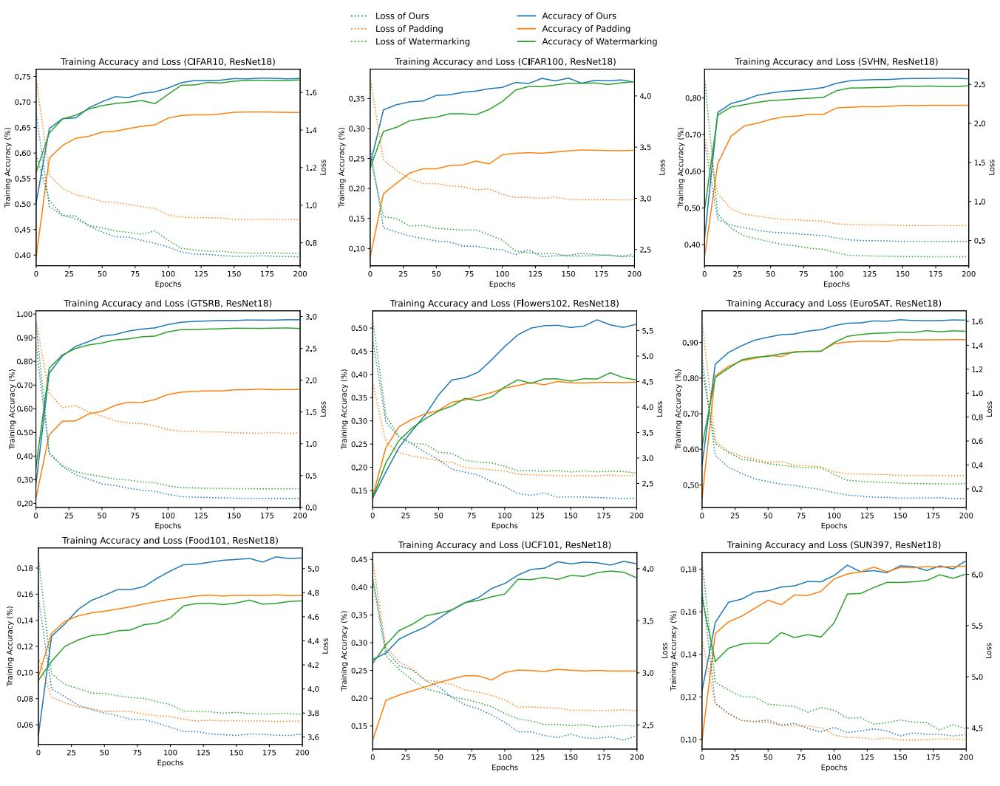  
Figure 11. Training Accuracy and Loss of Different Reprogramming Methods

SMM model helps prevent over-fitting and improve the testing accuracy.

Table 11. Training and Testing Accuracy with Enlarged $f _ { \mathrm { m a s k } }$ (using EuroSAT, ResNet-18)   

<table><tr><td>fmask</td><td>SMALL</td><td>MEDIUM (OURS)</td><td>LARGE</td><td>X-LARGE</td><td>XX-LARGE</td><td>XXX-LARGE</td></tr><tr><td>PARAMETERS</td><td>7203</td><td>26499</td><td>101379</td><td>396291</td><td>1566723</td><td>6230019</td></tr><tr><td>TRAINING ACCURACY(%)</td><td>94.9</td><td>96.2</td><td>96.4</td><td>97.3</td><td>97.7</td><td>98.1</td></tr><tr><td>TESTING ACCURACY（%)</td><td>91.7</td><td>92.2</td><td>92.2</td><td>93.1</td><td>93.5</td><td>93.2</td></tr></table>

# D.3. More Discussion about the Estimation Error

A higher estimation error generally implies an increased risk of model over-fitting to the training data. This observation can be corroborated by comparing the disparities in training and testing performance. For instance, as depicted in Figure 12, employing a more sophisticated pre-trained network such as ViT with a mask generator $f _ { \mathrm { m a s k } }$ shown in Figure 9 across some tasks like CIFAR10, SVHN, and GTSRB, the training accuracy tends towards $100 \%$ for both shared patterns $\mathcal { F } ^ { \mathrm { s h r } } ( f _ { \mathrm { P } } ^ { \prime } )$ (i.e., ‘Watermarking’ in Figure 12) and SMM patterns $\mathcal { F } ^ { \mathrm { s m m } } ( f _ { \mathrm { P } } ^ { \prime } )$ (i.e., ‘Ours’ in Figure 12). Despite this, $\mathcal { F } ^ { \mathrm { s m m } } ( f _ { \mathrm { P } } ^ { \prime } )$ maintains a test accuracy that is not inferior to that of shared patterns. It suggests that our method SMM does not suffer from more significant over-fitting than shared masking, resulting in negligible potential estimation error.

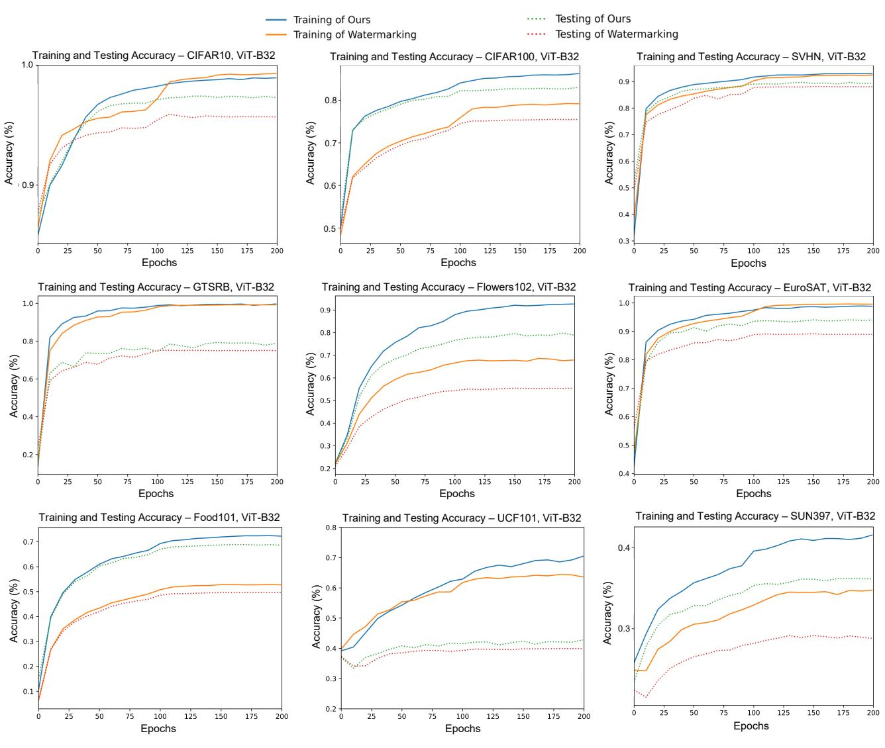  
Figure 12. Training Accuracy and Testing Accuracy with and without Our Method

However, when $f _ { \mathrm { m a s k } }$ is enlarged with increased number of parameters, the additional estimation error of $\mathcal { F } ^ { \mathrm { s m m } } ( f _ { \mathrm { P } } ^ { \prime } )$ may no longer be negligible and will impact the excess risk. The relationship between the number of parameters in $f _ { \mathrm { m a s k } }$ and the estimation error is influenced by various factors, including the specific target tasks, the volume of training data, the size of well-trained models, and the design of our generation model, etc. Through experiments, we will be able to estimate when the number of parameters begins to impact estimation error, potentially leading to over-fitting. For instance, in Table 11, we employ our generation model $f _ { \mathrm { m a s k } }$ on the EuroSAT dataset, with ResNet-18 being the well-trained model. By progressively doubling the number of intermediate channels while maintaining the architecture of $f _ { \mathrm { m a s k } }$ , we investigate how the model size affects performance.

Through the results of Table 11, we come to the following conclusions: (1) As the number of parameters continues to increase, although the training accuracy slowly increases, the test accuracy may even decrease, implying that the estimation error becomes more and more noticeable. (2) Under this situation (i.e., EuroSAT, ResNet-18), when the size of $f _ { \mathrm { m a s k } }$ is close to the same order of magnitude as the well-trained model, the estimation error should not be overlooked. (3) A larger model with the best test accuracy may not be optimal because of too many parameters. Our work strikes a balance between the number of parameters and test accuracy.

# D.4. Further Analysis of the Performance of SMM

More Discussion of SMM Abnormal Cases. In Section 5, we have briefly analyzed abnormal performance in Table 1 and Table 2. In this section, we will provide a more comprehensive discussion. Here, we outline detailed discussions regarding abnormal performance:

• ResNet-18, DTD: As shown in Figure 18, the DTD dataset contains a significant amount of texture features. Therefore, for relatively simple well-trained models, introducing reprogramming noise in the form of watermarking may affect the original features of the images. It can be observed that when the watermarking area is small (Narrow), the effect is better compared to when it is large (Full), and our method is also affected by this factor. However, the padding-based method preserves the original pixels of the image and only introduces reprogramming noise around them, thereby achieving relatively good results.

• ViT-B32, EuroSAT: This is because EuroSAT is one of the target tasks with the least task complexity. When using a large-scale network like ViT, the resizing-based method leads to over-fitting. As evident in the third column of the second row in Figure 12, the training accuracy is already close to 1. Therefore, in this scenario, the padding-based method yields slightly better test results compared to our method (which also belongs to resizing-based methods).

Table 12. An Ineffective Case of Input Reprogramming - StanfordCars (Mean % ± Std %)   

<table><tr><td>METHOD</td><td>PAD</td><td>NARROW</td><td>MEDIUM</td><td>FULL</td><td>OURS</td></tr><tr><td>ResNET-18</td><td>4.5±0.1</td><td>3.6±0.1</td><td>3.6±0.1</td><td>3.4±0.1</td><td>2.9±0.2</td></tr><tr><td>REsNET-50</td><td>4.7±0.2</td><td>4.7±0.1</td><td>4.7±0.2</td><td>4.6±0.1</td><td>3.0±0.6</td></tr><tr><td>VIT-B32</td><td>4.7±0.6</td><td>7.7±0.2</td><td>8.3±0.3</td><td>5.0±0.0</td><td>4.8±0.9</td></tr></table>

SMM on An Ineffective Case of Input Reprogramming. All input visual reprogramming methods seem ineffective on fine-grained recognition tasks where subtle appearance differences should be detected. As shown in Table 12, in the classification of StanfordCars, where 196 types of cars are to be classified, the accuracy of all input VR methods is below 10 $\%$ , indicating the failure of VR methods in this fine-grained recognition tasks. Adding our SMM module will not improve performance when VR methods fail.

# E. Additional Discussion about Input VR Compared with Finetuning

# E.1. Advantages of VR in Dealing with Distorted Input Images

Table 13. Performance of Finetuning (LoRA) and SMM Facing Target Tasks with Different Input Image Sizes (Accyracy $\%$ , using ViT-L with a $3 8 4 \times 3 8 4$ input as the well-trained model, average results are calculated on all four tasks with $3 2 \times 3 2$ inputs and all seven tasks with $1 2 8 \times 1 2 8$ inputs)   

<table><tr><td></td><td>EXTRA PARAMETERS</td><td>CIFAR10</td><td>CIFAR100</td><td>SVHN</td><td>GTSRB</td><td>AVERAGE (32×32)</td><td>AVERAGE (128×128)</td></tr><tr><td>FINETUNING-LORA</td><td>0.60M</td><td>95.9</td><td>83.6</td><td>65.3</td><td>66.6</td><td>77.9</td><td>83.4</td></tr><tr><td>OUR SMM</td><td>0.54M</td><td>97.4</td><td>87.3</td><td>91.0</td><td>84.2</td><td>90.0</td><td>83.5</td></tr></table>

In this section, we will compare the results of our SMM with finetuning-based methods to show the advantages of input VR in dealing with distorted input images. Low-rank adaptation (LoRA) (Hu et al., 2021) is an efficient finetuning-based transfer method proposed based on large language models for natural language processing, which has been adapted to ViT (Zhu et al., 2023). Here, we compare SMM for ViT with LoRA for ViT, which are representative methods that belong to input VR and finetuning, respectively.

Since LoRA for ViT already includes finetuning the fully connected layers, we also incorporate it in SMM. All training settings are kept the same. We set the rank of LoRA to be six, resulting in an additional parameter number being 0.60M (without counting the fully connected layers), which will be comparable to that of input VR and SMM (being 0.54M) for fairness. ViT-Large with the input size being $3 8 4 \times 3 8 4$ is applied, and the learning rate is 0.01, running 10 epochs in total.

Therefore, for both methods, the target training samples will be resized before input. VR mainly trains parameters in the input space before well-trained models, whereas LoRA injects parameters into layers of ViT. Results are listed in Table 13.

The results of target tasks with the input size being $1 2 8 \times 1 2 8$ are similar. However, it is observed that for those target tasks with lower resolution (e.g., CIFAR10/100, SVHN, GTSRB), our SMM appears to perform better. This is likely because when a $3 2 \times 3 2$ image is resized to $3 8 4 \times 3 8 4$ , it may become distorted, thus affecting the performance of target tasks. This distortion is especially noticeable on tasks with simple features, such as SVHN and GTSRB. Since VR modifies the input space, it effectively addresses this issue of significant differences in the input image sizes of pre-trained and target tasks.

# E.2. Advantages of VR in Being Orthogonal to Finetuning-based Methods

Table 14. Performance of Finetuning the Fully-Connected Layers (Finetuning-FC) without or with our SMM Module (Accuracy $\%$ , using ResNet-50 as the well-trained model)   

<table><tr><td></td><td>CIFAR10</td><td>CIFAR100</td><td>SVHN</td><td>GTSRB</td><td>FLOWERS102</td><td>DTD</td></tr><tr><td>FINETUNING-FC FINETUNING-FC + OUR SMM</td><td>90.1 91.2</td><td>70.7 72.4</td><td>63.5 86.9</td><td>77.8 85.2</td><td>90.9 90.9</td><td>67.6 68.2</td></tr><tr><td></td><td>UCF101</td><td>F00D101</td><td>SUN397</td><td>EUROSAT</td><td>OXFORDPETS</td><td>AVERAGE</td></tr><tr><td>FINETUNING-FC</td><td>70.8</td><td></td><td></td><td></td><td></td><td></td></tr><tr><td></td><td></td><td>57.6</td><td>53.5</td><td>95.7</td><td>90.4</td><td>75.3</td></tr><tr><td>FINETUNING-FC + OUR SMM</td><td>72.0</td><td>59.6</td><td>57.9</td><td>95.8</td><td>90.6</td><td>79.2</td></tr></table>

Since finetuning and reprogramming are orthogonal because finetuning modifies the model while reprogramming modifies the input and output spaces. Input VR can also be combined with finetuning-based methods. In this section, we will add the input VR module (i.e, using SMM as an example) to finetuning-based methods and analyze the performance gain. A widely-used method - finetuning the fully connected layer (named ‘Finetuning-FC’) - is employed as the baseline method. Using ResNet-50 as the well-trained model, we add our SMM input VR module to ‘Finetuning-FC’ to demonstrate the effectiveness of our module.

Results are shown in Tabel 14. Utilizing our module achieves an average accuracy of about $4 \%$ higher than solely finetuning the fully connected layers. Conclusively, input VR can be attached to finetuning-based methods to improve performance.

# E.3. Strengths and Weaknesses of Input Reprogramming in Visual Tasks

This part includes a conclusion of the strengths and weaknesses of Input VR, compared with finetuning-based methods.

# E.3.1. STRENGTHS

• The parameter numbers of VR tend to be negligible considering the size of well-trained models. Besides, the parameter numbers in VR are solely determined by the size of a single input image, independent of well-trained models, and remain fixed as the well-trained model size grows.

• VR is suitable for all well-trained models, regardless of the architecture, whereas finetuning-based methods are usually designed for a specific architecture (e.g., LoRA is specifically designed for ViT).

• VR improves the performance of the target task by altering the input and output space, and analyzing these changes may help understand why the model can also perform well in the target domain.

• By changing the input and output spaces while fixing the well-trained model, VR avoids practical issues such as catastrophic forgetting (i.e., the well-trained model may lose previously learned representations when being finetuned for new tasks).

• VR can be attached to most mainstream finetuning methods to further improve performance.

• In future research, VR could also utilize the well-trained model as a black box. This approach might prove useful for re-purposing models that only offer an application programming interface.

  
Figure 13. Original Images and Visual Reprogramming Results on CIFAR10

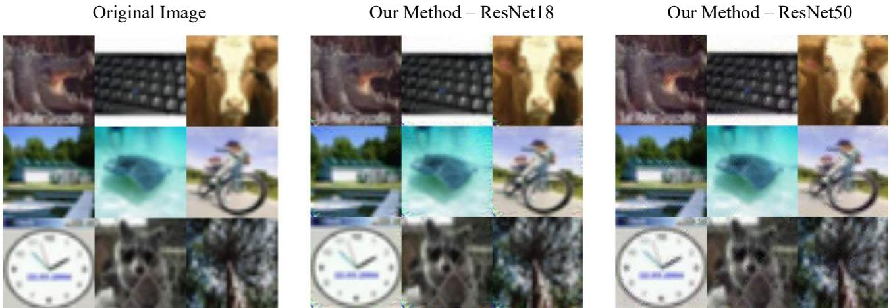  
Figure 14. Original Images and Visual Reprogramming Results on CIFAR100

# E.3.2. WEAKNESSES

• When target tasks are more challenging than the tasks well-trained models have been trained on, merely adjusting the input space may not be sufficient for satisfied performance. This poses a challenge for VR.

• For better performance approaching re-training or fully finetuning, integrating VR with other finetuning methods appears necessary (e.g., VR may be combined with finetuning the fully connected layer). How to train the combined model more effectively remains a task for future research.

# F. Additional Visualization Results

Figure 13-23 show sample images of the VR results of SMM on 11 datasets. These figures show that (1) our VR method does not alter the input space heavily; it only adds noise within a limited range, which ensures that the original images remain intact; (2) the more different the target domain is (e.g., GTSRB and SVHN), the more pronounced the noise pattern will be; (3) on datasets that prefer VR to be a narrow padding-sized watermark, SMM will convergence to a similar situation, that is, the noise at the outer frame of the images is much greater than that inside the images (e.g., UCF101, Food101, OxfordPets and SUN397).

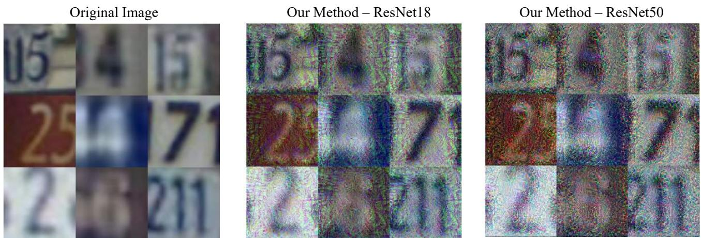  
Figure 15. Original Images and Visual Reprogramming Results on SVHN

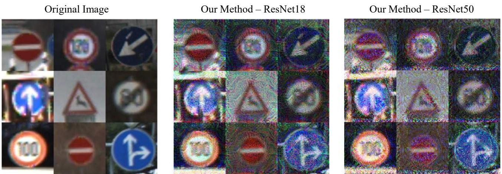  
Figure 16. Original Images and Visual Reprogramming Results on GTSRB

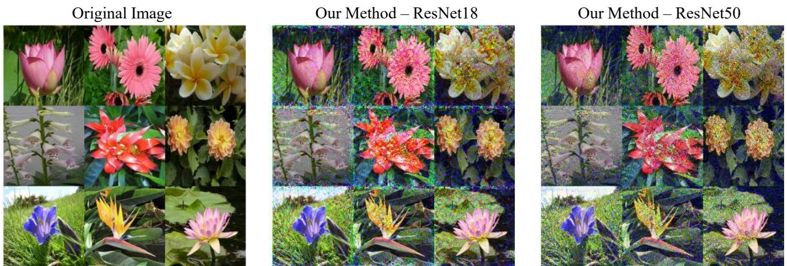  
Figure 17. Original Images and Visual Reprogramming Results on Flowers102

  
Figure 18. Original Images and Visual Reprogramming Results on DTD

  
Figure 19. Original Images and Visual Reprogramming Results on UCF101

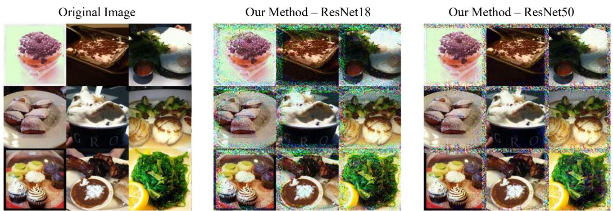  
Figure 20. Original Images and Visual Reprogramming Results on Food101

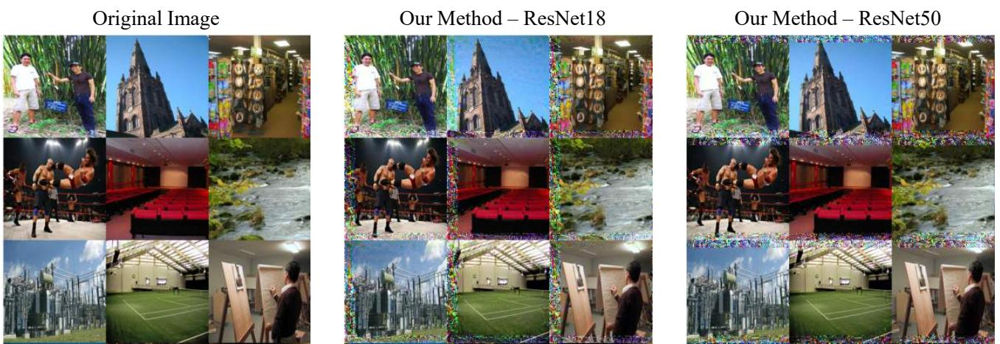  
Figure 21. Original Images and Visual Reprogramming Results on SUN397

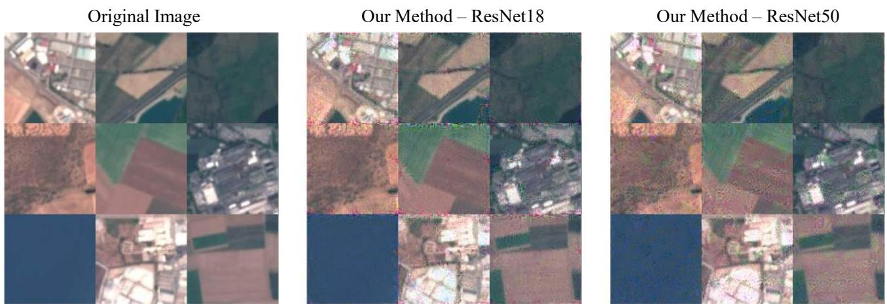

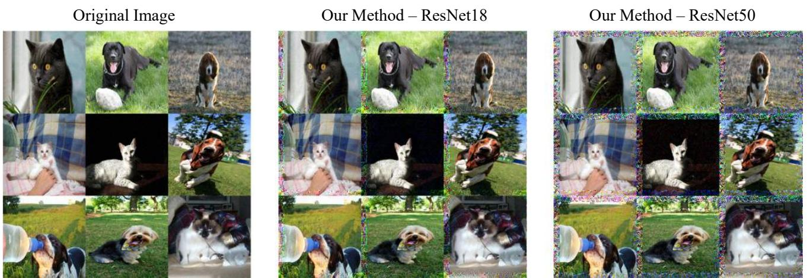  
Figure 22. Original Images and Visual Reprogramming Results on EuroSAT   
Figure 23. Original Images and Visual Reprogramming Results on OxfordPets