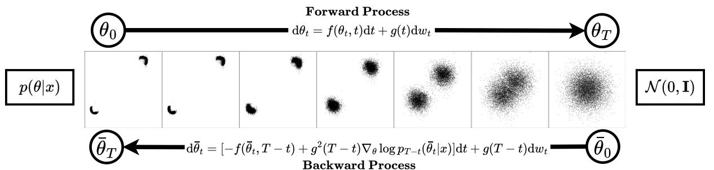
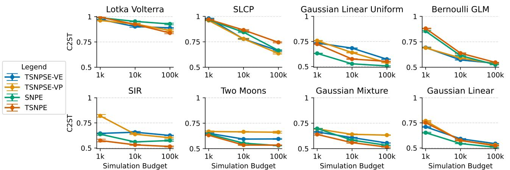
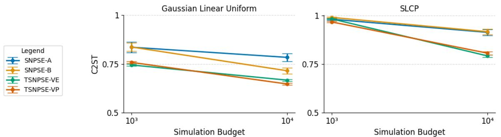

# Sequential Neural Score Estimation: Likelihood-Free Inference with Conditional Score Based Diffusion Models

Louis Sharrock \* 1 2 Jack Simons \* 2 Song Liu 2 Mark Beaumont 2

# Abstract

We introduce Sequential Neural Posterior Score Estimation (SNPSE), a score-based method for Bayesian inference in simulator-based models. Our method, inspired by the remarkable success of score-based methods in generative modelling, leverages conditional score-based diffusion models to generate samples from the posterior distribution of interest. The model is trained using an objective function which directly estimates the score of the posterior. We embed the model into a sequential training procedure, which guides simulations using the current approximation of the posterior at the observation of interest, thereby reducing the simulation cost. We also introduce several alternative sequential approaches, and discuss their relative merits. We then validate our method, as well as its amortised, non-sequential, variant on several numerical examples, demonstrating comparable or superior performance to existing state-of-the-art methods such as Sequential Neural Posterior Estimation (SNPE).

2010; Wood, 2010), epidemiology (Corander et al., 2017), climate science (Holden et al., 2018), cosmology (Alsing et al., 2018), high-energy physics (Brehmer, 2021), and econometrics (Gourieroux et al., 1993).

In many cases, simulator-based models depend on parameters $\theta$ which cannot be identified experimentally, and must be inferred from data $x$ . Bayesian inference provides a principled approach for this task. In particular, given a prior $p ( \theta )$ and a likelihood $p ( x | \theta )$ , Bayes’ Theorem gives the posterior distribution over the parameters as

$$
p ( \theta | x ) = \frac { p ( x | \theta ) p ( \theta ) } { p ( x ) }
$$

where $\begin{array} { r } { p ( x ) = \int p ( x | \theta ) p ( \theta ) \mathrm { d } \theta } \end{array}$ is known as the evidence or marginal likelihood. The major difficulty associated with simulator-based models is the absence of a tractable likelihood function $p ( x | \theta )$ . This precludes, in particular, the use of conventional likelihood-based Bayesian inference methods such as Markov chain Monte Carlo (MCMC) (Brooks et al., 2011) or variational inference (VI) (Blei et al., 2017). The resulting inference problem is often referred to as likelihood-free inference or simulation-based inference (SBI) (Cranmer et al., 2020; Sisson et al., 2018).

# 1. Introduction

Many applications in science, engineering, and economics make use of stochastic numerical simulations to model complex phenomena of interest. Such simulator-based models are often designed by domain experts, using knowledge of the underlying principles of the process of interest. They are thus well suited to domains in which observations are best understood as the result of mechanistic physical processes. These include, amongst others, neuroscience (Sterratt et al., 2011; Gonc¸alves et al., 2020), evolutionary biology (Beaumont et al., 2002; Ratmann et al., 2007), ecology (Beaumont,

Traditional methods for performing SBI include approximate Bayesian computation (ABC) (Beaumont et al., 2002; Sisson et al., 2018), whose variants include rejection ABC (Tavare et al. ´ , 1997; Pritchard et al., 1999), MCMC ABC (Marjoram et al., 2003), and sequential Monte Carlo (SMC) ABC (Beaumont et al., 2009; Bonassi & West, 2015). In such methods, one repeatedly samples parameters, and only accepts parameters for which the corresponding samples from the simulator are similar to the observed data $x _ { \mathrm { o b s } }$ .

More recently, a range of new SBI methods have been introduced, which leverage advances in machine learning such as normalising flows (Papamakarios et al., 2017; 2021) and generative adversarial networks (Goodfellow et al., 2014). These methods often include a sequential training procedure, which adaptively guides simulations to yield more informative data. Such methods include Sequential Neural Posterior Estimation (SNPE) (Papamakarios & Murray, 2016; Lueckmann et al., 2017; Greenberg et al., 2019), Sequential Neural Likelihood Estimation (SNLE) (Lueckmann et al., 2019; Papamakarios et al., 2019), and Sequential Neural Ratio Estimation (SNRE) (Durkan et al., 2020; Hermans et al., 2020; Miller et al., 2021; Thomas et al., 2022). Other more recent algorithms of a similar flavour include Sequential Neural Variational Inference (SNVI) (Glockler et al., 2022), Generative Adversarial Training for SBI (GATSBI) (Ramesh et al., 2022), Truncated SNPE (TSNPE) (Deistler et al., 2022a), and Sequential Unnormalized Neural Likelihood Estimation (SUNLE) (Glaser et al., 2022).

  
Figure 1. Visualisation of posterior inference using Neural Posterior Score Estimation (NPSE) in the ‘Two Moons’ experiment. The forward process transforms samples from the target posterior distribution $p ( \theta | x )$ to a tractable reference distribution. The backward process transports samples from the reference to the target posterior. The backward process depends on the scores $\nabla _ { \boldsymbol { \theta } } \log p _ { t } ( \boldsymbol { \theta } | \boldsymbol { x } )$ , which can be estimated using score matching techniques given access to samples $( \theta , x ) \sim p ( \theta ) p ( x | \theta )$ (see Section 2.2).

In this paper, we present Neural Posterior Score Estimation (NPSE), as well as its sequential variant (SNPSE). Our method, inspired by the remarkable success of score-based generative models (Song & Ermon, 2019; Song et al., 2021; Ho et al., 2020), utilises a conditional score-based diffusion model to generate samples from the posterior of interest. While similar approaches (e.g., Batzolis et al., 2021; Dhariwal & Nichol, 2021; Song et al., 2021; Tashiro et al., 2021; Chao et al., 2022; Chung & Ye, 2022) have previously found success in a variety of problems, their application to SBI has not yet been widely investigated.1

In contrast to existing SBI approaches based on normalising flows (e.g., SNLE, SNPE), our approach only requires estimates for the gradient of the log density, or score function, of the intractable likelihood or the posterior, which can be approximated using a neural network via score matching techniques (Hyvarinen ¨ , 2005; Vincent, 2011; Song et al., 2020). Since we do not require a normalisable model, our method avoids the need for any strong restrictions on the model architecture. In addition, unlike methods based on generative adversarial networks (e.g., GATSBI), we do not require adversarial training objectives, which are notoriously unstable (Metz et al., 2017; Salimans et al., 2016).

We first discuss how conditional score-based diffusion models can be used for SBI. We then outline how our approach can be embedded within a principled sequential training procedure, which guides simulations towards informative regions using the current approximation of the posterior. We outline in detail a number of possible sequential procedures, several of which could also be used to develop sequential variants of amortised algorithms more recently proposed in the SBI literature (e.g., Dax et al., 2023). We then advocate for our preferred method, Truncated Sequential NPSE (TSNPSE), which uses a series of truncated proposals inspired by the approach in Deistler et al. (2022a). We validate our methods on several benchmark SBI problems as well as a real-world neuroscience problem, obtaining comparable or superior performance to other state-of-the-art methods.

# 2. Simulation-Based Inference with Diffusion Models

# 2.1. Simulation-Based Inference

Suppose that we have access to a simulator which, given input parameters $\boldsymbol { \theta } \in \mathbb { R } ^ { d }$ , generates synthetic data $x \in \mathbb { R } ^ { p }$ We assume that parameters are distributed according to some known prior $p ( \theta )$ , but that the likelihood $p ( x | \theta )$ is intractable. Given an observation $x _ { \mathrm { o b s } }$ , we are interested in generating samples from the posterior distribution $p ( \theta | x _ { \mathrm { o b s } } ) \propto p ( \theta ) p ( x _ { \mathrm { o b s } } | \theta )$ , given a finite number of i.i.d. samples $\{ ( \theta _ { i } , x _ { i } ) \} _ { i = 1 } ^ { N } \sim p ( \theta ) p ( x | \theta )$ .

# 2.2. Diffusion Models for Simulation-Based Inference

We propose to tackle this problem using conditional scorebased diffusion models (e.g., Song et al., 2021). In such models, noise is gradually added to the target distribution using a diffusion process, resulting in a tractable reference distribution, e.g., a standard Gaussian. The time-reversal of this process is also a diffusion process, whose dynamics can be approximated using score matching (Hyvarinen ¨ , 2005; Vincent, 2011; Song & Ermon, 2020; Song et al., 2021). One can thus generate samples from the target distribution by simulating the approximate reverse-time process, initialised at samples from the reference distribution.

More concretely, we begin by defining a forward noising process $( \theta _ { t } ) _ { t \in [ 0 , T ] }$ which, initialised at $\theta _ { 0 } \sim p ( \cdot | x )$ , evolves according to the stochastic differential equation (SDE)

$$
\mathrm { d } \theta _ { t } = f ( \theta _ { t } , t ) \mathrm { d } t + g ( t ) \mathrm { d } w _ { t } ,
$$

where $f : \mathbb { R } ^ { d } \times \mathbb { R } _ { + } \to \mathbb { R } ^ { d }$ is the drift coefficient, $g : \mathbb { R } _ { + } $ $\mathbb { R } ^ { d }$ is the diffusion coefficient, and $( w _ { t } ) _ { t \geq 0 }$ is a standard $\mathbb { R } ^ { d }$ -valued Brownian motion. The coefficients $f$ and $g$ are chosen such that, for all $x \in \mathbb { R } ^ { p }$ , the forward noising process admits a unique stationary distribution $\pi$ from which it is easy to sample, e.g., a standard Gaussian.

Under mild conditions, the time-reversed process $( { \bar { \theta } } _ { t } ) _ { t \in [ 0 , T ] } \ : = \ ( \theta _ { T - t } ) _ { t \in [ 0 , T ] }$ is also a diffusion process (Anderson, 1982; Follmer ¨ , 1985; Haussmann & Pardoux, 1986). Initialised at $\bar { \theta } _ { 0 } \sim p _ { T } ( \cdot | x )$ , this process evolves according to

$$
\begin{array} { r } { \mathrm { d } \bar { \theta } _ { t } = \left[ - f ( \bar { \theta } _ { t } , T - t ) + g ^ { 2 } ( T - t ) \nabla _ { \theta } \log p _ { T - t } ( \bar { \theta } _ { t } | x ) \right] \mathrm { d } t } \\ { + g ( T - t ) \mathrm { d } w _ { t } , \quad ( 3 ) } \end{array}
$$

where $\begin{array} { r } { p _ { t } ( \cdot | x ) = \int p _ { t | 0 } ( \cdot | \theta _ { 0 } ) p ( \theta _ { 0 } | x ) \mathrm { d } \theta _ { 0 } } \end{array}$ denotes the time marginal density of $\theta _ { t }$ , conditioned on $x$ . By definition, the marginals of $( \bar { \theta } _ { t } ) _ { t \in [ 0 , T ] } | x$ are equal to those of $( \theta _ { T - t } ) _ { t \in [ 0 , T ] } | x$ . Thus, in particular, $\bar { \theta } _ { T } \sim p _ { 0 } ( \cdot | x ) : =$ $p ( \cdot | x )$ . Hence, if we could sample $\bar { \theta } _ { 0 } \sim p _ { T } ( \cdot | x )$ , and simulate $( \bar { \theta } _ { t } ) _ { t \in [ 0 , T ] }$ according to (3), then its final distribution would be the desired posterior distribution. This process is visualised in Figure 1.

Although this procedure provides an elegant sampling mechanism, it does not allow us to evaluate the density $p _ { 0 } ( \theta | x ) : = p ( \theta | x )$ of these samples. Fortunately, there exists an ODE with the same marginals as (2), which does enable density evaluation. This deterministic process, known as the probability flow ODE (Song et al., 2021), defines $( \theta _ { t } ) _ { t \in [ 0 , T ] }$ according to

$$
\frac { \mathrm { d } \theta _ { t } } { \mathrm { d } t } = \left[ f ( \theta _ { t } , t ) - \frac { 1 } { 2 } g ^ { 2 } ( t ) \nabla _ { \theta } \log p _ { t } ( \theta _ { t } | x ) \right] ,
$$

where once again $\theta _ { 0 } \sim p ( \cdot | x )$ . In this case, the log densities $\log p _ { t } ( \theta _ { t } | x )$ can be computed exactly via the instantaneous change-of-variables formula (Chen et al., 2018a):

$$
\begin{array} { l } { \displaystyle \frac { \mathrm { d } \log p _ { t } ( \theta _ { t } | x ) } { \mathrm { d } t } } \\ { \displaystyle = - \mathrm { T r } \big [ \nabla _ { \theta } \big ( f ( \theta _ { t } , t ) - \frac { 1 } { 2 } g ^ { 2 } ( t ) \nabla _ { \theta } \log p _ { t } ( \theta _ { t } | x ) \big ) \big ] . } \end{array}
$$

In practice, we cannot simulate (3) or (4) directly, since we do not have access to $p _ { T } ( \cdot | x )$ , or the scores $\nabla _ { \theta } \log { p _ { t } ( \theta _ { t } | x ) }$ . We will therefore rely on two approximations. First, we will assume that $p _ { T } \approx \pi$ . Second, we will approximate $\nabla _ { \theta } \log { p _ { t } ( \theta _ { t } | x ) }$ using score matching (e.g., Song et al., 2021), and substitute this approximation into (3) or (4). In this case, the ODE in (4) is an instance of a continuous normalising flow (CNF) (Grathwohl et al., 2019).

There are various ways in which we can obtain this approximation. Here, we choose to train a time-varying score network $s _ { \psi } ( \theta _ { t } , x , t ) \approx \nabla _ { \theta } \log p _ { t } ( \theta _ { t } | x )$ to directly approximate the score of the perturbed posterior (Dhariwal & Nichol, 2021; Song et al., 2021; Batzolis et al., 2021).2 In this case, a natural objective is the weighted Fisher divergence

$$
\begin{array} { l l } { \displaystyle \mathcal { I } _ { \mathrm { p o s t } } ^ { \mathrm { S M } } ( \psi ) = \frac { 1 } { 2 } \int _ { 0 } ^ { T } \lambda _ { t } } & { ( \medskip \mathfrak { q } _ { t } , x , t ) , } \\ { \quad \quad \quad \mathbb { E } _ { p _ { t } ( \theta _ { t } , x ) } \left[ | | s _ { \psi } ( \theta _ { t } , x , t ) - \nabla _ { \theta } \log p _ { t } ( \theta _ { t } | x ) | | ^ { 2 } \right] \mathrm { d } t , } \end{array}
$$

where $\lambda _ { t } : [ 0 , T ] \to \mathbb { R } _ { + }$ is a positive weighting function, and $p _ { t } ( \theta _ { t } , x )$ denotes the joint distribution of $( \theta _ { t } , x )$ . In practice, this objective cannot be evaluated directly, since it depends on the posterior scores $\nabla _ { \theta } \log { p _ { t } ( \theta _ { t } | x ) }$ . Fortunately, one can show (e.g., Batzolis et al., 2021; Tashiro et al., 2021; Appendix A.1) that it is equivalent to minimise the conditional denoising posterior score matching objective, given by

$$
\mathcal { I } _ { \mathrm { p o s t } } ^ { \mathrm { D S M } } ( \psi ) = \frac { 1 } { 2 } \int _ { 0 } ^ { T } \lambda _ { t } \mathbb { E } _ { p _ { t | 0 } ( \theta _ { t } | \theta _ { 0 } ) p ( x | \theta _ { 0 } ) p ( \theta _ { 0 } ) } ( \eta
$$

where $p _ { t | 0 } ( \theta _ { t } | \theta _ { 0 } )$ denotes the transition density defined by (2). In particular, this objective is minimised when $s _ { \psi } ( \theta _ { t } , x , t ) = \nabla _ { \theta } \log p _ { t } ( \theta _ { t } | x )$ for almost all $\theta _ { t } \in \mathbb { R } ^ { d }$ , $x \in$ $\mathbb { R } ^ { p }$ , and $t \in [ 0 , T ]$ .

The expectation in (7) only depends on samples $\theta _ { 0 } \sim p ( \theta )$ from the prior, $x \sim p ( x | \theta _ { 0 } )$ from the simulator, and $\theta _ { t } \sim$ $p _ { t | 0 } ( \theta _ { t } | \theta _ { 0 } )$ from the forward diffusion (2). Moreover, given a suitable choice for the drift and diffusion coefficients in (2), the scores $\nabla _ { \theta _ { t } } \log { p _ { t | 0 } ( \theta _ { t } | \theta _ { 0 } ) }$ can be computed in closed form. We can thus compute a Monte Carlo estimate of (7), and minimise this to obtain $s _ { \psi } ( \theta _ { t } , x , t ) \approx \nabla _ { \theta } \log p _ { t } ( \theta _ { t } | x )$ .

We now have all of the necessary ingredients to generate approximate samples from the target posterior distribution:

(i) Draw samples $\theta _ { 0 } \sim p ( \theta )$ from the prior, $x \sim p ( x | \theta _ { 0 } )$ from the likelihood, and $\theta _ { t } \sim p _ { t | 0 } ( \theta _ { t } | \theta _ { 0 } )$ using the forward process (2).   
(ii) Using these samples, train a time-varying score network $s _ { \psi } ( \theta _ { t } , x , t ) \approx \nabla _ { \theta } \log p _ { t } ( \theta _ { t } | x )$ by minimising a Monte Carlo estimate of (7).   
(iii) Draw samples $\bar { \theta } _ { 0 } \sim \pi ( \cdot )$ . Simulate an approximation of the reverse-time process in (3), or the time-reversal of the probability flow ODE in (4), with $x = x _ { \mathrm { o b s } }$ , replacing $\nabla _ { \boldsymbol { \theta } } \log { p _ { t } ( \theta _ { t } | x _ { \mathrm { o b s } } ) } \approx s _ { \psi } ( \theta _ { t } , x _ { \mathrm { o b s } } , t )$ .

In line with the current SBI taxonomy, we will refer to this approach as Neural Posterior Score Estimation (NPSE).

In Appendix A.2, we provide error bounds for NPSE in the fully deterministic sampling regime, assuming an $L ^ { 2 }$ bound on the approximation error and a mild regularity condition on the target posterior $p ( \cdot | x _ { \mathrm { o b s } } )$ . Our result is adapted from Benton et al. (2024, Theorem 6).

# 3. Sequential Neural Score Estimation

Given enough data and a sufficiently flexible model, the optimal score network $s _ { \psi ^ { * } } ( \theta _ { t } , x , t )$ will equal $\nabla _ { \theta } \log { p _ { t } ( \theta _ { t } | x ) }$ for almost all $x \in \mathbb { R } ^ { p }$ , $\theta _ { t } \in \mathbb { R } ^ { d }$ , and $t \in [ 0 , T ]$ . Thus, in theory, we can use the methods in the previous section to generate samples $\theta \sim p ( \theta | x )$ for any observation $x$ .

In practice, we are often only interested in sampling from the posterior for a particular experimental observation $x = x _ { \mathrm { o b s } }$ Thus, given a finite simulation budget, it may be more efficient to train the score network using simulated data which is close to $x _ { \mathrm { o b s } }$ , and thus more informative for learning the posterior scores $\nabla _ { \theta } \log p _ { t } ( \theta _ { t } | x _ { \mathrm { o b s } } )$ . This can be achieved by drawing initial parameter samples from a suitably chosen proposal prior, $\theta _ { 0 } \sim \tilde { p } ( \theta )$ , rather than the true prior $\theta _ { 0 } \sim p ( \theta )$ . This idea is central to existing sequential SBI algorithms, which use a sequence of adaptively chosen proposals in order to guide simulations towards more informative regions. The central challenge associated with developing a successful sequential algorithm is how to effectively correct for the mismatch between the so-called proposal posterior

$$
\tilde { p } ( \theta | x ) = p ( \theta | x ) \frac { \tilde { p } ( \theta ) } { p ( \theta ) } \frac { p ( x ) } { \tilde { p } ( x ) } ,
$$

and the true posterior $p ( \theta | x ) \propto p ( \theta ) p ( x | \theta )$ . In the following sections, we introduce several possible sequential variants of NPSE, which we collectively refer to as SNPSE. We note, as pointed out in the introduction, that in principle these approaches could also be used to develop sequential variants of the recently proposed flow-matching posterior estimation (FMPE) algorithm (Dax et al., 2023).

We begin by outlining some generic features of the sequential procedure, which hold irrespective of the specific sequential method employed (see Sections $3 . 1 \textrm { - } 3 . 2 )$ . In all cases, the sequential procedure will take place over $R$ rounds, indexed by $r \geq 1$ . Given a total budget of $N$ simulations, we assume the simulations are evenly distributed across rounds: $N _ { r } = N / R = M$ for $r = 1 , \ldots , R$ where $N _ { r }$ is the number of simulations in round $r$ . In the first round, we follow the standard NPSE algorithm (Section 2). In particular, we first generate $\{ \theta _ { 0 , i } ^ { 1 } \} _ { i = 1 } ^ { M } \sim p ( \theta )$ from the prior, and $\{ x _ { i } ^ { 1 } \} _ { i = 1 } ^ { M } \sim p ( x | \theta _ { 0 , i } )$ using the simulator. These samples are used to train a score network $s _ { \psi } ( \theta _ { t } , x , t ) \approx \nabla _ { \theta } \log p _ { t } ( \theta _ { t } | x )$ by minimising (7). By substituting this into (3), we can generate samples approximately from the target posterior. Following the initial round, there are several conceivable sequential procedures one could use to generate samples from $p ( \theta | x _ { \mathrm { o b s } } )$ . We now describe several such methods. Broadly speaking, these procedures differ in (i) how they define the proposal prior; and (ii) how they correct for the mismatch between the proposal posterior and the true posterior.

# 3.1. Truncated Approach

We first introduce our preferred method: Truncated SNPSE (TSNPSE). This algorithm - summarised in Algorithm 1 - utilises a series of proposals given by truncated versions of the prior, inspired by the approach in Deistler et al. (2022a). For $r \geq 1$ , let $p _ { \psi } ^ { r - \mathrm { i } } ( \theta | x _ { \mathrm { o b s } } )$ denote the approximation to the target posterior learned in the $( r - 1 ) ^ { \mathrm { t h } }$ round, with the convention that $p _ { \psi } ^ { 0 } ( \theta ) : = p ( \theta )$ . Then, in the $r ^ { \mathrm { t h } }$ round, we will use the highest-probability region of this approximation to define a truncated version of the prior. To be precise, in the $r ^ { \mathrm { t h } }$ round, suppose we define

$$
\bar { p } ^ { r } ( \theta ) \propto p ( \theta ) \cdot \mathbb { I } \{ \theta \in \mathrm { H P R } _ { \varepsilon } ( p _ { \psi } ^ { r - 1 } ( \theta | x _ { \mathrm { o b s } } ) ) \} ,
$$

where $\mathrm { H P R } _ { \varepsilon } ( \cdot )$ denotes the highest $1 - \varepsilon$ probability region, defined as the smallest region which contains $1 - \varepsilon$ of the mass; and we adopt the convention that $\bar { p } ^ { 0 } ( \theta ) = p ( \theta )$ We then define the proposal distribution for this round as $\begin{array} { r } { \tilde { p } ^ { r } ( \theta ) = \frac { 1 } { r } \sum _ { s = 0 } ^ { r - 1 } \bar { p } ^ { s } ( \theta ) } \end{array}$ . Additional details regarding how to compute and sample from this proposal distribution are provided in Appendix E.3.

Crucially, under the assumption that we do not truncate regions which have non-zero mass under the true posterior $p ( \theta | x _ { \mathrm { o b s } } )$ , this proposal distribution is proportional to the prior within the support of the posterior. Thus, we do not need to perform a correction. In particular, our loss function remains minimised at the score of the target posterior. This statement is formalised in the following proposition.

Proposition 3.1. Let $\begin{array} { r c l } { \tilde { p } ^ { r } ( \theta ) } & { = } & { \frac { 1 } { r } \sum _ { s = 0 } ^ { r - 1 } \bar { p } ^ { s } ( \theta ) } \end{array}$ , where $\bar { p } ^ { 0 } ( \theta ) = p ( \theta )$ and $\bar { p } ^ { s } ( \theta )$ is defined by (9) for all $s \geq 1$ Suppose that $\Theta _ { \mathrm { o b s } } ~ \subseteq ~ \mathrm { H P R } _ { \epsilon } ( p _ { \psi } ^ { s } ( \theta | x _ { \mathrm { o b s } } ) )$ for all $s \geq 1$ where $\Theta _ { \mathrm { o b s } } = \operatorname* { s u p p } ( p ( \cdot | x _ { \mathrm { o b s } } ) )$ . Then, writing $\tilde { p } _ { t } ^ { r } ( \theta _ { t } , x )$ for the distribution of $( \theta _ { t } , x )$ when $( \theta _ { 0 } , x ) \sim \tilde { p } ^ { r } ( \theta , x )$ , the minimiser $\psi ^ { * }$ of the loss function

$$
\begin{array} { l } { \mathcal { T } _ { \mathrm { p o s t } } ^ { \mathrm { T S N P S E - S M } } ( \psi ) = \displaystyle \frac { 1 } { 2 } \int _ { 0 } ^ { T } \lambda _ { t } \mathbb { E } _ { \tilde { p } _ { t } ^ { r } ( \theta _ { t } , x ) } } \\ { \quad \quad \quad [ | | s _ { \psi } ( \theta _ { t } , x , t ) - \nabla _ { \theta } \log p _ { t } ( \theta _ { t } | x ) | | ^ { 2 } ] \mathrm { d } t , } \end{array}
$$

or, equivalently, of the loss function

$$
\begin{array} { r l r } {  { \mathcal { I } _ { \mathrm { p o s t } } ^ { \mathrm { T S N P S E - D S M } } ( \psi ) = \frac { 1 } { 2 } \int _ { 0 } ^ { T } \lambda _ { t } \mathbb { E } _ { p _ { t | 0 } ( \theta _ { t } | \theta _ { 0 } ) p ( x | \theta _ { 0 } ) \tilde { p } ^ { r } ( \theta _ { 0 } ) } \ ( } } \\ & { } & { \ [ | | s _ { \psi } ( \theta _ { t } , x , t ) - \nabla _ { \theta } \log p _ { t 0 } ( \theta _ { t } | \theta _ { 0 } ) | | ^ { 2 } ] \mathrm { d } t , } \end{array}
$$

satisfies $s _ { \psi ^ { \star } } ( \theta _ { t } , x _ { \mathrm { o b s } } , t ) = \nabla _ { \theta } \log p _ { t } ( \theta _ { t } | x _ { \mathrm { o b s } } )$

Proof. See Appendix C.1.

# Algorithm 1 TSNPSE

Inputs: Observation $x _ { \mathrm { o b s } }$ , prior $p ( \theta ) = : \bar { p } ^ { 0 } ( \theta )$ , simula  
tor $p ( x | \theta )$ , simulation budget $N$ , number of rounds $R$ ,   
(simulations-per-round $M = N / R )$ , dataset $\mathcal { D } = \{ \}$ .   
Outputs: $p _ { \psi } ( \theta | x _ { \mathrm { o b s } } ) \approx p ( \theta | x _ { \mathrm { o b s } } )$ .   
for $r = 1 , \ldots , R$ do for $i = 1 , \dots , M$ do Draw $\theta _ { i } \sim \bar { p } ^ { r - 1 } ( \theta )$ , $x _ { i } \sim p ( x | \theta _ { i } )$ . Add $( \theta _ { i } , x _ { i } )$ to $\mathcal { D }$ . end for Learn $s _ { \psi } ( \theta _ { t } , x , t ) \approx \nabla _ { \theta } \log p _ { t } ( \theta _ { t } | x )$ by minimising a Monte Carlo estimate of (11) based on dataset $\mathcal { D }$ . Compute $\bar { p } ^ { r } ( \theta )$ in (9) using $s _ { \psi } ( \theta _ { t } , x _ { \mathrm { o b s } } , t )$ . See Appendix E.3 for details.   
end for   
Get $p _ { \psi } ( \theta | x _ { \mathrm { o b s } } )$ sampler by substituting $s _ { \psi } ( \theta _ { t } , x _ { \mathrm { o b s } } , t ) \approx$   
$\nabla _ { \theta } \log p _ { t } ( \theta _ { t } | x _ { \mathrm { o b s } } )$ in (4).   
Return: $p _ { \psi } ( \theta | x _ { \mathrm { o b s } } )$ .

# 3.2. Alternative Approaches

We now outline several other possible sequential approaches for NPSE. An extensive and detailed discussion of these methods, as well as supporting numerical results, can be found in Appendix C. Broadly speaking, these methods can be viewed as score-based analogues of existing sequential variants of NPE, namely, SNPE-A (Papamakarios & Murray, 2016), SNPE-B (Lueckmann et al., 2017), and SNPE-C (Greenberg et al., 2019). We refer to, e.g., Durkan et al. (2020) for a concise overview of SNPE-A, SNPE-B, and SNPE-C.

Unlike TSNPSE, in each of these methods, the proposal prior is defined directly in terms of the most recent approximation of the posterior. In particular, in the $r ^ { \mathrm { t h } }$ round, we now sample new parameters {θr0,i}Mi=1 ∼ pr−1ψ (θ|xobs) and simulate new data $\{ x _ { i } ^ { r } \} _ { i = 1 } ^ { M } \sim p ( x | \theta _ { 0 , i } ^ { r } )$ . We then concatenate these samples with those from previous rounds to form $\bigcup _ { s = 1 } ^ { r } \{ ( \theta _ { 0 , i } ^ { s } , x _ { i } ^ { s } ) \} _ { i = 1 } ^ { M } \sim \tilde { p } ^ { r } ( \theta ) p ( x | \theta )$ , where $\tilde { p } ^ { r } ( \theta ) =$ $\begin{array} { r } { \frac { 1 } { r } \sum _ { s = 0 } ^ { r - 1 } p _ { \psi } ^ { s } ( \theta | x _ { \mathrm { o b s } } ) } \end{array}$ , and $p _ { \psi } ^ { 0 } ( \theta | x _ { \mathrm { o b s } } ) : = p ( \theta )$ .

In this case, if were to minimise the original score matching objective (7), but using samples $\theta _ { 0 } \sim \tilde { p } ^ { r } ( \theta )$ rather than $\theta _ { 0 } \sim p ( \theta )$ , we would learn a score network which approximates $\nabla _ { \theta } \log \tilde { p } _ { t } ^ { r } ( \theta _ { t } | x )$ , rather than $\nabla _ { \theta } \log { p _ { t } ( \theta _ { t } | x ) }$ where $\begin{array} { r l r } { \tilde { p } _ { t } ^ { r } ( \theta _ { t } | x ) } & { { } = } & { \int _ { \mathbb { R } ^ { d } } p _ { t | 0 } ( \theta _ { t } | \theta _ { 0 } ) \tilde { p } ^ { r } ( \theta _ { 0 } | x ) \mathrm { d } \theta _ { 0 } } \end{array}$ , and $\begin{array} { r } { \tilde { p } ^ { r } ( \theta | x ) = \frac { \tilde { p } ^ { r } ( \theta ) p ( x | \theta ) } { \tilde { p } ^ { r } ( x ) } } \end{array}$ p˜r(θ)p(x|θ)p˜r(x) . Substituting this score network, evaluated at $x \ = \ x _ { \mathrm { o b s } }$ , into (3) or (4), would then result in samples $\theta \sim \tilde { p } ^ { r } ( \theta | x _ { \mathrm { o b s } } )$ , rather than $\theta \sim p ( \theta | x _ { \mathrm { o b s } } )$ . We thus require a correction to recover samples from the correct posterior.

SNPSE-A. The first approach is to perform a post-hoc importance weight correction using, e.g., sampling-importance resampling (SIR) (Rubin, 1987; 1988; Smith & Gelfand, 1992; Gelman et al., 1995). According to this approach, we first generate $\{ \tilde { \theta } _ { i } \} _ { i = 1 } ^ { M ^ { \prime } } \sim \tilde { p } _ { \psi } ^ { r } ( \cdot | x _ { \mathrm { o b s } } )$ , where $\tilde { p } _ { \psi } ^ { r } ( \cdot | x _ { \mathrm { o b s } } )$ denotes the approximate proposal posterior obtained in the $r ^ { \mathrm { t h } }$ round, and $M ^ { \prime } \geq M$ . We then draw samples ′ $\{ \theta _ { i } \} _ { i = 1 } ^ { M }$ with or without replacement from $\{ \tilde { \theta } _ { i } \} _ { i = 1 } ^ { M ^ { \prime } }$ i=1, with sample probabilities, $\tilde { w } _ { i }$ , proportional to the importance ratios

$$
\tilde { h } _ { i } = \frac { p ( \tilde { \theta } _ { i } | x _ { \mathrm { o b s } } ) } { \tilde { p } _ { \psi } ^ { r } ( \tilde { \theta } _ { i } | x _ { \mathrm { o b s } } ) } .
$$

In the limit as $M ^ { \prime } \to \infty$ , this sample will consist of independent draws from $p ( \cdot | x _ { \mathrm { o b s } } )$ (e.g., Smith & Gelfand, 1992). In practice, we cannot evaluate $p ( \cdot | x _ { \mathrm { o b s } } )$ in (12), and thus will instead use sample probabilities $w _ { i }$ proportional to

$$
h _ { i } = \frac { p ( \tilde { \theta } _ { i } ) } { \tilde { p } ^ { r } ( \tilde { \theta } _ { i } ) } .
$$

The importance ratios in (13) are approximately proportional to the correct importance ratios in (12), since

$$
h _ { i } = \frac { p ( \tilde { \theta } _ { i } ) } { \tilde { p } ^ { r } ( \tilde { \theta } _ { i } ) } \propto \frac { p ( \tilde { \theta } _ { i } | x _ { \mathrm { o b s } } ) } { \tilde { p } ^ { r } ( \tilde { \theta } _ { i } | x _ { \mathrm { o b s } } ) } \approx \frac { p ( \tilde { \theta } _ { i } | x _ { \mathrm { o b s } } ) } { \tilde { p } _ { \psi } ^ { r } ( \tilde { \theta } _ { i } | x _ { \mathrm { o b s } } ) } = \tilde { h } _ { i } .
$$

Although SNPSE-A can work well in simple settings, it is fundamentally limited by the approximation introduced in (14). In particular, when there is a significant mismatch between the true proposal, $\tilde { p } ^ { r } ( \cdot | x _ { \mathrm { o b s } } )$ , and the approximate (learned) proposal, $\tilde { p } _ { \psi } ^ { r } ( \cdot | x _ { \mathrm { o b s } } )$ , this approach can lead to inaccurate inference (see Appendix C.2).

SNPSE-B. The second approach is to include an importance weight correction within the denoising score matching objective (7). In particular, in the $r ^ { \mathrm { t h } }$ round, we now minimise a Monte Carlo estimate of

$$
\begin{array} { r l r } & { } & { \mathcal { I } _ { \mathrm { p o s t } } ^ { \mathrm { S N P S E - B } } ( \psi ) = \cfrac { 1 } { 2 } \displaystyle \int _ { 0 } ^ { T } \lambda _ { t } \mathbb { E } _ { p _ { t | 0 } ( \theta _ { t } | \theta _ { 0 } ) p ( x | \theta _ { 0 } ) \tilde { p } ^ { r } ( \theta _ { 0 } ) } \quad ( 1 5 ) } \\ & { } & { \bigg [ \frac { p ( \theta _ { 0 } ) } { \tilde { p } ^ { r } ( \theta _ { 0 } ) } | | s _ { \psi } ( \theta _ { t } , x , t ) - \nabla _ { \theta _ { t } } \log p _ { t | 0 } ( \theta _ { t } | \theta _ { 0 } ) | | ^ { 2 } \bigg ] \mathrm { d } t . } \end{array}
$$

It is straightforward to show that this objective is minimised at the score of the true posterior, that is, by $\psi ^ { * }$ such that $s _ { \psi ^ { * } } ( \theta _ { t } , x , t ) = \nabla _ { \theta } \log p _ { t } ( \theta _ { t } | x )$ (see Appendix C.3). Unfortunately, similar to SNPE-B (Lueckmann et al., 2017), the importance weights are often high variance, resulting in unstable training and poor overall algorithm performance (e.g., Papamakarios et al., 2019; Durkan et al., 2019).

SNPSE-C. The third approach is to include a scorebased correction within the denoising posterior score matching objective (7). In this case, we minimise (7), now over samples from the proposal prior, to learn an estimate $\tilde { s } _ { \psi } ^ { r } ( \theta _ { t } , x , t ) \approx \nabla _ { \theta } \log \tilde { p } _ { t } ^ { r } ( \theta _ { t } | x )$ of the proposal posterior. We would like to use this to automatically recover an estimate of $\nabla _ { \theta } \log { p _ { t } ( \theta _ { t } | x ) }$ . To do so, observe that

$$
\begin{array} { r } { \nabla _ { \theta } \log p _ { t } ( \theta _ { t } | x ) = \nabla _ { \theta } \log p _ { t } ( \theta _ { t } ) + \nabla _ { \theta } \log p _ { t } ( x | \theta _ { t } ) } \\ { \nabla _ { \theta } \log \tilde { p } _ { t } ^ { r } ( \theta _ { t } | x ) = \nabla _ { \theta } \log \tilde { p } _ { t } ^ { r } ( \theta _ { t } ) + \nabla _ { \theta } \log \tilde { p } _ { t } ^ { r } ( x | \theta _ { t } ) } \end{array}
$$

where $\begin{array} { r } { p _ { t } ( x | \theta _ { t } ) = \int p ( x | \theta _ { 0 } ) p _ { 0 | t } ( \theta _ { 0 } | \theta _ { t } ) \mathrm { d } \theta _ { 0 } } \end{array}$ and $\tilde { p } _ { t } ^ { r } ( x | \theta _ { t } ) =$ $\begin{array} { r l } { \int p ( x | \theta _ { 0 } ) \tilde { p } _ { 0 | t } ^ { r } ( \theta _ { 0 } | \theta _ { t } ) \mathrm { d } \theta _ { 0 } } \end{array}$ . Thus, in particular,

$$
\begin{array} { r l } { \nabla _ { \theta } \log \tilde { p } _ { t } ^ { r } ( \theta _ { t } | x ) = \nabla _ { \theta } \log p _ { t } ( \theta _ { t } | x ) } & { { } } \\ { + \nabla _ { \theta } \log \tilde { p } _ { t } ^ { r } ( \theta _ { t } ) + \nabla _ { \theta } \log \tilde { p } _ { t } ^ { r } ( x | \theta _ { t } ) } & { { } } \\ { - \nabla _ { \theta } \log p _ { t } ( \theta _ { t } ) - \nabla _ { \theta } \log p _ { t } ( x | \theta _ { t } ) . } \end{array}
$$

This identity suggests defining $\tilde { s } _ { \psi } ^ { r } ( \theta _ { t } , x , t )$ in terms of another score network $s _ { \psi } ( \theta _ { t } , x , t )$ according to

$$
\begin{array} { r l } { \tilde { s } _ { \psi } ^ { r } ( \theta _ { t } , x , t ) = s _ { \psi } ( \theta _ { t } , x , t ) } & { } \\ { + \nabla _ { \theta } \log \tilde { p } _ { t } ^ { r } ( \theta _ { t } ) + \nabla _ { \theta } \log \tilde { p } _ { t } ^ { r } ( x | \theta _ { t } ) } & { } \\ { - \nabla _ { \theta } \log p _ { t } ( \theta _ { t } ) - \nabla _ { \theta } \log p _ { t } ( x | \theta _ { t } ) . } \end{array}
$$

In this case, given $\boldsymbol { \tilde { s } } _ { \psi } ^ { r } ( \theta _ { t } , x _ { \mathrm { o b s } } , t ) \approx \nabla _ { \theta } \log \tilde { p } _ { t } ^ { r } ( \theta _ { t } | x _ { \mathrm { o b s } } )$ , we also have $s _ { \psi } ( \theta _ { t } , x _ { \mathrm { o b s } } , t ) \approx \nabla _ { \theta } \log p _ { t } ( \theta _ { t } | x _ { \mathrm { o b s } } )$ from (18) - (19), as required. Unlike SNPSE-A and SNPSE-B, SNPSE$\textrm { C }$ has the advantage of not requiring importance weights. Moreover, since the corrections are performed ‘in the score space’, it does not require us to evaluate $\tilde { p } ^ { r } ( \cdot )$ , and thus does not necessitate calculating likelihoods via (4) and (5). On the other hand, it does require knowledge of $\nabla _ { \theta } \log \tilde { p } _ { t } ^ { r } ( \theta _ { t } )$ , $\nabla _ { \theta } \log \tilde { p } _ { t } ^ { r } ( x | \theta _ { t } )$ , $\nabla _ { \theta } \log { p _ { t } ( \theta _ { t } ) }$ , and $\nabla _ { \boldsymbol { \theta } } \log p _ { t } ( \boldsymbol { x } | \boldsymbol { \theta } _ { t } )$ , which are not immediately available. Thus, in practice, this approach depends on several additional approximations. We provide further details in Appendix C.4.

In empirical testing, the corrections required for SNPSEA, SNPSE-B, and SNPSE-C, lead to significantly worse performance than TSNPSE (see Appendix C). On this basis, we advocate for TSNPSE as the preferred sequential method, and focus exclusively on this approach in our subsequent numerics (see Section 5).

# 4. Related Work

# 4.1. Simulation-Based Inference

Approximating the Posterior. Many modern SBI algorithms are based on learning a conditional neural density estimator $q _ { \psi } ( \theta | x )$ to approximate the posterior $p ( \theta | x )$ , often over a number of rounds of training (Papamakarios & Murray, 2016; Lueckmann et al., 2017; Greenberg et al., 2019). This approach is known as SNPE. Such methods circumvent the bias introduced by the use of a proposal prior in various ways, including a post-hoc importance weight correction (SNPE-A) (Papamakarios & Murray, 2016), minimising an importance weighted loss function (SNPE-B) (Lueckmann et al., 2017), and re-parametrising the proposal posterior objective (SNPE-C) (Greenberg et al., 2019). Alternatively, the use of a truncated prior as the proposal circumvents the need for a correction (TNPSE) (Deistler et al., 2022a). As noted in Section 3, our sequential methods can loosely be viewed as analogues of these approaches suitable for diffusion models.

Approximating the Likelihood. Rather than approximating the posterior directly, another approach is to learn a model $q _ { \psi } ( x | \theta )$ for the intractable likelihood $p ( x | \theta )$ . Such methods are sometimes referred to as Synthetic Likelihood approaches (Wood, 2010; Ong et al., 2018; Price et al., 2018; Frazier et al., 2022). Early examples of this approach assume that the likelihood can be parameterised as a single Gaussian (Wood, 2010), or a mixture of Gaussians (Fan et al., 2013). More recent approaches, referred to as SNLE, train conditional neural density estimators, over a number of rounds (Lueckmann et al., 2019; Papamakarios et al., 2019). While SNLE does not require a correction, it does rely on MCMC to generate posterior samples. This can be costly, and may prove prohibitive for posteriors with complex geometries.

Approximating the Likelihood Ratio. Another approach to simulation-based inference is based on learning a parametric model for the likelihood-to-marginal ratio $r ( x , \theta ) =$ $p ( x | \theta ) / p ( x ) = p ( \theta | x ) / p ( \theta )$ (Izbicki et al., 2014; Tran et al., 2017; Durkan et al., 2020; Hermans et al., 2020; Miller et al., 2021; Simons et al., 2021; Thomas et al., 2022), or the likelihood ratio $r ( x , \theta _ { 1 } , \theta _ { 2 } ) = p ( x | \theta _ { 1 } ) / p ( x | \theta _ { 2 } )$ (Pham et al., 2014; Cranmer et al., 2016; Gutmann et al., 2018; Stoye et al., 2019; Brehmer et al., 2020). In the first case, one trains a binary classifier to approximate this ratio. Using the fact that $p ( \theta | x _ { \mathrm { o b s } } ) = p ( \theta ) r ( x _ { \mathrm { o b s } } , \theta )$ , one can then use MCMC to generate posterior samples. This approach is also amenable to a sequential implementation, known as SNRE (Durkan et al., 2020).

Approximating the Posterior and the Likelihood. Two recent methods aim to combine the advantages of SNLE (or SNRE) and SNPE, while addressing their shortcomings (Wiqvist et al., 2021; Glockler et al., 2022). In particular, SNVI (Glockler et al., 2022) and Sequential Neural Posterior and Likelihood Approximation (SNPLA) (Wiqvist et al., 2021) first train a neural density estimator $q _ { \psi _ { \mathrm { l i k } } } ( x | \theta )$ to approximate the likelihood, or the likelihood ratio. Once this model has been trained, one trains a parametric approximation $q _ { \psi _ { \mathrm { p o s t } } } ( \theta )$ for the posterior, using variational inference with normalising flows. These methods differ in their variational objectives: SNVI uses the forward KL divergence, the importance weighted ELBO, or the Renyi $\alpha$ -divergence, while SNPLA uses the reverse KL divergence.

# 4.2. Diffusion Models

Diffusion models (Sohl-Dickstein et al., 2015; Song & Ermon, 2019; Ho et al., 2020; Song et al., 2021) have recently emerged as a new class of generative models. These models offer high quality generation and sample diversity, do not require adversarial training, and have achieved state-of-theart performance in a range of applications, including image generation (Dhariwal & Nichol, 2021; Ho et al., 2020; Song et al., 2021), audio synthesis (Chen et al., 2021; Kong et al., 2021; Popov et al., 2021), shape generation (Cai et al., 2020), music generation (Mittal et al., 2021), and video generation (Ho et al., 2022).

Conditional diffusion models (Song & Ermon, 2019; Song et al., 2021; Batzolis et al., 2021; Dhariwal & Nichol, 2021; Chao et al., 2022) extend this framework to allow for conditional generation, allowing for tasks such as image inpainting (Song et al., 2021), time series imputation (Tashiro et al., 2021), image colourisation (Song et al., 2021), and medical image reconstruction (Song et al., 2022). In such applications, the ‘prior’ typically corresponds to an unknown data distribution, whose score is estimated using score matching. Meanwhile, the ‘likelihood’ is often known, or else corresponds to a differentiable classifier (e.g., Song et al., 2021). This is rather different to our setting, in which the prior is typically known, while the likelihood is intractable.

# 4.3. Diffusion Models and Simulation-Based Inference

Surprisingly, the application of diffusion models to problems of interest to the SBI community (see, e.g., Lueckmann et al., 2021) has not previously been investigated. In parallel with this work, Geffner et al. (2023) also considered the use of diffusion models for SBI. While related to our work, Geffner et al. (2023) focused specifically on how to use NPSE for sampling from $p ( \theta | x _ { \mathrm { o b s } } ^ { 1 } , \ldots , x _ { \mathrm { o b s } } ^ { n } )$ , for any set of observations $\{ x _ { \mathrm { o b s } } ^ { 1 } , \ldots , x _ { \mathrm { o b s } } ^ { n } \}$ obs obs. Meanwhile, we introduce sequential variant(s) of NPSE (see Section 3). We provide a more detailed comparison with this work in Appendix D.

More recently, several other authors have proposed SBI algorithms which are closely related to diffusion models. In particular, Dax et al. (2023) propose flow matching posterior estimation (FMPE), an SBI algorithm which approximates the posterior $p ( \theta | x )$ using a CNF trained via flow matching (Lipman et al., 2023). This approach includes NPSE, when using the deterministic probability-flow ODE, as a special case. Meanwhile, Schmitt et al. (2023) introduce consistency model posterior estimation (CMPE), which applies consistency models (Song et al., 2023) to SBI. In contrast to our work, both of these papers consider only the amortised setting, and do not introduce sequential variants of their algorithms.

# 5. Numerical Experiments

In this section we benchmark the numerical performance of NPSE and TSNPSE. Code to reproduce our numerical results can be found at https://github.com/ jacksimons15327/snpse_icml.

# 5.1. Experimental Details

In all experiments, our score network is comprised of independent multilayer perceptron (MLP) embedding networks for $\theta _ { t }$ and $x$ . A sinusoidal embedding is employed for $t$ . The embeddings of $\theta _ { t } , x , t$ are concatenated and input to a MLP. All MLP networks have 3 fully connected layers, each with 256 neurons and SiLU activation functions. We use Adam (Kingma & Ba, 2015) to train the networks, with a learning rate of $1 0 ^ { - 4 }$ . We hold back $1 5 \%$ of the data to be used as a validation set for early stopping. We provide details of any additional hyperparameters in Appendix E.3.2.

# 5.2. Benchmark Results

We first provide results for eight popular SBI benchmarks described in Lueckmann et al. (2021) (see Appendix E.1 for details). We consider simulation budgets of 1000, 10000 and 100000. In all cases, we report the classification-based two-sample test (C2ST) score (Lopez-Paz & Oquab, 2017), which varies between 0.5 and 1 (lower is better), with a score of 0.5 indicating perfect posterior estimation.

For both our non-sequential (NPSE) and sequential (TSNPSE) methods, we consider two choices of dynamics for the forward noising process: a variance-exploding SDE (VE SDE) and a variance-preserving SDE (VP SDE) (Song et al., 2021). Further details can be found in Appendix E.3.1. For reference, we compare our non-sequential method (NPSE) with NPE (Papamakarios & Murray, 2016); and our sequential method (TSNPSE) with SNPE-C (Greenberg et al., 2019) and TSNPE (Deistler et al., 2022a). For these algorithms, we obtain results using the python toolkit sbibm (Lueckmann et al., 2021). We include an additional comparison with FMPE (Dax et al., 2023) in Appendix F.

Our results, provided in Figures 2 and 3, demonstrate that diffusion models provide an accurate and robust alternative to state-of-the-art SBI methods based on posterior density estimation with (discrete) normalising flows. Notably, for the two most challenging benchmark experiments, SLCP and Lotka Volterra, our methods outperform their competitors, providing evidence that our proposed algorithms scale well to high-dimensions. For the remaining benchmark experiments, the results are more mixed, with the best performing method varying based on the task at hand as well as the simulation budget. It is worth emphasising that our algorithms employ the same hyperparameter settings (e.g., neural network architecture, optimizer, etc.) across all experiments, including both the benchmarks and the real-world experiment in Section 5.3, and that we did not perform an extensive hyperparameter search. We suspect that the performance of (TS)NPSE could be further improved with additional tuning.

  
Figure 2. Results on eight benchmark tasks (non-sequential methods).

  
Figure 3. Results on eight benchmark tasks (sequential methods).

We also note that the choice of dynamics (e.g., VE SDE or VP SDE) for the forward noising process can have a significant impact on the quality of the posterior inference, although the best performing method can fluctuate based on the task at hand. In general, based on our empirical results, we recommend VE SDE for low dimensional experiments, and VP SDE for high dimensional experiments.

# 5.3. Real-world Neuroscience Problem

We also apply TSNPSE to a challenging real-world neuroscience problem: inference for the parameters of a simulator model of the pyloric network of the stomatogastric ganglion in the crab Cancer Borealis (Prinz et al., 2003; 2004). In this case, the model simulates 3 neurons, whose behaviours are governed by synapses and membrane conductances which together constitute a set of 31 parameters. The simulator outputs 3 voltage traces, which are condensed into 18 summary statistics (Prinz et al., 2003; 2004). The prior is uniform over previously defined parameter ranges (Prinz et al., 2004; Gonc¸alves et al., 2020). We are interested in inferring the posterior distribution of the parameters, given experimentally observed data (Haddad & Marder, 2021).

In this model, the volume of the parameter space which gives rise to meaningful summary statistics is very small. For example, over $9 9 \%$ of prior samples input into the simulator result in neural traces with ill-defined summary statistics. This, alongside the significant simulator cost, renders posterior inference in this model a very challenging task. Previous work has performed amortised inference using NPE, although this requires several million simulations (Gonc¸alves et al., 2020; Deistler et al., 2022b). More recent methods have adopted a sequential approach, reducing the number of samples required by 25 times or more (Glockler et al., 2022; Deistler et al., 2022a; Glaser et al., 2022).

We applied TSNPSE to this problem, using an identical architecture to that used in our benchmark experiments to demonstrate the robustness of our approach. We performed (c) Percentage of valid summary statistics from the pyloric simulator against simulation budget for 3 different methods, SNPSE (ours, blue), TSNPE (orange), SNVI (pink).

  
Figure 4. Results for the Pyloric experiment.

and multiple gradients of forward passes are required for density evaluation (Chen et al., 2018b; Grathwohl et al., 2019). Interestingly, this can be avoided using an alternative parameterisation of the score network; see Appendix G for further details.

It is worth noting that there are several ways to reduce the cost of both sampling and likelihood evaluation in CNFs. For example, faster numerical ODE solvers can substantially reduce the number of forward passes required for sampling (e.g., Lu et al., 2022; Zhang & Chen, 2023). Meanwhile, the Skilling-Hutchinson trace estimator (Skilling, 1989; Hutchinson, 1990) can be used to reduce the cost of the gradient computations required for likelihood evaluation (Grathwohl et al., 2019).

In some sense, this comparison between TSNPE and TSNPSE reflects a wider discussion regarding the tradeoffs between (discrete) normalising flows and CNFs. The former are associated with a lower computational cost, while the latter are much more flexible, which can result in more accurate inference (e.g., Grathwohl et al., 2019; Finlay et al., 2020). As such, preference for a method based on a discrete normalising flow (e.g., TSNPE) or a CNF (e.g., TSNPSE) will depend on the problem at hand. For example, for challenging real-world simulators, the additional cost incurred by a CNF may be negligible in comparison to the cost of acquiring simulations.

inference over 9 rounds, with 30000 initial simulations, and 20000 added simulations in each round. Our results, including the percentage of valid summary statistics versus the number of simulations, and a posterior predictive sample, are provided in Figure 4. We also provide a pairwise marginal plot of our final posterior approximation in Figure 7 (Appendix E.2). In the final round, we achieved $81 \%$ valid summary statistics from the simulator (Figure 4c), superior to the percentage achieved by other methods for the same simulation budget. We also note that the obtained posterior produces samples which closely match the observed data (Figure 4a). In addition, the posterior marginals (Figure 7) are very similar to others previously reported in the literature (Deistler et al., 2022a; Glockler et al., 2022).

Future Work We highlight two directions for future work. First, with the exception of SNPSE-C, the sequential methods in this paper can also be applied to other methods based on CNFs. In this sense, a natural extension of our work would be to develop a sequential variant of FMPE (Dax et al., 2023). Second, in this paper we used a relatively simple neural network architecture, with a relatively small number of parameters, in large part to demonstrate the robustness of our approach. In contrast, the architectures used by diffusion models in other modalities are often highly specialised, and have received significant attention in their own right (e.g., Karras et al., 2022). Undoubtedly, further investigation into effective network design for SBI problems would be a fruitful direction for future work.

# 6. Discussion

Limitations The main limitation of our approach relates to computational cost. In particular, TSNPSE requires computing $\mathrm { H P R } _ { \varepsilon }$ of the approximate posterior to define the proposal, which involves computing the approximate posterior density over many samples. In TSNPE, which uses a normalising flow, this is relatively inexpensive as a single forward pass is required for sampling, and a single backward pass for density evaluation (Dinh et al., 2017; Papamakarios et al., 2017). In contrast, with TSNPSE, which uses a CNF, multiple forward passes are required for sampling,

# Acknowledgements

The authors are grateful to the three anonymous reviewers for their constructive feedback. The authors would also like to thank Tomas Geffner and Iain Murray for useful comments on early drafts of the paper. LS was supported by the UK Research and Innovation (UKRI) Engineering and Physical Sciences Research Council (EPSRC), grant number EP/V022636/1. JS was supported by the EPSRC Centre for Doctoral Training in Computational Statistics and Data Science, grant number EP/S023569/1.

# Impact Statement

This paper presents work whose goal is to advance the field of machine learning. There are several potential societal consequences of our work, none of which we feel must be specifically highlighted here.

# References

Alsing, J., Wandelt, B., and Feeney, S. Massive optimal data compression and density estimation for scalable, likelihood-free inference in cosmology. Monthly Notices of the Royal Astronomical Society, 477(3):2874–2885, 2018. doi: 10.1093/mnras/sty819. 1

Anderson, B. D. O. Reverse-time diffusion equation models. Stochastic Processes and their Applications, 12(3):313– 326, 1982. doi: 10.1016/0304-4149(82)90051-5. 3

Bartholomew-Biggs, M., Brown, S., Christianson, B., and Dixon, L. Automatic differentiation of algorithms. Journal of Computational and Applied Mathematics, 124(1): 171–190, 2000. doi: 10.1016/S0377-0427(00)00422-2. 21

Batzolis, G., Stanczuk, J., Schonlieb, C.-B., and Etmann, C.¨ Conditional image generation with score-based diffusion models. arXiv preprint arXiv:2111.13606, 2021. 2, 3, 7, 17, 23, 24, 28, 30

Beaumont, M. A. Approximate Bayesian computation in evolution and ecology. Annual Review of Ecology, Evolution, and Systematics, 41(1):379–406, 2010. doi: 10.1146/annurev-ecolsys-102209-144621. 1

Beaumont, M. A., Zhang, W., and Balding, D. J. Approximate Bayesian computation in population genetics. Genetics, 162(4):2025–2035, 2002. doi: 10.1093/genetics/ 162.4.2025. 1

Beaumont, M. A., Cornuet, J.-M., Marin, J.-M., and Robert, C. P. Adaptive approximate Bayesian computation. Biometrika, 96(4):983–990, 2009. doi: 10.1093/biomet/ asp052. 1, 34

Benton, J., Deligiannidis, G., and Doucet, A. Error bounds for flow matching methods. Transactions on Machine Learning Research, 2024. 4, 18, 19, 20

Bickel, S., Bruckner, M., and Scheffer, T. Discriminative ¨ learning for differing training and test distributions. In Proceedings of the 24th International Conference on Machine Learning (ICML 2007), New York, NY, 2007. 27

Bishop, C. Pattern Recognition and Machine Learning. Springer-Verlag, New York, 2006. 21

Blei, D. M., Kucukelbir, A., and McAuliffe, J. D. Variational inference: a review for statisticians. Journal of the American Statistical Association, 112(518):859–877, 2017. doi: 10.1080/01621459.2017.1285773. 1

Bonassi, F. V. and West, M. Sequential Monte Carlo with adaptive weights for approximate Bayesian computation. Bayesian Analysis, 10(1):171–187, 2015. doi: 10.1214/ 14-BA891. 1

Brehmer, J. Simulation-based inference in particle physics. Nature Reviews Physics, 3(5):305, 2021. doi: 10.1038/ s42254-021-00305-6. 1

Brehmer, J., Kling, F., Espejo, I., and Cranmer, K. MadMiner: machine learning-based inference for particle physics. Computing and Software for Big Science, 4(1): 3, 2020. doi: 10.1007/s41781-020-0035-2. 6

Brooks, S., Gelman, A., Jones, G., and Meng, X.-L. Handbook of Markov Chain Monte Carlo. Chapman and Hall/CRC, 1st edition, 2011. ISBN 9781420079418. 1

Cai, R., Yang, G., Averbuch-Elor, H., Hao, Z., Belongie, S., Snavely, N., and Hariharan, B. Learning gradient fields for shape generation. In Proceedings of the European Conference on Computer Vision (ECCV 2020), Glasgow, UK, 2020. 7

Chao, C.-H., Sun, W.-F., Cheng, B.-W., Lo, Y.-C., Chang, C.-C., Liu, Y.-L., Chang, Y.-L., Chen, C.-P., and Lee, C.- Y. Denoising likelihood score matching for conditional score-based data generation. In Proceedings of the 10th International Conference on Learning Representations (ICLR 2022), Online, 2022. 2, 7, 21

Chen, N., Zhang, Y., Zen, H., Weiss, R. J., Norouzi, M., and Chan, W. WaveGrad: estimating gradients for waveform generation. In Proceedings of the 9th International Conference on Learning Representations (ICLR 2021), Online, 2021. 7

Chen, R. T., Rubanova, Y., Bettencourt, J., and Duvenaud, D. K. Neural ordinary differential equations. In Proceedings of the 32nd Annual Conference on Neural Information Processing Systems (NeurIPS 2018), Montreal, Canada, 2018a. 3

Chen, W. Y., Mackey, L., Gorham, J., Briol, F.-X., and Oates, C. Stein points. In Proceedings of the 35th International Conference on Machine Learning (ICML 2018), Stockholm, Sweden, 2018b. 9

Cheng, K. F. and Chu, C. K. Semiparametric density estimation under a two-sample density ratio model. Bernoulli, 10(4):583–604, 2004. doi: 10.3150/bj/1093265631. 27

Chung, H. and Ye, J. C. Score-based diffusion models for accelerated MRI. Medical Image Analysis, 80:102479, 2022. doi: 10.1016/j.media.2022.102479. 2

Corander, J., Fraser, C., Gutmann, M. U., Arnold, B., Hanage, W. P., Bentley, S. D., Lipsitch, M., and Croucher, N. J. Frequency-dependent selection in vaccine-associated pneumococcal population dynamics. Nature Ecology & Evolution, 1(12):1950–1960, 2017. doi: 10.1038/ s41559-017-0337-x. 1

Cranmer, K., Pavez, J., and Louppe, G. Approximating likelihood ratios with calibrated discriminative classifiers. arXiv preprint arXiv:1506.02169, 2016. 6

Cranmer, K., Brehmer, J., and Louppe, G. The frontier of simulation-based inference. Proceedings of the National Academy of Sciences, 117(48):30055–30062, 2020. doi: 10.1073/pnas.1912789117. 1

Dax, M., Wildberger, J., Buchholz, S., Green, S. R., Macke, J. H., and Scholkopf, B. Flow matching for scalable ¨ simulation-based inference. In Proceedings of the 37th Annual Conference on Neural Information Processing Systems (NeurIPS 2023), New Orleans, LA, 2023. 2, 4, 7, 9, 37

De Nicolao, G., Sparacino, G., and Cobelli, C. Nonparametric input estimation in physiological systems: Problems, methods, and case studies. Automatica, 33(5):851–870, 1997. doi: 10.1016/S0005-1098(96)00254-3. 34

Deistler, M., Goncalves, P. J., and Macke, J. H. Truncated proposals for scalable and hassle-free simulation-based inference. In Proceedings of the 36th Annual Conference on Neural Information Processing Systems (NeurIPS 2022), New Orleans, LA, 2022a. 2, 4, 6, 7, 8, 9, 23, 35, 37

Deistler, M., Macke, J. H., and Gonc¸alves, P. J. Energyefficient network activity from disparate circuit parameters. Proceedings of the National Academy of Sciences, 119(44):e2207632119, 2022b. doi: 10.1073/pnas. 2207632119. 8, 37

Delyon, B. and Portier, F. Integral approximation by kernel smoothing. Bernoulli, 22(4):2177–2208, 2016. doi: 10. 3150/15-BEJ725. 27

Dhariwal, P. and Nichol, A. Diffusion models beat GANs on image synthesis. In Proceedings of the 35th Annual Conference on Neural Information Processing Systems (NeurIPS 2021), Online, 2021. 2, 3, 7

Dinh, L., Sohl-Dickstein, J., and Bengio, S. Density estimation using Real NVP. In Proceedings of the 5th International Conference on Learning Representations (ICLR 2017), Toulon, France, 2017. 9

Du, Y., Durkan, C., Strudel, R., Tenenbaum, J. B., Dieleman, S., Fergus, R., Sohl-Dickstein, J., Doucet, A., and Grathwohl, W. Reduce, reuse, recycle: compositional generation with energy-based diffusion models and MCMC. In Proceedings of the 40th International Conference of Machine Learning (ICML 2023), Honolulu, HI, 2023. 31, 38

Durkan, C., Bekasov, A., Murray, I., and Papamakarios, G. Neural spline flows. In Proceedings of the 33rd Annual Conference on Neural Information Processing Systems (NeurIPS 2019), Vancouver, Canada, 2019. 5

Durkan, C., Murray, I., and Papamakarios, G. On contrastive learning for likelihood-free inference. In Proceedings of the 37th International Conference on Machine Learning (ICML 2020), Online, 2020. 2, 5, 6

Fan, Y., Nott, D. J., and Sisson, S. A. Approximate Bayesian computation via regression density estimation. Stat, 2(1): 34–48, 2013. ISSN 2049-1573. doi: 10.1002/sta4.15. 6

Finlay, C., Jacobsen, J.-H., Nurbekyan, L., and Oberman, A. M. How to train your neural ODE: the world of Jacobian and kinetic regularization. In Proceedings of the 37th International Conference on Machine Learning (ICML 2020), Online, 2020. 9

Follmer, H. An entropy approach to the time reversal of dif- ¨ fusion processes. In Metivier, M. and Pardoux, E. (eds.), Stochastic Differential Systems Filtering and Control, pp. 156–163. Springer, Berlin, Heidelberg, 1985. ISBN 978- 3-540-39253-8. 3

Frazier, D. T., Nott, D. J., Drovandi, C., and Kohn, R. Bayesian inference using synthetic likelihood: asymptotics and adjustments. Journal of the American Statistical Association, pp. 1–12, 2022. doi: 10.1080/01621459. 2022.2086132. 6

Fu, H., Yang, Z., Wang, M., and Chen, M. Unveil conditional diffusion models with classifier-free guidance: A sharp statistical theory. arXiv preprint arXiv:2403.11968, 2024. 18

Geffner, T., Papamakarios, G., and Mnih, A. Compositional score modeling for simulation-based inference. In Proceedings of the 40th International Conference of Machine Learning (ICML 2023), Honolulu, HI, 2023. 2, 7, 31, 33, 34

Gelfand, A. E., Smith, A. F. M., and Lee, T.-M. Bayesian analysis of constrained parameter and truncated data problems Using Gibbs sampling. Journal of the American Statistical Association, 87(418):523–532, 1992. doi: 10.1080/01621459.1992.10475235. 25

Gelman, A., Carlin, J., Stern, H., and Rubin, D. Bayesian data analysis. Chapman and Hall, London, 1995. 5, 24

Glaser, P., Arbel, M., Hromadka, S., Doucet, A., and Gretton, A. Maximum likelihood learning of unnormalized models for simulation-based inference. arXiv preprint arXiv:2210.14756, 2022. 2, 8

Glockler, M., Deistler, M., and Macke, J. H. Variational methods for simulation-based inference. In Proceedings of the 10th International Conference on Learning Representations (ICLR 2022), Online, 2022. 2, 6, 8, 9, 34, 35

Gonc¸alves, P. J., Lueckmann, J.-M., Deistler, M., Nonnenmacher, M., Ocal, K., Bassetto, G., Chintaluri, C., Pod- ¨ laski, W. F., Haddad, S. A., Vogels, T. P., Greenberg, D. S., and Macke, J. H. Training deep neural density estimators to identify mechanistic models of neural dynamics. eLife, 9, 2020. doi: 10.7554/eLife.56261. 1, 8

Goodfellow, I., Pouget-Abadie, J., Mirza, M., Xu, B., Warde-Farley, D., Ozair, S., Courville, A., and Bengio, Y. Generative adversarial nets. In Proceedings of the 28th Annual Conference on Neural Information Processing Systems (NIPS 2014), Montreal, Canada, 2014. 1

Gourieroux, C., Monfort, A., and Renault, E. Indirect inference. Journal of Applied Econometrics, 8(S1):S85–S118, 1993. doi: 10.1002/jae.3950080507. 1

Grathwohl, W., Chen, R. T. Q., Bettencourt, J., Sutskever, I., and Duvenaud, D. FFJORD: Free-form continuous dynamics for scalable reversible generative models. In Proceedings of the 7th International Conference on Learning Representations (ICLR 2019), New Orleans, LA, 2019. 3, 9

Greenberg, D. S., Nonnenmacher, M., and Macke, J. H. Automatics posterior transformation for likelihood-free inference. In Proceedings of the 36th International Conference on Machine Learning (ICML 2019), Long Beach, CA, 2019. 1, 5, 6, 7, 29, 30, 32, 34

Gretton, A., Smola, A., Huang, J., Schmittfull, M., Borgwardt, K., and Scholkopf, B. Covariate shift by kernel mean matching. In Quinonero-Candela, J., Sugiyama, M., Schwaighofer, A., and Lawrence, N. (eds.), Dataset Shift in Machine Learning, chapter 8, pp. 131–160. MIT Press, Cambridge MA, 2009. 27

Gutmann, M. U., Dutta, R., Kaski, S., and Corander, J. Likelihood-free inference via classification. Statistics and Computing, 28(2):411–425, 2018. doi: 10.1007/ s11222-017-9738-6. 6

Haddad, S. A. and Marder, E. Recordings from the c. borealis stomatogastric nervous system at different temperatures in the decentralized condition, 2021. URL https://zenodo.org/records/5139650. 8

Haussmann, U. G. and Pardoux, E. Time reversal of diffusions. The Annals of Probability, 14(4):1188–1205, oct 1986. doi: 10.1214/aop/1176992362. 3

Henmi, M., Yoshida, R., and Eguchi, S. Importance sampling via the estimated sampler. Biometrika, 94(4):985– 991, 2007. doi: 10.1093/biomet/asm076. 27

Hermans, J., Begy, V., and Louppe, G. Likelihood-free MCMC with amortized approximate ratio estimators. In Proceedings of the 37th International Conference on Machine Learning (ICML 2020), Online, 2020. 2, 6

Hermans, J., Delaunoy, A., Rozet, F., Wehenkel, A., Begy, V., and Louppe, G. A trust crisis in simulation-based inference? Your posterior approximations can be unfaithful. Transactions on Machine Learning Research, 2022. 35

Ho, J., Jain, A., and Abbeel, P. Denoising diffusion probabilistic models. In Proceedings of the 34th Annual Conference on Neural Information Processing Systems (NeurIPS 2020), Online, 2020. 2, 7

Ho, J., Salimans, T., Gritsenko, A., Chan, W., Norouzi, M., and Fleet, D. J. Video diffusion models. In Proceedings of the 36th Annual Conference on Neural Information Processing Systems (NeurIPS 2022), New Orleans, LA, 2022. 7

Holden, P. B., Edwards, N. R., Hensman, J., and Wilkinson, R. D. ABC for climate: dealing with expensive simulators. In Sisson, S. A., Fan, Y., and Beaumont, M. A. (eds.), Handbook of Approximate Bayesian Computation. Chapman and Hall/CRC, New York, 2018. doi: 10.1201/9781315117195. 1

Hutchinson, M. F. A stochastic estimator of the trace of the influence matrix for laplacian smoothing splines. Communications in Statistics - Simulation and Computation, 19(2):433–450, 1990. doi: 10.1080/03610919008812866. 9

Hyvarinen, A. Estimation of non-normalized statistical ¨ models by score matching. Journal of Machine Learning Research, 6(24):695–709, 2005. 2

Izbicki, R., Lee, A. B., and Schafer, C. M. High-dimensional density ratio estimation with extensions to approximate likelihood computation. In Proceedings of the 17th International Conference on Artificial Intelligence and Statistics (AISTATS 2014), Reykjavik, Iceland, 2014. 6

Kanamori, T., Hido, S., and Sugiyama, M. A least squares approach to direct importance estimation. Journal of Machine Learning Research, 10:1391–1445, 2009. 27

Karras, T., Aittala, M., Aila, T., and Laine, S. Elucidating the design space of diffusion-based generative models. In Proceedings of the 36th Annual Conference on Neural Information Processing Systems (NeurIPS 2022), New Orleans, LA, 2022. 9

Kingma, D. P. and Ba, J. Adam: a method for stochastic optimisation. In Proceedings of the 3rd International Conference on Learning Representations (ICLR 2015), San Diego, CA, 2015. 7, 37

Kong, Z., Ping, W., Huang, J., Zhao, K., and Catanzaro, B. DiffWave: a versatile diffusion model for audio synthesis. In Proceedings of the 9th International Conference on Learning Representations (ICLR 2021), Online, 2021. 7

Korba, A., Salim, A., Arbel, M., Luise, G., and Gretton, A. A non-asymptotic analysis for Stein variational gradient descent. In Proceedings of the 34th Annual Conference on Neural Information Processing Systems (NeurIPS 2020), Vancouver, Canada, 2020. 32

Lipman, Y., Chen, R. T. Q., Ben-Hamu, H., Nickel, M., and Le, M. Flow matching for generative modelling. In Proceedings of the 11th International Conference on Learning Representations (ICLR 2023), Kigali, Rwanda, 2023. 7

Liu, Q. and Lee, J. D. Black-box importance sampling. In Proceedings of the 20th International Conference on Artificial Intelligence and Statistics (AISTATS 2017), Fort Lauderdale, FL, 2017. 27

Liu, Q., Lee, J. D., and Jordan, M. A kernelized Stein discrepancy for goodness-of-fit tests. In Proceedings of the 33rd International Conference on Machine Learning (ICML 2016), New York, NY, 2016. 32

Liu, S., Kanamori, T., Jitkrittum, W., and Chen, Y. Fisher efficient inference of intractable models. In Proceedings of the 33rd Annual Conference on Neural Information Processing Systems (NeurIPS 2019), Vancouver, Canada, 2019. 27

Liu, S., Yu, J., Simons, J., Yi, M., and Beaumont, M. Minimizing f-divergences by interpolating velocity fields. In Proceedings of the 41st International Conference on Machine Learning (ICML 2024), Vienna, Austria, 2024. 32

Lopez-Paz, D. and Oquab, M. Revisiting classifier twosample tests. In Proceedings of the 5th International Conference on Learning Representations (ICLR 2017), Toulon, France, 2017. 7

Lotka, A. J. Analytical note on certain rhythmic relations in organic systems. Proceedings of the National Academy of Sciences, 6(7):410–415, 1920. 34

Lu, C., Zhou, Y., Bao, F., Chen, J., Li, C., and Zhu, J. DPMSolver: A Fast ODE Solver for Diffusion Probabilistic Model Sampling in Around 10 Steps. In Proceedings of the 36th Annual Conference on Neural Information Processing Systems (NeurIPS 2022), New Orleans, LA, 2022. 9

Lueckmann, J.-M., Goncalves, P. J., Bassetto, G., Ocal, K., ¨ Nonnenmacher, M., and Macke, J. H. Flexible statistical inference for mechanistic models of neural dynamics. In Proceedings of the 31st Conference on Neural Information Processing Systems (NIPS 2017), Long Beach, CA, 2017. 1, 5, 6, 27, 34

Lueckmann, J.-M., Bassetto, G., Karaletsos, T., and Macke, J. H. Likelihood-free inference with emulator networks. In Proceedings of The 1st Symposium on Advances in Approximate Bayesian Inference (AABI 2019), volume 96, pp. 32–53, Vancouver, Canada, 2019. 1, 6

Lueckmann, J.-M., Boelts, J., Greenberg, D., Goncalves, P., and Macke, J. Benchmarking simulation-based inference. In Proceedings of The 24th International Conference on Artificial Intelligence and Statistics (AISTATS 2021), Online, 2021. 7, 32, 34

Marjoram, P., Molitor, J., Plagnol, V., and Tavare, S. Markov ´ chain Monte Carlo without likelihoods. Proceedings of the National Academy of Sciences, 100(26):15324–15328, dec 2003. doi: 10.1073/pnas.0306899100. 1

Metz, L., Poole, B., Pfau, D., and Sohl-Dickstein, J. Unrolled generative adversarial networks. In Proceedings of the 5th International Conference on Learning Representations (ICLR 2017), Toulon, France, 2017. 2

Miller, B. K., Cole, A., Forre, P., Louppe, G., and Weniger, ´ C. Truncated marginal neural ratio estimation. In Proceedings of the 35th Annual Conference on Neural Information Processing Systems (NeurIPS 2021), Online, 2021. 2, 6

Mittal, G., Engel, J., Hawthorne, C. G.-M., and Simon, I. Symbolic music generation with diffusion models. In Proceedings of the 22nd International Society for Music Information Retrieval Conference (ISMIR 2021), Online, 2021. 7

Nijkamp, E., Pang, B., Han, T., Zhu, S.-C., and Wu, Y. N. Learning multi-layer latent variable model via variational optimization of short run MCMC for approximate inference. In European Conference on Computer Vision, pp. 361–378, Online, 2020. 38

Ong, V. M. H., Nott, D. J., Tran, M.-N., Sisson, S. A., and Drovandi, C. C. Variational Bayes with synthetic likelihood. Statistics and Computing, 28(4):971–988, 2018. doi: 10.1007/s11222-017-9773-3. 6

Papamakarios, G. and Murray, I. Fast $\epsilon$ -free inference of simulation models with Bayesian conditional density estimation. In Proceedings of the 30th Conference on Neural Information Processings Systems (NIPS 2016), Barcelona, Spain, 2016. 1, 5, 6, 7, 24

Papamakarios, G., Pavlakou, T., and Murray, I. Masked autoregressive flow for density estimation. In Proceedings of the 31st Annual Conference on Neural Information Processing Systems (NIPS 2017), Red Hook, NY, 2017. 1, 9

Papamakarios, G., Sterratt, D. C., and Murray, I. Sequential neural likelihood: fast likelihood-free inference with autoregressive flows. In 22nd International Conference on Artificial Intelligence and Statistics (AISTATS 2019), Okinawa, Japan, 2019. 2, 5, 6, 34

Papamakarios, G., Nalisnick, E., Rezende, D. J., Mohamed, S., and Lakshminarayanan, B. Normalizing flows for probabilistic modeling and inference. Journal of Machine Learning Research, 22(57):1–64, 2021. 1, 27

Pham, K. C., Nott, D. J., and Chaudhuri, S. A note on approximating ABC-MCMC using flexible classifiers. Stat, 3(1):218–227, 2014. doi: 10.1002/sta4.56. 6

Popov, V., Vovk, I., Gogoryan, V., Sadekova, T., and Kudinov, M. Grad-TTS: a diffusion probabilistic model for text-to-speech. In Proceedings of the 38th International Conference on Machine Learning (ICML 2021), Online, 2021. 7

Price, L. F., Drovandi, C. C., Lee, A., and Nott, D. J. Bayesian synthetic likelihood. Journal of Computational and Graphical Statistics, 27(1):1–11, 2018. doi: 10.1080/10618600.2017.1302882. 6

Prinz, A. A., Billimoria, C. P., and Marder, E. Alternative to hand-tuning conductance-based models: construction and analysis of databases of model neurons. Journal of neurophysiology, 90(6):3998–4015, 2003. doi: 10.1152/ jn.00641.2003. 8

Prinz, A. A., Bucher, D., and Marder, E. Similar network activity from disparate circuit parameters. Nature Neuroscience, 7(12):1345–1352, 2004. doi: 10.1038/nn1352. 8

Pritchard, J. K., Seielstad, M. T., Perez-Lezaun, A., and Feldman, M. W. Population growth of human Y chromosomes: a study of Y chromosome microsatellites. Molecular Biology and Evolution, 16(12):1791–1798, 1999. doi: 10.1093/oxfordjournals.molbev.a026091. 1

Qin, J. Inferences for case-control and semiparametric twosample density ratio models. Biometrika, 85(3):619–630, 1998. doi: 10.1093/biomet/85.3.619. 27

Ramesh, P., Lueckmann, J.-M., Boelts, J., Tejero-Cantero, A., Greenberg, D. S., Gon´ c¸alves, P. J., and Macke, J. H. GATSBI: generative adversarial training for simulationbased inference. In Proceedings of the 10th International Conference on Learning Representations (ICLR 2022), Online, 2022. 2

Ratmann, O., Jørgensen, O., Hinkley, T., Stumpf, M., Richardson, S., and Wiuf, C. Using likelihood-free inference to compare evolutionary dynamics of the protein networks of H. pylori and P. falciparum. PLOS Computational Biology, 3(11):e230, 2007. doi: 10.1371/journal. pcbi.0030230. 1

Rubin, D. Comment on ‘The calculation of posterior distributions by data augmentation’ by Tanner M. and Wong W.H. Journal of the American Statistical Association, 82: 543–546, 1987. 5, 24

Rubin, D. Using the SIR algorithm to simulate posterior distributions. In Bernardo, J., Degroot, M., Lindley, D., and Smith, A. (eds.), Bayesian Statistics 3: Proceedings of the Third Valencia International Meeting. Oxford University Press, 1988. 5, 24

Salimans, T. and Ho, J. Should EBMs model the energy or the score? In Proceedings of the 9th International Conference on Learning Representations (ICLR 2021): Energy Based Models Workshop, Online, 2021. 38

Salimans, T., Goodfellow, I., Zaremba, W., Cheung, V., Radford, A., Chen, X., and Chen, X. Improved techniques for training GANs. In Proceedings of the 30th Conference on Neural Information Processings Systems (NIPS 2016), Barcelona, Spain, 2016. 2

Schmitt, M., Pratz, V., Kothe, U., Burkner, P.-C., and Radev, S. T. Consistency models for scalable and fast simulationbased inference. arXiv preprint arXiv:2312.05440, 2023. 7

Simons, J., Liu, S., and Beaumont, M. Variational likelihood-free gradient descent. In Proceedings of the 4th Symposium on Advances in Approximate Bayesian Inference (AABI 2021), pp. 1–9, Online, 2021. 6

Sisson, S., Fan, Y., and Beaumont, M. A. Overview of approximate Bayesian computation. In Handbook of Approximate Bayesian Computation. Chapman and Hall/CRC Press., New York, 2018. doi: 10.1201/ 9781315117195. 1

Sisson, S. A., Fan, Y., and Tanaka, M. M. Sequential Monte Carlo without likelihoods. Proceedings of the National Academy of Sciences, 104(6):1760–1765, 2007. doi: 10. 1073/pnas.0607208104. 34

Skilling, J. The eigenvalues of mega-dimensional matrices. In Maximum Entropy and Bayesian Methods, pp. 455– 466. Springer, Dordrecht, 1989. 9

Smith, A. F. M. and Gelfand, A. E. Bayesian statistics without tears: a sampling–resampling perspective. The American Statistician, 46(2):84–88, 1992. doi: 10.1080/ 00031305.1992.10475856. 5, 24

Sohl-Dickstein, J., Weiss, E. A., Maheswaranathan, N., and Ganguli, S. Deep unsupervised learning using nonequilibrium thermodynamics. In Proceedings of the 32nd International Conference on Machine Learning (ICML 2015), Lille, France, 2015. 7

Song, Y. and Ermon, S. Generative modeling by estimating gradients of the data distribution. In Proceedings of the 33rd Annual Conference on Neural Information Processing Systems (NeurIPS 2019), Vancouver, Canada, 2019. 2, 7, 31

Song, Y. and Ermon, S. Improved techniques for training score-based generative models. In Proceedings of the 34th Annual Conference on Neural Information Processing Systems (NeurIPS 2020), Online, 2020. 2, 36

Song, Y., Garg, S., Shi, J., and Ermon, S. Sliced score matching: a scalable approach to density and score estimation. In Proceedings of the 36th Conference on Uncertainty in Artificial Intelligence (UAI 2020), Online, 2020. 2

Song, Y., Sohl-Dickstein, J., Kingma, D., Kumar, A., Ermon, S., and B. Poole. Score-based generative modeling through stochastic differential equations. In Proceedings of the 9th International Conference on Learning Representations (ICLR 2021), Online, 2021. 2, 3, 7, 36

Song, Y., Shen, L., Xing, L., and Ermon, S. Solving inverse problems in medical imaging with score-based generative models. In Proceedings of the 10th International Conference on Learning Representations (ICLR 2022), Online, 2022. 7

Song, Y., Dhariwal, P., Chen, M., and Sutskever, I. Consistency models. In Proceedings of the 40th International Conference of Machine Learning (ICML 2023), Honolulu, HI, 2023. 7

Sterratt, D., Graham, B., Gillies, A., and Willshaw, D. Principles of Computational Modelling in Neuroscience. Cambridge University Press, Cambridge, 2011. doi: 10.1017/CBO9780511975899. 1

Stoye, M., Brehmer, J., Louppe, G., Pavez, J., and Cranmer, K. Likelihood-free inference with an improved crossentropy estimator. In Proceedings of the 2nd Workshop on Machine Learning and the Physical Sciences (NeurIPS 2019), Vancouver, Canada, 2019. 6

Sugiyama, M., Suzuki, T., Nakajima, S., Kashima, H., von Bunau, P., and Kawanabe, M. Direct importance estima-¨ tion for covariate shift adaptation. Annals of the Institute of Statistical Mathematics, 60(4):699–746, 2008. doi: 10.1007/s10463-008-0197-x. 27

Sugiyama, M., Suzuki, T., and Kanamori, T. Density Ratio Estimation in Machine Learning. Cambridge University Press, 2012. ISBN 9780521190176. 27

Tashiro, Y., Song, J., Song, Y., and Ermon, S. CSDI: conditional score-based diffusion models for probabilistic time series imputation. In Proceedings of the 35th Annual Conference on Neural Information Processing Systems (NeurIPS 2021), Online, 2021. 2, 3, 7, 17

Tavare, S., Balding, D. J., Griffiths, R. C., and Donnelly, ´ P. Inferring coalescence times from DNA sequence data. Genetics, 145(2):505–518, 1997. doi: 10.1093/genetics/ 145.2.505. 1

Thomas, O., Dutta, R., Corander, J., Kaski, S., and Gutmann, M. U. Likelihood-free inference by ratio estimation. Bayesian Analysis, 17(1):1–31, 2022. doi: 10.1214/20-BA1238. 2, 6

Tran, D., Ranganath, R., and Blei, D. M. Hierarchical implicit models and likelihood-free variational inference. In Proceedings of the 31st Annual Conference on Neural Information Processing Systems (NIPS 2017), Long Beach, CA, 2017. 6

Tsuboi, Y., Kashima, H., Hido, S., Bickel, S., and Sugiyama, M. Direct density ratio estimation for large-scale covariate shift adaptation. Journal of Information Processing, 17:138–155, 2009. doi: 10.1137/1.9781611972788.40. 27

Vaswani, A., Shazeer, N., Parmar, N., Uszkoreit, J., Jones, L., Gomez, A. N., Kaiser, L., and Polosukhin, I. Attention is all you need. In Proceedings of the 31st Annual Conference on Neural Information Processing Systems (NIPS 2017), Long Beach, CA, 2017. 36

Vincent, P. A connection between score matching and denoising autoencoders. Neural Computation, 23(7):1661– 1674, 2011. doi: 10.1162/NECO a 00142. 2

Wiqvist, S., Frellsen, J., and Picchini, U. Sequential neural posterior and likelihood approximation. arXiv preprint arXiv:2102.06522, 2021. 6

Wood, S. N. Statistical inference for noisy nonlinear ecological dynamic systems. Nature, 466(7310):1102–1104, 2010. doi: 10.1038/nature09319. 1, 6

Xiong, Y., Yang, X., Zhang, S., and He, Z. An efficient likelihood-free Bayesian inference method based on sequential neural posterior estimation. arXiv preprint arXiv:2311.12530, 2023. 32

Yamada, M. and Sugiyama, M. Direct importance estimation with Gaussian mixture models. IEICE Transactions on Information and Systems, E92.D(10):2159–2162, 2009. doi: 10.1587/transinf.E92.D.2159. 27

Zhang, Q. and Chen, Y. Fast sampling of diffusion models with exponential integrator. In Proceedings of the 11th International Conference on Learning Representations (ICLR 2023), Kigali, Rwanda, 2023. 9

# A. Neural Posterior Score Estimation: Theoretical Results

# A.1. Derivation of the NPSE Loss Function

In this section we include a self-contained proof that the minimiser of the denoising posterior score matching objective in (7) is equal to the minimiser of the posterior score matching objective in (6). Similar results can also be found in Batzolis et al. (2021); Tashiro et al. (2021).

Our proof begins with the observation that

$$
\begin{array} { r l } & { \mathcal { T } _ { \mathrm { p o s t } } ^ { \mathrm { D S M } } ( \psi ) = \displaystyle \frac { 1 } { 2 } \int _ { 0 } ^ { T } \lambda _ { t } \mathbb { E } _ { ( \theta _ { t } , x ) \sim p _ { t } ( \theta _ { t } , x ) } \left[ | | s _ { \psi } ( \theta _ { t } , x , t ) - \nabla _ { \theta } \log p _ { t } ( \theta _ { t } | x ) | | ^ { 2 } \right] \mathrm { d } t } \\ & { \quad \quad \quad \quad = \displaystyle \frac { 1 } { 2 } \int _ { 0 } ^ { T } \lambda _ { t } \bigg [ \underbrace { \mathbb { E } _ { ( \theta _ { t } , x ) \sim p _ { t } ( \theta _ { t } , x ) } \left[ | | s _ { \psi } ( \theta _ { t } , x , t ) | | ^ { 2 } \right] } _ { \Omega _ { t } ^ { 1 } } - \underbrace { 2 \mathbb { E } _ { ( \theta _ { t } , x ) \sim p _ { t } ( \theta _ { t } , x ) } [ s _ { \psi } ^ { \top } ( \theta _ { t } , x , t ) \nabla _ { \theta } \log p _ { t } ( \theta _ { t } , x ) ] } _ { \Omega _ { t } ^ { 2 } } \bigg ] } \\ & { \quad \quad \quad \quad \quad \quad + \underbrace { \mathbb { E } _ { ( \theta _ { t } , x ) \sim p _ { t } ( \theta _ { t } , x ) } \left[ | | \nabla _ { \theta } \log p _ { t } ( \theta _ { t } | x ) | | ^ { 2 } \right] } _ { \Omega _ { t } ^ { 3 } } \bigg ] \mathrm { d } t . } \end{array}
$$

For the first term $\Omega _ { t } ^ { 1 }$ , we have that

$$
\begin{array} { r l } & { \Omega _ { t } ^ { 1 } = \int _ { \mathbb { R } ^ { d } } \int _ { \mathbb { R } ^ { n } } p _ { t } ( \theta _ { t } , x ) | | s _ { \psi } ( \theta _ { t } , x , t ) | | ^ { 2 } \mathrm { d } \theta _ { t } \mathrm { d } x } \\ & { \quad = \int _ { \mathbb { R } ^ { d } } \int _ { \mathbb { R } ^ { n } } p _ { t } ( \theta _ { t } | x ) p ( x ) | | s _ { \psi } ( \theta _ { t } , x , t ) | | ^ { 2 } \mathrm { d } \theta _ { t } \mathrm { d } x } \\ & { \quad = \int _ { \mathbb { R } ^ { d } } \int _ { \mathbb { R } ^ { n } } \left[ \int _ { \mathbb { R } ^ { n } } p _ { t } | 0 \left( \theta _ { t } | x , \theta _ { 0 } \right) p ( \theta _ { 0 } | x ) \mathrm { d } \theta _ { 0 } \right] p ( x ) | | s _ { \psi } ( \theta _ { t } , x , t ) | | ^ { 2 } \mathrm { d } \theta _ { t } \mathrm { d } x } \\ & { \quad = \int _ { \mathbb { R } ^ { d } } \int _ { \mathbb { R } ^ { n } } \int _ { \mathbb { R } ^ { n } } p _ { t } | 0 \left( \theta _ { t } | \theta _ { 0 } \right) p ( \theta _ { 0 } | x ) p ( x ) | | s _ { \psi } ( \theta _ { t } , x , t ) | | ^ { 2 } \mathrm { d } \theta _ { t } \mathrm { d } \theta _ { 0 } \mathrm { d } x } \\ & { \quad = \mathbb { E } ( \theta _ { 0 } , x ) \sim p ( \theta _ { 0 } , x ) , \theta _ { t } \sim p _ { t , \mathrm { l 0 } } ( \theta _ { t } | \theta _ { 0 } ) \left[ | | s _ { \psi } ( \theta _ { t } , x , t ) | | ^ { 2 } \right] . } \end{array}
$$

For the second term $\Omega _ { t } ^ { 2 }$ , we have that

$$
\begin{array} { r l } { \Omega _ { t } ^ { 2 } = \displaystyle \int _ { \mathbb { R } ^ { 3 } } \int _ { \mathbb { R } ^ { 2 } } p _ { t } \{ \beta ( \boldsymbol { b } , \boldsymbol { x } , \boldsymbol { t } ) \} _ { \beta } ^ { \top } \{ \beta _ { t } , \boldsymbol { x } , \ t \} \nabla _ { \boldsymbol { \theta } } \log p _ { t } \{ \beta _ { t } | \boldsymbol { x } \} \mathrm { d } \boldsymbol { \theta } _ { t } \mathrm { d } \boldsymbol { x } } \\ { = \displaystyle \int _ { \mathbb { R } ^ { 3 } } \int _ { \mathbb { R } ^ { 3 } } p _ { t } \{ \beta ( \boldsymbol { b } , \boldsymbol { x } ) \} \gamma ( \boldsymbol { x } ) \boldsymbol { s } _ { \boldsymbol { y } } ^ { \top } \{ \beta _ { t } , \boldsymbol { x } , \ t \} \nabla _ { \boldsymbol { \theta } } \log p _ { t } \{ \beta _ { t } | \boldsymbol { x } \} \mathrm { d } \boldsymbol { \theta } _ { t } \mathrm { d } \boldsymbol { x } } \\ { = \displaystyle \int _ { \mathbb { R } ^ { 3 } } \int _ { \mathbb { R } ^ { 3 } } p _ { t } p ( \boldsymbol { x } ) \gamma _ { \boldsymbol { \theta } } ^ { \top } \{ \beta _ { t } , \boldsymbol { x } , \ t \} \nabla _ { \boldsymbol { \theta } } \mu _ { t } \{ \beta _ { t } | \boldsymbol { x } \} \mathrm { d } \boldsymbol { x } } \\  = \displaystyle \int _ { \mathbb { R } ^ { 3 } } \int _ { \mathbb { R } ^ { 3 } } p _ { t } p ( \boldsymbol { x } ) \gamma _ { \boldsymbol { \theta } } ^ { \top } \{ \beta _ { t } , \boldsymbol { x } , \ t \} \nabla _ { \boldsymbol { \theta } } \mu _ { t } \Big [ \int _ { p _ { t } \in \{ \boldsymbol { \theta } \} _ { t } \setminus \boldsymbol { \theta } _ { \boldsymbol { \theta } \} \setminus \boldsymbol { \theta } } ( \beta _ { t } | \boldsymbol { x } , \boldsymbol { t } ) } \\  = \displaystyle \int _ { \mathbb { R } ^ { 3 } } \int _ { \mathbb { R } ^ { 3 } } p ( \boldsymbol { x } ) \gamma _  \boldsymbol  \theta \end{array}
$$

The third term $\Omega _ { t } ^ { 3 }$ is independent of $\psi _ { \mathrm { p o s t } }$ . We thus have

$$
\begin{array} { l } { \mathcal { T } _ { \mathrm { p o s t } } ^ { \mathrm { D S M } } ( \psi ) \propto \displaystyle \frac { 1 } { 2 } \int _ { 0 } ^ { t } \lambda _ { t } \mathbb { E } _ { ( \theta _ { 0 } , x ) \sim p ( \theta _ { 0 } , x ) , \theta _ { t } \sim p _ { t \mid 0 } ( \theta _ { t } \mid \theta _ { 0 } ) } [ \vert \vert s _ { \psi } ( \theta _ { t } , x , t ) \vert \vert ^ { 2 } - 2 s _ { \psi } ^ { \top } ( \theta _ { t } , x , t ) \nabla _ { \theta _ { t } } \log p _ { t \mid 0 } ( \theta _ { t } \vert \theta _ { 0 } ) \vert \vert ^ { 2 }  } \\ { \displaystyle \qquad \propto \displaystyle \frac { 1 } { 2 } \int _ { 0 } ^ { t } \lambda _ { t } \mathbb { E } _ { ( \theta _ { 0 } , x ) \sim p ( \theta _ { 0 } , x ) , \theta _ { t } \sim p _ { t \mid 0 } ( \theta _ { t } \vert \theta _ { 0 } ) } [ \vert \vert s _ { \psi } ( \theta _ { t } , x , t ) - \nabla _ { \theta _ { t } } \log p _ { t \mid 0 } ( \theta _ { t } \vert \theta _ { 0 } ) \vert \vert ^ { 2 } ] \mathrm { d } t . } \end{array}
$$

# A.2. Error Bounds for NPSE

We now present error bounds for NPSE in the fully deterministic sampling regime, assuming an $L ^ { 2 }$ bound on the approximation error and a mild regularity condition on the target posterior distribution. Our results are based on those obtained in Benton et al. (2024).

# A.2.1. NOTATION

We begin by setting up some basic notation. We first recall the definition of the probability flow ODE, now for fixed $x = x _ { \mathrm { o b s } }$ , and $t \in [ 0 , 1 ]$ . This ODE is given by

$$
\frac { \mathrm { d } \theta _ { t } ^ { \vartheta } } { \mathrm { d } t } = \underbrace { \bigg [ - f ( \theta _ { t } ^ { \vartheta } , t ) + \frac { 1 } { 2 } g ^ { 2 } ( t ) \nabla _ { \theta } \log p _ { t } ( \theta _ { t } ^ { \vartheta } | x _ { \mathrm { o b s } } ) \bigg ] } _ { v ( \theta _ { t } ^ { \vartheta } , t ) } , \quad \theta _ { 0 } ^ { \vartheta } = \vartheta
$$

for each $\vartheta \in \mathbb { R } ^ { d }$ . The probability flow ODE defines a deterministic coupling between the reference distribution and the target posterior distribution. In particular, if we define $( \theta _ { t } ) _ { t \in [ 0 , 1 ] }$ by taking $\vartheta \sim \pi$ , and setting $\theta _ { t } = \theta _ { t } ^ { \varphi }$ for all $t \in [ 0 , 1 ]$ , then $\theta _ { 1 } \sim p ( \cdot | x _ { \mathrm { o b s } } )$ . Throughout this section, we will write $v ( \theta , t )$ for the velocity field defined by (36), and $v _ { \psi } ( \theta , t )$ for the velocity field corresponding to (36) but where the score $\nabla _ { \theta } \log p _ { t } ( \theta _ { t } | x _ { \mathrm { o b s } } )$ is replaced with its approximation $s _ { \psi } ( \theta _ { t } , x _ { \mathrm { o b s } } , t )$ . We suppress notational dependence of these velocity fields on $x _ { \mathrm { o b s } }$ , since $x _ { \mathrm { o b s } }$ is assumed to be fixed.

It is worth noting several modifications between the definition of the probability flow ODE in this appendix, and the definition in the main text. First, we here assume that time is rescaled so that the probability flow ODE runs for $t \in [ 0 , 1 ]$ , rather than $t \in [ 0 , T ]$ . Second, we now consider time to run in the opposite direction. In particular, running forward in time, the probability flow ODE in (36) transforms the reference distribution to the target distribution, rather than the other way round. We adopt this convention to remain consistent with the setup used in Benton et al. (2024).

# A.2.2. ASSUMPTIONS

We impose the following assumptions, which represent analogues of Assumptions 1, 2, 3, and $4 '$ introduced in Benton et al.   
(2024).

Assumption A1 (Bound on Joint $L ^ { 2 }$ Approximation Error). The true and approximate scores $\nabla _ { \theta } \log { p _ { t } ( \theta _ { t } | x ) }$ and $s _ { \psi } ( \theta _ { t } , x , t )$ satisfy $\begin{array} { r } { \int _ { 0 } ^ { 1 } \mathbb { E } _ { p _ { t } ( \theta _ { t } , x ) } \left[ | | s _ { \psi } ( \theta _ { t } , x , t ) - \nabla _ { \theta } \log p _ { t } ( \theta _ { t } | x ) | | ^ { 2 } \right] \mathrm { d } t \leq \varepsilon ^ { 2 } } \end{array}$ .

Assumption A1’ (Bound on Conditional $L ^ { 2 }$ Approximation Error). The true and approximate scores $\nabla _ { \theta } \log p _ { t } ( \theta _ { t } | x _ { \mathrm { o b s } } )$ and $s _ { \psi } ( \theta _ { t } , x _ { \mathrm { o b s } } , t )$ satisfy $\begin{array} { r } { \int _ { 0 } ^ { 1 } \mathbb { E } _ { p _ { t } ( \theta _ { t } | x _ { \mathrm { o b s } } ) } \left[ | | s _ { \psi } ( \theta _ { t } , x _ { \mathrm { o b s } } , t ) - \nabla _ { \theta } \log p _ { t } ( \theta _ { t } | x _ { \mathrm { o b s } } ) | | ^ { 2 } \right] \mathrm { d } t \leq \varepsilon _ { \mathrm { o b s } } ^ { 2 } } \end{array}$ .

Assumption A2 (Existence and Uniqueness of Smooth Flows). For each $\vartheta \in \mathbb { R } ^ { d }$ , and $s \in [ 0 , T ]$ , there exist $( \eta _ { s , t } ^ { \vartheta } ) _ { t \in [ s , 1 ] }$ and $( \iota _ { s , t } ^ { \vartheta } ) _ { t \in [ s , 1 ] }$ starting in $\eta _ { s , s } ^ { \vartheta } = \vartheta$ and $\iota _ { s , s } ^ { \theta } = \vartheta$ with velocity fields $v _ { \psi } ( \varphi , t )$ and $v ( \varphi , t )$ respectively. In addition, $\eta _ { s , t } ^ { \vartheta }$ and $\eta _ { s , t } ^ { \vartheta }$ are continuously differentiable in $\eta , s$ , and $t$ .

Assumption A3 (Regularity of Approximate Score Function). The score-network $s _ { \psi } ( \theta , x _ { \mathrm { o b s } } , t )$ is differentiable in its first and last inputs. In addition, for each $t \in ( 0 , 1 )$ , there exists a constant $L _ { t }$ such that $s _ { \psi } ( \theta , x _ { \mathrm { o b s } } , t )$ is $L _ { t }$ Lipschitz in $\theta$ .

Assumption A4 (Regularity of Data Distribution). Let $\theta \sim p ( \cdot | x _ { \mathrm { o b s } } )$ . Then, for any $\tau \in ( 0 , \infty )$ and $\xi \sim \mathcal { N } ( 0 , \tau ^ { 2 } \mathbf { I } )$ independent of $\theta$ , there exists $\lambda \geq 1$ such that $| | \mathrm { C o v } _ { \xi | \theta ^ { \prime } = \vartheta } ( \xi ) | | _ { \mathrm { o p } } \leq \lambda \tau ^ { 2 }$ for all $\vartheta \in \mathbb { R } ^ { d }$ , where $\theta ^ { \prime } = \theta + \xi$ .

Assumption A1 is arguably the most natural assumption on the training error since we learn the score-network $s _ { \psi }$ by minimising the denoising posterior score matching objective in (7). This is proportional to the $L ^ { 2 }$ approximation erro in (6), which appears in the LHS of the bound in Assumption A1. On the other hand, Assumption A1’ is required to apply the results in Benton et al. (2024). Below, we provide an additional technical assumption which can be used to translate Assumption A1 into Assumption A1’.

Assumption B1. Let $\mathcal { A } _ { \mathrm { o b s } } ^ { \delta } = \left\{ x \in \mathbb { R } ^ { p } : | | x - x _ { \mathrm { o b s } } | | _ { 2 } < \delta \right\}$ , for $\delta > 0$ . There exists $\delta > 0$ such that $\operatorname* { i n f } _ { x \in A _ { \mathrm { o b s } } ^ { \delta } } p ( x ) >$ 0 and $\begin{array} { r l r } { | | s _ { \psi } ( \theta _ { t } , x _ { \mathrm { o b s } } , t ) - \nabla _ { \theta } \log p _ { t } ( \theta _ { t } | x _ { \mathrm { o b s } } ) | | ^ { 2 } \mathrm { d } t } & { \leq } & { ( C + 1 ) \operatorname* { i n f } _ { x \in \mathcal { A } _ { \mathrm { o b s } } ^ { s } } \int _ { 0 } ^ { 1 } \mathbb { E } _ { p _ { t } ( \theta _ { t } | x ) } | | s _ { \psi } ( \theta _ { t } , x , t ) - \frac { 1 } { \theta _ { t } ( x - x _ { \mathrm { o b s } } ) } | | \theta _ { t } - \phi _ { t } | | ^ { 2 } \mathrm { d } t } \end{array}$ $\nabla _ { \theta } \log { p _ { t } ( \theta _ { t } | x ) } | | ^ { 2 } \mathrm { d } t$ for some $C \geq 0$ .

Alternatively, we can just impose Assumption A1’ directly. In this case, the results in Benton et al. (2024) can essentially be applied without modification. We refer to, e.g., Fu et al. (2024, Theorem 3.2) for some conditions under which it is possible to obtain a bound of this type.

# A.2.3. AUXILIARY RESULTS

In order to extend Benton et al. (2024, Theorem 6) to our setting, we will require some simple additional results. We first establish a lemma which will allow us to translate Assumption A1 into Assumption A1’.

Lemma A.1. Suppose Assumption A1 and Assumption $B l$ hold. Then Assumption A1’ holds.

Proof. Let $\begin{array} { r } { f ( x ) = \int _ { 0 } ^ { 1 } \mathbb { E } _ { p _ { t } ( \theta _ { t } | x ) } | | s _ { \psi } ( \theta _ { t } , x , t ) - \nabla _ { \theta } \log p _ { t } ( \theta _ { t } | x ) | | ^ { 2 } \mathrm { d } t } \end{array}$ . In addition, let $\begin{array} { r } { K = [ \int _ { A _ { \mathrm { o b s } } ^ { \delta } } p ( x ) \mathrm { d } x ] ^ { - 1 } } \end{array}$ and $K _ { 1 } =$ $K ( 1 + C )$ . We then have

$$
\begin{array} { r l } { f ( x _ { \alpha \mathbf { a } } ) = } & { \frac { 1 } { \int _ { A _ { \alpha \mathbf { a } } } p ( x ) \mathrm { d } x } \Bigg [ \int _ { A _ { \alpha \mathbf { a } } } p ( x ) \mathrm { d } x \Bigg ] } \\ & { = - \frac { 1 } { \int _ { A _ { \alpha \mathbf { a } } } p ( x ) \mathrm { d } x } \Bigg [ \int _ { A _ { \alpha \mathbf { a } } } \frac { 1 } { p ( x ) \mathrm { d } x } \left( x ^ { 2 } \right) \int _ { A _ { \alpha \mathbf { a } } } p ( x ) \mathrm { d } x + \left[ f ( x _ { \alpha \mathbf { a } } ) - \frac { 1 } { \mathrm { e x } \mathrm { d } x _ { \alpha \mathbf { a } } } f ( x ) \right] \int _ { A _ { \alpha \mathbf { a } } } p ( x ) \mathrm { d } x \Bigg ] } \\ & { \leq \frac { 1 } { \int _ { A _ { \alpha \mathbf { a } } } p ( x ) \mathrm { d } x } \Bigg [ \int _ { A _ { \alpha \mathbf { a } } } \frac { 1 } { e ^ { \beta x } } \left( x ^ { 2 } \right) \int _ { A _ { \alpha \mathbf { a } } } p ( x ) \mathrm { d } x + \mathcal { C } \Big [ \underset { A \geq \delta } { \operatorname* { i n f } } \int _ { ( A _ { \alpha \mathbf { a } } ) } f ( x ) \Big ] \int _ { A _ { \alpha \mathbf { a } } } p ( x ) \mathrm { d } x \Bigg ] } \\ & { \leq \frac { C + 1 } { \int _ { A _ { \alpha \mathbf { a } } } p ( x ) \mathrm { d } x } \Bigg [ \int _ { A _ { \alpha \mathbf { a } } } f ( x ) \mathrm { d } \sigma \mathrm { d } x \Bigg ] } \\ & { \leq \frac { C + 1 } { \int _ { A _ { \alpha \mathbf { a } } } p ( x ) \mathrm { d } x } \Bigg [ \int _ { B _ { \alpha } } f ( x ) p ( x ) \mathrm { d } x \Bigg ] } \\ &  \leq \frac { C + 1 } { \int _ { A _ { \alpha \mathbf { a } } } p ( x ) \mathrm { d } x } \Bigg [ \int _ { B _ { \alpha } } f ( x ) \mathrm { d } x \Bigg ] \end{array}
$$

where in (39) we have used Assumption B1, in (40) we have used elementary properties of the infimum, in (41) we have used the fact that $f ( x ) \geq 0$ for all $x$ , and in (42) we have used Assumption A1. □

We next establish a very straightforward lemma which will enable us to convert our $L ^ { 2 }$ bound on the approximate score function (Assumption A1’) into an $L ^ { 2 }$ bound on the corresponding velocity field in the probability flow ODE.

Lemma A.2. Suppose Assumption $A l ^ { \prime }$ holds. Suppose also that $\begin{array} { r } { \operatorname* { s u p } _ { t \in [ 0 , 1 ] } g ^ { 4 } ( t ) < \infty . } \end{array}$ . Let $v ( \theta , t )$ and $v _ { \psi } ( \theta , t )$ be the true and approximate velocity fields for the probability flow ODE, as defined in Section A.2.1. Then there exists $\varepsilon _ { 1 } > 0$ such that $\begin{array} { r } { \int _ { 0 } ^ { 1 } \mathbb { E } _ { p _ { t } ( \theta _ { t } | x _ { \mathrm { o b s } } ) } \left[ | | v _ { \psi } ( \theta _ { t } , t ) - v ( \theta _ { t } , t ) | | ^ { 2 } \right] \mathrm { d } t \leq \varepsilon _ { 1 } ^ { 2 } . } \end{array}$ .

Proof. Straightforwardly, we have that

$$
\begin{array} { r l } & { \displaystyle \int _ { 0 } ^ { 1 } \frac { \log ( \theta _ { t } , t ) } { \log ( \epsilon _ { 0 } , 1 ) } \frac { \| ( \boldsymbol { v } _ { \delta } ( \boldsymbol { \theta } _ { t } , t ) - \boldsymbol { v } ( \boldsymbol { \theta } _ { t } , t ) ) \| ^ { 2 } \Big ) \mathrm { d } t } { \operatorname* { i n f } _ { t \in [ 0 , 1 ] , 1 } \frac { \mu ( t ) } { \mu ( t ) } } } \\ & { \quad = \frac { \operatorname* { i n f } _ { t \in [ 0 , 1 ] } \frac { 1 } { \mu ( t ) } } { \operatorname* { i n f } _ { t \in [ 0 , 1 ] , 1 } \frac { \mu ( t ) } { \mu ( t ) } } \int _ { 0 } ^ { 1 } \frac { 1 } { B _ { t } \sigma _ { t } ( \boldsymbol { v } _ { t } , \boldsymbol { v } _ { t \mathrm { m a x } } ) } [ \| \boldsymbol { v } _ { \delta } ( \boldsymbol { \theta } _ { t } , t ) - \boldsymbol { v } ( \boldsymbol { \theta } _ { t } , t ) \| ^ { 2 } ] \mathrm { d } t } \\ & { \quad \le \frac { 1 } { \operatorname* { i n f } _ { t \in [ 0 , 1 ] , 1 } \mu _ { t } ^ { 4 } } \displaystyle \int _ { 0 } ^ { 1 } \frac { 4 } { g ^ { 4 } ( L _ { t } ^ { 1 } ) } \mathrm { E } _ { \rho } \sigma _ { t } ( \boldsymbol { v } _ { t + \mathrm { i n a x } } ) [ \| \boldsymbol { v } _ { \delta } ( \boldsymbol { \theta } _ { t } , t ) - \boldsymbol { v } ( \boldsymbol { \theta } _ { t } , t ) \| ^ { 2 } ] \mathrm { d } t } \\ &  \quad = \frac { 1 } { 4 } \frac { \operatorname* { s u p } [ g ^ { 4 } ( L _ { t } ^ { 1 } ) ] } { \operatorname* { i n f } _ { t \in [ 0 , 1 ] } } \displaystyle \int _ { 0 } ^ { 1 } \frac { 4 } { B _ { t } \sigma _ { t } ( \boldsymbol { v } _ { t + \mathrm { i n a x } } ) } [ \| \frac  2 [ \boldsymbol { v }  \end{array}
$$

where in (45) we have used elementary properties of the infimum, in (47) we have used the definitions of $v ( \theta , t )$ and $v _ { \psi } ( \theta , t )$ , and in (48) we have used Assumption A1’. □

# A.3. Main Result

In order to state our main result, we will require some additional definitions. Following Benton et al. (2024, Corollary 2), we first define the quantities $( \beta _ { t } ) _ { t \in [ 0 , 1 ] }$ and $( \gamma _ { t } ) _ { t \in [ 0 , 1 ] }$ as

$$
\mathrm { \mathrm { \Delta ) D E } } \mathrm { \Delta } \cdot \mathrm { \Delta } \gamma _ { t } = R \cos \left[ \left( \frac { \pi } { 2 } - \delta \right) t \right] , \mathrm { \Delta } \beta _ { t } = \sin \left[ \left( \frac { \pi } { 2 } - \delta \right) t \right] ,
$$

We also define $( K _ { t } ) _ { t \in [ 0 , 1 ] }$ according to

$$
K _ { t } = \lambda \frac { | \dot { \gamma } _ { t } | } { \gamma _ { t } } + \operatorname* { m i n } \left[ \lambda \frac { | \dot { \beta } _ { t } | } { \beta _ { t } } , \lambda ^ { 1 / 2 } R \frac { | \dot { \beta } _ { t } | } { \gamma _ { t } } \right] .
$$

Finally, we let $\nu$ denote the class of functions $v : \mathbb { R } ^ { d } \times [ 0 , T ] \to \mathbb { R } ^ { d }$ which are $K _ { t }$ -Lipschitz in $\theta$ for all $t \in [ 0 , 1 ]$ .

We are now ready to state our main result: a bound on the error of NPSE in the deterministic sampling regime in terms of the $L ^ { 2 }$ approximation error.

Theorem A.3. Suppose that Assumption $A I$ and $B I$ hold, or that Assumption A1’ holds. Suppose also that Assumptions $A 2$ , A3, and $A 4$ hold. Let $v _ { \boldsymbol { \theta } } \in \mathcal { V }$ . Let $\tilde { \pi } _ { 0 } = \mathcal { N } ( 0 , \mathbf { I } )$ , and let $\tilde { \pi } _ { 1 }$ equal $p ( \cdot | x _ { \mathrm { o b s } } )$ plus Gaussian noise with scale $\gamma _ { 1 } \ll 1$ . Let $( \eta _ { t } ) _ { t \in [ 0 , T ] }$ be a flow starting in $\tilde { \pi } _ { 0 }$ with velocity field $v _ { \psi }$ , and let $\hat { \pi } _ { 1 }$ be the distribution of $\eta _ { 1 }$ . Then, with $\varepsilon _ { 1 }$ defined as in Lemma A.2,

$$
\begin{array} { r l } { \mathrm { V P O D E : } } & { { } W _ { 2 } ( \hat { \pi } _ { 1 } , \tilde { \pi } _ { 1 } ) \leq \varepsilon _ { 1 } \left[ \displaystyle \frac { e } { \gamma _ { 1 } } \right] ^ { \lambda } , } \\ { \mathrm { V E O D E : } } & { { } \boldsymbol { W } _ { 2 } ( \hat { \pi } _ { 1 } , \tilde { \pi } _ { 1 } ) \leq \varepsilon _ { 1 } \left[ \displaystyle \frac { 1 } { \gamma _ { 1 } } \right] ^ { \lambda } . } \end{array}
$$

Proof. The result follows directly from Benton et al. (2024, Theorem 6), setting the target distribution $\pi : = p ( \cdot | x _ { \mathrm { o b s } } )$ , for some fixed $x _ { \mathrm { o b s } }$ . We note, in particular, that Assumption 1 in Benton et al. (2024) follows from Assumption A1’ (or Assumptions A1 and B1 via Lemma A.1) and Lemma A.2. Meanwhile, our Assumptions A2, A3, and A4 correspond directly to Assumptions 2, 3, and $_ 4 \cdot$ in Benton et al. (2024). □

# B. Neural Likelihood Score Estimation

# B.1. Overview

In this section we outline an alternative method to the one described in Section 2.2 for learning an approximation to the perturbed posterior score $\nabla _ { \theta } \log { p _ { t } ( \theta _ { t } | x ) }$ . We refer to this approach as Neural Likelihood Score Estimation (NLSE). Our alternative approach is based on the following decomposition of the posterior score, which follows straightforwardly from Bayes’ theorem:

$$
\begin{array} { r } { \nabla _ { \theta } \log p _ { t } ( \theta _ { t } | x ) = \nabla _ { \theta } \log p _ { t } ( x | \theta _ { t } ) + \nabla _ { \theta } \log p _ { t } ( \theta _ { t } ) , } \end{array}
$$

where $\begin{array} { r } { p _ { t } ( x | \theta _ { t } ) = \int p ( x | \theta _ { 0 } ) p _ { 0 | t } ( \theta _ { 0 } | \theta _ { t } ) \mathrm { d } \theta _ { 0 } } \end{array}$ denotes the conditional density of $x$ given $\theta _ { t }$ . This decomposition suggests that, rather than directly targeting the score of the posterior, we could instead train a score network $s _ { \psi _ { \mathrm { l i k } } } ( \theta _ { t } , x , t ) \approx \nabla _ { \theta } \log p _ { t } ( x | \theta _ { t } )$ for the score of the perturbed ‘likelihood’ $p _ { t } ( x | \theta _ { t } )$ , and then estimate the perturbed posterior score by setting

$$
\begin{array} { r } { s _ { \psi _ { \mathrm { p o s t } } } ( \theta _ { t } , x , t ) = s _ { \psi _ { \mathrm { l i k } } } ( \theta _ { t } , x , t ) + \nabla _ { \theta } \log p _ { t } ( \theta _ { t } ) . } \end{array}
$$

In certain cases, it is possible to compute the perturbed prior $p _ { t } ( \theta _ { t } )$ in closed form, and thus obtain the perturbed prior score $\nabla _ { \theta } \log { p _ { t } ( \theta _ { t } ) }$ via automatic differentiation (see Appendix B.2.1). In cases where this is not possible, we can instead approximate this term using an additional score network $s _ { \psi _ { \mathrm { p r i } } } ( \theta _ { t } , t ) \approx \nabla _ { \theta } \log p _ { t } ( \theta _ { t } )$ (see Appendix B.2.2).

In order to train the time-varying score network $s _ { \psi _ { \mathrm { l i k } } } ( \theta _ { t } , x , t )$ , it is once again natural to minimise a weighted Fisher divergence, which now reads

$$
\mathcal { T } _ { \mathrm { l i k } } ^ { \mathrm { S M } } ( \psi _ { \mathrm { l i k } } ) : = \frac { 1 } { 2 } \int _ { 0 } ^ { T } \lambda _ { t } \mathbb { E } _ { p _ { t } ( \theta _ { t } , x ) } \big [ \big | \big | s _ { \psi _ { \mathrm { l i k } } } ( \theta _ { t } , x , t ) - \nabla _ { \theta } \log p _ { t } ( x | \theta _ { t } ) \big | \big | ^ { 2 } \big ] \mathrm { d } t .
$$

Similar to (6), we cannot optimise this objective due to the intractable second term. However, by substituting (54), and arguing as in Appendix A.1, one can show that it is equivalent to minimise the denoising likelihood score matching objective function, given by3

$$
\tau _ { \mathrm { l i k } } ^ { \mathrm { { D S M } } } ( \psi _ { \mathrm { l i k } } ) : = \frac { 1 } { 2 } \int _ { 0 } ^ { T } \lambda _ { t } \mathbb { E } _ { p _ { \mathrm { t } | 0 } ( \theta _ { t } | \theta _ { 0 } ) p ( \theta _ { 0 } , x ) } \left[ \left| \left| s _ { \psi _ { \mathrm { l i k } } } ( \theta _ { t } , x , t ) + \nabla _ { \theta } \log p _ { t } ( \theta _ { t } ) - \nabla _ { \theta } \log p _ { t | 0 } ( \theta _ { t } | \theta _ { 0 } ) \right| \right| ^ { 2 } \right] \mathrm { d } t
$$

Similar to (7), given a suitable choice for the drift and diffusion coefficients in (2), the scores $\nabla _ { \theta _ { t } } \log { p _ { t | 0 } ( \theta _ { t } | \theta _ { 0 } ) }$ can be computed in closed form. We can compute Monte Carlo estimates of (57), and minimise this using standard methods to obtain $s _ { \psi _ { \mathrm { l i k } } } ( \theta _ { t } , x , t ) \approx \nabla _ { \theta _ { t } } \log p _ { t } ( x | \theta _ { t } )$ .

# B.2. Computing or Estimating the Perturbed Prior Score

B.2.1. COMPUTING THE PERTURBED PRIOR SCORE

For certain choices of the prior, and certain choices of the drift and diffusion coefficients in the forward SDE (2), we can obtain the perturbed prior $\begin{array} { r } { p _ { t } ( \theta _ { t } ) = \int _ { \mathbb { R } ^ { d } } p _ { t | 0 } ( \theta _ { t } | \theta _ { 0 } ) p ( \theta _ { 0 } ) \mathrm { d } \theta _ { 0 } } \end{array}$ in closed form. We can then obtain the score of the perturbed prior $\nabla _ { \theta } \log { p _ { t } ( \theta _ { t } ) }$ using automatic differentiation (e.g., Bartholomew-Biggs et al., 2000).

Suppose, for example, that the drift and diffusion coefficients in (2) are given by $f ( \theta _ { t } , t ) = 0$ and $g ( t ) = \tau _ { t }$ , where $( \tau _ { t } ) _ { t \in [ 0 , T ] }$ is a positive sequence of reals. In this case, we have $p _ { t | 0 } ( \theta _ { t } | \theta ) = \mathcal { N } ( \theta _ { t } | \theta , \tau _ { t } ^ { 2 } \mathbf { I } )$ , and can obtain $p _ { t } ( \theta _ { t } )$ in closed form for the following common choices of prior.

Uniform Prior. Suppose that $p ( \theta ) = \mathcal { U } ( \theta | a , b )$ . We can then compute, writing $\Phi ( \cdot | \mu , \sigma ^ { 2 } )$ is the CDF of a univariate Gaussian with mean $\mu$ and variance $\sigma ^ { 2 }$ ,

$$
\begin{array} { l } { \displaystyle p _ { t } ( \theta _ { t } ) = \int _ { \mathbb { R } ^ { d } } p ( \theta _ { 0 } ) p _ { t | 0 } ( \theta _ { t } | \theta _ { 0 } ) \mathrm { d } \theta _ { 0 } } \\ { \displaystyle \quad = \frac { 1 } { \prod _ { i = 1 } ^ { d } ( b _ { i } - a _ { i } ) } \int _ { [ a _ { 1 } , b _ { 1 } ] \times \dots \times [ a _ { d } , b _ { d } ] } \mathcal { N } ( \theta _ { t } | \theta _ { 0 } , \tau _ { t } ^ { 2 } \mathbf { I } ) \mathrm { d } \theta _ { 0 } } \\ { \displaystyle \quad = \frac { 1 } { \prod _ { i = 1 } ^ { d } ( b _ { i } - a _ { i } ) } \prod _ { i = 1 } ^ { d } \left( \Phi ( b _ { i } | \theta _ { t , i } , \tau _ { i , t } ^ { 2 } ) - \Phi ( a _ { i } | \theta _ { t , i } , \tau _ { i , t } ^ { 2 } ) \right) . } \end{array}
$$

Gaussian Mixture Prior. Suppose that $\begin{array} { r } { p ( \theta ) = \sum _ { i = 1 } ^ { n } \alpha _ { i } \mathcal { N } ( \theta | \mu _ { i } , \Sigma _ { i } ) } \end{array}$ . Using standard results (e.g., Bishop, 2006, Equation 2.115), we then have that

$$
\begin{array} { l } { { \displaystyle p _ { t } ( { \boldsymbol { \theta } } _ { t } ) = \int _ { { \mathbb R } ^ { d } } p ( { \boldsymbol { \theta } } _ { 0 } ) p _ { t \mid 0 } ( { \boldsymbol { \theta } } _ { t } \vert { \boldsymbol { \theta } } _ { 0 } ) \mathrm d { } { \boldsymbol { \theta } } _ { 0 } } } \\ { ~ = \displaystyle \sum _ { i = 1 } ^ { n } \alpha _ { i } \int _ { { \mathbb R } ^ { d } } \mathcal N ( { \boldsymbol { \theta } } _ { 0 } \vert { \boldsymbol { \mu } } _ { i } , { \boldsymbol { \Sigma } } _ { i } ) \mathcal N ( { \boldsymbol { \theta } } _ { t } \vert { \boldsymbol { \theta } } _ { 0 } , { \boldsymbol { \tau } } _ { t } ^ { 2 } { \bf I } ) \mathrm d { } { \boldsymbol { \theta } } _ { 0 } } \\ { ~ = \displaystyle \sum _ { i = 1 } ^ { n } \alpha _ { i } \mathcal N \left( { \boldsymbol { \theta } } _ { t } \vert { \boldsymbol { \mu } } _ { i } , { \boldsymbol { \Sigma } } _ { i } + { \boldsymbol { \tau } } _ { t } ^ { 2 } { \bf I } \right) . } \end{array}
$$

# B.2.2. ESTIMATING THE PERTURBED PRIOR SCORE

In cases where it is not possible to obtain the perturbed prior in closed form (e.g., the prior is implicit), we can instead learn an approximation $s _ { \psi _ { \mathrm { p r i } } } ( \theta _ { t } , t ) \approx \nabla _ { \theta } \log p _ { t } ( \theta _ { t } )$ using denoising score matching, by minimising a Monte Carlo estimate of

$$
\mathcal { I } _ { \mathrm { p r i } } ( \psi _ { \mathrm { p r i } } ) = \frac { 1 } { 2 } \int _ { 0 } ^ { T } \lambda _ { t } \mathbb { E } _ { p ( \theta _ { 0 } ) p _ { t \mid 0 } ( \theta _ { t } | \theta _ { 0 } ) } \left[ \left| \left| s _ { \psi _ { \mathrm { p r i } } } ( \theta _ { t } , t ) - \nabla _ { \theta } \log p _ { t \mid 0 } ( \theta _ { t } | \theta _ { 0 } ) \right| \right| ^ { 2 } \right] .
$$

We summarise this procedure below.

3See also Chao et al. (2022, Theorem 1) for a slightly more general version of this result.

# Algorithm 2 Prior Score Estimation

<table><tr><td>Input: prior p(θ), prior sample budget N, dataset D = {}. Outputs: Sψpri(0t,t) ≈ Vθt log Pt(0t)</td></tr><tr><td>fori=1: Ndo</td></tr><tr><td>Sample 0i ~ p(0).</td></tr><tr><td>Add 0i to D.</td></tr><tr><td>end for</td></tr><tr><td>Learn Spri(0t,t) ~ Vθt log Pt(0t) by minimising a Monte Carlo estimate of (64) based on D.</td></tr><tr><td>Return: Sppri(0t,t)</td></tr></table>

# B.3. NPSE versus NLSE

A natural question to ask is whether it is preferable to use NLSE or NPSE. In numerical testing, we observed significantly better performance for NPSE relative to NLSE in cases where it was not possible to compute the score of the perturbed prior, and it was thus necessary to approximate this quantity using an additional score network (see Appendix B.2.2).

Meanwhile, in cases where it was possible to compute the perturbed prior analytically (see Appendix B.2.1), we found little empirical difference between NPSE and NLSE. To illustrate this point, we provide results for four benchmark experiments in Figure 5. For NPSE, we report results using both the VE SDE and VP SDE (see Appendix E.3.1) for the forward noising process. For NLSE, we use the VE SDE (see Appendix E.3.1), as this allowed us to easily compute the perturbed prior in closed form (see Appendix B.2.1).

  
Figure 5. Comparison between NPSE and NLSE on four benchmark tasks.

# C. Sequential Neural Posterior Score Estimation: Additional Details

In this section we provide further details of the various sequential methods introduced in Section 3: TSNPSE (Section C.1), SNPSE-A (Section C.2), SNPSE-B (Section C.3), and SNPSE-C (Section C.4).

# C.1. TSNPSE

We begin with our main sequential algorithm: TSNPSE. In particular, the following section contains a proof of the theoretical result (Proposition 3.1) provided in the main text.

# C.1.1. THEORETICAL RESULTS

Proposition C.1. Let $\begin{array} { r } { \tilde { p } ^ { r } ( \theta ) = \frac { 1 } { r } \sum _ { s = 0 } ^ { r - 1 } \bar { p } ^ { s } ( \theta ) . } \end{array}$ , where $\bar { p } ^ { 0 } ( \theta ) = p ( \theta )$ and $\bar { p } ^ { s } ( \theta )$ is defined by (9) for all $s \geq 1$ . Suppose that

$$
\Theta _ { \mathrm { o b s } } \subseteq \mathrm { H P R } _ { \epsilon } ( p _ { \psi } ^ { s } ( \theta | x _ { \mathrm { o b s } } ) )
$$

for all $s \geq 1$ , where $\Theta _ { \mathrm { o b s } } = \operatorname* { s u p p } ( p ( \cdot | x _ { \mathrm { o b s } } ) )$ . Then, writing $\tilde { p } _ { t } ^ { r } ( \theta _ { t } , x )$ for the distribution of $( \theta _ { t } , x )$ when $( \theta _ { 0 } , x ) \sim \tilde { p } ^ { r } ( \theta , x )$ , the minimiser $\psi ^ { * }$ of the loss function

$$
\mathcal { T } _ { \mathrm { p o s t } } ^ { \mathrm { T S N P S E - S M } } ( \psi ) : = \frac { 1 } { 2 } \int _ { 0 } ^ { T } \lambda _ { t } \mathbb { E } _ { \tilde { p } _ { t } ^ { r } ( \theta _ { t } , x ) } \left[ | | s _ { \psi } ( \theta _ { t } , x , t ) - \nabla _ { \theta } \log p _ { t } ( \theta _ { t } | x ) | | ^ { 2 } \right] \mathrm { d } t ,
$$

or, equivalently, of the loss function

$$
\mathcal { T } _ { \mathrm { p o s t } } ^ { \mathrm { T S N P S E - D S M } } ( \psi ) : = \frac { 1 } { 2 } \int _ { 0 } ^ { T } \lambda _ { t } \mathbb { E } _ { p _ { t } \mid 0 } ( \theta _ { t } \mid \theta _ { 0 } ) p ( x \mid \theta _ { 0 } ) \bar { p } ^ { r } ( \theta _ { 0 } ) \left[ \big \lvert \lvert s _ { \psi } ( \theta _ { t } , x , t ) - \nabla _ { \theta } \log p _ { t \mid 0 } ( \theta _ { t } \lvert \theta _ { 0 } ) \rvert \big \rvert ^ { 2 } \right] \mathrm { d } t ,
$$

satisfies $s _ { \psi ^ { \star } } ( \theta _ { t } , x _ { \mathrm { o b s } } , t ) = \nabla _ { \theta } \log p _ { t } ( \theta _ { t } | x _ { \mathrm { o b s } } ) .$ .

Proof. By definition, we have $\tilde { p } ^ { r } ( \theta ) \propto c ^ { r } ( \theta ) p ( \theta )$ , where $\textstyle c ^ { r } ( \theta ) : = { \frac { 1 } { r } } \sum _ { s = 0 } ^ { r - 1 } \mathbb { I } \{ \theta \in \Theta ^ { s } \}$ , with $\Theta ^ { 0 } = \operatorname { s u p p } ( p ( \theta ) )$ and $\Theta ^ { s } = \mathbb { I } \{ \theta \in \mathrm { H P R } _ { \varepsilon } ( p _ { \psi } ^ { s } ( \theta | x _ { \mathrm { o b s } } ) ) \}$ for all $s \geq 1$ . Thus, in particular, we can write

$$
p ^ { r } ( \theta ) = \frac { c ^ { r } ( \theta ) p ( \theta ) } { Z ^ { r } } : = f ^ { r } ( \theta ) p ( \theta ) ,
$$

where $\begin{array} { r } { f ^ { r } ( { \boldsymbol { \theta } } ) = \frac { c ^ { r } ( { \boldsymbol { \theta } } ) } { Z ^ { r } } } \end{array}$ cr(θ)Zr , and where Zr is the normalisation constant

$$
Z ^ { r } = \int _ { \mathbb { R } ^ { d } } c ^ { r } ( \theta ) p ( \theta ) \mathrm { d } \theta = \frac { 1 } { r } \sum _ { s = 0 } ^ { r - 1 } \int _ { \Theta ^ { s } } p ( \theta ) \mathrm { d } \theta .
$$

By definition, $\begin{array} { r } { c ^ { r } ( \theta ) = \frac { 1 } { r } \sum _ { s = 0 } ^ { r - 1 } \mathbb { I } \{ \theta \in \Theta ^ { s } \} = 1 } \end{array}$ for all $\theta \in \cup _ { s = 0 } ^ { r - 1 } \Theta ^ { s }$ . Under the assumption on $\Theta _ { \mathrm { o b s } }$ , we thus also have that $c ^ { r } ( \theta ) = 1$ for all $\theta \in \Theta _ { \mathrm { o b s } }$ . It follows that

$$
f ^ { r } ( \theta ) = { \frac { 1 } { Z ^ { r } } } = \operatorname { c o n s t a n t } = A _ { r }
$$

for all $\theta \in \Theta _ { \mathrm { o b s } }$ . Thus, in particular, we have that $p ^ { r } ( \theta ) = A _ { r } \cdot p ( \theta )$ for all $\theta \in \Theta _ { \mathrm { o b s } }$ ; see also Deistler et al. (2022a, Section 6.2).

Now, using standard results (e.g., Batzolis et al., 2021, Theorem 1), we know that $\psi ^ { \star } = \arg \operatorname* { m i n } \mathcal { I } _ { \mathrm { p o s t } } ^ { \mathrm { T S N P S E - S M } } ( \psi ) =$ arg min J TSNPSE−DSM(ψ) satisfies

$$
s _ { \psi ^ { \star } } ( \theta _ { t } , x , t ) = \nabla _ { \theta } \log \tilde { p } _ { t } ^ { r } ( \theta _ { t } | x ) ,
$$

where, similar to before, $\begin{array} { r } { \tilde { p } _ { t } ^ { r } ( \theta _ { t } | x ) = \int _ { \mathbb { R } ^ { d } } p _ { t | 0 } ( \theta _ { t } | \theta _ { 0 } ) \tilde { p } ^ { r } ( \theta _ { 0 } | x ) \mathrm { d } \theta _ { 0 } } \end{array}$ , and $\begin{array} { r } { \tilde { p } ^ { r } ( \theta _ { 0 } | x ) = \frac { \tilde { p } ^ { r } ( \theta _ { 0 } ) p ( x | \theta _ { 0 } ) } { \tilde { p } ^ { r } ( x ) } } \end{array}$ . Thus, at the observation $x _ { \mathrm { o b s } }$ , we have that

$$
\begin{array} { r l } {  { \tilde { p } _ { \mathrm { t } } ^ { * } ( \theta _ { \mathrm { i } } | z _ { \mathrm { o n s } } ) = \int _ { \mathbf { R } ^ { 2 } } p _ { \mathrm { t } \mathrm { o p } } ( \theta _ { \mathrm { i } } | \theta _ { 0 } ) \tilde { p } ^ { * } ( \theta _ { 0 } | z _ { \mathrm { o n s } } ) \mathrm { d } \theta _ { 0 } } } \\ & { = \int _ { \mathbf { R } ^ { 2 } } p _ { \mathrm { t p } } ( \theta _ { \mathrm { i } } | \theta _ { 0 } ) \frac { \tilde { p } ^ { * } ( \theta _ { 0 } ) p ( x _ { \mathrm { o n s } } , \theta _ { 0 } ) } { \tilde { p } ^ { * } ( x _ { \mathrm { o n s } } ) } \mathrm { d } \theta _ { 0 } } \\ & { = \int _ { \mathbf { R } ^ { 2 } } p _ { \mathrm { t p } } ( \theta _ { \mathrm { i } } | \theta _ { 0 } ) \frac { \tilde { p } ^ { * } ( \theta _ { 0 } ) p ( \theta _ { 0 } ) p ( x _ { \mathrm { o n s } } | \theta _ { 0 } ) } { \tilde { p } ^ { * } ( x _ { \mathrm { o n s } } ) } \mathrm { d } \theta _ { 0 } } \\ & { = \int _ { \mathbf { R } ^ { 2 } } p _ { \mathrm { t p } } ( \theta _ { \mathrm { i } } | \theta _ { 0 } ) \frac { \tilde { p } ^ { * } ( \theta _ { 0 } ) p ( \theta _ { 0 } ) \tilde { p } ( x _ { \mathrm { o n s } } | \theta _ { 0 } ) } { \tilde { p } ^ { * } ( x _ { \mathrm { o n s } } ) } \mathrm { d } \theta _ { 0 } } \\ & { \propto \int _ { \mathbf { R } ^ { 2 } } f ^ { * } ( \theta _ { 0 } ) p _ { \mathrm { t p } } ( \theta _ { \mathrm { i } } | \theta _ { 0 } ) \tilde { p } ^ { * } ( \theta _ { 0 } | z _ { \mathrm { o n s } } ) \mathrm { d } \theta _ { 0 } } \\ &  = A _ { \mathrm { r } } \int _  \end{array}
$$

where the penultimate equality holds since $f ^ { r } ( \theta ) = A _ { r }$ for all $\theta \in \Theta _ { \mathrm { o b s } }$ , and $p ( \theta | x _ { \mathrm { o b s } } ) = 0$ for all $\theta \in \mathbb { R } ^ { d } \setminus \Theta _ { \mathrm { o b s } }$ Thus, combining (71) and the logarithmic derivative of (78), we conclude that $s _ { \psi ^ { \star } } ( \theta _ { t } , x _ { \mathrm { o b s } } , t ) = \nabla _ { \theta } \log \tilde { p } _ { t } ^ { r } ( \theta _ { t } | x _ { \mathrm { o b s } } ) =$ $\nabla _ { \theta } \log p _ { t } ( \theta _ { t } | x _ { \mathrm { o b s } } )$ as required. □

# C.2. SNPSE-A

We now provide more details on SNPSE-A, so-named due to its connections with SNPE-A (Papamakarios & Murray, 2016).   
This algorithm is summarised in Algorithm 3.

# C.2.1. OVERVIEW

The main steps involved in SNPSE-A can be summarised as follows. For $r = 1$ , sample parameters from the prior $\{ \theta _ { 0 , i } ^ { 1 } \} _ { i = 1 } ^ { M } \sim p ( \theta ) : = p _ { \psi } ^ { 0 } ( \cdot | x _ { \mathrm { o b s } } )$ . Then, for $r = 1 , 2$ ,

(i) Simulate new data $\{ x _ { i } ^ { r } \} _ { i = 1 } ^ { M } \sim p ( \cdot | \theta _ { 0 , i } ^ { r } )$ . Concatenate samples $\{ ( \theta _ { 0 , i } ^ { r } , x _ { i } ^ { r } ) \} _ { i = 1 } ^ { M }$ with those from previous rounds to form $\begin{array} { r } { \{ ( \theta _ { 0 , i } , x _ { i } ) \} _ { i = 1 } ^ { r M } : = \bigcup _ { s = 1 } ^ { r } \{ ( \theta _ { 0 , i } ^ { r } , x _ { i } ^ { r } ) \} _ { i = 1 } ^ { M } \sim \tilde { p } ^ { r } ( \theta ) p ( x | \theta ) } \end{array}$ , where $\begin{array} { r } { \tilde { p } ^ { r } ( \theta ) = \frac { 1 } { r } \sum _ { s = 0 } ^ { r - 1 } p _ { \psi } ^ { s } ( \theta | x _ { \mathrm { o b s } } ) } \end{array}$ . Draw times $\{ t _ { i } \} _ { i = 1 } ^ { r M } \sim$ $\mathcal { U } ( 0 , T )$ s, and samples $\{ \theta _ { t _ { i } , i } \} _ { i = 1 } ^ { r M } \sim p _ { t | 0 } ( \cdot | \theta _ { 0 , i } )$ .

(ii) Using these samples, train a time-varying score network $\tilde { s } _ { \psi } ^ { r } ( \theta _ { t } , x , t )$ to approximate the score of the proposal posterior $\nabla _ { \theta } \log \tilde { p } _ { t } ^ { r } ( \theta _ { t } | x )$ , by minimising a Monte Carlo estimate of the original denoising posterior score matching objective, but now over samples from the proposal prior. That is,

$$
\mathcal { T } _ { \mathrm { p o s t } } ^ { \mathrm { D S M - A } } ( \psi ) = \frac { 1 } { 2 } \int _ { 0 } ^ { T } \lambda _ { t } \mathbb { E } _ { p _ { t | 0 } ( \theta _ { t } | \theta _ { 0 } ) p ( x | \theta _ { 0 } ) \tilde { p } ^ { r } ( \theta _ { 0 } ) } \left[ \big | \big | \tilde { s } _ { \psi } ^ { r } ( \theta _ { t } , x , t ) - \nabla _ { \theta _ { t } } \log p _ { t | 0 } ( \theta _ { t } | \theta _ { 0 } ) \big | \big | ^ { 2 } \right] \mathrm { d } t .
$$

(iii) Draw samples $\{ \theta _ { T , i } ^ { r + 1 } \} _ { i = 1 } ^ { M ^ { \prime } } \sim \pi ( \theta )$ , where $M ^ { \prime } \geq M$ . Simulate the backward SDE (3) or the probability flow ODE (4), substituting $\boldsymbol { \tilde { s } } _ { \psi } ^ { r } ( \theta _ { t } , \boldsymbol { x } _ { \mathrm { o b s } } , t ) \approx \nabla _ { \theta } \log \tilde { p } _ { t } ^ { r } ( \theta _ { t } | \boldsymbol { x } _ { \mathrm { o b s } } )$ , to obtain samples $\{ \widetilde { \theta } _ { 0 , i } ^ { r + 1 } \} _ { i = 1 } ^ { M ^ { \prime } } \sim \widetilde { p } _ { \psi } ^ { r } ( \cdot | x _ { \mathrm { o b s } } ) \approx \widetilde { p } ^ { r } ( \cdot | \overline { { x } } _ { \mathrm { o b s } } )$ .

(iv) Use (approximate) sampling-importance-resampling (SIR) (Rubin, 1987; 1988; Smith & Gelfand, 1992; Gelman et al., 1995) to recover sreplacement from $\{ \theta _ { \cdot , \cdot } ^ { r + 1 } \} _ { i = 1 } ^ { M } \sim p _ { \psi } ^ { r } ( \cdot | x _ { \mathrm { o b s } } ) \approx p ( \cdot | x _ { \mathrm { o b s } } )$ . In particular, draw samples oportional to $\{ \theta _ { 0 , i } ^ { r + 1 } \} _ { i = 1 } ^ { M }$ with or without $\{ \tilde { \theta } _ { 0 , i } ^ { r + 1 } \} _ { i = 1 } ^ { M ^ { \prime } }$ $w _ { i } ^ { r }$

$$
h _ { i } ^ { r } = { \frac { p ( \tilde { \theta } _ { i } ^ { r + 1 } ) } { \tilde { p } ^ { r } ( \tilde { \theta } _ { i } ^ { r + 1 } ) } } , \quad i \in [ M ^ { \prime } ] .
$$

This corresponds, at the level of densities, to updating the current posterior density estimate as (see also Papamakarios & Murray, 2016)

$$
p _ { \psi } ^ { r } ( \theta | x _ { \mathrm { o b s } } ) \propto \frac { p ( \theta ) } { \tilde { p } ^ { r } ( \theta ) } \tilde { p } _ { \psi } ^ { r } ( \theta | x _ { \mathrm { o b s } } ) .
$$

# Algorithm 3 SNPSE-A

Inputs: Observation $x _ { \mathrm { o b s } }$ , prior $p ( \theta ) = : p _ { \psi } ^ { 0 } ( \theta | x _ { \mathrm { o b s } } )$ , simulator $p ( x | \theta )$ , simulation budget $N$ , number of rounds $R$   
(simulations-per-round $M = N / R )$   
Outputs: Samples $\theta \sim p _ { \psi } ^ { r } ( \theta | x _ { \mathrm { o b s } } ) \approx p ( \theta | x _ { \mathrm { o b s } } )$   
for $r = 1 , 2$ do for $i = 1 , \dots , M$ do Draw $\theta _ { i } \sim p _ { \psi } ^ { r - 1 } ( \theta | x _ { \mathrm { o b s } } )$ using (81) (requires importance weights, see Appendix C.2.3 for details), $x _ { i } \sim p ( x | \theta _ { i } )$ . Add $( \theta _ { i } , x _ { i } )$ to $\mathcal { D }$ . end for Learn $\tilde { s } _ { \psi } ^ { r } ( \theta _ { t } , x , t ) \approx \nabla _ { \theta } \log \tilde { p } _ { t } ^ { r } ( \theta _ { t } | x )$ by minimising a Monte Carlo estimate of (79) based on dataset $\mathcal { D }$ . Get $\tilde { p } _ { \psi } ^ { r } ( \theta | x _ { \mathrm { o b s } } )$ sampler by substituting $\boldsymbol { \tilde { s } } _ { \psi } ^ { r } ( \theta _ { t } , \boldsymbol { x } _ { \mathrm { o b s } } , t ) \approx \nabla _ { \theta } \log \tilde { p } _ { t } ^ { r } ( \theta _ { t } | \boldsymbol { x } _ { \mathrm { o b s } } )$ into (3) or (4).   
end for   
Return: $\theta \sim p _ { \psi } ^ { r } ( \theta | x _ { \mathrm { o b s } } )$ using (81) (requires importance weights, see Appendix C.2.3 for details).

# C.2.2. THEORETICAL JUSTIFICATION

We can formally justify this procedure as follows. First, using standard results on conditional denoising score matching (e.g., Batzolis et al., 2021), the minimiser

$$
\psi ^ { * } = \mathrm { a r g m i n } _ { \psi } \mathcal { I } _ { \mathrm { p o s t } } ^ { \mathrm { D S M - A } } ( \psi )
$$

is such that $\tilde { s } _ { \psi ^ { * } } ^ { r } ( \theta _ { t } , x , t ) = \nabla _ { \theta } \log \tilde { p } _ { t } ^ { r } ( \theta _ { t } | x )$ for almost all $\theta _ { t } \in \mathbb { R } ^ { d }$ , $x \in \mathbb { R } ^ { p }$ , and $t \in [ 0 , T ]$ . Thus, by substituting the score network $\tilde { s } _ { \psi ^ { \ast } } ^ { r } ( \ r _ { \theta _ { t } , x , t } )$ into (3) or (4) we can, in principle, generate samples from the true proposal posterior,

$$
\{ \widetilde { \theta } _ { i } ^ { r + 1 } \} _ { i = 1 } ^ { M ^ { \prime } } \sim \widetilde { p } ^ { r } ( \theta | x _ { \mathrm { o b s } } ) .
$$

It follows, using classical results on SIR (e.g., Gelfand et al., 1992), that if we resample $\{ \theta _ { i } ^ { r + 1 } \} _ { i = 1 } ^ { M }$ 1 from { ˜θr+1i }M′i=1 with or without replacement, using sample probabilities $w _ { i } ^ { r }$ proportional to the importance weights

$$
h _ { i } ^ { r } = \frac { p ( \tilde { \theta } _ { i } ^ { r + 1 } | x _ { \mathrm { o b s } } ) } { \tilde { p } ^ { r } ( \tilde { \theta } _ { i } ^ { r + 1 } | x _ { \mathrm { o b s } } ) } \propto \frac { p ( \tilde { \theta } _ { i } ^ { r + 1 } ) } { \tilde { p } ^ { r } ( \tilde { \theta } _ { i } ^ { r + 1 } ) }
$$

then, in the limit as $M ^ { \prime } \to \infty$ , the resulting samples will correspond to i.i.d. draws from the target posterior $p ( \cdot | x _ { \mathrm { o b s } } )$ , as required. These are precisely the importance weights that we use in SNPSE-A, c.f. (80).

In practice, of that, hopefully, he minimiser or, alternativ $\psi ^ { * } \ = \ \mathrm { a r g m i n } _ { \psi } \mathcal { I } _ { \mathrm { p o s t } } ^ { \mathrm { D S M - A } } ( \psi )$ some . Here, $\psi$ suchas be$\tilde { s } _ { \psi } ^ { r } ( \theta _ { t } , x , t ) ~ \approx ~ \nabla _ { \theta } \log \tilde { p } _ { t } ^ { r } ( \theta _ { t } | x )$ $\tilde { p } _ { \psi } ^ { r } \dot { ( \theta | x _ { \mathrm { o b s } } ) } \approx \tilde { p } ^ { r } \big ( \theta | x _ { \mathrm { o b s } } \big )$ fore, we use $\tilde { p } _ { \psi } ^ { r } ( \theta | x _ { \mathrm { o b s } } )$ to denote the approximation of the true proposal posterior $\tilde { p } ^ { r } ( \theta | x _ { \mathrm { o b s } } )$ obtained by substituting $\tilde { s } _ { \psi } ^ { r } ( \theta _ { t } , x , t ) \approx \nabla _ { \theta } \log \tilde { p } _ { t } ^ { r } ( \theta _ { t } , x , t )$ into the probability flow ODE (4). Using the score network $\tilde { s } _ { \psi } ^ { r } ( \theta _ { t } , x , t )$ , we can now generate samples from an approximation of the proposal posterior, rather than the true proposal posterior:

$$
\{ \widetilde { \theta } _ { i } ^ { r + 1 } \} _ { i = 1 } ^ { M ^ { \prime } } \sim \widetilde { p } _ { \psi } ^ { r } ( \cdot | x _ { \mathrm { o b s } } ) \approx \widetilde { p } ^ { r } ( \theta | x _ { \mathrm { o b s } } ) .
$$

It follows, once again appealing to standard results on SIR, that in this case the correct probabilities to use in order to recover samples from the true posterior are sample probabilities $\tilde { w } _ { i } ^ { r }$ proportional to the importance weights

$$
\tilde { h } _ { i } ^ { r } = \frac { p ( \tilde { \theta } _ { i } ^ { r + 1 } | x _ { \mathrm { o b s } } ) } { \tilde { p } _ { \psi } ^ { r } ( \tilde { \theta } _ { i } ^ { r + 1 } | x _ { \mathrm { o b s } } ) } .
$$

These importance weights are only approximately equal to (84), i.e., the importance weights that we actually use in SNPSE-A:

$$
\tilde { h } _ { i } ^ { r } = \frac { p ( \tilde { \theta } _ { i } ^ { r + 1 } | x _ { \mathrm { o b s } } ) } { \tilde { p } _ { \psi } ^ { r } ( \tilde { \theta } _ { i } ^ { r + 1 } | x _ { \mathrm { o b s } } ) } \approx \frac { p ( \tilde { \theta } _ { i } ^ { r + 1 } | x _ { \mathrm { o b s } } ) } { \tilde { p } ^ { r } ( \tilde { \theta } _ { i } ^ { r + 1 } | x _ { \mathrm { o b s } } ) } = h _ { i } ^ { r } ,
$$

since we will only ever learn an approximation of the true proposal posterior scores, $\tilde { s } _ { \psi } ^ { r } ( \theta _ { t } , x , t ) \approx \nabla _ { \theta } \log \tilde { p } _ { t } ^ { r } ( \theta _ { t } , x , t )$ , and thus an approximation of the true proposal posterior, $\tilde { p } _ { \psi } ^ { r } ( \theta | x _ { \mathrm { o b s } } ) \approx \tilde { p } ^ { r } ( \theta | x _ { \mathrm { o b s } } )$ , when we minimise the SNPSE-A score-matching objective $\mathcal { I } _ { \mathrm { p o s t } } ^ { \mathrm { D S M - A } } ( \psi )$ ψ over a finite number of samples.

It follows that, when we perform a post-hoc correction in the $r ^ { \mathrm { t h } }$ round using sample probabilities proportional to $h _ { i } ^ { r }$ rather than $\tilde { h } _ { i } ^ { r }$ , we necessarily introduce an additional approximation into the sequential procedure. This approximation is directly related to the scale of the mismatch between the true proposal posterior $\tilde { p } ^ { r } ( \theta | x _ { \mathrm { o b s } } )$ , and the approximate proposal posterior $\tilde { p } _ { \psi } ^ { r } ( \theta | x _ { \mathrm { o b s } } )$ learned in the $r ^ { \mathrm { t h } }$ round.

# C.2.3. COMPUTING THE IMPORTANCE WEIGHTS

SNPSE-A relies on being able to compute the importance weights in (80). In particular, it is necessary to compute the density ratio between the prior and the proposal prior, viz

$$
\frac { p ( \theta ) } { \tilde { p } ^ { r } ( \theta ) } = \frac { p ( \theta ) } { \frac { 1 } { r } \sum _ { s = 0 } ^ { r - 1 } p _ { \psi } ^ { s } ( \theta | x _ { \mathrm { o b s } } ) } .
$$

Since the prior $p ( \theta )$ is typically available in closed form, it just remains to compute the proposal prior $\tilde { p } ^ { r } ( \theta )$ . In the following sections, we outline several possible ways to compute or approxiate this term.

Computing the Proposal Prior. The first and most direct approach is to compute the proposal prior using the probability flow ODE (4) and the instantaneous change-of-variables formula (5). To be precise, by substituting our estimate of the proposal posterior score, $\boldsymbol { \tilde { s } } _ { \psi } ^ { r } ( \theta _ { t } , \boldsymbol { x } _ { \mathrm { o b s } } , t ) \approx \nabla _ { \theta } \log \tilde { p } _ { t } ^ { r } ( \theta _ { t } | \boldsymbol { x } _ { \mathrm { o b s } } )$ into the probability flow ODE (4), it is possible to evaluate the approximate proposal posterior density $\tilde { p } _ { \psi } ^ { r } ( \theta | x _ { \mathrm { o b s } } ) \approx \tilde { p } ^ { r } ( \theta | x _ { \mathrm { o b s } } )$ via the instantaneous change of variable formula (5).

Unfortunately, even with access to approximate proposal posterior densities $\tilde { p } _ { \psi } ^ { r } ( \theta | x _ { \mathrm { o b s } } )$ , it turns out that we can only compute the approximate posterior densities $p _ { \mathrm { { a } } \mathrm { { s } } } ^ { r } ( \theta | x _ { \mathrm { { o b s } } } )$ for $r = 0 , 1$ . Thus, by definition, we can only compute the proposal prior $\tilde { p } ^ { r } ( \theta )$ and the importance weights $\frac { p ( { \boldsymbol { \theta } } ) ^ { \gamma } } { \tilde { p } ^ { r } ( { \boldsymbol { \theta } } ) }$ for $r = 1 , 2$ . In other words, it is only possible to compute the required weights in (88) for up to 2 rounds.

To illustrate this, we can consider explicitly the quantities required to compute the proposal priors $\tilde { p } ^ { 1 } ( \theta ) , \tilde { p } ^ { 2 } ( \theta ) , \dots .$ in rounds $r = 1 , 2 , 3$ . Recall that the proposal priors are defined as the mixture of the posterior estimates $p _ { \psi } ^ { 0 } ( \theta | x _ { \mathrm { o b s } } ) , p _ { \psi } ^ { 1 } ( \theta | x _ { \mathrm { o b s } } ) , . . .$ from the previous rounds, c.f. (88). For these proposals to be computable, we must be able to express them in terms of the prior $p ( \theta )$ , which we assume is known, and the proposal posterior estimates $\tilde { p } _ { \psi } ^ { 1 } ( \theta | x _ { \mathrm { o b s } } ) , \tilde { p } _ { \psi } ^ { 2 } ( \theta | x _ { \mathrm { o b s } } ) , . . . ,$ , which we can always access using the instantaneous change of variables formula.

At the start of the $1 ^ { \mathrm { s t } }$ round, the current ‘posterior estimate’ is initialised equal to the prior: $p _ { \psi } ^ { 0 } ( \theta | x _ { \mathrm { o b s } } ) = p ( \theta )$ . Thus, in the $1 ^ { \mathrm { s t } }$ round, the proposal prior is just equal to the prior:

$$
\tilde { p } ^ { 1 } ( \theta ) = p _ { \psi } ^ { 0 } ( \theta | x _ { \mathrm { o b s } } ) = p ( \theta ) .
$$

At the start of the $2 ^ { \mathrm { n d } }$ round, the current posterior estimate is equal to the proposal posterior estimate obtained in the $1 ^ { \mathrm { s t } }$ round: $p _ { \psi } ^ { 1 } ( \theta | x _ { \mathrm { o b s } } ) = \tilde { p } _ { \psi } ^ { 1 } ( \theta | x _ { \mathrm { o b s } } )$ . This is because the proposal prior in the $1 ^ { \mathrm { s t } }$ round is equal to the prior, and thus the proposal posterior in the $1 ^ { \mathrm { s t } }$ round coincides with the posterior. Thus, in the $2 ^ { \mathrm { n d } }$ round, the proposal prior is given by a mixture of the prior and the proposal posterior estimate obtained in the $1 ^ { \mathrm { s t } }$ round:

$$
\begin{array} { l } { { \displaystyle { \tilde { p } ^ { 2 } } ( \theta ) = \frac { 1 } { 2 } \left[ p _ { \psi } ^ { 0 } ( \theta | x _ { \mathrm { o b s } } ) + p _ { \psi } ^ { 1 } ( \theta | x _ { \mathrm { o b s } } ) \right] } } \\ { { \displaystyle ~ = \frac { 1 } { 2 } \left[ p ( \theta ) + \tilde { p } _ { \psi } ^ { 1 } ( \theta | x _ { \mathrm { o b s } } ) \right] . } } \end{array}
$$

At the start of $3 ^ { \mathrm { r d } }$ round, the current posterior estimate is equal to the proposal posterior estimate obtained in the $2 ^ { \mathrm { n d } }$ round, reweighted by the ratio between the prior and the proposal prior in the $2 ^ { \mathrm { n d } }$ round:

$$
p _ { \psi } ^ { 2 } ( \theta | x _ { \mathrm { o b s } } ) = \frac { 1 } { Z _ { \psi } ^ { 2 } } \frac { p ( \theta ) } { \tilde { p } ^ { 2 } ( \theta ) } \tilde { p } _ { \psi } ^ { 2 } ( \theta | x _ { \mathrm { o b s } } ) ,
$$

where $Z _ { \psi } ^ { 2 }$ is an (intractable) normalising constant given by $Z _ { \psi } ^ { 2 } = \tilde { p } ^ { 2 } ( x _ { \mathrm { o b s } } ) / p ( x _ { \mathrm { o b s } } )$ , where $\begin{array} { r } { p ( x _ { \mathrm { o b s } } ) = \int _ { \mathbb { R } ^ { d } } p ( \theta ) p ( x _ { \mathrm { o b s } } | \theta ) \mathrm d \theta } \end{array}$ and $\begin{array} { r } { \tilde { p } ^ { 2 } ( \tilde { x } _ { \mathrm { o b s } } ) = \int _ { \mathbb { R } ^ { d } } \tilde { p } ^ { 2 } ( \theta ) p ( x _ { \mathrm { o b s } } | \theta ) \mathrm { d } \theta } \end{array}$ . Thus, in the $3 ^ { \mathrm { r d } }$ round, the proposal prior is given by a mixture of the prior, the proposal posterior estimate obtained in the $1 ^ { \mathrm { s t } }$ round, and the posterior estimate obtained in the $2 ^ { \mathrm { n d } }$ round:

$$
\begin{array} { l } { \displaystyle { \widetilde { p } ^ { 3 } ( \theta ) = \frac { 1 } { 3 } \left[ p _ { \psi } ^ { 0 } ( \theta | x _ { \mathrm { o b s } } ) + p _ { \psi } ^ { 1 } ( \theta | x _ { \mathrm { o b s } } ) + p _ { \psi } ^ { 2 } ( \theta | x _ { \mathrm { o b s } } ) \right] } } \\ { \displaystyle { \quad \quad = \frac { 1 } { 3 } \left[ p ( \theta ) + \widetilde { p } _ { \psi } ^ { 1 } ( \theta | x _ { \mathrm { o b s } } ) + \frac { 1 } { Z _ { \psi } ^ { 2 } } \frac { p ( \theta ) } { \frac { 1 } { 2 } \left[ p ( \theta ) + \widetilde { p } _ { \psi } ^ { 1 } ( \theta | x _ { \mathrm { o b s } } ) \right] } \widetilde { p } _ { \psi } ^ { 2 } ( \theta | x _ { \mathrm { o b s } } ) \right] . } } \end{array}
$$

Crucially, this proposal not only depends on the prior $p ( \theta )$ and the proposal posterior estimates $\tilde { p } _ { \psi } ^ { 1 } ( \theta | x _ { \mathrm { o b s } } ) , \tilde { p } _ { \psi } ^ { 2 } ( \theta | x _ { \mathrm { o b s } } ) , . . . ,$ but also on an intractable normalising constant $Z _ { \psi } ^ { 2 }$ . Thus, without additional approximations, we cannot use this approach in the $3 ^ { \mathrm { r d } }$ round, or any future rounds.

Approximating the Proposal Prior. An alternative approach is to approximate the proposal prior, or each component of the proposal prior, using samples. In this case, we replace the proposal prior $\tilde { p } ^ { r } ( \theta )$ in (88) by an approximate proposal prior $\hat { p } ^ { r } ( \theta ) \approx \tilde { p } ^ { r } ( \theta )$ , which we obtain using samples $\theta \sim \tilde { p } ^ { r } ( \theta )$ . The advantages of this approach are that (a) it can be applied if we use more than 2 rounds and (b) we no longer need to use the probability flow ODE (4) and the instantaneous change-of-variables formula (5) to compute densities.

To see this, let us once again consider the quantities (i.e., the proposal priors) required to compute the importance weights in rounds $r = 1 , 2 , 3$ . At the start of the $1 ^ { \mathrm { s t } }$ round, the current ‘posterior estimate’ is once again defined to be equal to the prior. Thus, the proposal prior $\tilde { p } ^ { 1 } ( \theta )$ is equal to the prior $p ( \theta )$ , as in (89). In this case, we can just set the approximate proposal prior equal to the original proposal prior:

$$
\hat { p } ^ { 1 } ( \theta ) : = \tilde { p } ^ { 1 } ( \theta ) .
$$

At the start of the $2 ^ { \mathrm { n d } }$ round, the current posterior estimate is equal to the proposal posterior estimate from the $1 ^ { \mathrm { s t } }$ round, as argued after (89). Thus, as before, the proposal prior is equal to a mixture of the prior $p ( \theta )$ and the proposal posterior estimate $\tilde { p } _ { \psi } ^ { 1 } ( \theta | x _ { \mathrm { o b s } } )$ from the $1 ^ { \mathrm { s t } }$ round:

$$
\tilde { p } ^ { 2 } ( \theta ) = \frac { 1 } { 2 } [ p ( \theta ) + \tilde { p } _ { \psi } ^ { 1 } ( \theta | x _ { \mathrm { o b s } } ) ]
$$

Unlike before, suppose now that we can generate samples from $\tilde { p } _ { \psi } ^ { 1 } ( \theta | x _ { \mathrm { o b s } } )$ and thus from $\begin{array} { r } { \tilde { p } ^ { 2 } ( \theta ) = \frac { 1 } { 2 } [ p ( \theta ) + \tilde { p } _ { \psi } ^ { 1 } ( \theta | x _ { \mathrm { o b s } } ) ] } \end{array}$ but that we cannot explicitly evaluate $\tilde { p } _ { \psi } ^ { 1 } ( \theta | x _ { \mathrm { o b s } } )$ , nor $\begin{array} { r } { \tilde { p } ^ { 2 } ( \theta ) = \frac { 1 } { 2 } [ p ( \theta ) + \tilde { p } _ { \psi } ^ { 1 } ( \theta | x _ { \mathrm { o b s } } ) ] } \end{array}$ . For example, it may be too expensive to solve the instantaneous change-of-variables formula (5) to evaluate these densities. We then have two natural options for approximating $\tilde { p } ^ { 2 } ( \theta )$ . The first is to directly approximate $\hat { p } ^ { 2 } ( \theta ) \approx \tilde { p } ^ { 2 } ( \theta )$ using samples $\theta \sim \tilde { p } ^ { 2 } ( \theta )$ . The second is to approximate $\hat { p } _ { \psi } ^ { 1 } ( \theta | x _ { \mathrm { o b s } } ) \approx \tilde { p } _ { \psi } ^ { 1 } ( \theta | x _ { \mathrm { o b s } } )$ using samples $\theta \sim \tilde { p } _ { \psi } ^ { 1 } ( \theta | x _ { \mathrm { o b s } } )$ , and then to approximate $\tilde { p } ^ { 2 } ( \theta )$ using

$$
\hat { p } ^ { 2 } ( \theta ) : = \frac { 1 } { 2 } \left[ p ( \theta ) + \hat { p } _ { \psi } ^ { 1 } ( \theta | x _ { \mathrm { o b s } } ) \right] .
$$

At the start of the $3 ^ { \mathrm { r d } }$ round, the current posterior estimate is equal to the approximate proposal posterior estimate from the $2 ^ { \mathrm { n d } }$ round, reweighted by the ratio between the prior and the approximate proposal prior from the $2 ^ { \mathrm { n d } }$ round:

$$
p _ { \psi } ^ { 2 } ( \theta | x _ { \mathrm { o b s } } ) = \frac { 1 } { \hat { Z } _ { \psi } ^ { 2 } } \frac { p ( \theta ) } { \hat { p } ^ { 2 } ( \theta ) } \hat { p } _ { \psi } ^ { 2 } ( \theta | x _ { \mathrm { o b s } } ) ,
$$

where $\hat { p } _ { \psi } ^ { 2 } ( \theta | x _ { \mathrm { o b s } } )$ is the approximation of the proposal posterior $\hat { p } ^ { 2 } ( \theta | x _ { \mathrm { o b s } } ) \propto \hat { p } ^ { 2 } ( \theta ) p ( x _ { \mathrm { o b s } } | \theta )$ associated with the approximate proposal prior $\hat { p } ^ { 2 } ( \theta )$ , and $\hat { Z } _ { \psi } ^ { 2 }$ is the appropriate normalising constant. Explicitly, we now have $\begin{array} { r } { \hat { Z } _ { \psi } ^ { 2 } = \frac { \hat { p } ^ { 2 } \left( x _ { \mathrm { o b s } } \right) } { p \left( x _ { \mathrm { o b s } } \right) } } \end{array}$ , where $\begin{array} { r } { p ( x _ { \mathrm { o b s } } ) = \int _ { \mathbb { R } ^ { d } } p ( \theta ) p ( x _ { \mathrm { o b s } } | \theta ) \mathrm d \theta } \end{array}$ and $\begin{array} { r } { \hat { p } ^ { 2 } ( x _ { \mathrm { o b s } } ) = \int _ { \mathbb { R } ^ { d } } \hat { p } ^ { 2 } ( \theta ) p ( x _ { \mathrm { o b s } } | \theta ) \mathrm { d } \theta } \end{array}$ . Thus, in the round, the proposal prior $\tilde { p } ^ { 3 } ( \theta )$ is equal to a mixture of the prior, the approximate proposal posterior estimate obtained in $1 ^ { \mathrm { s t } }$ round, and the approximate posterior estimate in (98) obtained in the $2 ^ { \mathrm { n d } }$ round. That is, the mixture defined in (94), but now with $\tilde { p } ( \cdot )$ replaced everywhere by $\hat { p } ( \cdot )$ .

We cannot directly evaluate $p _ { \psi } ^ { 2 } ( \theta | x _ { \mathrm { o b s } } )$ in (98) due to the intractable normalising constant $\hat { Z } _ { \psi } ^ { 2 }$ . We can, however, still generate samples $\theta \sim p _ { \psi } ^ { 2 } ( \theta | x _ { \mathrm { o b s } } )$ using, e.g., SIR, since this only requires that we can sample from $\hat { p } _ { \psi } ^ { 2 } ( \theta | x _ { \mathrm { o b s } } )$ , and that we can evaluate both $p ( \theta )$ and $\hat { p } ^ { 2 } ( \theta )$ . Thus, by construction, we can also generate samples from the proposal prior, $\theta \sim \tilde { p } ^ { 3 } ( \theta )$ . Similar to before, we can then approximate $\tilde { p } ^ { 3 } ( \theta )$ using samples, either directly or by estimating the mixture components individually.

For subsequent rounds, we can proceed in precisely the same fashion. In particular, first generate samples from the current estimate of the proposal posterior. Then use SIR to obtain samples from the current posterior estimate. Finally, use these samples to approximate the current posterior estimate, and use this approximation to approximate the next proposal prior.

The disadvantage of this approach is that it necessitates additional approximations in each round. This being said, perhaps somewhat surprisingly, in other contexts the use of approximate importance weights rather than exact importance weights can actually improve performance (Henmi et al., 2007; Delyon & Portier, 2016); see also the discussion in Liu & Lee (2017). Regarding the proposal prior approximations, there are several possibilities: e.g., a kernel density estimator (Delyon & Portier, 2016), or a normalising flow (Papamakarios et al., 2021). We leave a more thorough investigation of this approach to future work.

Approximating the Importance Weights. One final option is to approximate the density ratio in (88) using samples, rather than just approximating the proposal prior. This is the subject of (two sample) density ratio estimation (DRE) (Sugiyama et al., 2012). There are various approaches to two-sample DRE, amongst others, moment matching (Gretton et al., 2009), probabilistic classification (Qin, 1998; Cheng & Chu, 2004; Bickel et al., 2007), and ratio matching (Sugiyama et al., 2008; Kanamori et al., 2009; Tsuboi et al., 2009; Yamada & Sugiyama, 2009). In our case, not only do we have access to samples from the prior, but we can also evaluate the density. In this setting, Stein density ratio estimation (SDRE) provides an alternative approach (Liu et al., 2019). Once again, we leave a more detailed investigation into this approach to future work.

# C.3. SNPSE-B

Next, we provide additional details on SNPSE-B, which can be seen as the score-based analogue of SNPE-B (Lueckmann et al., 2017). This algorithm is summarised in Algorithm 4.

# C.3.1. OVERVIEW

The main steps involved in SNPSE-B are as follows. For $r = 1$ , sample parameters from the prior $\{ \theta _ { 0 , i } ^ { 1 } \} _ { i = 1 } ^ { M } \sim p ( \theta ) : =$ $p _ { \psi } ^ { 0 } ( \cdot | x _ { \mathrm { o b s } } )$ . Then, for all $r \geq 1$ ,

(i) Simulate new data $\{ x _ { i } ^ { r } \} _ { i = 1 } ^ { M } \sim p ( \cdot | \theta _ { 0 , i } ^ { r } )$ . Concatenate samples $\{ ( \theta _ { 0 , i } ^ { r } , x _ { i } ^ { r } ) \} _ { i = 1 } ^ { M }$ with those from previous rounds to form $\begin{array} { r } { \{ ( \theta _ { 0 , i } , x _ { i } ) \} _ { i = 1 } ^ { r M } : = \bigcup _ { s = 1 } ^ { r } \{ ( \theta _ { 0 , i } ^ { r } , x _ { i } ^ { r } ) \} _ { i = 1 } ^ { M } \sim \tilde { p } ^ { r } ( \theta ) p ( x | \theta ) } \end{array}$ , where $\begin{array} { r } { \tilde { p } ^ { r } ( \theta ) = \frac { 1 } { r } \sum _ { s = 0 } ^ { r - 1 } p _ { \psi } ^ { s } ( \theta | x _ { \mathrm { o b s } } ) } \end{array}$ . Draw times $\{ t _ { i } \} _ { i = 1 } ^ { r M } \sim$ $\mathcal { U } ( 0 , T )$ , and samples $\{ \theta _ { t _ { i } , i } \} _ { i = 1 } ^ { r M } \sim p _ { t | 0 } ( \cdot | \theta _ { 0 , i } )$ .

(ii) Using these samples, train a time-varying score network $s _ { \psi } ( \theta _ { t } , x , t )$ to approximate the score of the posterior $\nabla _ { \theta } \log { p _ { t } ( \theta _ { t } | x ) }$ , by minimising a Monte Carlo estimate of

$$
\mathcal { T } _ { \mathrm { p o s t } } ^ { \mathrm { D S M - B } } ( \psi ) = \frac { 1 } { 2 } \int _ { 0 } ^ { T } \lambda _ { t } \mathbb { E } _ { p _ { t [ 0 } ( \theta _ { t } | \theta _ { 0 } ) p ( x | \theta _ { 0 } ) \bar { p } ^ { r } ( \theta _ { 0 } ) } \left[ \frac { p ( \theta _ { 0 } ) } { \tilde { p } ^ { r } ( \theta _ { 0 } ) } \left| \left| s _ { \psi } ( \theta _ { t } , x , t ) - \nabla _ { \theta _ { t } } \log p _ { t | 0 } ( \theta _ { t } | \theta _ { 0 } ) \right| \right| ^ { 2 } \right] \mathrm { d } t .
$$

(iii) Draw samples $\{ \theta _ { T , i } ^ { r + 1 } \} _ { i = 1 } ^ { M } \sim \pi ( \theta )$ . Simulate the backward SDE (3) or the probability flow ODE (4), substituting $s _ { \psi } ( \theta _ { t } , x _ { \mathrm { o b s } } , t ) \approx \nabla _ { \theta } \log p _ { t } ( \theta _ { t } | x _ { \mathrm { o b s } } )$ , to obtain samples $\{ \theta _ { 0 , i } ^ { r + 1 } \} _ { i = 1 } ^ { M } \sim p _ { \psi } ^ { r } ( \cdot | x _ { \mathrm { o b s } } ) \approx p ( \cdot | x _ { \mathrm { o b s } } )$ .

# Algorithm 4 SNPSE-B

Inputs: Observation $x _ { \mathrm { o b s } }$ , prior $p ( \theta ) = : p _ { \psi } ^ { 0 } ( \theta | x _ { \mathrm { o b s } } )$ , simulator $p ( x | \theta )$ , simulation budget $N$ , number of rounds $R$ ,   
(simulations-per-round $M = N / R )$   
Outputs: $p _ { \psi } ( \theta | x _ { \mathrm { o b s } } ) \approx p ( \theta | x _ { \mathrm { o b s } } )$   
for $r = 1 , \ldots , R$ do for $i = 1 , \dots , M$ do Draw $\theta _ { i } \sim p _ { \psi } ^ { r - 1 } ( \theta | x _ { \mathrm { o b s } } )$ , $x _ { i } \sim p ( x | \theta _ { i } )$ Add $( \theta _ { i } , x _ { i } )$ to $\mathcal { D }$ end for Learn $s _ { \psi } ( \theta _ { t } , x , t ) \approx \nabla _ { \theta } \log p _ { t } ( \theta _ { t } | x )$ by minimising a Monte Carlo estimate of (99) based on dataset $\mathcal { D }$ (requires importance weights, see Appendix C.3.3 for details). Get $p _ { \psi } ^ { r } ( \theta | x _ { \mathrm { o b s } } )$ sampler by substituting $s _ { \psi } ( \theta _ { t } , x _ { \mathrm { o b s } } , t ) \approx \nabla _ { \theta } \log p _ { t } ( \theta _ { t } | x _ { \mathrm { o b s } } )$ into (3) or (4).   
end for   
Return: $p _ { \psi } ^ { R } ( \theta | x _ { \mathrm { o b s } } )$

# C.3.2. THEORETICAL JUSTIFICATION

The theoretical justification for SNPSE-B is rather straightforward. In particular, observe that

$$
\begin{array} { r l } & { \mathcal { T } _ { \mathrm { p o s t } } ^ { \mathrm { D S M - B } } ( \psi ) = \displaystyle \frac { 1 } { 2 } \int _ { 0 } ^ { T } \lambda _ { t } \mathbb { E } _ { p _ { t \mathrm { l } 0 } ( \theta _ { t } | \theta _ { 0 } ) p ( x | \theta _ { 0 } ) \bar { p } ^ { r } ( \theta _ { 0 } ) } \left[ \frac { p ( \theta _ { 0 } ) } { \bar { p } ^ { r } \left( \theta _ { 0 } \right) } \left| \left| s _ { \psi } ( \theta _ { t } , x , t ) - \nabla _ { \theta _ { t } } \log p _ { t \mathrm { l } 0 } ( \theta _ { t } | \theta _ { 0 } ) \right| \right| ^ { 2 } \right] \mathrm { d } t } \\ & { \quad \quad \quad \quad = \displaystyle \frac { 1 } { 2 } \int _ { 0 } ^ { T } \lambda _ { t } \mathbb { E } _ { p _ { t \mathrm { l } 0 } ( \theta _ { t } | \theta _ { 0 } ) p ( x | \theta _ { 0 } ) p ( \theta _ { 0 } ) } \left[ \left| \left| s _ { \psi } ( \theta _ { t } , x , t ) - \nabla _ { \theta _ { t } } \log p _ { t \mathrm { l } 0 } ( \theta _ { t } | \theta _ { 0 } ) \right| \right| ^ { 2 } \right] \mathrm { d } t . } \end{array}
$$

This is nothing more than the original denoising posterior score matching objective in (7), which we know is minimised by $\psi ^ { * }$ such that $s _ { \psi ^ { * } } ( \theta _ { t } , x , t ) = \nabla _ { \theta } \log p _ { t } ( \theta _ { t } | x )$ (e.g., Batzolis et al., 2021). Thus, substituting $s _ { \psi } ( \theta _ { t } , x _ { \mathrm { o b s } } , t ) \approx \nabla _ { \theta } \log p _ { t } ( \theta _ { t } | x _ { \mathrm { o b s } } )$ into the backward SDE (3) or the probability flow ODE (4), will indeed result in samples approximately distributed according to $p ( \theta | x _ { \mathrm { o b s } } )$ , with no need for an additional correction.

# C.3.3. COMPUTING THE IMPORTANCE WEIGHTS

Similar to SNPSE-A, SNPSE-B relies on our ability to compute or approximate the importance weights $p ( \theta ) / \tilde { p } ^ { r } ( \theta )$ , which now appear in the objective function in (99). We refer to Appendix C.2.3 for a detailed discussion of how to compute or approximate these weights.

# C.4. SNPSE-C

Finally, we provide additional details regarding SNPSE-C, which can be seen as the score-based analogue of SNPE-C (Greenberg et al., 2019). This algorithm is summarised in Algorithm 5.

# C.4.1. OVERVIEW

The main components of the SNPSE-C algorithm are summarised below. For $r = 1$ , sample parameters from the prior $\{ \theta _ { 0 , i } ^ { 1 } \} _ { i = 1 } ^ { M } \sim p ( \theta ) : = p _ { \psi } ^ { 0 } ( \cdot | x _ { \mathrm { o b s } } )$ . For all $r \geq 1$ :

(i) Simulate new data $\{ x _ { i } ^ { r } \} _ { i = 1 } ^ { M } \sim p ( \cdot | \theta _ { 0 , i } ^ { r } )$ . Concatenate samples $\{ ( \theta _ { 0 , i } ^ { r } , x _ { i } ^ { r } ) \} _ { i = 1 } ^ { M }$ with those from previous rounds to form $\begin{array} { r } { \{ ( \theta _ { 0 , i } , x _ { i } ) \} _ { i = 1 } ^ { r M } : = \bigcup _ { s = 1 } ^ { \bar { r } } \{ \bar { ( \theta _ { 0 , i } ^ { r } , x _ { i } ^ { r } ) } \} _ { i = 1 } ^ { \tilde { M } } \sim \tilde { p } ^ { r } ( \theta ) p ( x | \theta ) } \end{array}$ , where $\begin{array} { r } { \tilde { p } ^ { r } ( \theta ) = \frac { 1 } { r } \sum _ { s = 0 } ^ { r - 1 } p _ { \psi } ^ { s } ( \theta | x _ { \mathrm { o b s } } ) } \end{array}$ . Draw times $\{ t _ { i } \} _ { i = 1 } ^ { r M } \sim$ $\mathcal { U } ( 0 , T )$ , and samples $\{ \theta _ { t _ { i } , i } \} _ { i = 1 } ^ { r M } \sim p _ { t | 0 } ( \cdot | \theta _ { 0 , i } )$ .

(ii) Using these samples, train a time-varying score network $\tilde { s } _ { \psi } ^ { r } ( \theta _ { t } , x , t )$ to approximate the score of the proposal posterior $\nabla _ { \theta } \log \tilde { p } _ { t } ^ { r } ( \theta _ { t } | x )$ , by minimising a Monte Carlo estimate of

$$
\mathcal { T } _ { \mathrm { p o s t } } ^ { \mathrm { D S M - C } } ( \psi ) = \frac { 1 } { 2 } \int _ { 0 } ^ { T } \lambda _ { t } \mathbb { E } _ { p _ { t | 0 } ( \theta _ { t } | \theta _ { 0 } ) p ( x | \theta _ { 0 } ) \tilde { p } ^ { r } ( \theta _ { 0 } ) } \left[ \big | \left| \tilde { s } _ { \psi } ^ { r } ( \theta _ { t } , x , t ) - \nabla _ { \theta _ { t } } \log p _ { t | 0 } ( \theta _ { t } | \theta _ { 0 } ) \right| \big | ^ { 2 } \right] \mathrm { d } t ,
$$

where the score network $\tilde { s } _ { \psi } ^ { r } ( \theta _ { t } , x , t )$ is defined as

$$
\begin{array} { r } { \tilde { s } _ { \psi } ^ { r } ( \theta _ { t } , x , t ) = s _ { \psi } ( \theta _ { t } , x , t ) + \nabla _ { \theta } \log \tilde { p } _ { t } ^ { r } ( \theta _ { t } ) - \nabla _ { \theta } \log p _ { t } ( \theta _ { t } ) . } \end{array}
$$

or some approximation thereof (see Appendix C.4.3).

(iii) Draw samples $\{ \theta _ { T , i } ^ { r + 1 } \} _ { i = 1 } ^ { M } \sim \pi ( \theta )$ . Simulate the backward SDE (3) or the probability flow ODE (4), substituting $s _ { \psi } ( \theta _ { t } , x _ { \mathrm { o b s } } , t )$ for $\nabla _ { \theta } \log p _ { t } ( \theta _ { t } | x _ { \mathrm { o b s } } )$ , to obtain samples $\{ \theta _ { 0 , i } ^ { r + 1 } \} _ { i = 1 } ^ { M } \sim p _ { \psi } ^ { r } ( \cdot | x _ { \mathrm { o b s } } ) \approx p ( \cdot | x _ { \mathrm { o b s } } )$ .

# Algorithm 5 SNPSE-C

Inputs: Observation $x _ { \mathrm { o b s } }$ , prior $p ( \theta ) = : p _ { \psi } ^ { 0 } ( \theta | x _ { \mathrm { o b s } } )$ , simulator $p ( x | \theta )$ , simulation budget $N$ , number of round   
(simulations-per-round $M = N / R )$   
Outputs: $p _ { \psi } ( \theta | x _ { \mathrm { o b s } } ) \approx p ( \theta | x _ { \mathrm { o b s } } )$   
Compute $\nabla _ { \theta } \log { p _ { t } ( \theta _ { t } ) }$ or estimate $s _ { \psi } ^ { r } ( \theta _ { t } , t ) \approx \nabla _ { \theta } \log p _ { t } ( \theta _ { t } )$ (see Algorithm 2).   
for $r = 1 , \ldots , R$ do for $i = 1 , \dots , M$ do Draw $\theta _ { i } \sim p _ { \psi } ^ { r - 1 } ( \theta | x _ { \mathrm { o b s } } ) , x _ { i } \sim p ( x | \theta _ { i } )$ Add $( \theta _ { i } , x _ { i } )$ to $\mathcal { D }$ end for if $r > 1$ then Learn $s _ { \varphi } ^ { r , \mathrm { p r o p } } ( \theta _ { t } , t ) \approx \nabla _ { \theta } \log \tilde { p } _ { t } ^ { r } ( \theta _ { t } )$ by minimising (123). Define $\begin{array} { r } { \tilde { s } _ { \psi } ^ { r } ( \theta _ { t } , x , t ) : = s _ { \psi } ( \theta _ { t } , x , t ) + s _ { \varphi } ^ { r , \mathrm { p r o p } } ( \theta _ { t } , t ) - \nabla _ { \theta } \log p _ { t } ( \theta _ { t } ) } \end{array}$ else Define $\widetilde { s } _ { \psi } ^ { r } ( \theta _ { t } , x , t ) : = s _ { \psi } ( \theta _ { t } , x , t )$ end if Learn $\tilde { s } _ { \psi } ^ { r } ( \theta _ { t } , x , t ) \approx \nabla _ { \theta } \log \tilde { p } _ { t } ^ { r } ( \theta _ { t } | x )$ by minimising a Monte Carlo estimate of (102) based on dataset $\mathcal { D }$ Get $p _ { \psi } ^ { r } ( \theta | x _ { \mathrm { o b s } } )$ sampler by substituting $s _ { \psi } ( \theta _ { t } , x _ { \mathrm { o b s } } , t ) \approx \nabla _ { \theta } \log p _ { t } ( \theta _ { t } | x _ { \mathrm { o b s } } )$ into (3) or (4).   
end for   
Return: $p _ { \psi } ^ { R } ( \theta | x _ { \mathrm { o b s } } )$

# C.4.2. THEORETICAL JUSTIFICATION

We now outline the theoretical justification for SNPSE-C. We begin by noting that, via a repeated application of Bayes’ Theorem, we have

$$
\begin{array} { r l } & { p _ { t } ( \theta _ { t } | x ) = \displaystyle \int p _ { t | 0 } ( \theta _ { t } | \theta _ { 0 } ) p ( \theta _ { 0 } | x ) \mathrm { d } \theta _ { 0 } = \frac { p _ { t } ( \theta _ { t } ) \int _ { \mathbb { R } ^ { d } } p _ { 0 | t } ( \theta _ { 0 } | \theta _ { t } ) p ( x | \theta _ { 0 } ) \mathrm { d } \theta _ { 0 } } { p ( x ) } = \frac { p _ { t } ( \theta _ { t } ) p _ { t } ( x | \theta _ { t } ) } { p ( x ) } , } \\ & { \hat { p } _ { t } ^ { r } ( \theta _ { t } | x ) = \displaystyle \int p _ { t | 0 } ( \theta _ { t } | \theta _ { 0 } ) \hat { p } ^ { r } ( \theta _ { 0 } | x ) \mathrm { d } \theta _ { 0 } = \frac { \tilde { p } _ { t } ^ { r } ( \theta _ { t } ) \int _ { \mathbb { R } ^ { d } } \tilde { p } _ { 0 | t } ^ { r } ( \theta _ { 0 } | \theta _ { t } ) p ( x | \theta _ { 0 } ) \mathrm { d } \theta _ { 0 } } { \tilde { p } ( x ) } = \frac { \tilde { p } _ { t } ^ { r } ( \theta _ { t } ) \tilde { p } _ { t } ^ { r } ( x | \theta _ { t } ) } { \tilde { p } ( x ) } , } \end{array}
$$

where in the final equality in each line we have identified $\begin{array} { r l r } { p _ { t } ( x | \theta _ { t } ) } & { { } = } & { \int p ( x | \theta _ { 0 } ) p _ { 0 | t } ( \theta _ { 0 } | \theta _ { t } ) \mathrm { d } \theta _ { 0 } } \end{array}$ and $\tilde { p } _ { t } ^ { r } ( x | \theta _ { t } ) \ =$ $\begin{array} { r l } { \int p ( x | \theta _ { 0 } ) \tilde { p } _ { 0 | t } ^ { r } ( \theta _ { 0 } | \theta _ { t } ) \mathrm { d } \theta _ { 0 } } \end{array}$ . It follows, taking logarithmic derivatives of (104) and (105), that

$$
\begin{array} { r } { \nabla _ { \theta } \log p _ { t } ( \theta _ { t } | x ) = \nabla _ { \theta } \log p _ { t } ( x | \theta _ { t } ) + \nabla _ { \theta } \log p _ { t } ( \theta _ { t } ) , } \\ { \nabla _ { \theta } \log \tilde { p } _ { t } ^ { r } ( \theta _ { t } | x ) = \nabla _ { \theta } \log \tilde { p } _ { t } ^ { r } ( x | \theta _ { t } ) + \nabla _ { \theta } \log \tilde { p } _ { t } ^ { r } ( \theta _ { t } ) . } \end{array}
$$

Thus, in particular, we can relate the perturbed posterior score $\nabla _ { \theta } \log { p _ { t } ( \theta _ { t } | x ) }$ to the perturbed proposal posterior $\nabla _ { \theta } \log \tilde { p } _ { t } ^ { r } ( \theta _ { t } | x )$ score according to

$$
\begin{array} { r } { \phantom { \frac { 1 } { \theta } } \log \tilde { p } _ { t } ^ { r } ( \theta _ { t } | x ) = \nabla _ { \theta } \log p _ { t } ( \theta _ { t } | x ) + \nabla _ { \theta } \log \tilde { p } _ { t } ^ { r } ( \theta _ { t } ) - \nabla _ { \theta } \log p _ { t } ( \theta _ { t } ) + \nabla _ { \theta } \log \tilde { p } _ { t } ^ { r } ( x | \theta _ { t } ) - \nabla _ { \theta } \log p _ { t } ( x | \theta _ { t } ) , } \end{array}
$$

Now, suppose that we define $\tilde { s } _ { \psi } ^ { r } ( \theta _ { t } , x , t )$ according to

$$
\begin{array} { r } { \tilde { s } _ { \psi } ^ { r } ( \theta _ { t } , x , t ) = s _ { \psi } ( \theta _ { t } , x , t ) + \nabla _ { \theta } \log \tilde { p } _ { t } ^ { r } ( \theta _ { t } ) - \nabla _ { \theta } \log p _ { t } ( \theta _ { t } ) + \nabla _ { \theta } \log \tilde { p } _ { t } ^ { r } ( x | \theta _ { t } ) - \nabla _ { \theta } \log p _ { t } ( x | \theta _ { t } ) . } \end{array}
$$

By standard results on conditional denoising score matching (e.g., Batzolis et al., 2021), we know that (102) is minimised by ob $\psi ^ { * }$ such that ation, the $\tilde { s } _ { \psi ^ { * } } ^ { r } ( \theta , x , t ) = \nabla _ { \theta } \log \tilde { p } _ { t } ^ { r } ( \theta | x )$ for almost every tity in (108), that t $\theta \in \mathbb { R } ^ { d }$ , m $x \in \mathbb { R } ^ { p }$ $t \in [ 0 , T ]$ lows, using thisof (102) is such $\psi ^ { * } = \mathrm { a r g m i n } \mathcal { I } _ { \mathrm { p o s t } } ^ { \mathrm { D S M } - C } ( \psi )$

$$
\begin{array} { r l } & { s _ { \psi ^ { * } } ( \theta , x , t ) = \tilde { s } _ { \psi ^ { * } } ^ { r } ( \theta _ { t } , x , t ) - \nabla _ { \theta } \log \tilde { p } _ { t } ^ { r } ( \theta _ { t } ) + \nabla _ { \theta } \log p _ { t } ( \theta _ { t } ) - \nabla _ { \theta } \log \tilde { p } _ { t } ^ { r } ( x | \theta _ { t } ) + \nabla _ { \theta } \log p _ { t } ( x | \theta _ { t } ) } \\ & { \qquad = \nabla _ { \theta } \log \tilde { p } _ { t } ^ { r } ( \theta _ { t } | x ) - \nabla _ { \theta } \log \tilde { p } _ { t } ^ { r } ( \theta _ { t } ) + \nabla _ { \theta } \log p _ { t } ( \theta _ { t } ) - \nabla _ { \theta } \log \tilde { p } _ { t } ^ { r } ( x | \theta _ { t } ) + \nabla _ { \theta } \log p _ { t } ( x | \theta _ { t } ) } \\ & { \qquad = \nabla _ { \theta } \log p _ { t } ( \theta _ { t } | x ) . } \end{array}
$$

More generally, if we minimise (102) to obtain $\tilde { s } _ { \psi } ^ { r } ( \theta _ { t } , x , t ) \approx \nabla _ { \theta } \log \tilde { p } _ { t } ^ { r } ( \theta _ { t } | x )$ , then we automatically recover $s _ { \psi } ( \theta _ { t } , x , t ) \approx$ $\nabla _ { \theta } \log { p _ { t } ( \theta _ { t } | x ) }$ via the definition (109). That is, we can automatically transform an estimate of the proposal posterior score into an estimate of the posterior score. This approach is reminiscent of SNPE-C (Greenberg et al., 2019), also referred to as automatic posterior transformation (APT).

In practice, the definition in (109) relies on several quantities - namely $\nabla _ { \theta } \log \tilde { p } _ { t } ^ { r } ( \theta _ { t } )$ , $\nabla _ { \theta } \log \tilde { p } _ { t } ^ { r } ( x | \theta _ { t } )$ and $\nabla _ { \theta } \log { p _ { t } ( x | \theta _ { t } ) }$ - to which we do not have immediate access. To make any progress, we will therefore need to make several simplifications and approximations. The first simplification is based on the observation that $\nabla _ { \theta } \log p _ { 0 } ( x | \theta _ { 0 } ) = \nabla _ { \theta } \log \tilde { p } _ { 0 } ( x | \theta _ { 0 } )$ and $\nabla _ { \boldsymbol { \theta } } \log p _ { T } ( \boldsymbol { x } | \boldsymbol { \theta } _ { T } ) \approx \nabla _ { \boldsymbol { \theta } } \log \tilde { p } _ { T } ( \boldsymbol { x } | \boldsymbol { \theta } _ { T } )$ . Thus, substituting into (108), we have

$$
\begin{array} { r l } & { \nabla _ { \theta } \log \tilde { p } _ { 0 } ^ { r } ( \theta _ { 0 } | x ) = \nabla _ { \theta } \log p _ { 0 } ( \theta _ { 0 } | x ) + \nabla _ { \theta } \log \tilde { p } _ { 0 } ^ { r } ( \theta _ { 0 } ) - \nabla _ { \theta } \log p _ { 0 } ( \theta _ { 0 } ) , } \\ & { \nabla _ { \theta } \log \tilde { p } _ { T } ^ { r } ( \theta _ { T } | x ) \approx \nabla _ { \theta } \log p _ { T } ( \theta _ { T } | x ) + \nabla _ { \theta } \log \tilde { p } _ { T } ^ { r } ( \theta _ { T } ) - \nabla _ { \theta } \log p _ { T } ( \theta _ { T } ) . } \end{array}
$$

Inspired by (113) - (114), suppose that we define a sequence of distributions $\{ p _ { t } ^ { r , \mathrm { s e q } } ( \theta _ { t } | x ) \} _ { t \in [ 0 , T ] }$ according to $p _ { t } ^ { r , \mathrm { s e q } } ( \theta _ { t } | x ) \propto$ pt(θt)p˜rt (θt) p˜rt (θt|x) ∝ $\begin{array} { r } { \frac { p _ { t } ( \theta _ { t } ) } { \tilde { p } _ { t } ^ { r } ( \theta _ { t } ) } \tilde { p } _ { t } ^ { r } ( \theta _ { t } | x ) \propto \frac { \tilde { p } _ { t } ^ { r } ( x | \theta _ { t } ) } { p _ { t } ( x | \theta _ { t } ) } p _ { t } ( \theta _ { t } | x ) } \end{array}$ p˜rt (x|θt)pt(x|θt) pt(θt|x). By construction, the scores of this sequence of distributions satisfy the identity

$$
\nabla _ { \theta } \log \tilde { p } _ { t } ^ { r } ( \theta _ { t } | x ) = \nabla _ { \theta } \log p _ { t } ^ { r , \mathrm { s e q } } ( \theta _ { t } | x ) + \nabla _ { \theta } \log \tilde { p } _ { t } ^ { r } ( \theta _ { t } ) - \nabla _ { \theta } \log p _ { t } ( \theta _ { t } ) .
$$

In addition, based on (115), suppose that we now redefine the score network $\tilde { s } _ { \psi } ^ { r } ( \theta _ { t } , x , t )$ according to

$$
\begin{array} { r } { \tilde { s } _ { \psi } ^ { r } ( \theta _ { t } , x , t ) = s _ { \psi } ( \theta _ { t } , x , t ) + \nabla _ { \theta } \log \tilde { p } _ { t } ^ { r } ( \theta _ { t } ) - \nabla _ { \theta } \log p _ { t } ( \theta _ { t } ) . } \end{array}
$$

$\psi ^ { * } = \mathrm { a r g m i n } \bar { \mathcal { T } } _ { \mathrm { p o s t } } ^ { \mathrm { D S M - } \bar { C } } ( \psi )$ before, but now using (116) and (115) in place of (109) and (108), it follows that the minimiser of (102) is such that

$$
\begin{array} { r l } & { s _ { \psi ^ { * } } ( \theta , x , t ) = \tilde { s } _ { \psi ^ { * } } ^ { r } ( \theta _ { t } , x , t ) - \nabla _ { \theta } \log \tilde { p } _ { t } ^ { r } ( \theta _ { t } ) + \nabla _ { \theta } \log p _ { t } ( \theta _ { t } ) } \\ & { \qquad = \nabla _ { \theta } \log \tilde { p } _ { t } ^ { r } ( \theta _ { t } | x ) - \nabla _ { \theta } \log \tilde { p } _ { t } ^ { r } ( \theta _ { t } ) + \nabla _ { \theta } \log p _ { t } ( \theta _ { t } ) = \nabla _ { \theta } \log p _ { t } ^ { r , \mathrm { s e q } } ( \theta _ { t } | x ) . } \end{array}
$$

Thus, in general, if we minimise (102) to obtain $\tilde { s } _ { \psi } ^ { r } ( \theta _ { t } , x , t ) \approx \nabla _ { \theta } \log \tilde { p } _ { t } ^ { r } ( \theta _ { t } | x )$ , then we automatically recover $s _ { \psi } ( \theta _ { t } , x , t ) \approx$ $\nabla _ { \boldsymbol { \theta } } \log \boldsymbol { p } _ { t } ^ { r , \mathrm { s e q } } ( \boldsymbol { \theta } _ { t } | \boldsymbol { x } )$ via the definition in (116). Crucially, by our construction of $\{ p _ { t } ^ { r , \mathrm { s e q } } ( \theta | x ) \} _ { t \in [ 0 , T ] }$ , we have

$$
\begin{array} { r l } & { p _ { 0 } ^ { r , \mathrm { s e q } } ( \theta _ { 0 } | x ) \propto \displaystyle \frac { p _ { 0 } ( \theta _ { 0 } ) } { \tilde { p } _ { 0 } ( \theta _ { 0 } ) } \tilde { p } _ { 0 } ^ { r } ( \theta _ { 0 } | x ) = \displaystyle \frac { p ( \theta _ { 0 } ) } { \tilde { p } ( \theta _ { 0 } ) } \tilde { p } ( \theta _ { 0 } | x ) \propto p ( \theta _ { 0 } | x ) , } \\ & { p _ { T } ^ { r , \mathrm { s e q } } ( \theta _ { T } | x ) \propto \displaystyle \frac { p _ { T } ( \theta _ { T } ) } { \tilde { p } _ { T } ( \theta _ { T } ) } \tilde { p } _ { T } ^ { r } ( \theta _ { T } | x ) \approx \displaystyle \frac { \mathcal { N } ( \theta _ { T } ; 0 , { \bf I } ) } { \mathcal { N } ( \theta _ { T } ; 0 , { \bf I } ) } \mathcal { N } ( \theta _ { T } ; 0 , { \bf I } ) = \mathcal { N } ( \theta _ { T } ; 0 , { \bf I } ) . } \end{array}
$$

Thus, in particular, $\{ p _ { t } ^ { r , \mathrm { s e q } } ( \theta _ { t } | x ) \} _ { t \in [ 0 , T ] }$ defines a sequence of distributions which smoothly interpolate between the true posterior $p _ { 0 } ( \theta | x ) = p ( \theta | x )$ , and the reference distribution ${ \mathcal { N } } ( \theta ; 0 , \mathbf { I } )$ . In general, of course, $p _ { t } ^ { r , \mathrm { s e q } } ( \theta _ { t } | x )$ will not coincide with $p _ { t } ( \theta _ { t } | x )$ , which means the sequence $\{ p _ { t } ^ { r , \mathrm { s e q } } ( \theta _ { t } | x ) \} _ { t \in [ 0 , T ] }$ does not correspond to the standard sequence $\{ p _ { t } ( \theta _ { t } | x ) \} _ { t \in [ 0 , T ] }$ of distributions obtained by applying the forward SDE (2), as described in Section 2.2. Thus, in particular, substituting the score network $s _ { \psi } ( \theta _ { t } , x , t ) \approx \nabla _ { \theta } \log p _ { t } ^ { r , \mathrm { s e q } } ( \theta _ { t } , x , t )$ obtained via (116) into the backward SDE (3) will not result in samples from the correct posterior distribution.

Nonetheless, based on our observation above that $\{ p _ { t } ^ { r , \mathrm { s e q } } ( \theta _ { t } | x ) \} _ { t \in [ 0 , T ] }$ smoothly interpolate between the true posterior $p _ { 0 } ( \theta | x ) = p ( \theta | x )$ , and the reference distribution $p _ { T } ( \theta | x ) = \mathcal { N } ( \theta ; 0 , \mathbf { I } )$ , we can still use this score network to obtain samples from the correct posterior. In particular, by using $s _ { \psi } ( \theta _ { t } , x , t ) \approx \nabla _ { \theta } \log p _ { t } ^ { r , \mathrm { s e q } } ( \theta _ { t } , x , t )$ within an annealed MCMC algorithm, e.g., annealed Langevin dynamics (Song & Ermon, 2019; Geffner et al., 2023; Du et al., 2023), we should still recover samples from the correct posterior. See also Du et al. (2023, Section 4) for a related discussion, albeit in a very different context.

# C.4.3. ESTIMATING THE PROPOSAL PRIOR SCORE

Clearly, in order to define the score network $\tilde { s } _ { \psi } ^ { r } ( \theta _ { t } , x , t )$ according to (103), we must be able to compute (or approximate) score of the perturbed proposal prior, namely,

$$
\nabla _ { \boldsymbol { \theta } } \log \tilde { p } _ { t } ^ { r } ( \boldsymbol { \theta } _ { t } ) : = \nabla _ { \boldsymbol { \theta } } \log \left[ \frac { 1 } { r } \sum _ { s = 0 } ^ { r - 1 } p _ { \psi , t } ^ { s } ( \boldsymbol { \theta } _ { t } | \boldsymbol { x } _ { \mathrm { o b s } } ) \right] ,
$$

where $\begin{array} { r } { \tilde { p } _ { t } ^ { r } ( \theta _ { t } ) = \int _ { 0 } ^ { t } p _ { t | 0 } ( \theta _ { t } | \theta _ { 0 } ) \tilde { p } ^ { r } ( \theta _ { 0 } ) \mathrm { d } \theta _ { 0 } } \end{array}$ 0, $\begin{array} { r } { p _ { \psi , t } ^ { s } ( \theta _ { t } | x _ { \mathrm { o b s } } ) = \int _ { 0 } ^ { t } p _ { t | 0 } ( \theta _ { t } | \theta _ { 0 } ) p _ { \psi } ^ { s } ( \theta _ { 0 } | x _ { \mathrm { o b s } } ) \mathrm { d } \theta _ { 0 } } \end{array}$ ; and $\tilde { p } ^ { r } ( \theta )$ and $p _ { \psi } ^ { s } ( \theta | x _ { \mathrm { o b s } } )$ are defined as in Section C.4.1. Unfortunately, the score of the perturbed proposal prior cannot be written as a mixture of the score of the perturbed proposal priors from each of the previous rounds:

$$
\nabla _ { \theta } \log \tilde { p } _ { t } ^ { r } ( \theta _ { t } ) \neq \frac { 1 } { r } \sum _ { s = 0 } ^ { r - 1 } \nabla _ { \theta } \log p _ { \psi , t } ^ { s } ( \theta _ { t } | x _ { \mathrm { o b s } } )
$$

That is, we cannot compute $\nabla _ { \theta } \log \tilde { p } _ { t } ^ { r } ( \theta _ { t } )$ in (121) using the score estimates obtained in previous rounds. Instead, to compute (121), and thus to use (103), we will need an alternative approach. Below, we outline several possibilities.

Approximating the Proposal Prior Score. The first and perhaps most natural approach is to approximate $s _ { \varphi } ^ { r , \mathrm { p r o p } } ( \theta _ { t } , t ) \approx \nabla _ { \theta } \log \tilde { p } _ { t } ^ { r } ( \theta _ { t } )$ using a score network, and substitute this approximation into (103). Given samples $\theta \sim \tilde { p } ^ { r } ( \theta )$ we can train this network by minimising a Monte Carlo estimate of the standard denoising score matching objective, viz,

$$
\mathcal { I } _ { \mathrm { p r o p } } ^ { \mathrm { D S M - C } } ( \varphi ) = \frac { 1 } { 2 } \int _ { 0 } ^ { T } \lambda _ { t } \mathbb { E } _ { p _ { t | 0 } ( \theta _ { t } | \theta _ { 0 } ) \tilde { p } ^ { r } ( \theta _ { 0 } ) } \left[ | | s _ { \varphi } ^ { r , \mathrm { p r o p } } ( \theta _ { t } , t ) - \nabla _ { \theta } \log p _ { t | 0 } ( \theta _ { t } | \theta _ { 0 } ) | | ^ { 2 } \right] \mathrm { d } t .
$$

There are several advantages of this approach: it is conceptually very simple, and it fits rather naturally into our existing framework. At the same time, there are several disadvantages, particularly with regards to computational and memory costs.

First, to obtain a sufficiently accurate score network $s _ { \varphi } ^ { r , \mathrm { p r o p } } ( \theta _ { t } , t ) \approx \nabla _ { \theta } \log \tilde { p } _ { t } ^ { r } ( \theta _ { t } )$ , it is desirable to use a large number of samples $\theta \sim \tilde { p } ^ { r } ( \theta )$ from the proposal prior to form the Monte Carlo estimate of (123). By definition of the proposal prior, this requires generating (and storing) a large number of samples $\theta \sim p _ { \psi } ^ { s } ( \theta | x _ { \mathrm { o b s } } )$ , for $s = 1 , \ldots , r - 1$ , which are obtained by repeated simulation of the relevant backward SDE (3) or probability flow ODE (4). Second, minimising (123) is itself a costly procedure, possibly requiring a large number of iterations in order to converge. The score network $s _ { \varphi } ^ { r , \mathrm { p r o p } } ( \theta _ { t } , t ) \approx$ $\nabla _ { \theta } \log \tilde { p } _ { t } ^ { r } ( \theta _ { t } )$ must be re-learned after each round, which may amount to a significant additional computational cost over a large number of rounds.

Finally, the proposal prior score network $s _ { \varphi } ^ { r , \mathrm { p r o p } } ( \theta _ { t } , t ) \approx \nabla _ { \theta } \log \tilde { p } _ { t } ^ { r } ( \theta _ { t } )$ is substituted into (103) to compute $\tilde { s } _ { \psi } ^ { r } ( \theta _ { t } , x , t )$ , which is then learned by minimising the SNPSE-C objective in (102). Thus, minimising (102) requires an additional neural network pass at each training iteration. In addition, any error in the approximation $s _ { \varphi } ^ { r , \mathrm { p r o p } } ( \theta _ { t } , t ) \approx \nabla _ { \theta } \log \tilde { p } _ { t } ^ { r } ( \theta _ { t } )$ will adversely affect learning an accurate approximation $\tilde { s } _ { \psi } ^ { r } ( \theta _ { t } , x , t ) \approx \nabla _ { \theta } \log \tilde { p } _ { t } ^ { r } ( \theta _ { t } | x )$ .

Approximating the Density Ratio Score. An alternative approach is instead to approximate the score of the ratio of the proposal prior density and the prior density, viz

$$
\nabla _ { \boldsymbol { \theta } } \log \left[ \frac { \tilde { p } _ { t } ^ { r } ( \boldsymbol { \theta } _ { t } ) } { p _ { t } ( \boldsymbol { \theta } _ { t } ) } \right] = \nabla _ { \boldsymbol { \theta } } \log \tilde { p } _ { t } ^ { r } ( \boldsymbol { \theta } _ { t } ) - \nabla _ { \boldsymbol { \theta } } \log p _ { t } ( \boldsymbol { \theta } _ { t } ) .
$$

Inspired by the recent perspective in Liu et al. (2024) on Stein variational gradient descent (Liu et al., 2016), we can approximate this term using a normalised, kernel-based estimate. In particular, let $k : \mathbb { R } ^ { d } \times \mathbb { R } ^ { d }  \mathbb { R }$ be a positive semi-definite kernel. We can then approximate

$$
\begin{array} { r l } & { \nabla _ { \theta } \log [ \frac { \tilde { p } _ { t } ^ { r } ( \theta _ { t } ) } { p _ { t } ( \theta _ { t } ) } ] \approx \frac { \int _ { \mathbb { R } ^ { d } } k ( \theta _ { t } , \theta _ { t } ^ { \prime } ) \nabla _ { \theta ^ { \prime } } \log [ \frac { \tilde { p } _ { t } ^ { r } ( \theta _ { t } ^ { \prime } ) } { p _ { t } ( \theta _ { t } ^ { \prime } ) } ] \tilde { p } _ { t } ^ { r } ( \theta _ { t } ^ { \prime } ) \mathrm { d } \theta _ { t } ^ { \prime } } { \int _ { \mathbb { R } ^ { d } } k ( \theta _ { t } , \theta _ { t } ^ { \prime } ) \tilde { p } _ { t } ^ { r } ( \theta _ { t } ^ { \prime } ) \mathrm { d } \theta _ { t } ^ { \prime } } } \\ & { \qquad = - \frac { \int _ { \mathbb { R } ^ { d } } [ \nabla _ { \theta ^ { \prime } } k ( \theta _ { t } , \theta _ { t } ^ { \prime } ) + \nabla _ { \theta ^ { \prime } } \log p _ { t } ( \theta _ { t } ^ { \prime } ) ] \tilde { p } _ { t } ^ { r } ( \theta _ { t } ^ { \prime } ) \mathrm { d } \theta _ { t } ^ { \prime } } { \int _ { \mathbb { R } ^ { d } } k ( \theta _ { t } , \theta _ { t } ^ { \prime } ) \tilde { p } _ { t } ^ { r } ( \theta _ { t } ^ { \prime } ) \mathrm { d } \theta _ { t } ^ { \prime } } } \\ &  \qquad = - \frac { \mathbb { E } _ { p _ { t } \mid 0 } ( \theta _ { t } ^ { \prime } \mid \theta _ { 0 } ^ { \prime } ) \tilde { p } ^ { r } ( \theta _ { 0 } ^ { \prime } ) } { \mathbb { E } _ { p _ { t } \mid 0 } ( \theta _ { t } ^ { \prime } \mid \theta _ { 0 } ^ { \prime } ) \tilde { p } ^ { r } ( \theta _ { 0 } ^ { \prime } ) } [ V _ { \theta ^ { \prime } } \end{array}
$$

where the second line follows using integration by parts, and holds under mild regularity conditions (e.g., Liu et al., 2016; Korba et al., 2020). Crucially, the expectations in (127) only depend on samples $\theta _ { t } ^ { \prime } \sim p _ { t | 0 } ( \cdot | \theta _ { 0 } ^ { \prime } )$ , where $\theta _ { 0 } ^ { \prime } \sim \tilde { p } ^ { r } ( \cdot )$ , and can therefore be approximated using Monte Carlo.

Approximating the Proposal Prior. One final approach, somewhat different in spirit from the previous two, is to learn an approximation $\hat { p } ^ { r } ( \theta ) \approx \tilde { p } ^ { r } ( \theta )$ of the proposal prior, or else an approximation $\hat { p } _ { \psi } ^ { s } ( \theta | x _ { \mathrm { o b s } } ) \approx p _ { \psi } ^ { s } ( \theta | x _ { \mathrm { o b s } } )$ of each component of the proposal prior, for which it is possible to exactly compute the score of the corresponding perturbed proposal prior

$$
\nabla _ { \boldsymbol { \theta } } \log \hat { p } _ { t } ^ { r } ( \boldsymbol { \theta } _ { t } ) : = \nabla _ { \boldsymbol { \theta } } \left[ \frac { 1 } { r } \sum _ { s = 0 } ^ { r - 1 } \hat { p } _ { \boldsymbol { \psi } , t } ^ { s } ( \boldsymbol { \theta } _ { t } | \boldsymbol { x } _ { \mathrm { o b s } } ) \right] .
$$

There are several possible choices of surrogate proposal prior for which this calculation is possible. These include a mixture of Gaussians, a (continuous) uniform distribution, and an atomic (i.e., discrete uniform) distribution (e.g., Greenberg et al., 2019). We refer to Appendix B.2.1 for further details of how to compute the perturbed prior score in each of these cases. We leave further investigation of this approach to future work.

# C.5. TSNPSE vs SNPSE-A vs SNPSE-B vs SNPSE-C

In Figure 6, we provide a comparison between TSNPSE, SNPSE-A, and SNPSE-B, for two of the benchmark tasks described in Lueckmann et al. (2021) (SLCP and GLU). We omit the corresponding results for SNPSE-C since, in our empirical testing, this method failed to provide meaningful results (e.g., $\mathrm { C 2 S T } \approx 1 $ ). This, we suspect, is due to the significant approximation error incurred when estimating the score of the proposal prior, as described in Section C.4.3.

In both of these task, TSNPSE significantly outperforms both SNPSE-A and SNPSE-B, a finding which was also replicated in other tasks. We suspect that this is largely due to the error associated with the approximate importance weight correction used by SNPSE-A, and the high-variance updates associated with the use of importance weights in the loss function used by SNPSE-B. We note that the performance of SNPSE-B could likely be improved using the techniques recently introduced in Xiong et al. (2023).

  
Figure 6. Comparison between SNPSE-A, SNPSE-B, and TSNPSE on two benchmark tasks.

# D. Dealing with Multiple Observations

In this section, we discuss how to adapt our methods to the task of generating samples from $p ( \theta _ { t } | x _ { \mathrm { o b s } } ^ { 1 } , \ldots , x _ { \mathrm { o b s } } ^ { n } )$ for any set of observations $\{ x _ { \mathrm { o b s } } ^ { 1 } , \ldots , x _ { \mathrm { o b s } } ^ { n } \}$ . As noted in Geffner et al. (2023), it is not possible to factorise the multiple-observation posterior score $\nabla _ { \boldsymbol { \theta } } \log { p _ { t } ( \theta _ { t } | x _ { \mathrm { o b s } } ^ { 1 } , \dots , x _ { \mathrm { o b s } } ^ { n } ) }$ in terms of the single-observation posterior scores $\nabla _ { \theta } \log p _ { t } ( \theta _ { t } | x _ { \mathrm { { o b s } } } ^ { i } )$ , and the prior score $\nabla _ { \theta } \log { p ( \theta _ { t } ) }$ . Thus, a naive implementation of NPSE would require training a score network $s _ { \psi } ( \theta _ { t } , x ^ { 1 } , \ldots , x ^ { n } , t ) \approx \nabla _ { \theta } \log p _ { t } ( \theta _ { t } | x ^ { 1 } , \ldots , x ^ { n } )$ using samples $( \theta , x ^ { 1 } , \ldots , x ^ { n } ) \sim p ( \theta ) \prod _ { j = 1 } ^ { n } p ( x ^ { i } | \theta )$ . This requires calling the simulator $n$ times for every parameter sample $\theta$ , and is thus highly sample inefficient.

To circumvent this issue, Geffner et al. (2023) introduce a new method based on the observation that $p ( \theta | x ^ { 1 } , \ldots , x ^ { n } ) \propto$ $\begin{array} { r l } { p ( \theta ) ^ { 1 - n } \prod _ { i = 1 } ^ { n } p ( \theta | x ^ { i } ) } \end{array}$ . In particular, they propose to use the sequence of densities

$$
p _ { t } ^ { ( \mathrm { b r i d g e } ) } ( \theta _ { t } | x ^ { 1 } , \ldots , x ^ { n } ) \propto ( p ( \theta _ { t } ) ^ { 1 - n } ) ^ { \frac { T - t } { T } } \prod _ { i = 1 } ^ { n } p _ { t } ( \theta _ { t } | x ^ { i } ) .
$$

Importantly, the density at $t = 0$ coincides with the target distribution $p ( \theta | x ^ { 1 } , \ldots , x ^ { n } )$ , while the density at $t = T$ is a tractable Gaussian. In addition, the score of these densities can be decomposed into the single-observation posterior scores $\nabla _ { \boldsymbol { \theta } } \log { p _ { t } ( \cdot | x ^ { i } ) }$ , and the (known) prior score $\nabla _ { \boldsymbol { \theta } } \log \boldsymbol { p } ( \cdot )$ , as

$$
\nabla _ { \theta } \log p _ { t } ^ { ( \mathrm { b r i d g e } ) } ( \theta _ { t } | x ^ { 1 } , \dots , x ^ { n } ) = \frac { ( 1 - n ) ( T - t ) } { T } \nabla _ { \theta } \log p ( \theta _ { t } ) + \sum _ { i = 1 } ^ { n } \nabla _ { \theta } \log p _ { t } ( \theta _ { t } | x ^ { i } ) .
$$

Thus, in particular, it is only necessary to learn a single score network $s _ { \psi _ { \mathrm { p o s t } } } ( \theta _ { t } , x , t ) \approx \nabla _ { \theta } \log p _ { t } ( \theta _ { t } | x )$ , which can be trained using samples $( \theta , x ) \sim p ( \theta ) p ( x | \theta )$ . After learning this score network, one can then generate samples from the posterior by running the reverse diffusion with

$$
\nabla _ { \theta } \log p _ { t } ^ { ( \mathrm { b r i d g e } ) } ( \theta _ { t } | x _ { \mathrm { o b s } } ^ { 1 } , \dots , x _ { \mathrm { o b s } } ^ { n } ) \approx \frac { ( 1 - n ) ( T - t ) } { T } \nabla _ { \theta } \log p ( \theta _ { t } ) + \sum _ { i = 1 } ^ { n } s _ { \psi } ( \theta _ { t } , x _ { \mathrm { o b s } } ^ { i } , t ) .
$$

It is worth emphasising that, other than for $t = 0$ , $p _ { t } ^ { ( \mathrm { b r i d g e } ) } ( \theta _ { t } | x ^ { 1 } , \ldots , x ^ { n } )$ do not coincide with the true perturbed multiobservation posterior densities $p _ { t } ( \theta _ { t } | x ^ { 1 } , \ldots , x ^ { n } )$ . Thus, to generate samples, one must use an annealed MCMC algorithm (e.g., Geffner et al., 2023, Algorithm 1), rather than directly integrating the reverse-time SDE.

We now propose an alternative approach, based on a very similar idea to the one in Geffner et al. (2023). In particular, in place of (129), we now propose the sequence of densities

$$
p _ { t } ^ { ( \mathrm { b r i d g e } ) } ( \theta _ { t } | x ^ { 1 } , \ldots , x ^ { n } ) \propto ( p _ { t } ( \theta _ { t } ) ) ^ { 1 - n } \prod _ { i = 1 } ^ { n } p _ { t } ( \theta _ { t } | x ^ { i } ) .
$$

This sequence of densities has all of the desirable properties of (129). The density at $t = 0$ coincides with the target $p ( \theta _ { t } | x ^ { 1 } , \ldots , x ^ { n } )$ , and the density at $t = T$ is a tractable Gaussian. Moreover, we can factorise these densities in terms of the single-observation posterior scores $\nabla _ { \theta } \log p _ { t } ( \theta _ { t } | x ^ { i } )$ , and the perturbed prior score $\nabla _ { \theta } \log { p _ { t } ( \theta _ { t } ) }$ , as

$$
\nabla _ { \theta } \log p _ { t } ^ { ( \mathrm { b r i d g e } ) } ( \theta _ { t } | x ^ { 1 } , \dots , x ^ { n } ) = ( 1 - n ) \nabla _ { \theta } \log p _ { t } ( \theta _ { t } ) + \sum _ { i = 1 } ^ { n } \nabla _ { \theta } \log p _ { t } ( \theta _ { t } | x ^ { i } ) .
$$

Similar to above, it is then only necessary to learn a single score network $s _ { \psi _ { \mathrm { p o s t } } } ( \theta _ { t } , x , t ) \approx \nabla _ { \theta } \log p _ { t } ( \theta _ { t } | x )$ , which we can train using samples $( \theta , x ) \sim p ( \theta ) p ( x | \theta )$ . Clearly, the expressions in (131) - (132) are very similar to the ones given in (129) - (130), with the only difference appearing in the first term. These quantities coincide at time zero, but will otherwise differ. The advantage of (130), i.e., the scheme proposed in Geffner et al. (2023), is that it only requires access to the score of the prior (rather than the score of the perturbed prior), and is thus very straightforward to implement.

# E. Additional Experimental Details

# E.1. Benchmark Tasks

We consider the following set of benchmark tasks, described in Lueckmann et al. (2021, Appendix T).

Gaussian Linear. This simple experiment involves inferring the mean of a 10-dimensional Gaussian, in which the covariance is fixed. The prior is a Gaussian, given by $p ( \theta ) = \mathcal { N } ( 0 , 0 . 1 \mathbf { I } )$ , as is the simulator, $p ( x | \theta ) = \mathcal { N } ( x | \theta , 0 . 1 \mathbf { I } )$ .

Gaussian Mixture. This task, introduced by Sisson et al. (2007), appears frequently in the SBI literature (Beaumont et al., 2009; Lueckmann et al., 2021). It consists of a uniform prior $p ( \theta ) = \mathcal { U } ( - 1 0 , 1 0 )$ , and a simulator given by $p ( x | \theta ) = 0 . 5 \mathcal { N } ( x | \theta , \mathbf { I } ) + 0 . 5 \mathcal { N } ( x | \theta , 0 . 0 1 \mathbf { I } )$ , where $\theta , x \in \mathbb { R } ^ { 2 }$ .

Two Moons. This two-dimensional experiment consists of a uniform prior given by $p ( \theta ) = \mathcal { U } ( - 1 , 1 )$ , $\theta \in \mathbb { R } ^ { 2 }$ , and a simulator defined by

$$
x | \theta = { \binom { r \cos ( \alpha ) + 0 . 2 5 } { r \sin ( \alpha ) } } + { \binom { - | \theta _ { 1 } + \theta _ { 2 } | / { \sqrt { 2 } } } { ( - \theta _ { 1 } + \theta _ { 2 } ) / { \sqrt { 2 } } } }
$$

where $\alpha \sim \mathcal { U } ( - \pi / 2 , \pi / 2 )$ and $r \sim \mathcal { N } ( 0 . 1 , 0 . 0 1 ^ { 2 } )$ . It defines a posterior distribution over the parameters which exhibits both local (crescent shaped) and global (bimodal) features, and is frequently used to analyse how SBI methods deal with multimodality (Greenberg et al., 2019; Glockler et al., 2022).

Gaussian Linear Uniform. This task consists of a uniform prior $p ( \theta ) = \mathcal { U } ( - 1 , 1 )$ , and a Gaussian simulator $p ( x | \theta ) =$ $\mathcal { N } ( x | \theta , 0 . 1 \mathbf { I } )$ , where $\theta , x \in \mathbb { R } ^ { 1 0 }$ . This example allows us to determine how algorithms scale with increased dimensionality, as well as with truncated support.

Bernoulli GLM. This experiment consists of a generalised linear model (GLM) with Bernoulli observations, used to simulate the activity of a neuron depending on a single set of covariates (De Nicolao et al., 1997; Lueckmann et al., 2017). The task is to infer a 10-dimensional parameter $\theta = ( \beta , \mathbf { f } ) \in \mathbb { R } ^ { 1 0 }$ , where $\beta \sim \mathcal { N } ( 0 , 2 )$ and f $\sim \mathcal { N } ( 0 , ( \mathbf { F } ^ { T } \mathbf { F } ) ^ { - 1 } )$ , where $\mathbf { F }$ encourages smoothness by penalizing the second-order differences in the vector of parameters. The observed data $\mathbf { x } \in \mathbb { R } ^ { 1 0 }$ are the sufficient statistics for this GLM.

SLCP. This task, introduced by Papamakarios et al. (2019), is designed to have a simple likelihood and a complex posterior. The prior is a five-dimensional uniform distribution $p ( \theta ) = \mathcal { U } ( - 3 , 3 )$ , while the likelihood for the eight-dimensional data is Gaussian, but with mean and covariance which are highly non-linear functions of the parameters. This defines a complex posterior distribution over the parameters, with four symmetrical modes and vertical cut-offs.

SIR. This is an epidemiological model in which individuals from a population move between 3 possible compartments: (S)usceptible, (I)nfected and (R)emoved. The task involves inferring a two-dimensional model parameter $\theta = ( \beta , \gamma )$ , where $\beta \sim \mathrm { L o g N o r m a l } ( \log ( 0 . 4 ) , 0 . 5 )$ is the contact rate between susceptible and infected, and $\gamma \sim \mathrm { L o g N o r m a l } ( \log ( 0 . 8 ) , 0 . 2 )$ is the mean removal rate. The data $x = ( x _ { 1 } , \ldots , x _ { 1 0 } ) \in \mathbb { R } ^ { 1 0 }$ consist of 10 equally spaced noisy recordings $\begin{array} { r } { x _ { i } \sim \mathrm { B i n } ( 1 0 0 0 , \frac { I } { N } ) } \end{array}$ , where $I$ denotes the number of individuals in the infected compartment, and is simulated according to a set of ODEs.

Lotka Volterra. This experiment involves a classical model used in ecology to model predator-prey populations (Lotka, 1920). The task is to infer a four dimensional parameter $\theta = ( \alpha , \beta , \gamma , \delta )$ which governs the growth rates and the interactions of the predator and prey populations, which are described by a system of ODEs. The priors for these parameters are given by $\alpha , \gamma \sim \mathrm { { L o g N o r m a l } ( - 0 . 1 2 5 , 0 . 5 ) }$ , and $\beta , \delta \sim \mathrm { L o g N o r m a l } ( - 3 , 0 . 5 )$ . The observed data $x = ( x _ { 1 } , \ldots , x _ { 1 0 } ) \in \mathbb { R } _ { + } ^ { 2 0 }$ , with each $x _ { i } \in \mathbb { R } _ { + } ^ { 2 }$ , consist of 10 evenly spaced recordings of both predator and prey populations.

# E.2. Real-World Neuroscience Problem

Additional Implementation Details. To deal with ill-defined summary statistics, we follow the approach adopted by Deistler et al. (2022a), and replace invalid summary statistics with a value two standard deviations below the prior predictive of the summary statistic. We use the VP SDE to diffuse samples (see Appendix E.3.1 for more details).

Additional Numerical Results. Additional results for this experiment are provided in Figures 7 - 8. In Figure 7, we provide a pairwise marginal plot for the posterior approximation obtained by TSNPSE. Our approximation has similar characteristics to those previously obtained in the literature; see, e.g., Deistler et al. (2022a) and Glockler et al. (2022). Meanwhile, Figure 8 shows the expected coverage of the approximate posterior, computed according to the simulation-based coverage calibration (SBCC) procedure described in Deistler et al. (2022a). This plot indicates that, for mid-low confidence levels, the empirical expected coverage is smaller than the confidence level (i.e., the posterior is overconfident). Importantly, however, the empirical expected coverage approximately matches the confidence level for high confidence levels. We expect that, as suggested in Hermans et al. (2022), an ensemble of approximate neural posteriors estimators could be used to obtain a more conservative posterior.

  
Figure 7. Pairwise marginal plot for the posterior approximation obtained in the Pyloric experiment. The posterior mean is plotte in red.

  
Figure 8. Coverage plot for the Pyloric experiment.

# E.3. Implementation Details

# E.3.1. SDE

For the benchmark experiments, we consider two different choices for the forward noising process: the variance exploding SDE (VE SDE) and the variance preserving SDE (VP SDE). See Song et al. (2021, Appendices B - C) for further details.

VE SDE. The VE SDE is defined according to

$$
\begin{array} { r } { \mathrm { d } \theta _ { t } = \sigma _ { \mathrm { m i n } } \left( \frac { \sigma _ { \mathrm { m i n } } } { \sigma _ { \mathrm { m a x } } } \right) ^ { t } \sqrt { 2 \log \frac { \sigma _ { \mathrm { m a x } } } { \sigma _ { \mathrm { m i n } } } } \mathrm { d } w _ { t } \ , t \in ( 0 , 1 ] . } \end{array}
$$

We set $\sigma _ { \mathrm { m i n } } = 0 . 0 1$ for the 2-dimensional experiments, SIR and Two Moons, and $\sigma _ { \mathrm { m i n } } = 0 . 0 5$ for all other experiments, while $\sigma _ { \mathrm { m a x } }$ is chosen according to Technique 1 in Song & Ermon (2020). This SDE defines the transition density

$$
\begin{array} { r } { p _ { t | 0 } ( \theta _ { t } | \theta _ { 0 } ) = \mathcal { N } \left( \theta _ { t } \left| \theta _ { 0 } , \sigma _ { \mathrm { m i n } } ^ { 2 } \left( \frac { \sigma _ { \mathrm { m a x } } } { \sigma _ { \mathrm { m i n } } } \right) ^ { 2 t } \mathbf { I } \right. \right) . } \end{array}
$$

VP SDE. The VP SDE is defined according to

$$
 \mathrm { d } \theta _ { t } = - \frac { 1 } { 2 } \beta _ { t } \theta _ { t } \mathrm { d } t + \sqrt { \beta _ { t } } \mathrm { d } w _ { t } \ , t \in ( 0 , 1 ] ,
$$

where $\beta _ { t } = \beta _ { \operatorname* { m i n } } + t ( \beta _ { \operatorname* { m a x } } - \beta _ { \operatorname* { m i n } } )$ . In our experiments, we set $\beta _ { \mathrm { m i n } } = 0 . 1$ and $\beta _ { \mathrm { m a x } } = 1 1 . 0$ , following Song & Ermon (2020). This SDE defines the transition density

$$
p _ { t | 0 } ( \theta _ { t } | \theta _ { 0 } ) = \mathcal { N } \left( \theta _ { t } \left| \theta _ { 0 } e ^ { \frac { 1 } { 2 } \int _ { 0 } ^ { t } \beta _ { s } \mathrm { d } s } , \mathbf { I } - \mathbf { I } e ^ { \int _ { 0 } ^ { t } \beta _ { s } \mathrm { d } s } \right. \right) .
$$

# E.3.2. NETWORK ARCHITECTURE AND TRAINING

$\theta _ { t }$ embedding network. 3-layer fully-connected MLP with 256 hidden units in each layer. The input dimension is $d$ $( \theta \in \mathbb { R } ^ { d } )$ and the output dimension from the final layer is determined by $\operatorname* { m a x } ( 3 0 , 4 \cdot d )$ . We denote this embedding $\theta _ { \mathrm { e m b } }$ .

$x$ embedding network. 3-layer MLP fully-connected with 256 hidden units in each layer. The input dimension is $p$ $( x \in \mathbb { R } ^ { p } )$ and the output dimension from the final layer is determined by $\operatorname* { m a x } ( 3 0 , 4 \cdot p )$ . We denote this embedding $x _ { \mathrm { e m b } }$

sinusoidal embedding. We embed $t$ into 64 dimensions, denoted $t _ { \mathrm { e m b } }$ . Inspired by Vaswani et al. (2017), we use sinusoidal embeddings defined by

$$
( t _ { \mathrm { e m b } } ) _ { i } = \left\{ \begin{array} { l l } { \sin \left( \displaystyle \frac { t } { 1 0 0 0 0 ^ { ( i - 1 ) / 3 1 } } \right) } & { \mathrm { i f ~ } i \leq 3 2 , } \\ { \cos \left( \displaystyle \frac { t } { 1 0 0 0 0 ^ { ( ( i - 3 2 ) - 1 ) / 3 1 } } \right) } & { \mathrm { i f ~ } i > 3 2 . } \end{array} \right.
$$

Score network. Finally, we concatenate $[ \theta _ { \mathrm { e m b } } , x _ { \mathrm { e m b } } , t _ { \mathrm { e m b } } ]$ and feed this into a 3-layer fully-connected MLP with 256 hidden units in each layer whose output dimension is $d$ .

Activation Function. We use SiLU activation functions between layers for all MLP networks.

Optimizer. We use Adam (Kingma & Ba, 2015) to train the networks with a learning rate of $1 \times 1 0 ^ { - 4 }$ . We hold $1 5 \%$ of the data back as a validation set: we compute the loss function on these samples after each training step, if this loss does not decrease for 1000 steps then we stop training and return the network which gave the lowest validation loss. The maximum number of training iterations is 3000 for sequential experiments and 3000 for non-sequential experiments. For experiments with a simulation budget of either 1000 or 10000, our batch size is 50 for non-sequential experiments and 200 for sequential experiments. For simulation budgets of 100000 we employ a bigger batch size of 500 for both sequential and non-sequential.

# E.3.3. MISCELLANEOUS

Sampling. We use the probability flow ODE for sampling. To solve this ODE, we use an off-the-shelf solver (RK45).

Estimating $\mathbf { H P R } _ { \varepsilon }$ and Sampling the Truncated Proposal. We follow the approach described in Deistler et al. (2022a, Section 6.3). We first simulate 20000 samples from our approximate posterior via (the time-reversal of) the probability flow ODE in (4) using our approximation of $\nabla _ { \theta } \log p _ { t } ( \theta _ { t } | x _ { \mathrm { o b s } } )$ . We then compute the likelihood of these samples via the instantaneous change-of-variables formula in (5). Finally, we calculate the truncation boundary, $\kappa$ , by taking the $( \varepsilon = 5 \times 1 0 ^ { - 4 } ) ^ { \mathrm { t h } }$ quantile. This quantity defines the log-probability rejection threshold for rejection sampling.

To sample the truncated proposal, we use rejection sampling. In particular, we repeat the following procedure until the appropriate number of samples have been accepted: sample $\theta \sim p ( \theta )$ , compute the likelihood under our approximate posterior using the instantaneous change-of-variables formula in (5), and accept the sample if the likelihood is greater than $\kappa$ , otherwise reject. As outlined in Deistler et al. (2022b, Section 3.2), one could also use other sampling schemes besides rejection sampling, such as Sampling Importance Resampling (SIR).

In practice, computing likelihoods via the instantaneous change of variables formula in (5) is a computationally expensive procedure, and thus we introduce an additional rejection sampling step to minimise the number of likelihood evaluations required.4 In particular, we first perform a cheap initial rejection step directly on the prior samples by identifying whether they are within the (empirical) hypercube occupied by the approximate posterior samples. This is appropriate since the support of the approximate posterior typically takes up a fraction of the prior space; and can significantly reduce the number of likelihood calculations required.

Standardization. We centre both $\theta _ { t }$ and $x$ before being input into the score network, by subtracting an estimate of the mean and dividing by the standard deviation in each dimension.

Number of Rounds We use $R = 1 0$ rounds for all sequential experiments, unless otherwise specified. The simulation budget is equally divided between rounds.

# F. Comparison to Flow Matching Posterior Estimation

In this section we provide an additional comparison between our non-sequential method (NPSE) and flow matching posterior estimation (FMPE) (Dax et al., 2023). In particular, results for the eight SBI benchmark experiments described in Section E.1, for simulation budgets of 1000, 10000, and 100000, are provided in Figure 9.

It is worth noting that the results for FMPE are taken directly from Dax et al. (2023). As a consequence, there is a difference in the way in which hyperparameters are tuned between the two methods. For FMPE, as detailed in Dax et al. (2023, Appendix C), hyperparameter tuning is performed on an experiment-by-experiment basis. This is achieved by sweeping over values of 5 hyperparameters (layer width, number of layers, learning rate, batch size, and a loss-weighting hyperparameter) for each experiment, and selecting the model which has the lowest validation loss on a held-out dataset. In contrast, NPSE uses a single set of hyperparameters for all experiments.

  
Figure 9. Comparison between NPSE and FMPE on eight benchmark tasks.

# G. Alternative Parameterisation of the Score Network

In this section we discuss how an alternative energy-based parameterisation of the diffusion model (e.g., Du et al., 2023) can significantly reduce the computational cost of TSNPSE. Specifically, this parameterisation circumvents the need to use the instantaneous change-of-variables formula (5) to compute likelihoods, which is required for the truncated proposal used in TSNPSE (see Section E.3.3).

As discussed in Salimans & Ho (2021); Du et al. (2023), there are multiple ways to parameterise the posterior score estimate used in diffusion models. In this paper, we have directly modelled the score using a vector-valued score network $s _ { \psi } : \cdot$ $\mathbb { R } ^ { d } \times \mathbb { R } ^ { p } \times [ 0 , T ]  \mathbb { R } ^ { d }$ . As an alternative, one could parameterise a scalar-valued energy function $E _ { \psi } : \mathbb { R } ^ { d } \times \mathbb { R } ^ { p } \times [ 0 , T ] \to \mathbb { R }$ and then model the score as the gradient of this function: $s _ { \psi } ( \theta _ { t } , x , t ) = - \nabla _ { \theta _ { t } } E _ { \psi } ( \theta _ { t } , x , t )$ .5 In this case, we automatically also obtain an estimate of the perturbed posterior density as

$$
p _ { t } ( \theta _ { t } | x ) \approx \frac { \exp { \left[ - E _ { \psi } ( \theta _ { t } , x , t ) \right] } } { Z _ { \psi } ( x , t ) } ,
$$

where $\begin{array} { r } { Z _ { \psi } ( x , t ) = \int _ { \mathbb { R } ^ { d } } \exp \left[ - E _ { \psi } ( \theta _ { t } , x , t ) \right] \mathrm { d } \theta _ { t } } \end{array}$ is an (unknown) normalising constant. Recalling that $p _ { 0 } ( \cdot | x ) : = p ( \cdot | x )$ , and noting that the normalising constant is independent of $\theta$ , it follows in particular that

$$
p ( \theta | x _ { \mathrm { o b s } } ) \stackrel { \propto } { \sim } \exp \left[ - E _ { \psi } ( \theta , x _ { \mathrm { o b s } } , 0 ) \right] .
$$

Now, observe that estimating $\mathrm { H P R } _ { \varepsilon }$ and sampling the truncated proposal (i.e., evaluating if samples are inside $\mathrm { H P R } _ { \varepsilon }$ ) actually only requires knowledge of the likelihood up to a normalisation constant (see Section E.3.3). Thus, under the energy-based parameterisation, estimating $\mathrm { H P R } _ { \varepsilon }$ and sampling the truncated proposal only requires a single forward pass of the neural network $E _ { \psi }$ . This is significantly cheaper than using a score-based parameterisation, which not only requires multiple forward passes, but also the gradient of multiple forward passes, to solve (4) and (5).

It is worth noting that the choice of parameterisation can have a significant impact on the sample quality of (unconditional) score-based generative models; see, e.g., Salimans & Ho (2021, Section 4.1) or Du et al. (2023, Appendix E). It is likely that the same is true for the conditional score-based generative models used in TSNPSE. With this in mind, further empirical testing is required to understand whether the speed-up associated with the use of an energy-based parameterisation in TSNPSE comes at any cost in terms of sample quality.